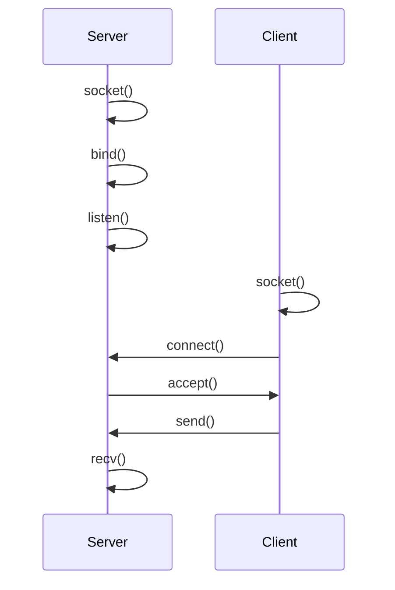
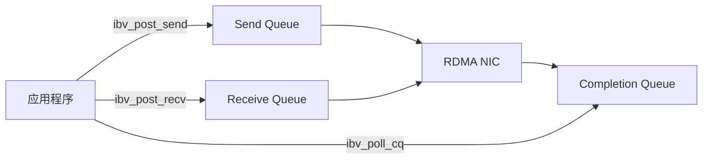
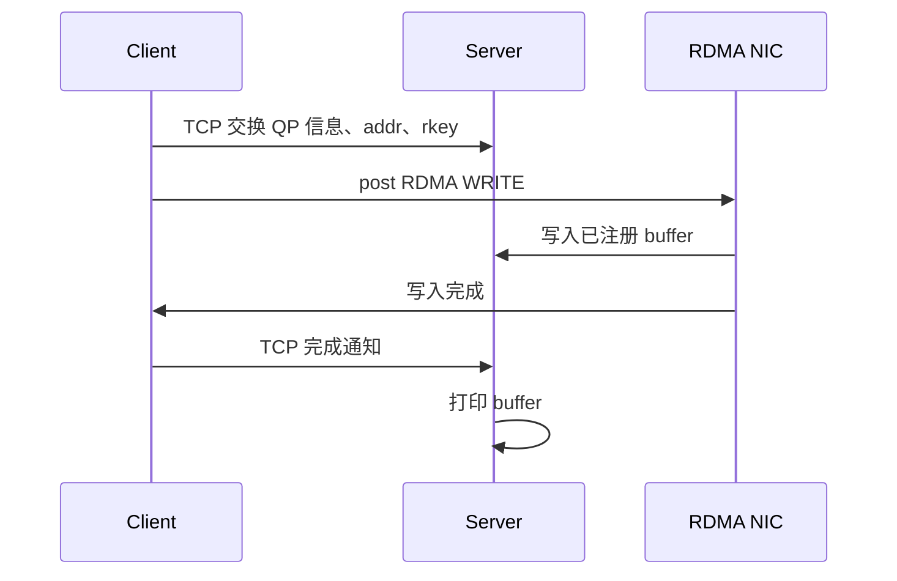

# 第一篇：快速入门

两台机器之间传输数据，最常见的方式是 TCP socket。TCP 提供可靠、通用、易部署的字节流抽象，把连接维护、报文处理、重传、拥塞控制等细节交给内核完成。这样的抽象降低了网络编程的门槛，但也意味着数据路径会深度经过内核协议栈。对于高性能数据传输系统，系统调用、协议处理和缓冲区管理等都会影响延迟、吞吐和 CPU 开销。

RDMA 重新组织这条数据路径。它将频繁发生的数据传输从内核协议栈中移出，由应用、用户态库、驱动和 RDMA 网卡共同完成；相应地，应用也必须显式处理内存注册、队列提交和完成事件。学习 RDMA 因而不能只看 API，也不能只看网卡配置。

本篇分为三段：

- 第 1、2 节说明网络编程的一般模式，以及 TCP socket 如何实现这一模式；
- 第 3、4 节说明高性能数据传输对数据路径提出的要求，以及 RDMA 的关键特点；
- 第 5、6 节完成环境检查、基础测试和一个单边 RDMA WRITE 样例。

完成本篇后，应能判断一台机器是否具备运行 RDMA 程序的基本条件，并能运行一个最小的 one-sided RDMA 程序。

## 1. 网络编程的一般模式

网络程序要解决两类问题。第一类是建立通信关系：本端是谁，远端是谁，双方通过什么路径通信。第二类是传输数据：发送方把哪段内存中的内容送出去，接收方把收到的数据放到哪段内存中，以及应用如何知道一次操作已经完成。

无论底层使用 TCP、UDP、RDMA，还是更上层的 RPC 框架，程序中通常都会出现几类对象：

- endpoint：通信双方的身份，例如 IP 地址、端口、设备或连接句柄；
- connection：一条已经建立或正在建立的通信关系；
- buffer：应用准备发送或接收数据的内存区域；
- send/receive：把本地 buffer 交给传输层，或让传输层把数据写入本地 buffer；
- completion 或返回值：告诉应用操作是否成功、失败或仍在进行。

这些对象构成了网络编程的基本骨架。不同传输机制的差异，主要体现在 endpoint 如何表示，连接如何建立，buffer 如何交给传输层，以及完成状态由谁产生、以什么方式返回给应用。

## 2. TCP socket 的实现

TCP socket 是上述模式在操作系统中的典型实现。它用 IP 地址和端口描述 endpoint，用 socket 文件描述符表示通信对象。server 创建监听 socket 后，先用 `bind` 指定本地地址和端口，再用 `listen` 进入监听状态，最后通过 `accept` 接受 client 发起的连接。client 使用 `connect` 连接 server。连接建立后，两端都会得到一个已连接 socket，并通过 `send` 和 `recv` 在这条连接上传输数据。



以下代码片段保留 server 端最核心的动作：绑定本地地址，进入监听状态，接受连接，然后从连接上读取数据。

```c
int listen_fd = socket(AF_INET, SOCK_STREAM, 0);

bind(listen_fd, (struct sockaddr *)&addr, sizeof(addr));
listen(listen_fd, 128);

int conn_fd = accept(listen_fd, NULL, NULL);

char buf[4096];
ssize_t n = recv(conn_fd, buf, sizeof(buf), 0);
```

client 端则主动连接 server，并把用户态 buffer 中的数据写入连接。

```c
int fd = socket(AF_INET, SOCK_STREAM, 0);

connect(fd, (struct sockaddr *)&server_addr, sizeof(server_addr));

char buf[] = "hello";
send(fd, buf, sizeof(buf), 0);
```

这两段代码刻意省略了错误处理和参数初始化，只保留 TCP socket 的基本结构。应用显式管理的是 socket 文件描述符、地址和用户态 buffer。至于用户态数据如何进入内核，TCP 如何分段和重传，乱序数据如何恢复，网卡何时通过 DMA 收发数据，远端内核何时唤醒应用，这些都由 socket 抽象隐藏起来。

这种抽象是 TCP socket 的价值所在。应用不必直接处理复杂的网络细节，就可以得到可靠、通用、易部署的字节流连接。正因为如此，TCP 仍然是最重要的通用传输机制，适合跨机房、跨地域和广域网环境，也常用于 RDMA 系统的控制面，例如连接建立、元数据交换和故障恢复。

不过，当传输路径本身进入性能敏感的数据面时，socket 抽象隐藏的成本就需要重新评估。RDMA 要解决的不是“怎样替代 TCP”，而是在特定部署条件下，怎样为数据面提供更短、更直接的路径。

## 3. TCP 数据路径的开销与边界

在大模型推理、分布式存储、远程内存等场景中，系统经常需要在节点之间搬运大块数据，或者以很高频率传输小消息。这类数据面需求通常不是“能够通信”这么简单，而是希望端到端持续达到 GB/s 级带宽，同时把延迟控制在微秒级。此时，数据移动不再只是业务逻辑之后的附属步骤，而会直接决定吞吐、延迟和资源利用率。

在这样的性能目标下，上一节中被 socket 抽象隐藏起来的细节会重新变成系统设计必须考虑的问题，尤其是以下几类开销。

第一，系统调用和上下文切换会增加延迟。应用每次进入内核都要穿越用户态和内核态边界。在高频小消息场景中，这部分开销会被放大。

第二，协议处理需要 CPU。TCP 需要维护连接状态，处理确认、重传、拥塞控制和顺序交付。高速网卡环境下，如果 CPU 需要参与每一次传输的大量协议处理，CPU 可能先于网络带宽成为瓶颈。

第三，缓冲区管理会带来内存带宽压力。现代内核和网卡已经做了大量优化，但用户态 buffer、内核 buffer 和网卡 DMA 之间的关系仍会影响数据路径；在部分场景中，额外的数据复制也会成为开销来源。

第四，TCP 的字节流抽象不能直接表达远端内存访问。很多系统真正需要的是把本地一段内存写入远端一段内存，或者从远端一段内存读取数据。远端地址、访问权限和完成语义都需要由应用协议重新定义。

因此，RDMA 不应被理解为 TCP 的通用替代品。它更适合被看作一种数据面技术：在硬件、网络和部署条件相对受控的环境中，以更低的 CPU 参与度、更短的数据路径和更明确的内存语义完成数据移动。实际系统也经常同时使用 TCP 和 RDMA：TCP 负责连接管理、控制消息或跨网络边界的通信，RDMA 负责性能敏感的数据传输。

## 4. RDMA 的关键特点

理解 RDMA，先要理解 DMA。DMA 是 Direct Memory Access 的缩写，指设备在获得授权后，可以不通过 CPU 逐字节搬运数据，而是直接在设备和主机内存之间传输数据。网卡收包、磁盘读写、GPU 数据传输都会用到 DMA。CPU 仍然负责配置设备、提交请求、处理完成和异常；真正的大块数据搬运则由设备完成。

RDMA 就是远程 DMA：一台机器的 RDMA 网卡，在本端程序提交请求后，通过网络访问另一台机器已经注册并授权的内存区域。其中，“remote”说明目标内存位于远端机器，“direct”说明数据面尽量不走传统 TCP socket 的内核协议栈和远端应用处理路径。

本节只介绍 RDMA 区别于 TCP socket 的几个关键特点。protection domain、memory region、queue pair、completion queue 等对象之间的完整关系，将在第二篇“编程模型”中展开。

### 4.1 远端内存访问

TCP socket 提供的是字节流。应用把数据写入 socket，远端应用再从 socket 读出数据。RDMA 提供的抽象更接近“内存访问”：一端可以把数据写入远端的一段内存，也可以从远端的一段内存读取数据。远端地址、访问权限和完成语义不再完全隐藏在内核协议栈中，而是成为应用协议必须显式处理的内容。

这并不意味着任意机器都能读写任意远端内存。远端内存必须先被注册，并授予相应权限；发起 RDMA READ、RDMA WRITE 或 Atomic 操作时，还需要使用远端提供的地址和 `rkey`。因此，RDMA 的“直接访问”建立在明确授权之上。

### 4.2 更短的数据路径

传统 TCP 程序的数据路径通常经过内核网络协议栈。应用调用 `send` 或 `recv` 后，内核负责 socket buffer 管理、TCP/IP 协议处理、拥塞控制、重传和唤醒通知。RDMA 的数据路径不同：资源建立完成后，应用可以通过用户态 Verbs 接口提交请求，由 RDMA 网卡执行组包、发送或接收。

这通常被称为 kernel bypass。准确地说，它指数据面绕过通用内核网络协议栈，而不是整个程序不经过内核。设备发现、资源创建、内存注册、权限设置和错误事件处理仍然需要内核和驱动参与。

RDMA 也常与 zero copy 一起讨论。RDMA 语境中的 zero copy 主要指避免数据在应用 buffer 和内核 buffer 之间反复复制，让网卡通过 DMA 直接访问应用指定的内存区域。为了做到这一点，应用必须把相关内存注册为 memory region，并在提交请求时使用对应的 `lkey`；如果允许远端访问，还需要把远端地址和 `rkey` 交给对端。

### 4.3 异步队列

RDMA 不是同步的函数调用模型，而是异步队列模型。一个 queue pair，简称 QP，维护两个队列：send queue 和 receive queue。应用发起 SEND、RDMA WRITE、RDMA READ 或 Atomic 操作时，把请求投递到 send queue；应用准备接收 SEND 消息时，把接收 buffer 投递到 receive queue。



Send Queue 和 Receive Queue 共同构成一个 queue pair。投递到队列中的请求称为 work request，简称 WR。WR 描述网卡要做什么：操作类型是什么，本地 buffer 在哪里，长度是多少，使用哪个 `lkey`；如果是 RDMA WRITE、RDMA READ 或 Atomic，还要提供远端地址和 `rkey`。应用提交 WR 之后，网卡异步读取队列并执行请求。

请求执行完成后，网卡不会直接调用应用函数，而是把完成记录写入 completion queue，简称 CQ。应用通过 polling 或事件通知从 CQ 中取出 work completion，简称 WC，并根据其中的状态判断操作是否成功。

这个模型带来高性能，也带来新的语义边界。`ibv_post_send` 或 `ibv_post_recv` 返回成功，只说明请求已经被接受投递；它不等于传输已经完成。应用需要从 completion queue 取到完成记录，才能根据操作类型判断本地 buffer 是否可以复用、远端内存是否已经被写入，或者 receive buffer 中是否已经有可读取的数据。更进一步说，RDMA completion 通常不表示远端应用已经处理了这条数据；如果需要应用级确认，仍然要由协议自己设计。

### 4.4 RDMA 操作类型

常见 RDMA 操作包括 SEND/RECV、RDMA WRITE、RDMA READ 和 Atomic。可以按通信方式把它们分成三类：

- SEND/RECV：two-sided 操作。它与 TCP socket 的 `send`/`recv` 最相似：一端发送数据，另一端接收数据，两端应用都参与通信过程。区别在于，RDMA 接收方必须提前投递 RECV，网卡才能把到达的数据放入接收方准备好的 buffer；发送方和接收方也都需要通过 completion 判断各自操作是否完成。
- RDMA WRITE：one-sided 操作。发起方把本地数据写入远端已经授权的内存区域。远端需要提前注册内存并把地址、`rkey` 等信息交给发起方，但数据搬运发生时，远端 CPU 不参与。
- RDMA READ：one-sided 操作。发起方从远端已经授权的内存区域读取数据。它同样依赖远端提前提供地址和 `rkey`，但读取动作由发起方发起并完成。
- Atomic：one-sided 原子操作。它可以在远端授权内存上执行有限的 64 位数据原子读改写操作（Compare-and-swap 和 Fetch-and-add），常用于同步和协调。

## 5. RDMA 环境配置与设备检查

要完成本篇的工具测试和单边 RDMA WRITE 样例，需要先准备一套 Linux 环境。最好的实验条件是两台带 RDMA 网卡的服务器；如果暂时没有真实网卡，也可以用 Soft-RoCE/RXE 在普通以太网上模拟一个 RDMA 设备。

环境准备分为三步：选择实验环境，安装必要软件，确认系统能看到 RDMA 设备。更具体的对象模型和性能调优将在后续篇章展开。

### 5.1 真实网卡：InfiniBand 与 RoCE

真实 RDMA 网卡通常工作在两类网络上：InfiniBand 和 RoCE。InfiniBand 是专用高性能网络，常见于 Mellanox/NVIDIA 的整套硬件和软件环境。RoCE 是 RDMA over Converged Ethernet 的缩写，运行在以太网上；其中 RoCEv2 是数据中心里常见的形态。二者底层网络不同，但应用通常使用同一套 RDMA 编程接口和工具。本篇后续使用的检查命令和测试工具，对这两类环境都适用。

Linux 上常用的基础软件来自 `rdma-core`。如果使用 Mellanox/NVIDIA 网卡，在安装厂商驱动及配套软件（如 NVIDIA MLNX_OFED 或云厂商镜像中已经集成的 OFED 软件栈）后，这些基础软件都已经安装好了。

### 5.2 软件模拟：Soft-RoCE/RXE

没有真实 RDMA 网卡时，可以使用 Soft-RoCE，也就是 RXE。RXE 是 Linux 内核提供的一个功能，支持在普通以太网接口上模拟一个 RDMA 设备。它的价值在于复现门槛低：一台普通 Linux 机器，就可以完成基本 RDMA 编程实验。RXE 适合学习 API 和通信流程，但不能代表真实网卡性能，也不适合做严肃性能测试。

配置 RXE 前，先选择一个已经能通信的普通网卡。以下命令以 `eth0` 为例：

```bash
ip link show eth0
ip addr show eth0
```

加载 RXE 模块，并在该网卡上创建软件 RDMA 设备（正常情况下没有回显）：

```bash
sudo modprobe rdma_rxe
sudo rdma link add rxe0 type rxe netdev eth0
```

如果需要删除 RXE 设备，可以执行：

```bash
sudo rdma link delete rxe0
```

### 5.3 第一次环境验证

环境准备完成后，需要做一次最小验证。验证顺序如下：

1. 使用 `ibv_devices` 查看 RDMA 设备列表；
2. 使用 `ibv_devinfo` 查看设备和端口参数；
3. 使用 `perftest` 跑一次基础传输。

本节只确认环境可用，不讨论性能优化。

**设备列表。** `ibv_devices` 用于枚举用户态 Verbs 能看到的 RDMA 设备：

```bash
ibv_devices
```

一台 RoCE 测试机的输出示例如下：

```text
    device          	   node GUID
    ------          	----------------
    mlx5_0          	0016********f03f
    mlx5_1          	5c25********8466
    mlx5_2          	5c25********8dd0
    mlx5_3          	5c25********7592
    mlx5_4          	5c25********6232
```

输出中只要能看到至少一个设备，就说明用户态 Verbs 已经能够枚举 RDMA 设备。真实 Mellanox/NVIDIA 网卡上常见 `mlx5_0`、`mlx5_1` 这样的名字；Soft-RoCE 设备通常显示为 `rxe0`。

**设备参数。** `ibv_devinfo` 用于查看设备和端口的详细信息：

```bash
ibv_devinfo -d mlx5_0
```

`mlx5_0` 的输出片段如下：

```text
hca_id:	mlx5_0
	transport:			InfiniBand (0)
	fw_ver:				28.39.3674
	node_guid:			0016:****:****:f03f
	sys_image_guid:			c470:bd03:0063:39a8
	vendor_id:			0x02c9
	vendor_part_id:			4126
	hw_ver:				0x0
	board_id:			MT_0000000833
	phys_port_cnt:			1
		port:	1
			state:			PORT_ACTIVE (4)
			max_mtu:		4096 (5)
			active_mtu:		1024 (3)
			sm_lid:			0
			port_lid:		0
			port_lmc:		0x00
			link_layer:		Ethernet
```

首次阅读 `ibv_devinfo` 输出时，重点关注三项：`hca_id` 是设备名，后续命令的 `-d` 会用到；`state` 应为 `PORT_ACTIVE`；`link_layer` 用于判断端口工作在 InfiniBand 还是 Ethernet/RoCE 环境。

**第一次传输。** `perftest` 提供了一组常用 RDMA 测试程序。第一次测试可以选择 `ib_write_bw`，先验证两端能否完成一次 RDMA WRITE 带宽测试，不急于调优参数。

测试需要两端配合。server 端先启动，不带 server IP：

```bash
# server
ib_write_bw -d mlx5_0
```

client 端后启动，并在命令末尾指定 server IP：

```bash
# client
ib_write_bw -d mlx5_0 10.10.0.3
```

第一次运行时可以先使用 `ib_write_bw` 的默认选择，让程序自己确定端口号和 GID index。只有在默认选择失败，或者需要严格复现实验条件时，再显式指定这些参数。

perftest 的结果主要看 client 端回显。client 端输出示例如下：

```text
---------------------------------------------------------------------------------------
                    RDMA_Write BW Test
 Dual-port       : OFF          Device         : mlx5_1
 Number of qps   : 1            Transport type : IB
 Connection type : RC           Using SRQ      : OFF
 PCIe relax order: ON
 ibv_wr* API     : ON
 TX depth        : 128
 CQ Moderation   : 1
 Mtu             : 4096[B]
 Link type       : Ethernet
 GID index       : 3
 Max inline data : 0[B]
 rdma_cm QPs     : OFF
 Data ex. method : Ethernet
---------------------------------------------------------------------------------------
 local address: LID 0000 QPN 0x5690 PSN 0xb53d0e RKey 0x204a05 VAddr 0x007fc5d2cf5000
 GID: 00:00:00:00:00:00:00:00:00:00:255:255:26:45:209:242
 remote address: LID 0000 QPN 0x568f PSN 0x4d8c8e RKey 0x204904 VAddr 0x007f01eea8e000
 GID: 00:00:00:00:00:00:00:00:00:00:255:255:26:45:209:242
---------------------------------------------------------------------------------------
 #bytes     #iterations    BW peak[MB/sec]    BW average[MB/sec]   MsgRate[Mpps]
 65536      5000             44326.24            44276.64                  0.708426
---------------------------------------------------------------------------------------
```

这段输出可以分两层阅读。先看测试配置是否符合预期，例如 `Device`、`Connection type`、`Mtu`、`Link type` 和 `GID index`；再看最后一行结果，其中 `BW average[MB/sec]` 是平均带宽，`MsgRate[Mpps]` 是消息速率。

## 6. 单边 RDMA WRITE 样例

在基础 RDMA WRITE 测试通过后，可以通过一个最小程序观察单边 RDMA 的基本结构。样例放在 `examples/one_sided_write/` 目录下，源码可在 [GitHub](https://github.com/alogfans/RDMA101/tree/main/examples/one_sided_write) 查看。它使用 TCP 作为控制通道交换连接信息，再由 client 发起一次 RDMA WRITE，把字符串直接写入 server 注册好的内存。



这个样例参考了 Mooncake TE 中 RDMA 数据路径的核心做法，但去掉了线程池、多网卡调度、metadata 管理和错误恢复等工程复杂度，只保留四个关键动作：

- server 和 client 都注册本地内存；
- 双方通过 TCP 交换 QP 信息、buffer 地址和 `rkey`；
- client 使用 `IBV_WR_RDMA_WRITE` 写入 server 的远端内存；
- server 不调用 `recv` 接收这段数据，只在 client 完成写入后查看自己的 buffer。

编译方式如下：

```bash
make -C examples/one_sided_write
```

运行时 server 先启动：

```bash
./examples/one_sided_write/one_sided_write --server -d mlx5_0
```

client 后启动，并指定 server IP：

```bash
./examples/one_sided_write/one_sided_write --client 172.31.32.3 -d mlx5_0 \
  --message "hello one-sided rdma"
```

如果使用 RoCE/RXE 且默认 GID 选择不能工作，可以参考 perftest 输出，显式指定 GID index：

```bash
./examples/one_sided_write/one_sided_write --server -d mlx5_0 --gid-index 3
./examples/one_sided_write/one_sided_write --client 172.31.32.3 -d mlx5_0 --gid-index 3
```

运行成功后，client 端会看到 RDMA WRITE 完成：

```text
client: RDMA WRITE completed, wrote 21 bytes
```

server 端会看到自己的 buffer 已经被远端写入：

```text
server: buffer after RDMA WRITE: "hello one-sided rdma"
```

这就是 one-sided 的关键语义：数据搬运由 client 发起，写入 server 已授权的内存；server 的 CPU 不参与这次数据复制，也不会因为 RDMA WRITE 自动得到一条应用层消息。样例中最后仍然用 TCP 发了一个很小的完成通知，这是为了让 server 知道何时打印 buffer。真实系统通常也需要类似的控制面协议来管理元数据、权限、完成通知和错误处理。下一篇将继续说明这些对象和协议是怎么被组织起来的。
