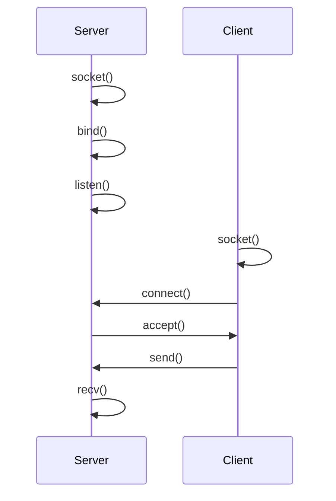
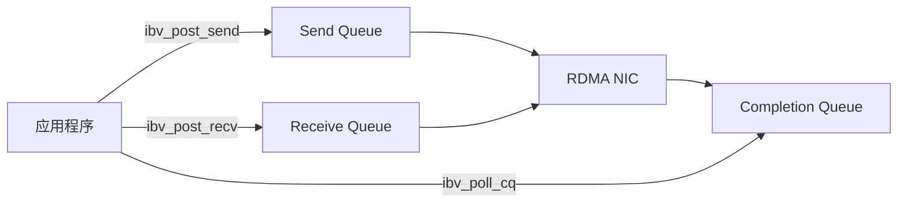

# 1.1 从 TCP 到 RDMA

两台机器之间传输数据，最常见的方式是 TCP socket。TCP 提供可靠、通用、易部署的字节流抽象，把连接维护、报文处理、重传、拥塞控制等细节交给内核完成。这样的抽象降低了网络编程的门槛，但也意味着数据路径会深度经过内核协议栈。对于高性能数据传输系统，系统调用、协议处理和缓冲区管理等都会影响延迟、吞吐和 CPU 开销。

RDMA 就是为了解决这类问题而设计的。它重新组织了数据路径：将频繁发生的数据传输从内核协议栈中移出，由应用、用户态库、驱动和 RDMA 网卡共同完成；相应地，应用也必须显式处理内存注册、队列提交和完成事件。学习 RDMA 因而不能只看 API，也不能只看网卡配置——我们需要理解它为什么要这样设计，以及它与传统网络编程有什么不同。

本章按照"是什么—为什么—怎么做"的逻辑分为三个部分。

前两节从 TCP socket 出发，介绍网络编程的通用模式。通过回顾 TCP socket 如何建立连接、传输数据，为后续理解 RDMA 建立一个对比基准。

后两节探讨高性能场景下的数据传输需求，说明 TCP 在这些场景下的瓶颈，并引出 RDMA 的核心设计理念——绕过内核协议栈、直接访问远端内存。

完成本章后，应能理解 RDMA 与 TCP socket 的核心区别，以及 RDMA 的关键特点。实践部分将在下一章展开。

## 1.1.1 网络编程的一般模式

网络程序要解决两类问题。第一类是建立通信关系：本端是谁，远端是谁，双方通过什么路径通信。第二类是传输数据：发送方把哪段内存中的内容送出去，接收方把收到的数据放到哪段内存中，以及应用如何知道一次操作已经完成。

无论底层使用 TCP、UDP、RDMA，还是更上层的 RPC 框架，程序中通常都会出现几类对象：

- **endpoint**：通信双方的身份，例如 IP 地址、端口、设备或连接句柄
- **connection**：一条已经建立或正在建立的通信关系
- **buffer**：应用准备发送或接收数据的内存区域
- **send/receive**：把本地 buffer 交给传输层，或让传输层把数据写入本地 buffer
- **completion 或返回值**：告诉应用操作是否成功、失败或仍在进行

这些对象构成了网络编程的基本骨架。不同传输机制的差异，主要体现在 endpoint 如何表示，连接如何建立，buffer 如何交给传输层，以及完成状态由谁产生、以什么方式返回给应用。

下一节看看 TCP socket 如何实现这个模式。

## 1.1.2 TCP socket 的实现

TCP socket 是上述模式在操作系统中的典型实现。它用 IP 地址和端口描述 endpoint，用 socket 文件描述符表示通信对象。server 创建监听 socket 后，先用 `bind` 指定本地地址和端口，再用 `listen` 进入监听状态，最后通过 `accept` 接受 client 发起的连接。client 使用 `connect` 连接 server。连接建立后，两端都会得到一个已连接 socket，并通过 `send` 和 `recv` 在这条连接上传输数据。



图 1-1：TCP socket 的连接建立与数据接收过程。
{: .figure-caption }

以下代码片段保留 server 端最核心的动作：绑定本地地址，进入监听状态，接受连接，然后从连接上读取数据。

```c
int listen_fd = socket(AF_INET, SOCK_STREAM, 0);

bind(listen_fd, (struct sockaddr *)&addr, sizeof(addr));
listen(listen_fd, 128);

int conn_fd = accept(listen_fd, NULL, NULL);

char buf[4096];
ssize_t n = recv(conn_fd, buf, sizeof(buf), 0);
```

client 端则主动连接 server，并把用户态 buffer 中的数据写入连接。

```c
int fd = socket(AF_INET, SOCK_STREAM, 0);

connect(fd, (struct sockaddr *)&server_addr, sizeof(server_addr));

char buf[] = "hello";
send(fd, buf, sizeof(buf), 0);
```

这两段代码刻意省略了错误处理和参数初始化，只保留 TCP socket 的基本结构。从代码可以看出，应用显式管理的是 socket 文件描述符、地址和用户态 buffer。

至于用户态数据如何进入内核，TCP 如何分段和重传，乱序数据如何恢复，网卡何时通过 DMA 收发数据，远端内核何时唤醒应用——这些都由 socket 抽象隐藏起来，应用不必关心。

这种抽象是 TCP socket 的价值所在。应用不必直接处理复杂的网络细节，就可以得到可靠、通用、易部署的字节流连接。正因为如此，TCP 仍然是最重要的通用传输机制，适合跨机房、跨地域和广域网环境，也常用于 RDMA 系统的控制面，例如连接建立、元数据交换和故障恢复。

**但是**，当传输路径本身进入性能敏感的数据面时，socket 抽象隐藏的成本就需要重新评估了。下一节来看看这些成本究竟是什么。

## 1.1.3 TCP 数据路径的开销与边界

想象一个分布式训练系统：4 台机器，每台配备 8 张 GPU，模型参数需要在机器之间持续同步。如果网络传输延迟从 10 微秒增加到 100 微秒，整体训练时间可能会延长 30%；如果 CPU 需要花费大量时间处理网络协议，GPU 就会空转等待。

在大模型推理、分布式存储、远程内存等场景中，系统经常需要在节点之间搬运大块数据，或者以很高频率传输小消息。这类数据面需求通常不是"能够通信"这么简单，而是希望端到端持续达到 GB/s 级带宽，同时把延迟控制在微秒级。此时，数据移动不再只是业务逻辑之后的附属步骤，而会直接决定吞吐、延迟和资源利用率。

在这样的性能目标下，上一节中被 socket 抽象隐藏起来的细节会重新变成系统设计必须考虑的问题。主要有以下三类开销。

第一，系统调用和上下文切换会增加延迟。应用每次进入内核都要穿越用户态和内核态边界。在高频小消息场景中，这部分开销会被显著放大。

第二，协议处理会消耗 CPU。TCP 需要维护连接状态，处理确认、重传、拥塞控制和顺序交付。高速网卡环境下，如果 CPU 需要参与每一次传输的大量协议处理，CPU 可能先于网络带宽成为瓶颈。

第三，TCP 的字节流抽象与实际需求不匹配。很多系统真正需要的是把本地一段内存写入远端一段内存，或者从远端一段内存读取数据。远端地址、访问权限和完成语义都需要由应用协议重新定义。

这正是 RDMA 要解决的问题。RDMA 不应被理解为 TCP 的通用替代品，而更适合被看作一种数据面技术：在硬件、网络和部署条件相对受控的环境中，以更低的 CPU 参与度、更短的数据路径和更明确的内存语义完成数据移动。实际系统也经常同时使用 TCP 和 RDMA：TCP 负责连接管理、控制消息或跨网络边界的通信，RDMA 负责性能敏感的数据传输。

下一节看看 RDMA 究竟有什么关键特点。

## 1.1.4 RDMA 的关键特点

理解 RDMA，先要理解 DMA。

DMA 就是让设备直接读写内存，不用 CPU 逐字节搬运。网卡收包、磁盘读写、GPU 数据传输都会用到 DMA。CPU 仍然负责配置设备、提交请求、处理完成和异常；真正的大块数据搬运则由设备完成。

RDMA 就是远程 DMA：一台机器的 RDMA 网卡，在本端程序提交请求后，通过网络访问另一台机器已经注册并授权的内存区域。其中，"remote"说明目标内存位于远端机器，"direct"说明数据面尽量不走传统 TCP socket 的内核协议栈和远端应用处理路径。

本节只介绍 RDMA 区别于 TCP socket 的几个关键特点。protection domain、memory region、queue pair、completion queue 等对象之间的完整关系，将在第二篇"编程模型"中展开。

### 远端内存访问

RDMA 与 TCP socket 的第一个核心区别在于内存访问方式。

TCP socket 提供的是字节流。应用把数据写入 socket，远端应用再从 socket 读出数据。RDMA 提供的抽象更接近"内存访问"：一端可以把数据写入远端的一段内存，也可以从远端的一段内存读取数据。

这并不意味着任意机器都能读写任意远端内存。远端内存必须先被注册，并授予相应权限；发起 RDMA READ、RDMA WRITE 或 Atomic 操作时，还需要使用远端提供的地址和 `rkey`。因此，RDMA 的"直接访问"建立在明确授权之上。

### 更短的数据路径

传统 TCP 程序的数据路径通常经过内核网络协议栈。应用调用 `send` 或 `recv` 后，内核负责 socket buffer 管理、TCP/IP 协议处理、拥塞控制、重传和唤醒通知。

RDMA 的数据路径不同。资源建立完成后，应用可以通过用户态 Verbs 接口提交请求，由 RDMA 网卡直接执行组包、发送或接收。

!!! note "kernel bypass 不是完全绕过内核"
    kernel bypass 指数据面绕过通用内核网络协议栈，而不是整个程序不经过内核。设备发现、资源创建、内存注册、权限设置和错误事件处理仍然需要内核和驱动参与。

RDMA 也常与 zero copy 一起讨论。zero copy 就是让网卡通过 DMA 直接访问应用指定的内存区域，避免数据在应用 buffer 和内核 buffer 之间反复复制。为此，应用必须把相关内存注册为 memory region，并在提交请求时使用对应的 `lkey`；如果允许远端访问，还需要把远端地址和 `rkey` 交给对端。

### 异步队列

RDMA 不是同步的函数调用模型，而是异步队列模型。一个 queue pair，简称 QP，维护两个队列：send queue 和 receive queue。应用发起 SEND、RDMA WRITE、RDMA READ 或 Atomic 操作时，把请求投递到 send queue；应用准备接收 SEND 消息时，把接收 buffer 投递到 receive queue。



图 1-2：RDMA 异步队列中的请求提交与完成轮询。
{: .figure-caption }

Send Queue 和 Receive Queue 共同构成一个 queue pair。投递到队列中的请求称为 work request，简称 WR。WR 描述网卡要做什么：操作类型是什么，本地 buffer 在哪里，长度是多少，使用哪个 `lkey`；如果是 RDMA WRITE、RDMA READ 或 Atomic，还要提供远端地址和 `rkey`。应用提交 WR 之后，网卡异步读取队列并执行请求。

请求执行完成后，网卡不会直接调用应用函数，而是把 completion queue entry（简称 CQE）写入 completion queue（简称 CQ）。应用通过 polling 或事件通知从 CQ 中取出 work completion（简称 WC），并根据其中的状态判断操作是否成功。

这个模型带来高性能，也带来新的语义边界。

`ibv_post_send` 或 `ibv_post_recv` 返回成功，只说明请求已经被接受投递，不等于传输已经完成。应用需要从 completion queue 取到 WC，才能根据操作类型判断本地 buffer 是否可以复用、远端内存是否已经被写入，或者 receive buffer 中是否已经有可读取的数据。

更进一步说，RDMA completion 通常不表示远端应用已经处理了这条数据；如果需要应用级确认，仍然要由协议自己设计。

### RDMA 操作类型

RDMA 提供了几种不同的操作类型。

**SEND/RECV** 与 TCP socket 的 `send`/`recv` 最相似。一端发送数据，另一端接收数据，两端应用都参与。区别在于，RDMA 接收方必须提前投递 RECV，网卡才能把到达的数据放入接收方准备好的 buffer。

**RDMA WRITE** 和 **RDMA READ** 是 one-sided 操作。发起方把本地数据直接写入（或从）远端已经授权的内存区域，远端 CPU 不参与数据搬运。

**Atomic** 可以在远端授权内存上执行有限的 64 位原子操作，常用于同步和协调。

下一章开始动手实践——先检查环境，然后运行第一个 RDMA 程序。
