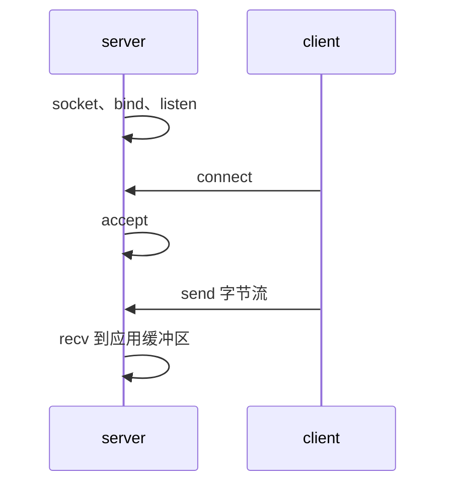
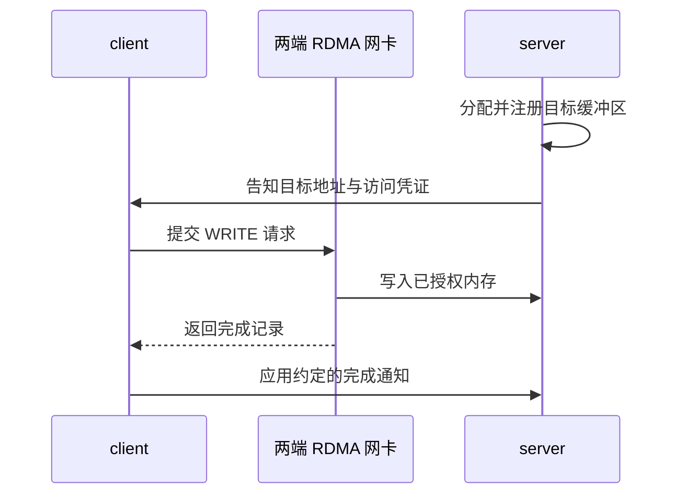

# 1.1 从 TCP 到 RDMA

网络程序经常需要把一段内存中的数据送到另一台机器。例如，一台服务器生成了一批缓存数据，另一台服务器需要读取它们。使用 TCP 时，发送方调用 `send`，接收方调用 `recv`。数据量不大时，这通常已经足够。

当数据变成几 GiB 的模型权重，或每秒有大量小块缓存需要交换时，搬运本身也会占用可观的 CPU 时间和内存带宽。RDMA（Remote Direct Memory Access，远程直接内存访问）提供了一种让网卡直接访问已授权应用内存的方式。理解它，可以从熟悉的 socket 程序开始。

## 从一个字符串的传输开始

假设 client 要发送字符串 `hello`。server 先绑定地址、监听连接，client 再主动连接。连接建立以后，双方各有一个已连接的 socket：



图 1-1：TCP 连接与字符串收发。
{: .figure-caption }

下面的 C 片段只展示连接后的收发动作，省略地址初始化、错误检查和处理部分收发的循环：

```c
/* client：fd 是已经连接的 socket。 */
char message[] = "hello";
send(fd, message, sizeof(message), 0);

/* server：conn_fd 来自 accept。 */
char buffer[4096];
ssize_t received = recv(conn_fd, buffer, sizeof(buffer), 0);
```

TCP 提供有序字节流。一次 `send` 不一定对应一次 `recv`，应用需要约定消息长度或分隔方式。`send` 返回也不表示对方业务已经处理完数据；它首先反映本次调用接受了多少字节。

在常见的普通 socket 路径中，发送数据会从应用缓冲区进入内核管理的网络缓冲区，再由网卡发送。接收端经过相反的过程。TCP 的分包、确认、重传由协议栈承担，应用主要处理字节流。

## 当应用已经知道目标内存

假设 server 已经分配好一个 8 MiB 缓冲区，client 需要把一块缓存放进去。应用真正关心的是数据从哪个地址移动到哪个地址。通过 socket 完成这件事，还需要由接收程序读取消息，再把数据放入约定的位置。

RDMA WRITE 可以直接表达这次搬运。server 先登记缓冲区的地址范围和允许的访问方式，这个过程叫内存注册。随后把目标地址和远端访问凭证 `rkey` 交给 client。client 提交写入请求，两端网卡完成传输，server 不必为这块数据调用 `recv`。



图 1-2：先授权目标内存，再发起 RDMA WRITE。
{: .figure-caption }

两端通常仍有一条 TCP 或 RPC 控制通道，用来交换连接信息、分配目标空间和通知业务。RDMA 接管其中的大块数据搬运。下一章的示例正是这种结构。

## “直接访问”省去了什么

DMA（Direct Memory Access，直接内存访问）允许设备读写内存，CPU 不必逐字节执行复制。普通网卡和磁盘也使用 DMA。RDMA 将这种访问能力延伸到网络另一端事先授权的内存。

硬件 RDMA 的常规数据路径可以省去应用缓冲区与内核 socket 缓冲区之间的复制，这通常被称为 zero copy。数据依然需要经过内存、网卡和网络。小消息还可能使用 inline，由 CPU 在投递时复制到设备工作项里；后文会解释这种取舍。

资源准备完成后，投递和完成轮询通常可以在用户态执行，这就是常说的 kernel bypass。打开设备、注册内存和创建队列仍需要内核协助。性能收益来自改变高频数据路径，具体幅度要在给定硬件和负载上测量。

网卡也不会因为拿到了一个地址就执行访问。它会检查访问凭证、范围和权限。注册得到的 Memory Region（MR，内存区域）保存这些信息，第二篇再详细解释它的用法。

## 从函数返回到操作完成

RDMA 是异步的。应用先描述一次工作，再把请求放进队列；网卡执行以后，通过另一条队列报告结果。

```text
填写请求 → 投递 → 网卡读取数据并传输 → 应用取得完成
```

因此，投递函数返回成功后，源数据仍可能尚未读完。如果应用立即把缓冲区改成下一条消息，网卡可能发送修改后的内容。最初的示例会等待成功完成，再允许复用缓冲区。

client 得到 WRITE 完成，server 的业务线程却未必知道有数据到达。普通 WRITE 不自动产生远端接收完成。示例会在 WRITE 完成后发一条 TCP 通知，server 收到通知才打印内存。

## 后面会用到的操作

WRITE 适合由数据生产方主动推送；READ 则由需要数据的一方取回。SEND/RECV 按消息协作，接收方先准备接收空间。Atomic 可以原子地更新特定的远端值，放在第二篇的选读章节。

| 操作 | 怎样指定数据位置 | 通信前的准备 |
|---|---|---|
| SEND / RECV | 接收方通过 RECV 指定 | 提前投递接收缓冲区 |
| WRITE | 发起方使用约定的远端地址 | 注册目标、授权并安排消费 |
| READ | 发起方指定本地结果地址 | 远端授权数据源并保持其有效 |
| Atomic | 发起方使用约定的远端变量地址 | 提供符合能力、权限和对齐要求的变量 |

表 1-1：RDMA 操作与通信前的准备。
{: .table-caption }

WRITE、READ、Atomic 常称为单边操作，意思是单次数据操作由发起方提交。内存授权、寿命和业务协调仍需要双方约定。带着这些区别，可以开始[检查环境并运行第一个程序](02-environment-and-first-program.md)。

## 参考资料

[Linux RDMA 用户态接口文档](https://docs.kernel.org/infiniband/user_verbs.html)说明设备访问与用户态资源的关系；[rdma-core](https://github.com/linux-rdma/rdma-core)提供本教程使用的 Verbs 库、工具和手册。
