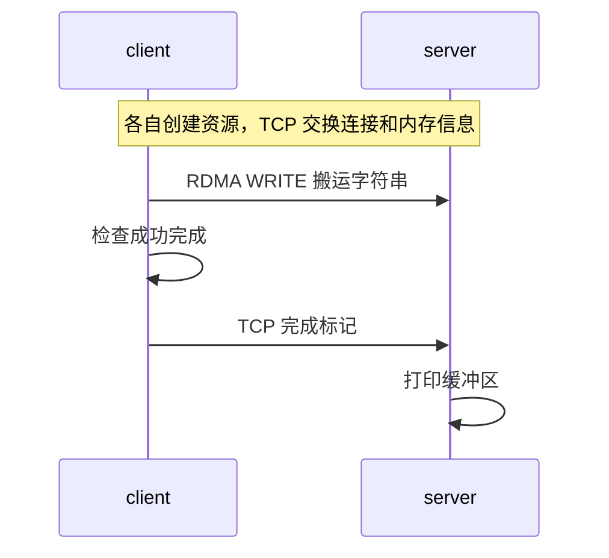

# 1.2 环境配置与第一个 RDMA 程序

上一章描述了一次远端写入。本章把它变成可以观察的结果：client 发送字符串，server 从自己的缓冲区中打印出相同内容。先运行现成工具，再运行示例，后续读代码时就有了明确的参照。

所有命令从仓库根目录执行。示例设备名为 `mlx5_0`，server 地址为 `10.10.10.3`，运行时应换成实际值。两端设备名和 GID index 不要求相同。

## 准备实验环境 {#environment}

两台网络互通、装有 RDMA 网卡的 Linux 服务器最方便。网卡可以工作在 InfiniBand 网络，也可以使用以太网上的 RoCE。应用仍使用 Verbs 接口，但连接时采用的地址和网络配置有所不同。

用户态库及设备工具来自 rdma-core，带宽工具来自 perftest。编译示例还需要 C 编译器、Make 和 libibverbs 开发头文件。通过发行版或已有厂商软件环境准备这些依赖后，先执行：

```bash
ibv_devices
ibv_devinfo -d mlx5_0
```

第一条命令列出当前进程可见的 RDMA 设备。第二条命令查询所选设备，重点看端口的 `state`、`link_layer` 和 `active_mtu`。下面是字段示意，具体值随设备变化：

```text
hca_id: mlx5_0
    port: 1
        state: PORT_ACTIVE (4)
        active_mtu: 4096 (5)
        link_layer: Ethernet
```

`Ethernet` 表示这里使用以太网链路；不能只凭输出顶部的 `transport: InfiniBand` 判断是 IB 网络。端口 ACTIVE 是后续传输的前提之一，实际连通性还要用工具验证。容器中还应确认 RDMA 设备可见、驱动库可用，并检查 `ulimit -l` 所显示的锁定内存限制。

### 没有 RDMA 网卡时使用 RXE

Soft-RoCE（RXE）在普通以太网上提供软件 RDMA 设备，适合观察 API、队列和完成行为。它的数据路径在软件中执行，测出的吞吐和 CPU 开销不能代表硬件 RDMA。

选择一个已经能与对端通信的接口，例如 `eth0`：

```bash
ip addr show eth0
sudo modprobe rdma_rxe
sudo rdma link add rxe0 type rxe netdev eth0
ibv_devices
ibv_devinfo -d rxe0
```

内核需要包含 RXE 支持，容器还可能需要由宿主机配置设备。如果创建成功，设备列表中会出现 `rxe0`。后面的命令将 `mlx5_0` 换成它即可。实验结束且没有程序使用该设备时，可以用 `sudo rdma link delete rxe0` 删除。

## 用 perftest 验证实际传输

server 先启动，不带 server IP：

```bash
ib_write_bw -d mlx5_0
```

client 再连接 server：

```bash
ib_write_bw -d mlx5_0 10.10.10.3
```

首次运行使用工具默认参数，让工具选择端口及地址条目。默认选择失败时，再根据实际端口和 GID 表显式指定。两端 perftest 版本及测试选项应匹配。

正常结束时，工具会输出消息大小、迭代次数、带宽和消息速率。此时先确认测试结束且没有传输错误，并保存两端完整输出。这里的带宽没有统一达标值；消息大小、并发、网卡速率及主机拓扑都会影响它。[第四篇](../04-optimization/01-measurement.md)再解释怎样设计性能实验。

如果 TCP 能连上而 RDMA 操作超时，可以先对照两端工具输出中的设备、端口和 GID。控制连接可达，只证明控制通道能够工作，不能代替数据路径验证。

## 编译并运行 WRITE 示例

源码位于 `examples/one_sided_write/one_sided_write.c`。程序用 TCP 交换连接信息，字符串本身由 RDMA WRITE 搬运：

```bash
make -C examples/one_sided_write
```

server 先启动：

```bash
./examples/one_sided_write/one_sided_write --server -d mlx5_0
```

client 随后启动：

```bash
./examples/one_sided_write/one_sided_write --client 10.10.10.3 -d mlx5_0 \
  --message "hello one-sided rdma"
```

示例默认 GID index 为 0，没有实现复杂的地址自动选择。若 perftest 选择了其他可用条目，应将示例的 `--gid-index` 设置为本机对应值，例如：

```bash
./examples/one_sided_write/one_sided_write --server -d mlx5_0 --gid-index 3
```

client 也需要按它自己的 GID 表设置。编号的含义和查询方法见 [RoCE 网络基础](../03-internals/06-roce-network.md#gid-config)。

## 解释两端输出

上述字符串包含结尾的 `\0`，共写入 21 字节。正常路径的输出为：

```text
client: RDMA WRITE completed, wrote 21 bytes
server: buffer after RDMA WRITE: "hello one-sided rdma"
```

这两行来自不同进程。client 先等到 WRITE 的成功完成，再经 TCP 发送一个完成标记。server 收到标记后，才打印自己的内存。



图 1-3：示例中的写入、完成与 TCP 通知。
{: .figure-caption }

server 没有为字符串调用 RDMA RECV。TCP 完成标记只告诉它何时可以查看数据，标记本身没有携带这段字符串。

可以先只改变 `--message`，重新启动两端，确认 server 输出随之改变。再对照源码中的 `strlen(message) + 1`，解释传输长度为何比可见字符数多一。暂时保持其余逻辑不变，第二篇再逐项修改资源和请求。

## 如果实验停在中途

| 现象 | 下一步检查 |
|---|---|
| 没有设备 | 驱动、RXE 创建结果、容器设备映射及用户态库 |
| 端口不 ACTIVE | 物理链路、交换机；IB 还需检查子网管理器 |
| TCP 连接失败 | server 是否已启动、地址与控制端口是否可达 |
| TCP 成功而 RDMA 超时 | 设备、端口、GID 和端到端路径 |
| perftest 成功而示例失败 | 两个程序实际采用的参数是否一致 |
| 注册内存失败 | 返回错误、锁定内存限制、分配与权限 |

表 1-2：首次实验的常见停滞位置。
{: .table-caption }

这些是检查方向，不是仅凭一条错误就能确定的根因。更完整的观察方法见[诊断章节](../04-optimization/06-diagnostics.md#symptoms)。

下一章回到这个程序的 `main`，解释[一次 WRITE 所需的资源](../02-programming-model/01-first-rdma-program.md)。示例只完成一次传输，其阻塞等待和错误时退出的处理适合观察基本流程；长期运行的服务需要第四篇的超时与回收机制。

## 参考资料

[perftest 官方说明](https://github.com/linux-rdma/perftest)列出测试选项与实验约束；[Linux RXE 实现](https://github.com/torvalds/linux/tree/master/drivers/infiniband/sw/rxe)对应本章的软件设备。
