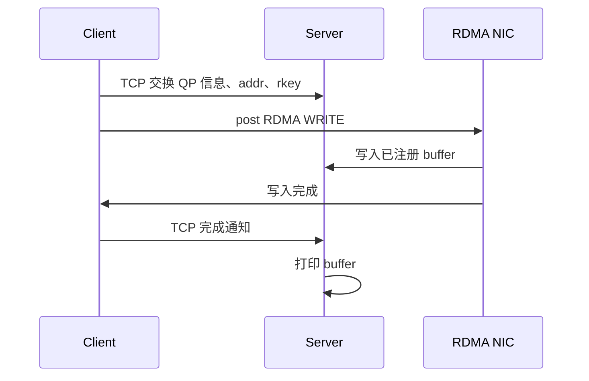

# 1.2 环境配置与第一个 RDMA 程序

上一章介绍了 RDMA 与 TCP socket 的核心区别。本章开始动手实践——先检查 RDMA 环境、运行基础工具测试，然后运行一个最小化的 RDMA WRITE 程序，亲眼看到"把数据直接写入远端内存"的效果。

## 1.2.1 RDMA 环境配置与设备检查

在开始写 RDMA 程序之前，需要确认环境是否就绪。

最好的实验条件是两台带 RDMA 网卡的服务器；如果暂时没有真实网卡，也可以用 Soft-RoCE/RXE 在普通以太网上模拟一个 RDMA 设备——这对于学习 API 和通信流程已经足够。

环境准备分为三步：选择实验环境，安装必要软件，确认系统能看到 RDMA 设备。更具体的对象模型和性能调优将在后续篇章展开。

### 真实网卡：InfiniBand 与 RoCE

真实 RDMA 网卡通常工作在两类网络上：**InfiniBand** 和 **RoCE**。

- **InfiniBand**：专用高性能网络，常见于 Mellanox/NVIDIA 的整套硬件和软件环境。
- **RoCE**（RDMA over Converged Ethernet）：运行在以太网上，其中 RoCEv2 是数据中心里常见的形态。

二者底层网络不同，但应用通常使用同一套 RDMA 编程接口和工具。本章后续使用的检查命令和测试工具，对这两类环境都适用。

!!! note "软件安装"
    Linux 上常用的基础软件来自 `rdma-core`。如果使用 Mellanox/NVIDIA 网卡，在安装厂商驱动及配套软件后，这些基础软件通常已经安装好了。

### 软件模拟：Soft-RoCE/RXE

没有真实 RDMA 网卡时，可以使用 Soft-RoCE（RXE）。RXE 是 Linux 内核提供的一个功能，支持在普通以太网接口上模拟一个 RDMA 设备。它的价值在于门槛低：一台普通 Linux 机器就可以完成基本 RDMA 编程实验。

!!! warning "RXE 适合学习，不代表真实性能"
    RXE 可以用来学习 API 和通信流程，但不能代表真实网卡的性能，也不适合做严肃的性能测试。

配置 RXE 前，先选择一个已经能通信的普通网卡。以下命令以 `eth0` 为例：

**1. 检查网卡状态：**

```bash
ip link show eth0
ip addr show eth0
```

**2. 加载 RXE 模块并创建设备**（正常情况下没有回显）：

```bash
sudo modprobe rdma_rxe
sudo rdma link add rxe0 type rxe netdev eth0
```

**预期结果**：运行 `ibv_devices` 后应该能看到 `rxe0` 设备。

如果需要删除 RXE 设备，可以执行：

```bash
sudo rdma link delete rxe0
```

### 第一次环境验证

环境准备完成后，我们需要确认三件事：设备存在、端口正常、能够传输数据。

验证顺序如下：

1. 使用 `ibv_devices` 查看 RDMA 设备列表；
2. 使用 `ibv_devinfo` 查看设备和端口参数；
3. 使用 `perftest` 跑一次基础传输。

本节只确认环境可用，不讨论性能优化。

---

**步骤 1：查看设备列表**

`ibv_devices` 用于枚举用户态 Verbs 能看到的 RDMA 设备：

```bash
ibv_devices
```

**预期输出**（RoCE 测试机示例）：

```text
    device          	   node GUID
    ------          	----------------
    mlx5_0          	0000********000f
    mlx5_1          	0000********0006
```

✅ **成功标志**：输出中至少有一个设备。真实网卡通常显示为 `mlx5_0`、`mlx5_1`；Soft-RoCE 设备显示为 `rxe0`。

---

**步骤 2：查看设备参数**

`ibv_devinfo` 用于查看设备和端口的详细信息：

```bash
ibv_devinfo -d mlx5_0
```

**预期输出**（片段）：

```text
hca_id:	mlx5_0
	transport:			InfiniBand (0)
	fw_ver:				28.39.3674
		...
		port:	1
			state:			PORT_ACTIVE (4)
			max_mtu:		4096 (5)
			link_layer:		Ethernet
```

✅ **成功标志**：`state` 应为 `PORT_ACTIVE`，`link_layer` 显示 `Ethernet`（RoCE）或 `InfiniBand`。

---

**步骤 3：第一次传输测试**

`perftest` 提供了一组常用 RDMA 测试程序。第一次测试我们选择 `ib_write_bw`，验证两端能否完成一次 RDMA WRITE 带宽测试。

**server 端先启动**（不带 server IP）：

```bash
ib_write_bw -d mlx5_0
```

**client 端后启动**（指定 server IP）：

```bash
ib_write_bw -d mlx5_0 10.10.0.3
```

!!! note "首次测试使用默认参数"
    第一次运行时可以使用 `ib_write_bw` 的默认选择，让程序自己确定端口号和 GID index。只有在默认选择失败时，才需要显式指定这些参数。

**预期输出**（client 端，片段）：

```text
---------------------------------------------------------------------------------------
                    RDMA_Write BW Test
...
---------------------------------------------------------------------------------------
 #bytes     #iterations    BW peak[MB/sec]    BW average[MB/sec]   MsgRate[Mpps]
 65536      5000             44326.24            44276.64                  0.708426
---------------------------------------------------------------------------------------
```

✅ **成功标志**：测试正常完成，最后一行显示带宽和消息速率数值。

环境检查完成！下一节，我们运行一个最小化的 RDMA 程序。

## 1.2.2 单边 RDMA WRITE 样例

让我们通过一个最小程序来观察单边 RDMA 的基本结构。这个样例会演示 RDMA 最核心的特点：**client 可以直接把数据写入 server 的内存，server 的 CPU 不参与数据搬运**。

样例放在 `examples/one_sided_write/` 目录下，源码可在 [GitHub](https://github.com/alogfans/RDMA101/tree/main/examples/one_sided_write) 查看。

### 程序做了什么？

让我们一步步看这个程序做了什么：



图 1-3：单边 RDMA WRITE 中控制信息交换与远端内存写入。
{: .figure-caption }

**关键步骤：**

1. **注册内存**：server 和 client 都注册本地内存，告诉 RDMA 网卡哪些内存区域可以直接访问。
2. **交换元数据**：双方通过 TCP 交换 QP 信息、buffer 地址和 `rkey`（这是授权远端访问的"钥匙"）。
3. **发起写入**：client 使用 `IBV_WR_RDMA_WRITE` 写入 server 的远端内存——这一步不需要 server CPU 参与。
4. **验证结果**：server 不调用 `recv` 接收这段数据，只在 client 完成写入后查看自己的 buffer。

### 如何运行？

**编译：**

```bash
make -C examples/one_sided_write
```

**运行：**server 端先启动：

```bash
./examples/one_sided_write/one_sided_write --server -d mlx5_0
```

client 端后启动，并指定 server IP：

```bash
./examples/one_sided_write/one_sided_write --client 10.10.10.3 -d mlx5_0 \
  --message "hello one-sided rdma"
```

!!! note "GID index 问题"
    如果使用 RoCE/RXE 且默认 GID 选择不能工作，可以参考 perftest 输出，显式指定 GID index：
    ```bash
    ./examples/one_sided_write/one_sided_write --server -d mlx5_0 --gid-index 3
    ./examples/one_sided_write/one_sided_write --client 10.10.10.3 -d mlx5_0 --gid-index 3
    ```

### 应该看到什么

**client 端输出：**

```text
client: RDMA WRITE completed, wrote 21 bytes
```

**server 端输出：**

```text
server: buffer after RDMA WRITE: "hello one-sided rdma"
```

✅ **成功标志**：两端都显示预期输出，server 的 buffer 中出现了 client 发送的内容。

### 小结

这个样例展示了 RDMA 的核心特点：

1. **One-sided 操作**：client 直接写入远端内存，server CPU 不参与数据搬运。
2. **直接内存访问**：数据直接写入 server 的注册内存，不需要经过传统的 socket recv/send。
3. **控制面与数据面分离**：使用 TCP 交换元数据（控制面），使用 RDMA 传输数据（数据面）。

!!! note "RDMA WRITE 不会自动通知远端应用"
    数据搬运由 client 发起，写入 server 已授权的内存；server 的 CPU 不参与这次数据复制，也不会因为 RDMA WRITE 自动得到一条应用层消息。样例中最后仍然用 TCP 发了一个很小的完成通知，这是为了让 server 知道何时打印 buffer。真实系统通常也需要类似的控制面协议来管理元数据、权限、完成通知和错误处理。

---

**第一篇回顾**

完成第一篇后，应该能够：

- 判断一台机器是否具备运行 RDMA 程序的基本条件
- 理解 RDMA 与 TCP socket 的核心区别
- 运行一个最小的 one-sided RDMA 程序

下一篇将继续说明这些对象和协议是怎么被组织起来的。
