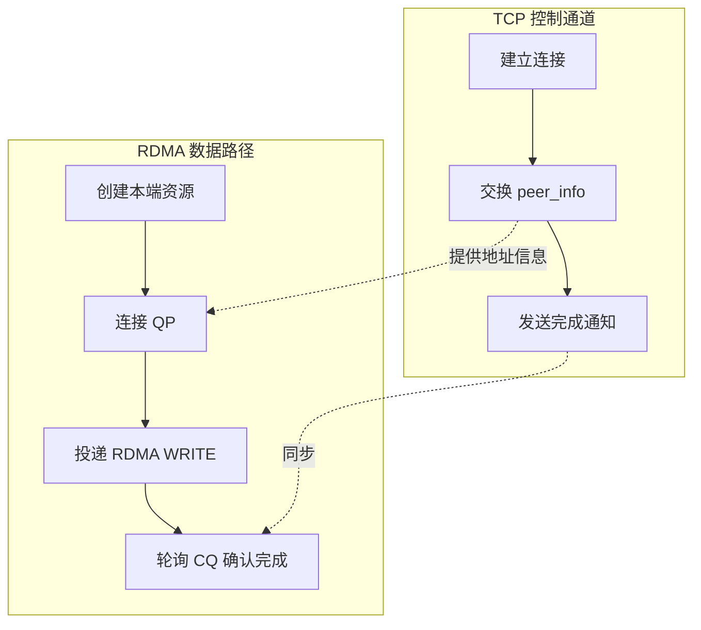
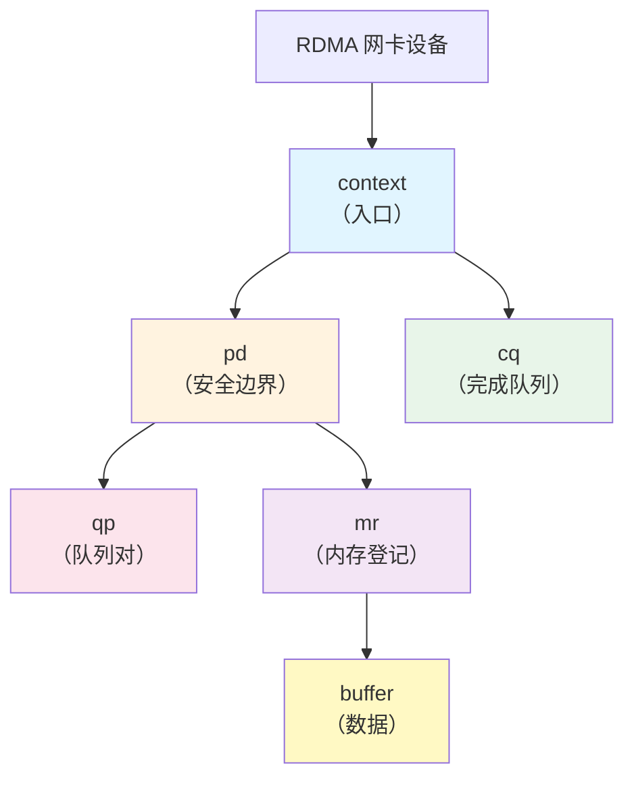
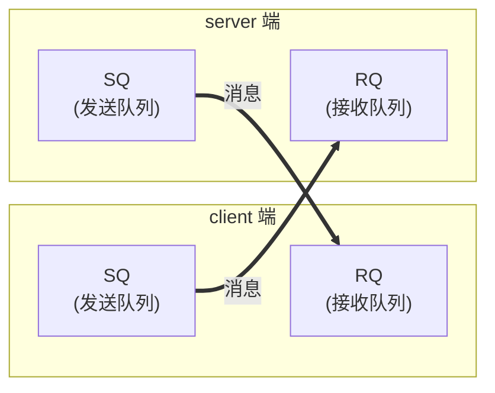

# 2.1 RDMA WRITE 范例解读

第一篇我们完成了一个单边 RDMA WRITE 程序。这个程序的表面行为很简单：client 把字符串写入 server 的内存，server 随后打印这段字符串。

但这段数据并不是通过 TCP `send` 发送给 server，也不是由 server 调用 `recv` 接收得到的。真正的数据搬运动作发生在 RDMA 网卡之间——server 的 CPU 从头到尾都没有参与这段数据的接收。

本章以 `examples/one_sided_write/one_sided_write.c` 为线索，说明一个最小 RDMA 程序如何组织。我们重点建立整体印象，而非深入每个 API 的细节——后者会在后续章节展开。

## 2.1.1 先看程序做了什么

让我们先忽略实现细节，从外部观察这个程序的行为：

**Client 端：**
```
1. 连接到 server 的 TCP 控制通道
2. 准备一段字符串
3. 把字符串直接写入 server 的内存
4. 通过 TCP 通知 server："写完了"
```

**Server 端：**
```
1. 创建 TCP 监听 socket，等待 client 连接
2. 准备一块可被写入的内存
3. 等待 TCP 通知
4. 查看自己的内存——数据已经在那里了
```

关键观察：**server 没有调用任何"接收"操作**。字符串不是"传给"server 的，而是 client 单方面"写进" server 内存里的。这就是"one-sided"（单边）操作的含义。

!!! note "与 TCP 程序的直观对比"
    在 TCP 程序中，数据必须是"发送方调用 send，接收方调用 recv"的双边配合。RDMA ONE-SIDED WRITE 则不同：发起方单方面完成数据搬运，接收方的 CPU 可以完全不参与这个过程——数据到达时它可能正在做别的事情。

## 2.1.2 程序的整体结构

理解了"程序做了什么"，我们再来看"程序怎么组织的"。`main` 函数的代码结构清楚地展现了四个阶段：

```c
int sock = opt.is_client ? create_client_socket(opt.server, opt.tcp_port)
                         : create_server_socket(opt.tcp_port);

struct rdma_state state;
init_rdma(&state, &opt);

struct peer_info local = local_info(&state);
struct peer_info remote;
exchange_info(sock, &local, &remote);
connect_qp(&state, &opt, &remote);

if (opt.is_client) {
    memcpy(state.buffer, opt.message, len);
    post_write(&state, &remote, len);
    send_all(sock, "D", 1);
} else {
    recv_all(sock, &done, 1);
    printf("server: buffer after RDMA WRITE: \"%s\"\n", state.buffer);
}
```

用一句话概括：**TCP 负责握手，RDMA 负责运货**。



图 2-1：控制面与数据面的协作关系。
{: .figure-caption }

四个阶段的职责：

| 阶段 | 职责 | 为什么需要它 |
|------|------|-------------|
| **建立控制通道** | TCP 连接 | RDMA 需要交换"往哪写、写什么"的信息 |
| **创建本端资源** | 初始化 RDMA 对象 | 网卡需要知道用什么资源来服务请求 |
| **交换信息并连接 QP** | 交换 `peer_info`、建立 RDMA 路由 | 两端网卡需要知道"对方的门牌号" |
| **发起数据搬运** | 投递 RDMA WRITE | 真正的数据传输发生在这里 |

!!! note "这是所有 RDMA 程序的共同模式"
    不论程序多复杂，基本都包含这四个阶段。不同程序的差异主要在于：资源如何管理、如何同步、如何处理错误。这些细节会在后续章节深入讨论。

## 2.1.3 为什么还需要 TCP

你已经看到 RDMA 是"网卡到网卡"的数据搬运。那么为什么程序还要创建 TCP 连接？RDMA 不是应该替代 TCP 吗？

答案是：**RDMA 替代的是 TCP 的数据搬运功能，但不能替代 TCP 的协商功能**。

想象你要给朋友寄东西：

- 你需要先打电话告诉朋友："我要给你寄个包裹"（控制信息）
- 快递公司直接把包裹送到你家门口（数据搬运）

TCP 在这里就是那个"电话"——它不搬运实际的数据，只负责交换必要的信息。两端通过 TCP 交换的是 `peer_info` 结构：

```c
struct peer_info {
    uint16_t lid;      // 本地 RDMA 端口的"门牌号"
    uint32_t qpn;      // Queue Pair 编号——对应"哪个接收队列"
    uint32_t psn;      // 包序列号——用于可靠传输
    uint32_t rkey;     // 远端访问密钥——"你有权写我的这段内存"
    uint64_t addr;     // 远端内存地址——"写到我内存的哪个位置"
    union ibv_gid gid; // 全局标识符——更高级的地址形式
};
```

!!! note "控制面与数据面分离"
    这是 RDMA 编程的第一个重要概念：**控制面（TCP）和数据面（RDMA）分离**。控制面负责协商，数据面负责搬运。后续章节会看到，这种分离让 RDMA 能够实现真正的零拷贝、内核旁路。

## 2.1.4 本端需要创建哪些资源

`init_rdma` 函数创建了一组对象。每个对象都有明确的用途：

- **context（设备上下文）**：与 RDMA 设备通信的入口
- **pd（保护域）**：限定资源之间的访问关系——只有同一 PD 内的 QP 和 MR 才能互相访问
- **cq（完成队列）**：网卡完成请求后在这里写入完成记录
- **qp（队列对）**：发送队列和接收队列的组合，请求投递到这里排队处理
- **mr（内存区域）**：向系统注册的内存，网卡才能直接访问
- **buffer**：实际的数据缓冲区
- **psn（包序列号）**：用于可靠传输的序号维护

样例用 `rdma_state` 把这些资源组织在一起：

```c
struct rdma_state {
    struct ibv_context *context;  // 设备上下文——"大门"
    struct ibv_pd *pd;            // 保护域——"安全边界"
    struct ibv_cq *cq;            // 完成队列——"签收本"
    struct ibv_qp *qp;            // 队列对——"收发柜台"
    struct ibv_mr *mr;            // 内存区域——"物品登记"
    struct ibv_port_attr port_attr; // 端口属性
    union ibv_gid gid;            // 全局标识符
    char *buffer;                 // 数据缓冲区——"货物"
    uint32_t psn;                 // 包序列号
};
```



图 2-2：本端 RDMA 资源的依赖关系。
{: .figure-caption }

!!! note "为什么要这么多对象？"
    RDMA 的设计哲学是"显式声明"：需要什么资源、什么权限、什么访问模式，都要明确告诉网卡。这种显式性是 RDMA 安全性和性能的基础。后续章节会详细讲解每个对象的作用和配置方法。

!!! note "资源创建的顺序不能乱"
    注意依赖关系：必须先有 `context` 才能创建 `pd` 和 `cq`，必须有 `pd` 才能创建 `qp` 和 `mr`。这个顺序不是随意规定的——它反映了资源之间的逻辑依赖。

## 2.1.5 内存为什么要"注册"

这是 RDMA 新手最常问的问题之一：*为什么不能直接用 `malloc` 的内存，非要调用 `ibv_reg_mr`？*

答案是：**RDMA 要实现零拷贝，必须让网卡直接访问内存——这需要固定虚拟地址到物理地址的映射关系**。

普通网络 I/O 通过 CPU 来搬运数据：
```
buffer → CPU 拷贝 → 内核空间 → 网卡
```
每次数据传输至少有一次 CPU 拷贝，这就是"有拷贝"。

RDMA 让网卡直接访问用户态内存：
```
buffer ←→ 网卡（CPU 不参与）
```
网卡通过 DMA 直接读写内存，不需要 CPU 参与，这就是"零拷贝"。

**零拷贝的代价：必须固定 VA→PA 映射**

你用 `malloc` 分配的是**虚拟地址（VA）**，程序运行时虚拟地址到物理地址（PA）的映射可能变化：

- 操作系统可能换页到不同物理位置
- 虚拟内存可能被换出到磁盘再换回

但网卡 DMA 需要确切的**物理地址（PA）**，而且映射关系在传输期间不能改变。

`ibv_reg_mr` 的本质就是：
```
1. 锁定这段虚拟内存，防止被换出
2. 固定 VA→PA 映射关系
3. 告诉网卡："从这个 PA 开始的 N 字节，你可以直接访问"
```

```c
posix_memalign((void **)&s->buffer, 4096, BUFFER_SIZE);
int access = IBV_ACCESS_LOCAL_WRITE | IBV_ACCESS_REMOTE_WRITE;
s->mr = ibv_reg_mr(s->pd, s->buffer, BUFFER_SIZE, access);
```

注册后，会得到两个 key：

- `lkey`（local key）：本端引用这个内存时用
- `rkey`（remote key）：远端引用这个内存时用

**远端地址 ≠ 访问权限**。client 想写 server 的内存，必须同时知道：

1. 这段内存的**地址**（`addr`）
2. 这段内存的**访问凭证**（`rkey`）

!!! note "rkey 的安全意义"
    `rkey` 不是简单的形式主义——它是 RDMA 安全模型的基石。远端没有正确的 `rkey`，就无法访问本地内存。这防止了任意 RDMA 请求随意读写内存。

## 2.1.6 QP 连接：双方之间建立专用通道

首先理解 QP 的本质：**QP 是通信双方之间的专用通道**。

每个 QP 由一对队列组成：

- **Send Queue（SQ）**：存放本端要发送的请求
- **Receive Queue（RQ）**：存放本端准备接收远端消息的缓冲区

通信双方各有一个 QP：



图 2-3：QP 是通信双方之间的专用通道，client 的 SQ 对应 server 的 RQ，反之亦然。
{: .figure-caption }

client 的 SQ 发送的消息，会到达 server 的 RQ。server 的 SQ 发送的消息，会到达 client 的 RQ。

创建 QP（`ibv_create_qp`）只是分配了队列对象，还不能通信。就像装了电话机但还没拨号。

**双方都需要调用 `connect_qp`**，各自把自己的 QP 从 INIT 状态转到 RTR（Ready to Receive），再转到 RTS（Ready to Send）：

```c
// client 和 server 都要执行这个流程
// 第一步：进入 RTR——告诉本端"对方的 QP 编号、地址"
ibv_modify_qp(qp, &attr, IBV_QP_STATE | IBV_QP_AV | ...);

// 第二步：进入 RTS——设置超时、重试等参数
ibv_modify_qp(qp, &attr, IBV_QP_STATE | IBV_QP_TIMEOUT | ...);
```

**为什么要两步？**

- **RTR**（Ready to Receive）："我已经准备好接收来自这个特定远端 QP 的消息"
- **RTS**（Ready to Send）："我已经准备好向这个特定远端 QP 发送消息"

只有双方都进入 RTS 后，Send Queue 中的 WR 才能被网卡取走执行。

!!! note "双方都需要交换 peer_info"
    由于双方都要进入 RTR/RTS，双方都需要知道对方的 QP 编号、地址等信息。这就是为什么 `exchange_info` 是双向的——不是 client 单独告诉 server，而是双方互相交换自己的信息。

## 2.1.7 投递请求：三层嵌套结构

client 真正发起写入时，代码是这样的：

```c
memcpy(state.buffer, opt.message, len);

// 第一层：SGE——描述本地数据从哪里读
struct ibv_sge sge = {
    .addr = (uintptr_t)s->buffer,
    .length = len,
    .lkey = s->mr->lkey
};

// 第二层：WR——描述完整的远端写入请求
struct ibv_send_wr wr = {
    .opcode = IBV_WR_RDMA_WRITE,
    .sg_list = &sge,
    .num_sge = 1,
    .send_flags = IBV_SEND_SIGNALED,
    .wr.rdma.remote_addr = remote->addr,
    .wr.rdma.rkey = remote->rkey
};

// 第三层：投递到 Send Queue
ibv_post_send(s->qp, &wr, &bad);
```

这是一个三层嵌套结构：

```
WR（Work Request，工作请求）
├── opcode：做什么操作？（RDMA WRITE）
├── sge list：本地数据从哪里读？
│   └── SGE（Scatter/Gather Element）
│       ├── addr：起始地址
│       ├── length：长度
│       └── lkey：本地 key
└── wr.rdma：远端写到哪里？
    ├── remote_addr：远端地址
    └── rkey：远端 key
```

!!! note "Scatter/Gather 的含义"
    `sg_list` 是一个数组，可以包含多个 SGE。这支持"scatter-gather"操作：从多个不连续的内存块收集数据，一次性发送到远端。本章样例只用了一个 SGE，是最简单的情况。

!!! note "投递成功 ≠ 传输完成"
    `ibv_post_send` 返回成功，只说明 WR 已经被放入队列。数据是否真正写入远端，需要通过轮询 CQ 并检查 WC 来判断。这是理解 RDMA 异步语义的关键。

## 2.1.8 完成队列：异步结果的获取方式

RDMA 操作是异步的：投递请求后，网卡在后台执行，程序可以做别的事情。那么怎么知道操作完成了？

答案是：**轮询 CQ（Completion Queue）**。

```c
for (;;) {
    struct ibv_wc wc;
    int n = ibv_poll_cq(s->cq, 1, &wc);
    if (n == 0) continue;  // 还没完成，继续等
    if (wc.status != IBV_WC_SUCCESS) {
        fprintf(stderr, "RDMA WRITE failed: %s\n",
                ibv_wc_status_str(wc.status));
        exit(EXIT_FAILURE);
    }
    return;  // 成功完成
}
```

两个容易出错的地方：

1. **`ibv_poll_cq` 返回 0 不是错误**：只是说明当前没有可返回的 WC，需要继续轮询。
2. **必须检查 `wc.status`**：只有 `IBV_WC_SUCCESS` 才表示操作真正成功。

!!! note "为什么不用回调？"
    后续章节会介绍，RDMA 也支持事件驱动的完成通知（通过 `ibv_req_notify_cq`）。但轮询 CQ 是最低开销的方式，也是高性能场景的首选。

!!! note "WC 成功 ≠ 应用级完成"
    对 RDMA WRITE 来说，client 取到成功 WC，表示"数据已经写入远端内存"。但这不表示 server 的 CPU 已经看到或处理了这段数据。远端 CPU 何时看到写入内容，与平台缓存一致性有关。这就是为什么样例最后还要发一个 TCP 的 `"D"`——纯粹的应用级同步通知。

## 2.1.9 Server 端的"被动"特性

让我们再看看 server 的核心逻辑：

```c
recv_all(sock, &done, 1);  // 等待 TCP 通知
printf("server: buffer after RDMA WRITE: \"%s\"\n", state.buffer);
```

**server 端没有任何"接收"数据的代码**。数据已经在那里了，因为 client 的 RDMA WRITE 把它写进去了。

这就是 one-sided RDMA 操作的威力：

- 发起方（client）单方面完成数据搬运
- 接收方（server）的 CPU 从头到尾不参与

!!! note "one-sided ≠ 无同步"
    虽然 server 不参与数据搬运，但应用级同步仍然是需要的。server 怎么知道"数据已经写好了"？答案是：通过额外的控制面通知（本例中的 TCP `"D"`）。

## 2.1.10 编程模型回顾

让我们用一张表总结这个程序的核心模式：

| 概念 | 关键点 |
|------|--------|
| **控制面与数据面分离** | TCP 用于交换元数据，RDMA 用于搬运数据 |
| **资源先建，请求后投** | 先创建可被网卡使用的资源，再把请求投递到队列 |
| **异步语义** | `ibv_post_send` 成功只表示请求被接受，完成需检查 WC |
| **one-sided 操作** | 远端 CPU 不参与数据搬运，但应用级同步需协议设计 |
| **rkey 是权限凭证** | 远端地址本身不是权限，`rkey` 才是访问凭证 |

!!! note "你已经看到了全貌"
    本章建立的四个阶段框架（控制通道 → 资源创建 → 连接 QP → 投递请求）是所有 RDMA 程序的基础。后续章节会深入每个细节：
    
    - QP 状态机的完整转换逻辑
    - 错误处理和重试机制
    - 资源生命周期管理
    - 性能优化技巧
    - 其他 RDMA 操作（READ、SEND、_RECV）
    - 缓存一致性和内存序

    现在你已经看到了"森林"，接下来的章节会带你仔细观察每一棵"树"。
