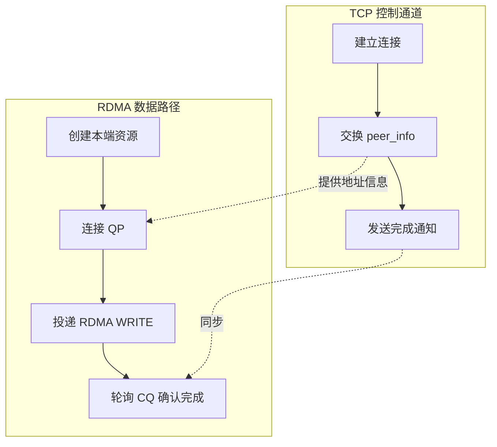
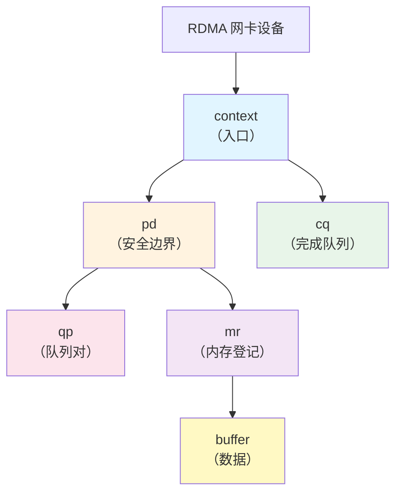
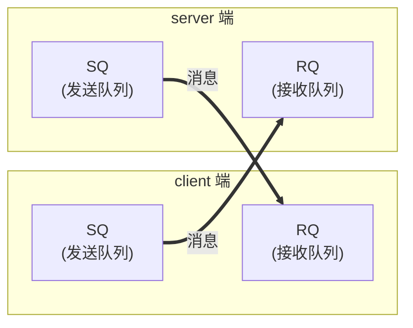

# 2.1 RDMA WRITE 范例解读

第一篇已经完成了一个单边 RDMA WRITE 程序。从外部看，这个范例的行为很直接：client 把字符串写入 server 的内存，server 随后打印这段字符串。

但这段数据并不是通过 TCP `send` 发送给 server，也不是由 server 调用 `recv` 接收得到的。数据搬运动作由 RDMA 数据路径完成，server 的 CPU 不参与这段数据的接收。

本章以 `examples/one_sided_write/one_sided_write.c` 为线索，说明一个最小 RDMA 程序如何组织。本章只建立整体印象；各个 Verbs API 的参数和资源关系会在后续章节展开。

本章实验使用 `examples/one_sided_write/one_sided_write.c`。实验需要两个进程：server 端准备一块可被远端写入的 MR，client 端在交换远端地址和 `rkey` 后投递 RDMA WRITE。运行时先启动 server，再在另一端或另一个终端启动 client：

```bash
make -C examples/one_sided_write
./examples/one_sided_write/one_sided_write --server -d mlx5_0 -i 1 -g 0
./examples/one_sided_write/one_sided_write --client <server-ip> -d mlx5_0 -i 1 -g 0
```

## 2.1.1 先看程序做了什么

先从外部行为开始观察：

**Client 端：**
```
1. 连接到 server 的 TCP 控制通道
2. 准备一段字符串
3. 把字符串直接写入 server 的内存
4. 通过 TCP 通知 server："写完了"
```

**Server 端：**
```
1. 创建 TCP 监听 socket，等待 client 连接
2. 准备一块可被写入的内存
3. 等待 TCP 通知
4. 查看自己的内存——数据已经在那里了
```

关键观察：**server 没有为这段数据调用 RECV 操作**。字符串不是通过双边消息交给 server 的，而是 client 发起 RDMA WRITE，把数据写入 server 已经授权的内存。这就是 one-sided（单边）操作的含义。

!!! note "与 TCP 程序的直观对比"
    在 TCP 程序中，数据通常表现为"发送方调用 send，接收方调用 recv"的双边配合。RDMA WRITE 则不同：数据搬运由发起方和两端网卡完成，远端 CPU 不需要参与这次写入。

## 2.1.2 程序的整体结构

理解了"程序做了什么"，我们再来看"程序怎么组织的"。`main` 函数的代码结构清楚地展现了四个阶段：

```c
int sock = opt.is_client ? create_client_socket(opt.server, opt.tcp_port)
                         : create_server_socket(opt.tcp_port);

struct rdma_state state;
init_rdma(&state, &opt);

struct peer_info local = local_info(&state);
struct peer_info remote;
exchange_info(sock, &local, &remote);
connect_qp(&state, &opt, &remote);

if (opt.is_client) {
    memcpy(state.buffer, opt.message, len);
    post_write(&state, &remote, len);
    send_all(sock, "D", 1);
} else {
    recv_all(sock, &done, 1);
    printf("server: buffer after RDMA WRITE: \"%s\"\n", state.buffer);
}
```

用一句话概括：**TCP 负责交换控制信息，RDMA 负责数据搬运**。



图 2-1：控制面与数据面的协作关系。
{: .figure-caption }

四个阶段的职责：

| 阶段 | 职责 | 作用 |
|------|------|------|
| **建立控制通道** | TCP 连接 | RDMA 需要交换 QP 编号、地址、key 等元数据 |
| **创建本端资源** | 初始化 RDMA 对象 | 网卡需要知道用什么资源来服务请求 |
| **交换信息并连接 QP** | 交换 `peer_info`、把双方 QP 连接到 RTS | 两端 QP 需要知道对端 QP 编号、PSN 和路径信息 |
| **发起数据搬运** | 投递 RDMA WRITE | 数据传输发生在这里 |

!!! note "这是所有 RDMA 程序的共同模式"
    不论程序多复杂，基本都包含这四个阶段。不同程序的差异主要在于：资源如何管理、如何同步、如何处理错误。这些细节会在后续章节深入讨论。

## 2.1.3 控制通道的作用

RDMA 负责性能敏感的数据搬运，但样例程序仍然需要 TCP 连接。这是因为 RDMA 数据路径本身不负责连接协商和元数据交换。

QP 连接前，两端必须先知道对方的 QP number、PSN、地址信息，以及远端 MR 的 `addr`/`rkey`。本样例使用 TCP 作为控制通道来交换这些信息。

两端通过 TCP 交换的是 `peer_info` 结构：

```c
struct peer_info {
    uint16_t lid;      // InfiniBand LID；RoCE 场景下通常主要依赖 GID
    uint32_t qpn;      // Queue Pair 编号
    uint32_t psn;      // 包序列号——用于可靠传输
    uint32_t rkey;     // 远端访问 key
    uint64_t addr;     // 已注册 buffer 的虚拟地址
    union ibv_gid gid; // GID；RoCE 路由需要
};
```

!!! note "控制面与数据面分离"
    控制面负责协商，数据面负责搬运。控制面不一定必须是 TCP，也可以是已有 RPC、配置服务或 RDMA CM；本教程的样例使用 TCP，是因为它便于观察和调试。

## 2.1.4 本端需要创建哪些资源

`init_rdma` 函数创建了一组对象。`context` 是与 RDMA 设备交互的入口，`pd` 限定本地资源之间的访问关系，`cq` 用来接收网卡写入的完成记录，`qp` 承载发送和接收请求队列，`mr` 则把应用缓冲区注册成网卡可访问的内存区域。样例中的 `buffer` 是实际数据所在的位置，`psn` 用于可靠传输中的包序列维护。

样例用 `rdma_state` 把这些资源组织在一起：

```c
struct rdma_state {
    struct ibv_context *context;  // 设备上下文
    struct ibv_pd *pd;            // 保护域
    struct ibv_cq *cq;            // 完成队列
    struct ibv_qp *qp;            // 队列对
    struct ibv_mr *mr;            // 内存区域
    struct ibv_port_attr port_attr; // 端口属性
    union ibv_gid gid;            // 全局标识符
    char *buffer;                 // 数据缓冲区
    uint32_t psn;                 // 包序列号
};
```



图 2-2：本端 RDMA 资源的依赖关系。
{: .figure-caption }

!!! note "资源对象的显式性"
    RDMA 程序需要显式声明资源、权限和访问模式。这样做让网卡可以直接执行数据路径，也让错误配置更容易暴露在资源创建、投递或 completion 阶段。

!!! note "资源创建的顺序不能乱"
    注意依赖关系：必须先有 `context` 才能创建 `pd` 和 `cq`，必须有 `pd` 才能创建 `qp` 和 `mr`。这个顺序不是随意规定的——它反映了资源之间的逻辑依赖。

## 2.1.5 内存注册

普通 `malloc` 内存不能直接作为远端 RDMA 访问目标。RDMA 要让网卡直接访问应用内存，必须先把这段内存注册给 RDMA 设备，并生成可校验的访问 key。

普通网络 I/O 通过 CPU 来搬运数据：
```
buffer → CPU 拷贝 → 内核空间 → 网卡
```
每次数据传输至少有一次 CPU 拷贝，这就是"有拷贝"。

RDMA 让网卡直接访问用户态内存：
```
buffer ←→ 网卡（CPU 不参与）
```
网卡通过 DMA 直接读写应用缓冲区，不需要 CPU 在用户 buffer 和内核 buffer 之间搬运数据，这就是本教程所说的 zero copy。

这种数据路径也带来一个约束：内存必须先注册。

`malloc` 分配得到的是虚拟地址。普通内存可能被换出，也没有默认授权给 RDMA 网卡访问。注册 MR 时，内核和驱动会锁定相关页面，建立网卡可使用的地址转换/权限信息，并返回 `lkey` 和 `rkey`。

`ibv_reg_mr` 可以粗略理解为：锁定或登记这段用户内存，建立设备可使用的地址映射和权限信息，并返回 `lkey`/`rkey`，供本端和远端访问时校验。

```c
posix_memalign((void **)&s->buffer, 4096, BUFFER_SIZE);
int access = IBV_ACCESS_LOCAL_WRITE |
             IBV_ACCESS_REMOTE_WRITE |
             IBV_ACCESS_REMOTE_READ;
s->mr = ibv_reg_mr(s->pd, s->buffer, BUFFER_SIZE, access);
```

注册后，会得到两个 key。`lkey` 是本端引用这段 MR 时使用的 local key；`rkey` 是远端执行 RDMA READ/WRITE/Atomic 时使用的 remote key。二者都不是普通业务编号，而是设备用来校验访问权限的凭证。

远端地址不等于访问权限。client 想写 server 的内存，必须同时知道这段内存的地址 `addr` 和访问凭证 `rkey`。

!!! note "rkey 的安全意义"
    `rkey` 不是形式参数。远端没有正确的 `rkey`，就无法通过 RDMA READ/WRITE/Atomic 访问这段 MR。实际系统还需要配合进程权限、设备隔离和控制面认证，不能把 `rkey` 当作完整的安全方案。

## 2.1.6 QP 连接：双方之间建立专用通道

首先理解 QP 的作用：**QP 承载本端与某个远端之间的请求队列和连接状态**。

每个 QP 由一对队列组成：Send Queue（SQ）存放本端要发送的请求，Receive Queue（RQ）存放本端准备接收远端消息的缓冲区。

通信双方各有一个 QP：



图 2-3：QP 是通信双方之间的专用通道，client 的 SQ 对应 server 的 RQ，反之亦然。
{: .figure-caption }

对于 SEND/RECV，client 的 SQ 发送的消息会匹配 server 预先投递在 RQ 中的接收 WR；反方向同理。对于 RDMA READ/WRITE/Atomic，请求仍然投递到发起方 SQ，但不消耗远端 RQ。

创建 QP（`ibv_create_qp`）只是分配了队列对象。RC QP 创建后处于 RESET 状态，还不能通信；程序必须用 `ibv_modify_qp` 按顺序把它转到 INIT、RTR、RTS。

**双方都需要调用 `connect_qp`**，各自把自己的 QP 从 INIT 状态转到 RTR（Ready to Receive），再转到 RTS（Ready to Send）。样例中的 INIT 转换在 `init_rdma` 中完成：

```c
// client 和 server 都要执行这个流程
// 第一步：进入 RTR——告诉本端"对方的 QP 编号、地址"
ibv_modify_qp(qp, &attr, IBV_QP_STATE | IBV_QP_AV | ...);

// 第二步：进入 RTS——设置超时、重试等参数
ibv_modify_qp(qp, &attr, IBV_QP_STATE | IBV_QP_TIMEOUT | ...);
```

RTR 和 RTS 分别设置接收方向和发送方向的参数。RTR（Ready to Receive）表示本端已经准备好接收来自特定远端 QP 的消息；RTS（Ready to Send）表示本端已经准备好向这个特定远端 QP 发送消息。

对于本教程使用的 RC QP，双方都完成这些状态转换后，投递到 SQ 的请求才能按可靠连接语义执行。

!!! note "双方都需要交换 peer_info"
    由于双方都要进入 RTR/RTS，双方都需要知道对方的 QP 编号、地址等信息。因此 `exchange_info` 是双向的：不是 client 单独告诉 server，而是双方互相交换自己的信息。

## 2.1.7 投递请求：三层嵌套结构

client 发起写入时，核心代码如下：

```c
memcpy(state.buffer, opt.message, len);

// 第一层：SGE——描述本地数据从哪里读
struct ibv_sge sge = {
    .addr = (uintptr_t)s->buffer,
    .length = len,
    .lkey = s->mr->lkey
};

// 第二层：WR——描述完整的远端写入请求
struct ibv_send_wr wr = {
    .opcode = IBV_WR_RDMA_WRITE,
    .sg_list = &sge,
    .num_sge = 1,
    .send_flags = IBV_SEND_SIGNALED,
    .wr.rdma.remote_addr = remote->addr,
    .wr.rdma.rkey = remote->rkey
};

// 第三层：投递到 Send Queue
ibv_post_send(s->qp, &wr, &bad);
```

这是一个三层嵌套结构：

```
WR（Work Request，工作请求）
├── opcode：做什么操作？（RDMA WRITE）
├── sge list：本地数据从哪里读？
│   └── SGE（Scatter/Gather Element）
│       ├── addr：起始地址
│       ├── length：长度
│       └── lkey：本地 key
└── wr.rdma：远端写到哪里？
    ├── remote_addr：远端地址
    └── rkey：远端 key
```

!!! note "Scatter/Gather 的含义"
    `sg_list` 是一个数组，可以包含多个 SGE。这支持"scatter-gather"操作：从多个不连续的内存块收集数据，一次性发送到远端。本章样例只用了一个 SGE，是最简单的情况。

!!! note "投递成功 ≠ 传输完成"
    `ibv_post_send` 返回成功，只说明 WR 已经被放入队列。数据是否写入远端，需要通过轮询 CQ 并检查 WC 来判断。

## 2.1.8 完成队列：异步结果的获取方式

RDMA 操作是异步的：投递请求后，网卡在后台执行，程序可以做别的事情。那么怎么知道操作完成了？

完成状态通过轮询 CQ（Completion Queue）获得。

```c
for (;;) {
    struct ibv_wc wc;
    int n = ibv_poll_cq(s->cq, 1, &wc);
    if (n == 0) continue;  // 还没完成，继续等
    if (wc.status != IBV_WC_SUCCESS) {
        fprintf(stderr, "RDMA WRITE failed: %s\n",
                ibv_wc_status_str(wc.status));
        exit(EXIT_FAILURE);
    }
    return;  // 成功完成
}
```

两个容易出错的地方需要特别记住：`ibv_poll_cq` 返回 0 不是错误，只是说明当前没有可返回的 WC，需要继续轮询；轮询到 WC 后必须检查 `wc.status`，只有 `IBV_WC_SUCCESS` 才表示操作成功完成。

!!! note "完成通知方式"
    后续章节会介绍，RDMA 也支持事件驱动的完成通知（通过 `ibv_req_notify_cq`）。但轮询 CQ 是最低开销的方式，也是高性能场景的首选。

!!! note "WC 成功 ≠ 应用级完成"
    对 RDMA WRITE 来说，client 取到成功 WC，表示这个 WRITE WR 已经成功完成。但这不表示 server 应用已经看到或处理了这段数据。样例最后发送 TCP `"D"`，作用是提供一个应用级同步通知。

## 2.1.9 Server 端的"被动"特性

server 的核心逻辑如下：

```c
recv_all(sock, &done, 1);  // 等待 TCP 通知
printf("server: buffer after RDMA WRITE: \"%s\"\n", state.buffer);
```

**server 端没有为这段数据投递 RECV WR**。数据已经在那里了，因为 client 的 RDMA WRITE 把它写进去了。

这就是 one-sided RDMA 操作的特点：发起方 client 单方面完成数据搬运，接收方 server 的 CPU 不参与写入本身。server 只是在收到 TCP 通知后读取自己的内存，因此这个样例展示的是 one-sided WRITE 的基本语义，而不是一个完整的应用层协议。

!!! note "one-sided ≠ 无同步"
    虽然 server 不参与数据搬运，但应用级同步仍然是需要的。本例通过额外的 TCP `"D"` 通知 server：client 已经完成写入。

## 2.1.10 编程模型回顾

本章的范例给出了 RDMA 程序的基本骨架。TCP 控制通道用于交换 QP number、PSN、LID/GID、远端地址和 `rkey` 等元数据；RDMA 数据路径负责真正的数据搬运。两者的职责不同，但在一个完整程序中必须配合使用。

资源创建先于请求投递。程序需要先打开设备、创建 PD、CQ、QP，注册 MR，并把 RC QP 连接到可通信状态，然后才能投递 RDMA WRITE。`ibv_post_send` 成功只表示 WR 已进入发送队列；这次写入是否成功完成，还要由 CQ 中的 WC 来确认。

这个范例还说明了 one-sided 操作的边界。远端 CPU 不参与数据搬运，但应用级同步仍由协议承担；远端地址也不等同于访问权限，只有同时持有正确的 `addr` 和 `rkey`，发起方才能访问对端授权的内存。

!!! note "本章建立的是整体框架"
    本章建立的四个阶段框架（控制通道 → 资源创建 → 连接 QP → 投递请求）是所有 RDMA 程序的基础。后续章节会继续讨论 QP 状态机、错误处理和重试、资源生命周期、性能优化、其他 RDMA 操作，以及缓存一致性和内存序。

## 延伸阅读

- [rdma-core 的 libibverbs 手册页](https://man.archlinux.org/man/extra/rdma-core/)：`ibv_post_send`、`ibv_post_recv`、`ibv_poll_cq`、`ibv_reg_mr`、`ibv_modify_qp` 等函数的行为与返回值定义。
- [Linux 内核 RDMA API 文档](https://docs.kernel.org/infiniband/core_lib.html)：说明内核侧 RDMA 对象与用户态 Verbs 的对应关系。
- 本章样例源码位于仓库 `examples/one_sided_write/one_sided_write.c`，读者可对照阅读完整实现，包括错误处理与控制通道细节。
