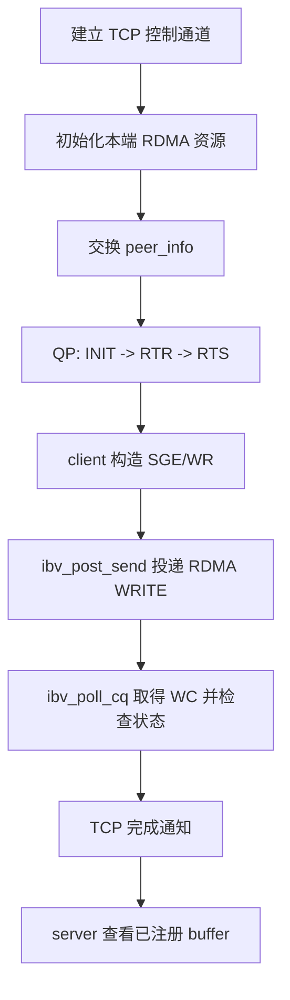
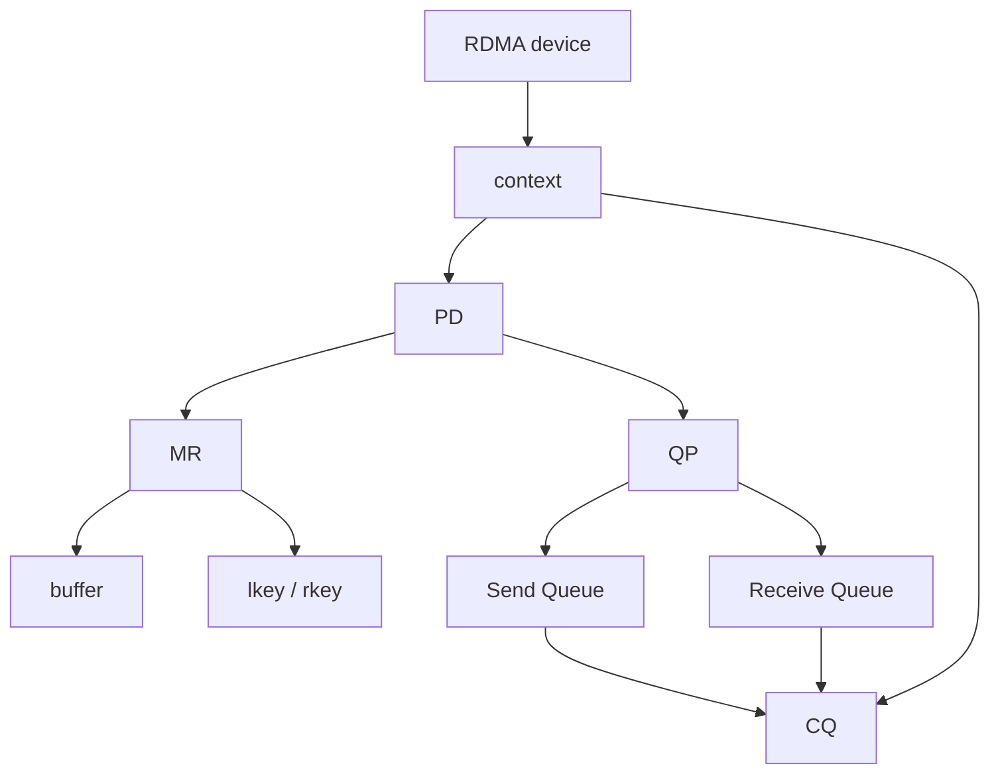

# 2.1 RDMA WRITE 范例解读

第一篇完成了一个单边 RDMA WRITE 程序。这个程序的表面行为很简单：client 把字符串写入 server 的内存，server 随后打印这段字符串。但这段数据并不是通过 TCP `send` 发送给 server，也不是由 server 调用 `recv` 接收得到的。真正的数据搬运动作发生在 RDMA 网卡之间。

本章以 `examples/one_sided_write/one_sided_write.c` 为线索，说明一个最小 RDMA 程序如何组织。重点不在于覆盖 Verbs API 的全部细节，而在于把第一篇中已经运行过的代码和 RDMA 编程模型对应起来：控制通道传什么，RDMA 资源如何创建，内存为什么要注册，QP 如何连接，WR 如何投递，completion 又保证了什么。

## 2.1.1 程序的主线

程序入口 `main` 给出了最清楚的执行顺序：

```c
int sock = opt.is_client ? create_client_socket(opt.server, opt.tcp_port)
                         : create_server_socket(opt.tcp_port);

struct rdma_state state;
init_rdma(&state, &opt);

struct peer_info local = local_info(&state);
struct peer_info remote;
exchange_info(sock, &local, &remote);
connect_qp(&state, &opt, &remote);

if (opt.is_client) {
    memcpy(state.buffer, opt.message, len);
    post_write(&state, &remote, len);
    send_all(sock, "D", 1);
} else {
    recv_all(sock, &done, 1);
    printf("server: buffer after RDMA WRITE: \"%s\"\n", state.buffer);
}
```

这段代码包含四个阶段。

第一，建立 TCP 连接。TCP 在样例中承担控制通道的角色，用于交换 RDMA 连接信息、远端内存地址和访问凭证。

第二，创建本端 RDMA 资源。`init_rdma` 打开设备，创建 PD、CQ 和 QP，分配并注册 buffer，然后把 QP 放入初始状态。

第三，交换两端信息并连接 QP。`exchange_info` 通过 TCP 交换 `peer_info`，`connect_qp` 根据远端信息把 QP 转换到可通信状态。

第四，发起数据搬运。client 将字符串放入本地 buffer，投递 RDMA WRITE；server 不接收这段数据，只在收到 TCP 完成通知后查看自己的 buffer。



图 2-1：单边 RDMA WRITE 样例的执行阶段。
{: .figure-caption }

!!! note "RDMA 程序先组织资源，再提交请求"
    TCP socket 程序通常围绕 `send` 和 `recv` 展开。RDMA 程序则先建立一组可被网卡使用的资源，再把请求投递到队列，由网卡异步执行。

## 2.1.2 控制通道仍然存在

RDMA 数据面不使用 TCP 搬运字符串，但程序仍然需要 TCP。server 端先创建监听 socket：

```c
int fd = socket(AF_INET, SOCK_STREAM, 0);
setsockopt(fd, SOL_SOCKET, SO_REUSEADDR, &one, sizeof(one));
bind(fd, (struct sockaddr *)&addr, sizeof(addr));
listen(fd, 1);

int conn = accept(fd, NULL, NULL);
```

client 端连接 server：

```c
fd = socket(it->ai_family, it->ai_socktype, it->ai_protocol);
if (connect(fd, it->ai_addr, it->ai_addrlen) == 0) break;
```

这条 TCP 连接不在数据面上承载字符串本身。它承担两类控制信息：一类用于建立 RDMA 连接，另一类用于样例末尾的完成通知。真实 RDMA 系统通常也保留类似控制面，用于连接建立、metadata 交换、权限管理、错误恢复和应用级确认。

两端通过 TCP 交换的结构是 `peer_info`：

```c
struct peer_info {
    uint16_t lid;
    uint32_t qpn;
    uint32_t psn;
    uint32_t rkey;
    uint64_t addr;
    union ibv_gid gid;
};
```

`qpn` 和 `psn` 用于连接 QP；`addr` 和 `rkey` 用于 one-sided 远端内存访问；`lid` 和 `gid` 描述网络寻址信息。没有这些信息，client 无法知道应当把 RDMA WRITE 发给哪个 QP，也无法知道远端哪段内存允许被写入。

| 字段 | 来源 | 用途 |
| --- | --- | --- |
| `lid` | 本地端口属性 | InfiniBand 路径寻址；RoCE 中常为 0 |
| `gid` | `ibv_query_gid` | RoCE 或需要 global route header 的路径寻址 |
| `qpn` | `s->qp->qp_num` | 指定远端 QP |
| `psn` | 本端生成的初始序号 | 可靠连接的包序起点 |
| `addr` | 已注册 buffer 地址 | one-sided 操作的远端目标地址 |
| `rkey` | MR 注册后生成 | 远端访问 MR 的凭证 |

表 2-1：`peer_info` 中各字段的来源和作用。
{: .table-caption }

## 2.1.3 本端资源的集合

样例使用 `rdma_state` 保存本端 RDMA 资源：

```c
struct rdma_state {
    struct ibv_context *context;
    struct ibv_pd *pd;
    struct ibv_cq *cq;
    struct ibv_qp *qp;
    struct ibv_mr *mr;
    struct ibv_port_attr port_attr;
    union ibv_gid gid;
    char *buffer;
    uint32_t psn;
};
```

这些字段不是彼此独立的变量，而是一组相互约束的资源。

Context
: 打开的 RDMA 设备上下文。程序通过它查询端口、创建 PD、CQ 等资源。

Protection Domain, PD
: 保护域。MR 和 QP 绑定到同一个 PD 后，才能在同一组访问控制关系下工作。

Completion Queue, CQ
: 完成队列。网卡完成请求后，把 completion queue entry，简称 CQE，写入 CQ；应用通过 `ibv_poll_cq` 取得 work completion，简称 WC，并检查其中的状态。

Queue Pair, QP
: 通信队列对象，由 Send Queue 和 Receive Queue 组成。样例中的 RDMA WRITE 请求投递到 Send Queue。

Memory Region, MR
: 已注册内存区域。注册后，网卡才能根据权限访问 `buffer`。

PSN
: Packet Sequence Number。可靠连接使用它维护包序关系。

这组对象构成了 Verbs 编程模型的基本形状：设备上下文提供入口，PD 限定资源关系，MR 描述可访问内存，QP 承载请求，CQ 返回完成结果。



图 2-2：样例中本端 RDMA 资源之间的依赖关系。
{: .figure-caption }

## 2.1.4 创建设备、队列和保护域

`init_rdma` 按资源依赖关系创建本端对象。程序先打开设备并查询端口：

```c
s->context = open_device(opt->device);

ibv_query_port(s->context, opt->ib_port, &s->port_attr);
ibv_query_gid(s->context, opt->ib_port, opt->gid_index, &s->gid);
```

`open_device` 内部使用 Verbs API 枚举设备，并打开命令行指定的 device：

```c
struct ibv_device **devices = ibv_get_device_list(&num_devices);
const char *dev_name = ibv_get_device_name(devices[i]);
struct ibv_context *ctx = ibv_open_device(chosen);
```

这与第一篇中的 `ibv_devices` 相呼应。命令行工具能枚举出的 RDMA device，用户态程序通常也通过 `ibv_get_device_list` 看到。

随后创建 PD、CQ 和 QP：

```c
s->pd = ibv_alloc_pd(s->context);
s->cq = ibv_create_cq(s->context, 16, NULL, NULL, 0);

qp_init.send_cq = s->cq;
qp_init.recv_cq = s->cq;
qp_init.qp_type = IBV_QPT_RC;
qp_init.cap.max_send_wr = 16;
qp_init.cap.max_recv_wr = 1;
qp_init.cap.max_send_sge = 1;
qp_init.cap.max_recv_sge = 1;

s->qp = ibv_create_qp(s->pd, &qp_init);
```

`IBV_QPT_RC` 表示 Reliable Connection。RC QP 提供可靠的一对一连接语义，是 RDMA WRITE/READ 入门样例中最常见的选择。

`send_cq` 和 `recv_cq` 都指向同一个 CQ。这种写法适合最小样例：所有 CQE 都写入同一个 CQ，应用再通过 `ibv_poll_cq` 取得 WC。真实系统中，不同 QP、不同方向或不同线程可以使用不同 CQ，以减少争用或简化调度。

| 创建步骤 | 样例代码 | 生成对象 | 后续依赖 |
| --- | --- | --- | --- |
| 打开设备 | `ibv_open_device` | `context` | 查询端口，创建 CQ/PD |
| 创建保护域 | `ibv_alloc_pd` | `pd` | 创建 QP，注册 MR |
| 创建完成队列 | `ibv_create_cq` | `cq` | 保存 QP 产生的 CQE |
| 创建 QP | `ibv_create_qp` | `qp` | 状态转换，投递 WR |
| 注册内存 | `ibv_reg_mr` | `mr` | 生成 `lkey`、`rkey` |

表 2-2：RDMA 资源创建顺序与依赖关系。
{: .table-caption }

## 2.1.5 注册内存与访问凭证

RDMA 的数据面依赖 DMA。网卡要访问用户态 buffer，必须先知道这段内存的位置、长度和权限。样例先分配一块 4096 字节对齐的 buffer，再注册成 MR：

```c
posix_memalign((void **)&s->buffer, 4096, BUFFER_SIZE);
memset(s->buffer, 0, BUFFER_SIZE);

int access = IBV_ACCESS_LOCAL_WRITE | IBV_ACCESS_REMOTE_WRITE |
             IBV_ACCESS_REMOTE_READ;
s->mr = ibv_reg_mr(s->pd, s->buffer, BUFFER_SIZE, access);
```

注册内存会产生两个 key：

- `lkey` 用于本地访问。WR 引用本地 buffer 时需要它；
- `rkey` 用于远端访问。对端发起 RDMA READ/WRITE 时需要它。

样例把 server 的 buffer 地址和 `rkey` 放入 `peer_info`：

```c
info.rkey = s->mr->rkey;
info.addr = (uintptr_t)s->buffer;
```

client 后续构造 RDMA WRITE 时，会把这两个字段填入 WR。远端地址本身不是权限；`rkey` 才是远端访问这段 MR 的凭证。

!!! warning "远端地址必须配合 rkey 才能使用"
    one-sided 操作不是任意远端内存读写。远端必须先注册内存并授予权限，发起方也必须同时持有远端地址和匹配的 `rkey`。

## 2.1.6 连接 QP

双方完成本端资源初始化后，需要交换连接信息：

```c
static void exchange_info(int sock, const struct peer_info *local,
                          struct peer_info *remote) {
    send_all(sock, local, sizeof(*local));
    recv_all(sock, remote, sizeof(*remote));
}
```

拿到远端 `peer_info` 后，`connect_qp` 把 QP 从 INIT 转到 RTR，再转到 RTS。

RTR 是 Ready to Receive。进入 RTR 时，本端需要知道远端 QP 编号、远端 PSN 和路径信息：

```c
attr.qp_state = IBV_QPS_RTR;
attr.dest_qp_num = remote->qpn;
attr.rq_psn = remote->psn;
attr.ah_attr.dlid = remote->lid;
attr.ah_attr.port_num = (uint8_t)opt->ib_port;
```

RoCE 或需要 GID 的环境还要设置 global route header：

```c
attr.ah_attr.is_global = 1;
attr.ah_attr.grh.dgid = remote->gid;
attr.ah_attr.grh.sgid_index = opt->gid_index;
attr.ah_attr.grh.hop_limit = 1;
```

随后 QP 进入 RTS，即 Ready to Send：

```c
attr.qp_state = IBV_QPS_RTS;
attr.timeout = 14;
attr.retry_cnt = 7;
attr.rnr_retry = 7;
attr.sq_psn = s->psn;
```

进入 RTS 后，Send Queue 中的 WR 才能被网卡取走执行。也就是说，创建 QP 只是分配了队列对象；连接 QP 才把这个队列对象接入一条可通信路径。

## 2.1.7 构造并投递 RDMA WRITE

client 发起写入前，先把字符串放入本地 buffer：

```c
size_t len = strlen(opt.message) + 1;
memcpy(state.buffer, opt.message, len);
```

`post_write` 接着构造 scatter/gather element，简称 SGE：

```c
struct ibv_sge sge;
sge.addr = (uintptr_t)s->buffer;
sge.length = (uint32_t)len;
sge.lkey = s->mr->lkey;
```

SGE 描述本地内存：从哪里读，读多少字节，使用哪个 `lkey` 验证访问权限。

随后构造 work request，简称 WR：

```c
struct ibv_send_wr wr;
wr.wr_id = 1;
wr.opcode = IBV_WR_RDMA_WRITE;
wr.sg_list = &sge;
wr.num_sge = 1;
wr.send_flags = IBV_SEND_SIGNALED;
wr.wr.rdma.remote_addr = remote->addr;
wr.wr.rdma.rkey = remote->rkey;
```

这个 WR 描述了一次完整的远端写入：本地数据来自 `sge`，远端目标由 `remote_addr` 和 `rkey` 指定，操作类型是 `IBV_WR_RDMA_WRITE`。`IBV_SEND_SIGNALED` 表示这次请求完成后需要在 CQ 中产生 CQE。

最后，WR 被投递到 QP 的 Send Queue：

```c
struct ibv_send_wr *bad = NULL;
ibv_post_send(s->qp, &wr, &bad);
```

`bad` 用于返回投递失败的 WR。样例中只有一个 WR，因此失败时直接报错退出；批量投递时，`bad` 可以帮助定位从哪个 WR 开始失败。

| 字段 | 示例值 | 含义 |
| --- | --- | --- |
| `sge.addr` | `(uintptr_t)s->buffer` | 本地数据起始地址 |
| `sge.length` | `len` | 本地数据长度 |
| `sge.lkey` | `s->mr->lkey` | 本地访问凭证 |
| `wr.opcode` | `IBV_WR_RDMA_WRITE` | 操作类型为 RDMA WRITE |
| `wr.sg_list` | `&sge` | 本地 buffer 描述 |
| `wr.send_flags` | `IBV_SEND_SIGNALED` | 请求完成后产生 CQE |
| `wr.wr.rdma.remote_addr` | `remote->addr` | 远端已注册 buffer 地址 |
| `wr.wr.rdma.rkey` | `remote->rkey` | 远端访问凭证 |

表 2-3：一次 RDMA WRITE 请求中的关键字段。
{: .table-caption }

!!! note "post 成功不是传输完成"
    `ibv_post_send` 返回成功，只说明 WR 已经被 Verbs 接受并放入队列。数据是否已经写入远端内存，需要通过 CQE/WC 判断。

## 2.1.8 CQE 与 WC 的含义

样例通过轮询 CQ 等待 RDMA WRITE 完成：

```c
for (;;) {
    struct ibv_wc wc;
    int n = ibv_poll_cq(s->cq, 1, &wc);
    if (n == 0) continue;
    if (wc.status != IBV_WC_SUCCESS) {
        fprintf(stderr, "RDMA WRITE failed: %s (%d)\n",
                ibv_wc_status_str(wc.status), wc.status);
        exit(EXIT_FAILURE);
    }
    return;
}
```

CQE 是网卡写入 CQ 的完成队列项。用户态程序调用 `ibv_poll_cq` 后，Verbs API 把 CQ 中的完成信息返回为 `struct ibv_wc`，也就是 work completion，简称 WC。程序需要关注两件事。

第一，`ibv_poll_cq` 返回 0 表示当前没有可返回的 WC，不表示请求失败。样例采用忙轮询，直到取到一条 WC。

第二，取到 WC 后必须检查 `wc.status`。只有 `IBV_WC_SUCCESS` 才表示这次 RDMA 操作在 Verbs 语义上成功完成。

!!! note "WC 成功不等于应用级确认"
    对 RDMA WRITE 来说，client 取到成功 WC，表示写操作在 RDMA 语义上已经完成。它不表示 server 应用已经读取或处理了 buffer；甚至不应被简单理解为“在这个时刻，server CPU 读到的一定已经是新值”。远端 CPU 何时看到写入后的内容，还与平台的缓存一致性（Cache coherence）及内存类型等有关，后续章节将进一步说明。样例最后额外发送 `"D"`，只是给 server 一个应用级通知。

## 2.1.9 server 端没有接收字符串

server 端没有调用 RDMA receive 来接收字符串。它只等待 TCP 上的 1 字节通知：

```c
char done;
recv_all(sock, &done, 1);
printf("server: buffer after RDMA WRITE: \"%s\"\n", state.buffer);
```

字符串能够出现在 `state.buffer` 中，是因为 client 的 RDMA WRITE 已经把数据写入 server 注册并授权的内存区域。server 的 CPU 没有参与这段数据复制，也不会因为远端写入自动收到一条应用层消息。

这一区别正是 one-sided 操作的核心。SEND/RECV 要求接收方提前投递 receive buffer；RDMA WRITE 要求远端提前注册内存并提供地址和 `rkey`。两者都需要远端提前准备，但数据面参与方式不同。

| 通信方式 | 发送侧动作 | 接收/远端侧准备 | 数据到达时远端应用是否直接参与 |
| --- | --- | --- | --- |
| TCP `send`/`recv` | 调用 `send` 写入 socket | 调用 `recv` 读取 socket | 参与，远端应用通过 `recv` 取数据 |
| RDMA SEND/RECV | 投递 SEND WR | 提前投递 RECV WR | 参与，远端应用需要管理 receive buffer 和 WC |
| RDMA WRITE | 投递 RDMA WRITE WR | 提前注册 MR，并提供 `addr`/`rkey` | 不直接参与，通常需要额外控制面通知 |

表 2-4：TCP、RDMA SEND/RECV 与 RDMA WRITE 的参与方式对比。
{: .table-caption }

## 2.1.10 编程模型小结

基于上述代码，RDMA Verbs 编程模型可以概括为以下关系：

- `ibv_get_device_list`、`ibv_open_device` 选择并打开 RDMA 设备；
- `ibv_alloc_pd` 建立资源保护域；
- `ibv_create_cq` 创建完成队列；
- `ibv_create_qp` 创建通信队列；
- `ibv_reg_mr` 注册本地内存，产生 `lkey` 和 `rkey`；
- `exchange_info` 通过控制面交换远端 QP 信息、地址和 `rkey`；
- `ibv_modify_qp` 完成 QP 状态转换；
- `ibv_post_send` 提交 RDMA WRITE；
- `ibv_poll_cq` 获取 WC 并检查状态。

这些对象共同构成 RDMA 程序的基本结构：应用把可访问内存注册给网卡，把传输请求投递到队列，再通过 CQE/WC 判断网卡是否完成请求。后续章节将在这个结构之上继续讨论 QP 状态机、错误语义、资源生命周期和性能影响。
