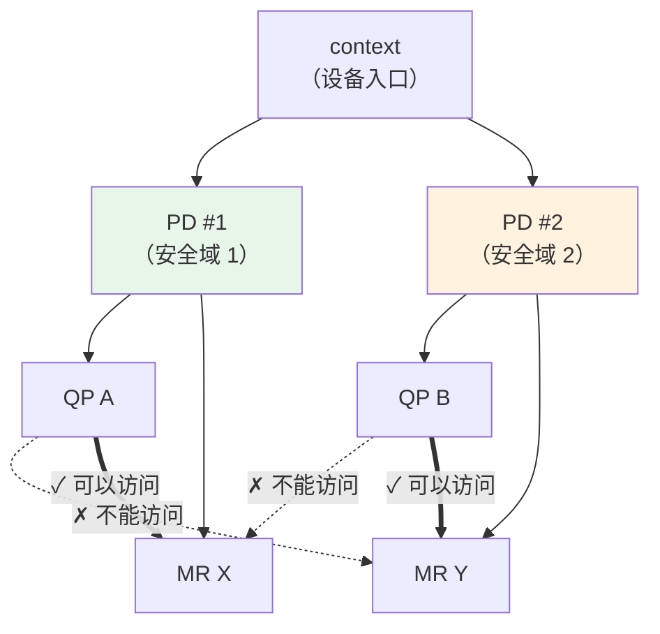

# 2.2 Context 与 Protection Domain（PD）

上一节我们从整体上观察了一个 RDMA 程序的结构。现在开始逐个深入每个核心资源。

本章讨论最基础的两个对象：Context 和 Protection Domain（保护域）。它们是所有 RDMA 程序的起点——没有 Context，程序无法与设备对话；没有 PD，无法创建任何可用于通信的资源。

!!! note "推荐阅读资源"
    RDMA 的官方编程手册和 www.rdmamojo.com 网站提供了更完整的 API 参考。本章建立概念框架，具体 API 的细节可以在需要时查阅这些资源。

## 2.2.1 先从两个问题开始

在深入代码之前，让我们先回答两个根本问题：

1. **为什么程序需要 Context？**
2. **为什么需要 PD，它"保护"了什么？**

理解这两个问题的答案，后面的内容就自然顺畅了。

### Context：设备的大门

Context 本质上是程序与 RDMA 设备的会话入口。类比一下：

- 打开文件需要 `FILE*` 或 `fd`
- 建立网络连接需要 `socket`
- 使用 RDMA 设备需要 `ibv_context`

**Context 与设备的对应关系**：每个 RDMA 设备实例（如 `mlx5_0`、`mlx5_1`）对应一个设备句柄，每次调用 `ibv_open_device` 都会创建一个独立的 Context。

- **一个设备可以被多个 Context 同时打开** —— 多个进程、或同一个进程的多个线程，都可以打开同一个设备创建各自的 Context
- **一个设备实例可能有多个端口** —— 例如多口网卡，一个 `mlx5_0` 可能对应 port 1、port 2 等多个物理接口。程序启动时需要指定使用哪个端口，后续的通信都通过该端口进行
- **Context 及其关联对象只作用于该设备** —— 通过某个 Context 创建的 PD、CQ、QP、MR 都只能用于这一个设备。如果需要使用多张网卡（多卡聚合），需要为每个设备分别创建 Context 及其所有资源

通过 Context，程序可以：
- 询问设备"你能做什么"（查询能力）
- 要求设备"为我创建资源"（分配 PD、CQ、QP、MR）
- 查询端口状态

你几乎不会在 Context 上做"实际的通信工作"——它更像是一个管理入口，而不是通信通道本身。

### PD：资源的安全边界

Protection Domain（PD）是 RDMA 安全模型的基础。它实现了一个简单规则：

**只有同一 PD 内的资源才能互相访问。**

具体来说：
- QP 要访问某个 MR，两者必须在同一个 PD 中
- QP 和 AH（Address Handle）也必须在同一个 PD 中
- 不同 PD 的资源被完全隔离



图 2-4：PD 作为安全边界限定资源访问关系。
{: .figure-caption }

这就像不同的"沙盒"——每个 PD 是一个独立的安全域。PD 防止了"错误的 QP 访问错误的 MR"这类安全问题。

!!! note "为什么需要 PD，Context 隔离不够吗？"
    Context 是设备级别的隔离——不同 Context 的资源天然隔离，但 Context 是重量级的会话对象。如果你只想在**同一设备内**隔离不同的资源组（比如控制流和数据流），使用多个 Context 的成本太高。

    PD 的设计就是为此场景：它提供了轻量级的隔离机制，可以在同一个 Context 下快速创建多个 PD。PD 隔离只限制资源访问关系，不涉及设备会话，开销极小。

    简单来说：**Context 隔离设备，PD 隔离资源**。

!!! note "PD 不是权限隔离机制"
    PD 隔离的是资源访问关系，而不是用户权限。它防止的是程序内部的错误配置，而非外部攻击。如果你需要真正的多租户隔离，那需要其他机制（如 SR-IOV 的 VF 隔离）。

## 2.2.2 程序如何找到并打开设备

让我们看看实际的代码流程。第一步是"找到设备"。

### 获取设备列表

`ibv_get_device_list` 返回系统上所有 RDMA 设备的列表：

```c
int num_devices;
struct ibv_device **dev_list = ibv_get_device_list(&num_devices);

if (!dev_list) {
    perror("Failed to get RDMA devices list");
    return EXIT_FAILURE;
}

if (num_devices == 0) {
    fprintf(stderr, "No RDMA devices found\n");
    ibv_free_device_list(dev_list);
    return EXIT_FAILURE;
}
```

返回的 `dev_list` 是一个指针数组，以 NULL 结尾。每个元素是一个 `ibv_device` 结构，代表一个 RDMA 硬件（或其端口）。

### 设备长什么样？

常见的设备名格式：

| 设备名 | 含义 |
|--------|------|
| `mlx5_0`、`mlx5_1` | Mellanox ConnectX 系列（最常见） |
| `rxe_cm0` | 软件模拟的 RDMA 设备（用于开发测试） |
| `irdma0` | Intel X722 系列 |
| `siw` | 另一个软件模拟实现 |

你可以打印所有设备：

```c
printf("Found %d RDMA device(s)\n", num_devices);
for (int i = 0; i < num_devices; i++) {
    printf("  [%d]: %s\n", i, ibv_get_device_name(dev_list[i]));
}
```

### 选择设备

大多数程序选择"第一个可用设备"：

```c
struct ibv_device *chosen_dev = dev_list[0];
```

如果你的机器有多个 RDMA 设备，也可以通过名称选择：

```c
for (int i = 0; i < num_devices; i++) {
    if (strcmp(ibv_get_device_name(dev_list[i]), "mlx5_0") == 0) {
        chosen_dev = dev_list[i];
        break;
    }
}
```

!!! note "选择设备是程序员的决策"
    RDMA 本身不提供"设备发现"协议——哪些设备适合做什么，需要上层配置或管理员指定。生产环境通常通过配置文件或环境变量来指定。

### 打开设备

选定设备后，`ibv_open_device` 创建一个 Context：

```c
struct ibv_context *ctx = ibv_open_device(chosen_dev);
if (!ctx) {
    perror("Failed to open RDMA device");
    ibv_free_device_list(dev_list);
    return EXIT_FAILURE;
}

// 设备列表已不需要，可以释放
ibv_free_device_list(dev_list);
```

`ibv_open_device` 成功后，你就获得了一个与该设备的"会话"——后续所有操作都通过这个 `ctx` 进行。

## 2.2.3 询问设备能力

打开设备后，通常需要查询"这个设备能做什么"。这就像买电脑前看配置清单。

### 查询设备属性

`ibv_query_device` 返回设备的能力和限制：

```c
struct ibv_device_attr device_attr;
if (ibv_query_device(ctx, &device_attr)) {
    perror("Failed to query device attributes");
    return EXIT_FAILURE;
}

printf("Device capabilities:\n");
printf("  Max QP: %d\n", device_attr.max_qp);
printf("  Max CQ: %d\n", device_attr.max_cq);
printf("  Max MR: %d\n", device_attr.max_mr);
printf("  Max SGE per WR: %d\n", device_attr.max_sge);
printf("  Max CQ entries: %d\n", device_attr.max_cqe);
```

这些数字告诉你资源的上限。例如：
- `max_qp`：最多可以创建多少个 Queue Pair
- `max_qp_wr`：每个 QP 最多有多少个未完成的 Work Request
- `max_sge`：一个 WR 最多可以包含多少个 Scatter/Gather 元素

!!! note "这些限值很重要"
    某些硬件（特别是老设备或模拟设备）的资源限值很低。例如：
    - 老的 `rxe` 软件模拟设备的 `max_qp` 可能只有几十个
    - 某些低端或特殊网卡的 `max_sge` 可能只有 1-2 个
    - `max_cqe` 限制了 CQ 的深度，影响并发请求数

    如果你的程序尝试创建超过设备能力的资源（比如创建超过 `max_qp` 个 QP），`ibv_create_qp` 会直接失败。查询这些限制是保证程序可移植性的第一步——让你的代码能够在不同硬件上都能运行。

### 查询端口状态

RDMA 设备通常有多个端口（物理接口），每个端口独立工作。你可以先用 `ibv_devinfo` 命令查看设备有哪些端口及其状态：

```bash
$ ibv_devinfo
    transport:            InfiniBand (0)
    fw_ver:               28.0.1000
    node_guid:            ...
    sys_image_guid:       ...
    phys_port_cnt:        2            # 这个设备有 2 个端口
    port:                 1
          state:          PORT_ACTIVE  # 端口 1 处于活跃状态
          link_layer:     InfiniBand
    port:                 2
          state:          PORT_DOWN     # 端口 2 未连接
```

程序中通过 `ibv_query_port` 查询端口属性：
```cpp
struct ibv_port_attr port_attr;
uint8_t port_num = 1;  // 查询第一个端口

if (ibv_query_port(ctx, port_num, &port_attr)) {
    perror("Failed to query port attributes");
    return EXIT_FAILURE;
}

printf("Port %d state: %s\n", port_num,
       ibv_port_state_str(port_attr.state));
printf("  LID: 0x%x\n", port_attr.lid);
printf("  Active MTU: %d\n", 1 << (port_attr.active_mtu + 7));
```

端口状态非常重要。在使用端口之前，必须确认它是 `ACTIVE` 的：

```c
if (port_attr.state != IBV_PORT_ACTIVE) {
    fprintf(stderr, "Port %d is not ACTIVE (state: %d)\n",
            port_num, port_attr.state);
    return EXIT_FAILURE;
}
```

!!! note "端口不 ACTIVE 可能的原因"
    - 网线没插
    - 链路层协商失败
    - 子网管理器（SM）未配置（InfiniBand 需要）
    - 交换机端口被禁用

## 2.2.4 创建 Protection Domain

有了 Context 和确认了端口状态，就可以创建 PD 了。

### 分配 PD

`ibv_alloc_pd` 在指定 Context 下创建一个新的 PD：

```c
struct ibv_pd *pd = ibv_alloc_pd(ctx);
if (!pd) {
    perror("Failed to allocate protection domain");
    return EXIT_FAILURE;
}
```

这个 PD 现在就是你的"安全域"。后续创建的 QP、MR 都要关联到这个 PD，才能互相访问。

### 释放 PD

使用完毕后，用 `ibv_dealloc_pd` 释放 PD：

```c
if (ibv_dealloc_pd(pd)) {
    perror("Failed to deallocate PD");
}
```

!!! note "释放顺序很重要"
    只有当 PD 内没有其他资源（QP、MR、AH、SRQ）时，才能释放 PD。这意味着清理顺序是：
    1. 先销毁所有关联的 QP
    2. 先注销所有关联的 MR
    3. 最后才释放 PD

## 2.2.5 一个完整的初始化流程

让我们把上述步骤串联起来：

```c
struct rdma_context {
    struct ibv_context *ctx;
    struct ibv_pd *pd;
    struct ibv_port_attr port_attr;
    uint8_t port_num;
};

int init_rdma_context(struct rdma_context *rc) {
    int num_devices;
    struct ibv_device **dev_list;

    // 1. 获取设备列表
    dev_list = ibv_get_device_list(&num_devices);
    if (!dev_list || num_devices == 0) {
        fprintf(stderr, "No RDMA devices found\n");
        return -1;
    }

    // 2. 打开第一个设备
    rc->ctx = ibv_open_device(dev_list[0]);
    ibv_free_device_list(dev_list);  // 不再需要列表
    if (!rc->ctx) {
        perror("Failed to open device");
        return -1;
    }

    // 3. 查找第一个 ACTIVE 的端口
    for (rc->port_num = 1; rc->port_num <= 255; rc->port_num++) {
        if (ibv_query_port(rc->ctx, rc->port_num, &rc->port_attr))
            continue;
        if (rc->port_attr.state == IBV_PORT_ACTIVE)
            break;
    }

    if (rc->port_attr.state != IBV_PORT_ACTIVE) {
        fprintf(stderr, "No active port found\n");
        ibv_close_device(rc->ctx);
        return -1;
    }

    // 4. 创建 PD
    rc->pd = ibv_alloc_pd(rc->ctx);
    if (!rc->pd) {
        perror("Failed to allocate PD");
        ibv_close_device(rc->ctx);
        return -1;
    }

    printf("Context and PD initialized on port %d\n", rc->port_num);
    return 0;
}
```

这个函数是几乎所有 RDMA 程序的"标准开头"：找到设备、打开设备、确认端口、创建 PD。

## 2.2.6 何时需要多个 PD？

大多数程序只需要一个 PD。但某些场景下，多个 PD 有其价值：

| 场景 | 原因 |
|------|------|
| **控制流与数据流分离** | 为控制和数据创建不同 PD，防止数据 QP 意外访问控制 MR |
| **多租户隔离** | 在一个进程内为不同客户创建独立的资源组 |
| **错误隔离** | 一个 PD 内的配置错误不会影响其他 PD 的资源 |

示例：

```c
// 为控制和数据创建不同的 PD
struct ibv_pd *pd_control = ibv_alloc_pd(ctx);
struct ibv_pd *pd_data = ibv_alloc_pd(ctx);

// 控制流的资源
struct ibv_qp *qp_ctrl = create_qp(pd_control, ...);
struct ibv_mr *mr_ctrl = ibv_reg_mr(pd_control, ctrl_buf, size, ...);

// 数据流的资源
struct ibv_qp *qp_data = create_qp(pd_data, ...);
struct ibv_mr *mr_data = ibv_reg_mr(pd_data, data_buf, size, ...);

// 现在 qp_data 只能访问 mr_data，不能访问 mr_ctrl
```

!!! note "多 PD 是隔离手段，不是性能优化"
    多 PD 增加管理复杂度，不会提升性能。只有当你确实需要资源隔离时才使用。

## 2.2.7 关键要点回顾

| 概念 | 核心要点 |
|------|----------|
| **Context** | 与设备的会话入口，所有资源都通过它创建 |
| **PD** | 安全边界，限定资源访问权限 |
| **设备列表** | 用完要记得 `ibv_free_device_list` |
| **端口状态** | 必须是 ACTIVE 才能用于通信 |
| **资源释放顺序** | 先释放 PD 内的资源，最后释放 PD |
| **多 PD** | 用于隔离，不是性能优化 |

!!! note "下一步"
    有了 Context 和 PD，我们就可以创建其他资源了：
    - **CQ（Completion Queue）** - 网卡写入完成记录的地方
    - **MR（Memory Region）** - 向网卡注册的内存区域
    - **QP（Queue Pair）** - 发送和接收请求的队列

    接下来的三章分别深入讲解这些资源。
