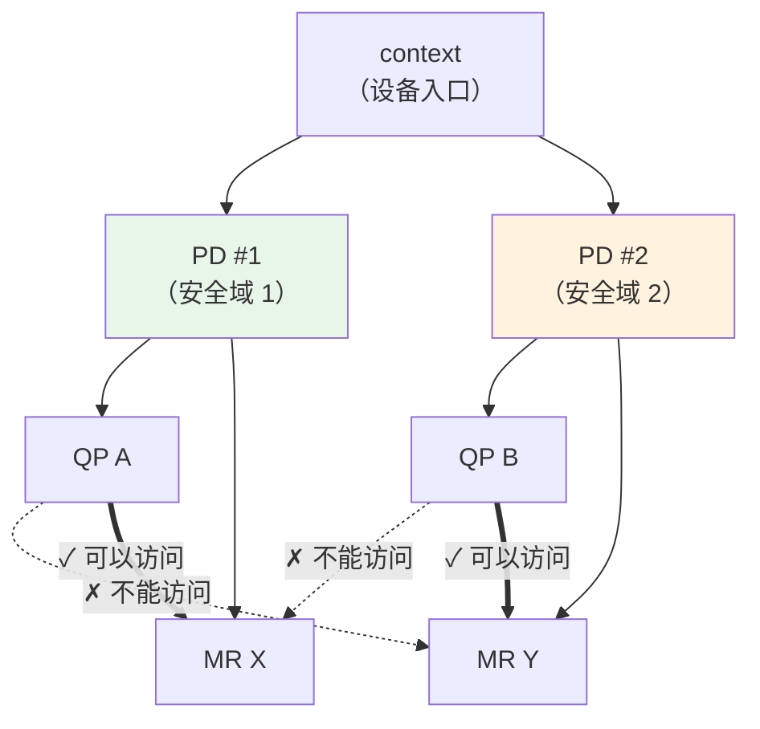

# 2.2 Context 与 Protection Domain（PD）

上一节我们从整体上观察了一个 RDMA 程序的结构。现在开始逐个深入每个核心资源。

本章讨论最基础的两个对象：Context 和 Protection Domain（保护域）。Context 是程序访问 RDMA 设备的入口；PD 则把 QP、MR、AH 等本地资源放进同一个访问域中，限制它们之间能否配合使用。

## 2.2.1 Context 与 PD 的作用

Context 和 PD 是后续资源创建的基础。Context 连接应用与 RDMA 设备，PD 则组织同一设备上下文下的资源访问关系。理解这两个对象后，再看 MR、QP、CQ 的依赖关系会更清楚。

### Context：设备入口

Context 可以看作程序与 RDMA 设备的会话入口：打开文件需要 `FILE*` 或 `fd`，建立网络连接需要 `socket`，使用 RDMA 设备则需要 `ibv_context`。

**Context 与设备的对应关系**：每个 RDMA 设备实例（如 `mlx5_0`、`mlx5_1`）可以被打开为一个设备上下文。每次调用 `ibv_open_device` 都会返回一个独立的 `ibv_context`。同一设备可以被多个进程或线程同时打开，一个设备实例也可能有多个物理端口。通过某个 Context 创建的 PD、CQ、QP、MR 只属于这个设备，不能直接拿到另一张 RDMA 设备上使用；如果程序要使用多张网卡，通常要为每个设备分别创建 Context 及其资源。

通过 Context，程序可以查询设备能力、创建 PD/CQ/QP/MR 等资源，也可以查询端口状态。

Context 本身不是通信通道。实际请求会投递到 QP，完成结果会出现在 CQ；Context 更多承担设备入口和资源创建的角色。

### PD：资源的安全边界

Protection Domain（PD）是 RDMA 本地资源隔离模型的一部分。它实现了一个简单规则：

**只有同一 PD 内的资源才能互相访问。**

具体来说，QP 要访问某个 MR，两者必须在同一个 PD 中；QP 和 AH（Address Handle）也必须在同一个 PD 中；不同 PD 的资源不能直接配合访问。



图 2-4：PD 作为安全边界限定资源访问关系。
{: .figure-caption }

可以把 PD 理解为同一设备上下文下的资源分组。它防止"错误的 QP 使用错误的 MR"这类本地资源配置错误。

!!! note "PD 与 Context 的关系"
    Context 是设备会话入口；PD 是同一个设备上下文下更细粒度的资源访问域。在同一设备内隔离不同资源组（例如控制流和数据流）时，PD 比重新打开设备更合适。

    PD 隔离的是本地资源访问关系，不负责连接认证、租户隔离或控制面权限校验。

    简单来说：**Context 选择设备，PD 组织该设备上的资源访问关系**。

!!! note "PD 不是完整安全方案"
    PD 能限制 QP、MR、AH 等本地资源是否能配合使用，但它不是用户身份认证机制，也不能替代进程隔离、VF/SR-IOV、IOMMU 或控制面鉴权。

## 2.2.2 程序如何找到并打开设备

实际代码的第一步是获取设备列表。

### 获取设备列表

`ibv_get_device_list` 返回系统上所有 RDMA 设备的列表：

```c
int num_devices;
struct ibv_device **dev_list = ibv_get_device_list(&num_devices);

if (!dev_list) {
    perror("Failed to get RDMA devices list");
    return EXIT_FAILURE;
}

if (num_devices == 0) {
    fprintf(stderr, "No RDMA devices found\n");
    ibv_free_device_list(dev_list);
    return EXIT_FAILURE;
}
```

返回的 `dev_list` 是一个指针数组，以 NULL 结尾。每个元素是一个 `ibv_device`，代表用户态 Verbs 能看到的一个 RDMA 设备实例。

这里有两个细节需要留意。第一，`ibv_get_device_list` 失败时返回 `NULL`；如果系统上没有 RDMA 设备，它可以返回一个非空列表，同时把 `num_devices` 设为 0。因此程序通常要分别处理“调用失败”和“没有设备”两种情况。第二，`ibv_device` 只是设备描述项，后续真正用于查询能力和创建资源的是 `ibv_open_device` 返回的 `ibv_context`。

### 设备长什么样？

常见的设备名格式：

| 设备名 | 含义 |
|--------|------|
| `mlx5_0`、`mlx5_1` | Mellanox ConnectX 系列（最常见） |
| `rxe0` | Soft-RoCE/RXE 软件模拟设备（用于开发测试） |
| `irdma0` | Intel X722 系列 |
| `siw0` | Soft-iWARP 软件模拟设备 |

可以打印所有设备名：

```c
printf("Found %d RDMA device(s)\n", num_devices);
for (int i = 0; i < num_devices; i++) {
    printf("  [%d]: %s\n", i, ibv_get_device_name(dev_list[i]));
}
```

### 选择设备

大多数程序选择"第一个可用设备"：

```c
struct ibv_device *chosen_dev = dev_list[0];
```

如果机器有多个 RDMA 设备，也可以通过名称选择：

```c
for (int i = 0; i < num_devices; i++) {
    if (strcmp(ibv_get_device_name(dev_list[i]), "mlx5_0") == 0) {
        chosen_dev = dev_list[i];
        break;
    }
}
```

!!! note "选择设备是程序配置的一部分"
    Verbs 可以枚举本机设备，但不会判断哪张卡适合当前连接。生产环境通常通过配置文件、命令行参数或服务发现结果来指定设备、端口和 GID index。

### 打开设备

选定设备后，`ibv_open_device` 创建一个 Context：

```c
struct ibv_context *ctx = ibv_open_device(chosen_dev);
if (!ctx) {
    perror("Failed to open RDMA device");
    ibv_free_device_list(dev_list);
    return EXIT_FAILURE;
}

// 设备列表已不需要，可以释放
ibv_free_device_list(dev_list);
```

`ibv_open_device` 成功后，程序获得与该设备的会话入口。后续查询设备、创建 CQ、分配 PD 等操作都会从这个 `ctx` 开始。

设备列表在打开目标设备后就可以释放。释放列表并不会使已经打开的 `ibv_context` 失效；但没有打开的 `ibv_device` 指针不应在 `ibv_free_device_list` 之后继续使用。

## 2.2.3 查询设备能力

打开设备后，通常需要查询这个设备支持哪些能力和资源上限。

### 查询设备属性

`ibv_query_device` 返回设备的能力和限制：

```c
struct ibv_device_attr device_attr;
if (ibv_query_device(ctx, &device_attr)) {
    perror("Failed to query device attributes");
    return EXIT_FAILURE;
}

printf("Device capabilities:\n");
printf("  Max QP: %d\n", device_attr.max_qp);
printf("  Max CQ: %d\n", device_attr.max_cq);
printf("  Max MR: %d\n", device_attr.max_mr);
printf("  Max SGE per WR: %d\n", device_attr.max_sge);
printf("  Max CQ entries: %d\n", device_attr.max_cqe);
```

这些数字描述资源上限。例如，`max_qp` 表示最多可以创建多少个 Queue Pair，`max_qp_wr` 表示每个 QP 最多可以有多少个未完成的 Work Request，`max_sge` 表示一个 WR 最多可以包含多少个 Scatter/Gather 元素。

这些属性更接近“硬件和驱动支持的上限”，不是当前进程一定能够创建到的剩余资源数量。实际创建 QP、CQ、MR 等对象时，还会受到系统内存、权限、其他进程占用以及驱动策略的影响。因此查询能力用于选择合理参数，不能替代创建调用的错误处理。

!!! note "这些限值很重要"
    某些硬件（特别是老设备或模拟设备）的资源限值很低。老的 `rxe` 软件模拟设备可能只允许几十个 QP，某些低端或特殊网卡的 `max_sge` 可能只有 1 到 2 个，`max_cqe` 也会限制 CQ 的深度并影响并发请求数。如果程序尝试创建超过设备能力的资源，相关创建调用会失败。查询这些限制是保证程序可移植性的第一步。

### 查询端口状态

RDMA 设备通常有多个端口（物理接口），每个端口独立工作。可以先用 `ibv_devinfo` 命令查看设备有哪些端口及其状态：

```bash
$ ibv_devinfo
    transport:            InfiniBand (0)
    fw_ver:               28.0.1000
    node_guid:            ...
    sys_image_guid:       ...
    phys_port_cnt:        2            # 这个设备有 2 个端口
    port:                 1
          state:          PORT_ACTIVE  # 端口 1 处于活跃状态
          link_layer:     InfiniBand
    port:                 2
          state:          PORT_DOWN     # 端口 2 未连接
```

程序中通过 `ibv_query_port` 查询端口属性：
```cpp
struct ibv_port_attr port_attr;
uint8_t port_num = 1;  // 查询第一个端口

if (ibv_query_port(ctx, port_num, &port_attr)) {
    perror("Failed to query port attributes");
    return EXIT_FAILURE;
}

printf("Port %d state: %s\n", port_num,
       ibv_port_state_str(port_attr.state));
printf("  LID: 0x%x\n", port_attr.lid);
printf("  Active MTU: %d\n", 1 << (port_attr.active_mtu + 7));
```

端口状态非常重要。在使用端口之前，必须确认它是 `ACTIVE` 的：

```c
if (port_attr.state != IBV_PORT_ACTIVE) {
    fprintf(stderr, "Port %d is not ACTIVE (state: %d)\n",
            port_num, port_attr.state);
    return EXIT_FAILURE;
}
```

端口属性与设备属性不同，很多字段会随链路状态、子网管理器配置或硬件状态变化而变化。程序启动时通常要检查 `state` 和 `link_layer`，运行中如果收到异步端口事件，也应重新确认端口状态。InfiniBand 场景中 LID、P_Key 等字段更常用；RoCE 场景则通常需要关注 GID、GID index 和 GRH 配置。

!!! note "端口不 ACTIVE 可能的原因"
    端口不 ACTIVE 的原因可能是网线未连接、链路层协商失败、InfiniBand 子网管理器（SM）未配置，或者交换机端口被禁用。排查时通常先看 `ibv_devinfo`、系统日志和交换机端口状态。

## 2.2.4 创建 Protection Domain

有了 Context 和确认了端口状态，就可以创建 PD 了。

### 分配 PD

`ibv_alloc_pd` 在指定 Context 下创建一个新的 PD：

```c
struct ibv_pd *pd = ibv_alloc_pd(ctx);
if (!pd) {
    perror("Failed to allocate protection domain");
    return EXIT_FAILURE;
}
```

这个 PD 现在就是后续 QP、MR 等资源的访问域。QP 访问本地 MR 时，两者需要属于同一个 PD。
同一个 PD 还会被用于创建或关联 AH、SRQ、QP、MR、MW 等资源。实际程序中，如果一个 QP 要使用某个 MR 的 `lkey`，两者应来自同一个 PD；如果把不同 PD 下的对象混用，错误通常会在 WR 完成时以保护错误或操作错误暴露出来。

### 释放 PD

使用完毕后，用 `ibv_dealloc_pd` 释放 PD：

```c
if (ibv_dealloc_pd(pd)) {
    perror("Failed to deallocate PD");
}
```

!!! note "释放顺序很重要"
    只有当 PD 内没有其他依赖资源（QP、MR、AH、SRQ 等）时，才能释放 PD。清理时通常先销毁关联的 QP，再注销关联的 MR，最后才释放 PD。

## 2.2.5 一个完整的初始化流程

上述步骤可以串联为如下初始化流程：

```c
struct rdma_context {
    struct ibv_context *ctx;
    struct ibv_pd *pd;
    struct ibv_port_attr port_attr;
    uint8_t port_num;
};

int init_rdma_context(struct rdma_context *rc) {
    int num_devices;
    struct ibv_device **dev_list;
    struct ibv_device_attr device_attr;
    int found_active = 0;

    // 1. 获取设备列表
    dev_list = ibv_get_device_list(&num_devices);
    if (!dev_list) {
        perror("Failed to get RDMA devices");
        return -1;
    }
    if (num_devices == 0) {
        fprintf(stderr, "No RDMA devices found\n");
        ibv_free_device_list(dev_list);
        return -1;
    }

    // 2. 打开第一个设备
    rc->ctx = ibv_open_device(dev_list[0]);
    ibv_free_device_list(dev_list);  // 不再需要列表
    if (!rc->ctx) {
        perror("Failed to open device");
        return -1;
    }

    if (ibv_query_device(rc->ctx, &device_attr)) {
        perror("Failed to query device");
        ibv_close_device(rc->ctx);
        return -1;
    }

    // 3. 查找第一个 ACTIVE 的端口
    for (rc->port_num = 1; rc->port_num <= device_attr.phys_port_cnt; rc->port_num++) {
        if (ibv_query_port(rc->ctx, rc->port_num, &rc->port_attr))
            continue;
        if (rc->port_attr.state == IBV_PORT_ACTIVE) {
            found_active = 1;
            break;
        }
    }

    if (!found_active) {
        fprintf(stderr, "No active port found\n");
        ibv_close_device(rc->ctx);
        return -1;
    }

    // 4. 创建 PD
    rc->pd = ibv_alloc_pd(rc->ctx);
    if (!rc->pd) {
        perror("Failed to allocate PD");
        ibv_close_device(rc->ctx);
        return -1;
    }

    printf("Context and PD initialized on port %d\n", rc->port_num);
    return 0;
}
```

这个函数展示了 RDMA 程序常见的初始化顺序：找到设备、打开设备、确认端口、创建 PD。

## 2.2.6 何时需要多个 PD？

大多数程序只需要一个 PD。但某些场景下，多个 PD 有其价值：

| 场景 | 原因 |
|------|------|
| **控制流与数据流分离** | 为控制和数据创建不同 PD，防止数据 QP 意外访问控制 MR |
| **进程内资源分组** | 在同一进程内为不同连接或模块创建独立资源组 |
| **错误边界更清楚** | 错误 QP 更难误用不属于同一 PD 的 MR |

示例：

```c
// 为控制和数据创建不同的 PD
struct ibv_pd *pd_control = ibv_alloc_pd(ctx);
struct ibv_pd *pd_data = ibv_alloc_pd(ctx);

// 控制流的资源
struct ibv_qp *qp_ctrl = create_qp(pd_control, ...);
struct ibv_mr *mr_ctrl = ibv_reg_mr(pd_control, ctrl_buf, size, ...);

// 数据流的资源
struct ibv_qp *qp_data = create_qp(pd_data, ...);
struct ibv_mr *mr_data = ibv_reg_mr(pd_data, data_buf, size, ...);

// 现在 qp_data 只能访问 mr_data，不能访问 mr_ctrl
```

!!! note "多 PD 是隔离手段，不是性能优化"
    多 PD 会增加管理复杂度，通常不会提升性能。只有确实需要资源隔离时才使用。

## 2.2.7 关键要点回顾

| 概念 | 核心要点 |
|------|----------|
| **Context** | 与设备的会话入口，所有资源都通过它创建 |
| **PD** | 本地资源访问域，限定 QP、MR、AH 等资源的配合关系 |
| **设备列表** | 用完要记得 `ibv_free_device_list` |
| **端口状态** | 必须是 ACTIVE 才能用于通信 |
| **资源释放顺序** | 先释放 PD 内的资源，最后释放 PD |
| **多 PD** | 用于隔离，不是性能优化 |

!!! note "后续章节"
    有了 Context 和 PD，程序就可以继续创建 CQ、MR 和 QP。接下来的几章会分别讨论完成队列、内存注册以及请求队列。
