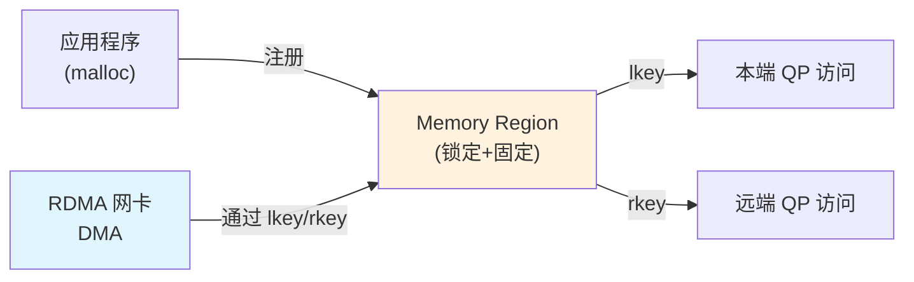
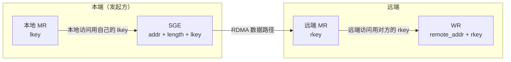

# 2.3 Memory Region（MR）

上一节我们讨论了如何打开设备和创建 PD。现在进入 RDMA 最核心的概念之一：Memory Region（内存区域）。

第一章已经说明，RDMA 可以让网卡直接读写应用缓冲区，避免传统 socket 数据路径中的额外拷贝。但这有一个前提：**应用必须先把这段内存注册给 RDMA 设备，并声明访问权限**。这就是 Memory Registration 要做的事情。

本章实验使用 `examples/programming_model/02_resource_lifecycle.c`。程序分配一段页对齐缓冲区，调用 `ibv_reg_mr` 完成注册，并打印 MR 返回的 `addr`、`length`、`lkey` 和 `rkey`。这些字段体现了内存注册前后的差别：注册前，缓冲区只是进程中的普通用户态内存；注册后，它才成为可由 WR 通过 key 引用的 MR。

```bash
make -C examples/programming_model
./examples/programming_model/02_resource_lifecycle -d mlx5_0 -p 1
```

## 2.3.1 普通内存与 Memory Registration

普通 `malloc` 内存不能直接用于 RDMA 数据路径，这涉及虚拟地址、DMA 和访问权限之间的边界。

### 虚拟地址、DMA 与访问权限

程序使用的是虚拟地址，但网卡通过 DMA 访问内存。普通用户态内存不能直接交给网卡使用：传输期间页面必须保持可访问，驱动需要为网卡建立可使用的地址映射，权限也必须被显式声明和校验，不能让远端凭一个地址就随意读写进程内存。

### Memory Registration 做了什么

`ibv_reg_mr` 的作用可以概括为：注册一段用户内存，按需要锁定页面或建立按需分页访问能力，设置本地/远端访问权限，并生成访问凭证 `lkey`/`rkey`。

注册后，网卡才能在 WR 中通过 `lkey` 或 `rkey` 校验并访问这段内存。

这个过程通常比一次普通函数调用重得多。它可能涉及内核、页表、IOMMU 和设备侧缓存，因此不适合放在每个请求的热路径上反复执行。更常见的做法是在程序启动或连接建立阶段注册较大的缓冲区，再由应用在已注册内存中自行分配小块。



图 2-5：Memory Registration 让网卡可以直接访问内存。
{: .figure-caption }

!!! note "普通网络 I/O vs RDMA"
    普通 TCP 程序中，数据通常会经过内核协议栈和 socket buffer。RDMA 通过 Memory Registration 让网卡直接访问应用提供的缓冲区，减少数据复制和 CPU 参与。代价是应用必须显式告诉网卡哪些内存可以访问、如何访问。

## 2.3.2 注册内存：`ibv_reg_mr`

注册内存的代码很简单：

```c
#define BUFFER_SIZE 4096

// 分配内存（推荐页对齐）
char *buffer;
posix_memalign((void **)&buffer, 4096, BUFFER_SIZE);

// 设置访问权限：本地写、远端读写
int access = IBV_ACCESS_LOCAL_WRITE |
             IBV_ACCESS_REMOTE_WRITE |
             IBV_ACCESS_REMOTE_READ;

// 注册内存
struct ibv_mr *mr = ibv_reg_mr(pd, buffer, BUFFER_SIZE, access);
if (!mr) {
    perror("Failed to register memory");
    return -1;
}

printf("MR registered: lkey=0x%x, rkey=0x%x\n", mr->lkey, mr->rkey);
```

### 访问权限

`access` 参数控制谁可以如何访问这段内存：

| 权限标志 | 含义 | 何时需要 |
|---------|------|----------|
| `IBV_ACCESS_LOCAL_WRITE` | 本地写权限 | 接收缓冲区、RDMA READ 结果、远端写或远端原子场景 |
| `IBV_ACCESS_REMOTE_WRITE` | 远端写权限 | 对方要 RDMA WRITE 到本地内存 |
| `IBV_ACCESS_REMOTE_READ` | 远端读权限 | 对方要 RDMA READ 本地内存 |
| `IBV_ACCESS_REMOTE_ATOMIC` | 远端原子操作 | 对方要做原子操作 |

!!! note "远端写需要本地写权限"
    如果设置了 `IBV_ACCESS_REMOTE_WRITE` 或 `IBV_ACCESS_REMOTE_ATOMIC`，必须同时设置 `IBV_ACCESS_LOCAL_WRITE`。这是 `ibv_reg_mr` 对访问标志的要求。

!!! note "本地读是隐式的"
    本地读权限不需要显式设置。本端始终可以读取自己的 MR。

!!! note "访问权限不能超过原内存权限"
    注册权限还受原始内存映射权限约束。例如只读映射不能注册为可写 MR；设置远端写或远端原子权限时，也必须满足本地写权限要求。

### MR 结构体返回什么

`ibv_reg_mr` 成功后，会得到一个 `ibv_mr` 结构：

```c
struct ibv_mr {
    void *addr;        // 注册时传入的虚拟地址
    size_t length;     // 注册长度
    uint32_t lkey;     // Local key - 本端使用
    uint32_t rkey;     // Remote key - 远端使用
    // ...
};
```

最重要的字段是 `lkey` 和 `rkey` —— 这两个 key 是网卡的"访问凭证"。

每次成功注册都会生成对应的 key。不要假定同一段虚拟地址在重新注册后仍然得到相同的 `lkey` 或 `rkey`，也不要把 key 当作跨设备、跨进程长期有效的标识。MR 注销后，这些 key 就不再代表可用授权；控制面如果曾把 `addr`/`rkey` 发给远端，也需要有相应的失效和更新机制。

## 2.3.3 lkey 和 rkey 的区别

lkey 和 rkey 的使用位置不同，需要明确区分。

| Key | 全称 | 谁用 | 用在什么地方 |
|-----|------|------|-------------|
| **lkey** | Local Key | 本端 | 构造 SGE 时，告诉网卡"从我的哪段内存读/写" |
| **rkey** | Remote Key | 远端 | RDMA WRITE/READ 时，告诉网卡"写到对方的哪段内存" |

可以用一张图说明两个 key 各自出现的场景。发起方（本端）在 SGE 中用自己的 `lkey` 描述本地内存；如果要对远端内存执行 RDMA WRITE/READ/Atomic，则在 WR 中携带对方的 `addr` 和 `rkey`。



图 2-5b：`lkey` 与 `rkey` 的使用位置。本端网卡用 `lkey` 校验本地访问，远端网卡用 `rkey` 校验远端访问；地址本身不构成权限。
{: .figure-caption }

### 具体使用场景

**场景 1：本端发送数据（用 lkey）**

```c
// 我要发送本地 buffer 的数据
struct ibv_sge sge = {
    .addr = (uintptr_t)local_mr->addr,
    .length = size,
    .lkey = local_mr->lkey  // 用自己的 lkey
};
```

**场景 2：远端 RDMA WRITE 到对方内存（用对方的 rkey）**

```c
// 我要写到对方的内存
struct ibv_send_wr wr = {
    .opcode = IBV_WR_RDMA_WRITE,
    .wr.rdma.remote_addr = remote_addr,  // 对方的虚拟地址
    .wr.rdma.rkey = remote_rkey          // 对方的 rkey
};
```

!!! note "rkey 是访问凭证，不是地址"
    远端地址本身不是权限。RDMA READ/WRITE/Atomic 必须同时提供远端地址和正确的 `rkey`，网卡才会允许访问。实际系统不应随意暴露 `addr`/`rkey`，控制面需要负责认证、授权和生命周期管理。

## 2.3.4 注销内存：`ibv_dereg_mr`

使用完毕后，需要注销 MR：

```c
if (ibv_dereg_mr(mr)) {
    perror("Failed to deregister MR");
}

free(buffer);
```

!!! note "注销时机很重要"
    只有在所有使用该 MR 的 Work Request 都完成后，才能安全注销。注销太早会导致未定义行为，例如网卡仍在访问内存时应用已经释放了该缓冲区。

    如果 MR 正被未完成的 WR 引用，错误可能表现为后续 WC 中的访问错误；如果 MR 还被 Memory Window 绑定，注销也可能失败。实际清理时应先停止投递新请求，再等待相关 CQE 或完成错误全部处理完毕。

## 2.3.5 内存对齐

`ibv_reg_mr` 可以接受任意地址和长度，注册缓冲区本身不要求页对齐。但实验和生产代码通常会优先使用页对齐内存：

```c
// 页对齐（4KB 对齐）
posix_memalign((void **)&buffer, 4096, BUFFER_SIZE);

// 也可以工作，但边界不如页对齐清晰
char *buffer = malloc(BUFFER_SIZE);
```

### 页对齐的作用

页对齐并不是注册的硬性要求，它的好处主要在工程管理和性能上。注册范围与页边界一致时，长度、权限和越界问题更容易排查；配合大页时，页表项更少，注册和地址转换开销也可能更低。真实系统中的大块缓冲区、内存池和 MR cache 通常也会按页或大页组织。

### 获取系统页大小

```c
long page_size = sysconf(_SC_PAGESIZE);  // 通常是 4096
posix_memalign((void **)&buffer, page_size, size);
```

## 2.3.6 性能关键点

Memory Registration 的开销可能远超想象。在性能敏感的场景下，必须注意两点。

### 注册操作极为耗时

`ibv_reg_mr` 不是一个轻量级操作。它需要：
进入内核，遍历并锁定相关页面，为这些页面建立设备可使用的地址映射，并把映射和权限信息交给网卡或驱动维护。

注册耗时会随页面数量、IOMMU、驱动和硬件能力变化。在小消息或高频请求场景中，注册一次内存的开销往往会超过一次 RDMA 传输本身。

!!! warning "减少注册次数是性能优化的第一步"
    不要频繁注册/注销内存。常见做法是在程序启动时预注册需要的内存，把请求缓冲区从已注册内存池中分配出来，并让 MR 的生命周期覆盖一批请求甚至整个进程，而不是绑定到单次操作。

### 使用大页加速注册

标准 4KB 页意味着注册 1MB 内存需要处理 256 个页表项。如果使用 2MB 大页，只需要处理 1 个。

大页可能减少页表项数量，使注册过程更快，也可能改善 TLB 命中率并减少页表锁定开销。不过这些收益与硬件、IOMMU 和访问模式有关，应结合实际测试判断。

**启用大页的一种方式**：

```bash
# 配置大页（需要 root 权限）
echo 100 > /proc/sys/vm/nr_hugepages

# 挂载 hugetlbfs（若尚未挂载）
mkdir -p /hugepages
mount -t hugetlbfs hugetlbfs /hugepages

# 程序中使用大页
#define HUGEPAGE_SIZE (2 * 1024 * 1024)  // 2MB

void *buffer;
// 使用 mmap 从 hugetlbfs 分配
int fd = open("/hugepages", O_RDWR);
buffer = mmap(NULL, HUGEPAGE_SIZE, PROT_READ | PROT_WRITE,
              MAP_SHARED, fd, 0);
```

!!! note "大页挂载与权限"
    上面的 `mount` 需要 root 权限，且不同发行版的挂载方式（`/etc/fstab`、systemd 单元等）可能不同。大页只是工程优化手段之一；在未启用大页的普通页系统上，页对齐的 `posix_memalign` 注册同样正确。

!!! note "大页的权衡"
    大页的缺点是分配和运维更复杂，内存粒度也更大。它适合长期持有的大块缓冲区，不适合为了每个小对象临时分配。

## 2.3.7 常见错误

### 错误 1：忘记 LOCAL_WRITE

```c
// 错误：远端写但没设本地写
int access = IBV_ACCESS_REMOTE_WRITE;  // 缺少 LOCAL_WRITE
struct ibv_mr *mr = ibv_reg_mr(pd, buffer, size, access);
```

**后果**：某些驱动会拒绝，返回 `EINVAL`。必须同时设置 `IBV_ACCESS_LOCAL_WRITE`。

### 错误 2：访问超出 MR 范围

```c
// MR 只有 4096 字节
struct ibv_mr *mr = ibv_reg_mr(pd, buffer, 4096, access);

// 但尝试访问偏移 4096 处
struct ibv_sge sge = {
    .addr = (uintptr_t)mr->addr + 4096,  // 超出范围！
    .length = 100,
    .lkey = mr->lkey
};
```

**后果**：操作会失败，WC 状态为 `IBV_WC_LOC_LEN_ERR`。

### 错误 3：注销太早

```c
// 错误：刚投递就注销
ibv_post_send(qp, &wr, &bad_wr);
ibv_dereg_mr(mr);  // 太早了！WR 可能还没完成
```

**后果**：未定义行为，可能导致系统崩溃。

**正确做法**：等待 CQ 确认所有操作完成后再注销。

## 2.3.8 高级主题：Memory Window（可选）

Memory Window（MW）是基于已有 MR 的授权机制，可以在运行时授予或撤销远端访问权限，也可以对同一 MR 的不同部分设置更细粒度的访问范围。它的价值在于把“内存注册”和“远端授权”拆开，在已经注册的内存之上调整远端可访问区域。

!!! note "MW 是高级特性"
    大多数程序不需要 MW。只有需要频繁改变远端访问权限时才考虑使用。简单应用用 MR 就足够了。

## 2.3.9 本章小结

Memory Registration 把一段用户态内存纳入 RDMA 设备可访问的范围，并为它生成 `lkey` 和 `rkey`。`lkey` 用于本端 WR 的 SGE 校验，`rkey` 用于远端 RDMA READ、WRITE 或 Atomic 访问。远端地址本身不是权限，只有地址与正确的 key 同时出现，访问才可能通过。

MR 的权限应按实际用途声明。设置远端写或远端原子权限时，还要满足 `ibv_reg_mr` 对本地写权限的要求。MR 的生命周期必须覆盖所有引用它的 outstanding WR；注销过早会使仍在执行的数据路径失去有效内存描述。注册本身不要求页对齐，但实验和生产代码常使用页对齐内存，便于管理内存池、大页和设备映射。

!!! note "后续章节"
    有了 Context、PD 和 MR 后，程序还需要创建请求队列和完成队列。下一章将进入 QP，理解请求如何投递到网卡。

## 延伸阅读

- [rdma-core 手册页：ibv_reg_mr(3)、ibv_dereg_mr(3)](https://man.archlinux.org/man/extra/rdma-core/)：注册与注销的返回值、访问标志与错误码。
- Linux 内核文档 [RDMA Memory Registration](https://docs.kernel.org/infiniband/core_lib.html)：说明页固定、DMA mapping 与内核侧 MR 的生命周期。
- 关于 On-Demand Paging（ODP）的行为与限制，可查阅内核文档中的 [ODP 说明](https://docs.kernel.org/infiniband/opd.html) 以及所用网卡驱动的手册。
- 本章实验程序为 `examples/programming_model/02_resource_lifecycle.c`，打印 MR 的 `addr`、`length`、`lkey` 与 `rkey`。
