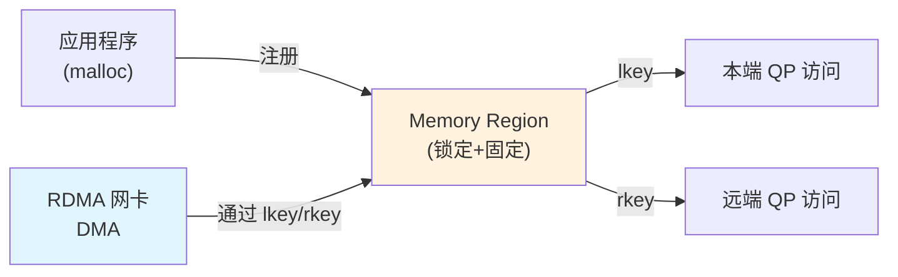

# 2.3 Memory Region（MR）

上一节我们讨论了如何打开设备和创建 PD。现在进入 RDMA 最核心的概念之一：Memory Region（内存区域）。

在第一章中我们已经看到 RDMA 的威力——网卡直接读写内存，CPU 完全不参与数据搬运。但实现这个零拷贝魔法有一个前提：**网卡必须知道内存的物理地址和访问权限**。这就是 Memory Registration 要做的事情。

!!! note "推荐阅读资源"
    RDMA 的官方编程手册和 www.rdmamojo.com 网站提供了更完整的 API 参考。本章建立概念框架，具体 API 的细节可以在需要时查阅这些资源。

## 2.3.1 先从问题开始：为什么不能直接用 malloc 的内存？

你可能会问：*我 `malloc` 的内存不就是内存吗？为什么还要再"注册"一遍？*

问题的根源在于虚拟地址和物理地址的区别。

### 虚拟地址 vs 物理地址

程序使用的是**虚拟地址（VA）**，但网卡 DMA 需要的是**物理地址（PA）**。更麻烦的是：

1. **虚拟地址映射可能变化** — 操作系统可能将页面换出到不同的物理位置
2. **网卡无法做地址转换** — 网卡没有操作系统的页表，无法进行 VA→PA 转换
3. **安全控制必须强制** — 不能让网卡随意读写任何内存

### Memory Registration 做了什么

`ibv_reg_mr` 的本质是：

```
1. 锁定内存页（防止被换出）
2. 固定 VA→PA 映射关系
3. 设置访问权限
4. 生成访问凭证（lkey/rkey）
```

注册后，网卡就能安全地直接访问这段内存，无需 CPU 参与。



图 2-5：Memory Registration 让网卡可以直接访问内存。
{: .figure-caption }

!!! note "普通网络 I/O vs RDMA"
    普通 TCP 程序中，`send/recv` 的数据会经过 CPU 拷贝至少一次。RDMA 通过 Memory Registration 让网卡直接访问用户态内存，实现真正的零拷贝——代价是你必须显式告诉网卡"哪些内存可以访问、如何访问"。

## 2.3.2 注册内存：`ibv_reg_mr`

注册内存的代码很简单：

```c
#define BUFFER_SIZE 4096

// 分配内存（推荐页对齐）
char *buffer;
posix_memalign((void **)&buffer, 4096, BUFFER_SIZE);

// 设置访问权限：本地写、远端读写
int access = IBV_ACCESS_LOCAL_WRITE |
             IBV_ACCESS_REMOTE_WRITE |
             IBV_ACCESS_REMOTE_READ;

// 注册内存
struct ibv_mr *mr = ibv_reg_mr(pd, buffer, BUFFER_SIZE, access);
if (!mr) {
    perror("Failed to register memory");
    return -1;
}

printf("MR registered: lkey=0x%x, rkey=0x%x\n", mr->lkey, mr->rkey);
```

### 访问权限

`access` 参数控制谁可以如何访问这段内存：

| 权限标志 | 含义 | 何时需要 |
|---------|------|----------|
| `IBV_ACCESS_LOCAL_WRITE` | 本地写权限 | 几乎总是需要（包括远端写场景） |
| `IBV_ACCESS_REMOTE_WRITE` | 远端写权限 | 对方要 RDMA WRITE 到本地内存 |
| `IBV_ACCESS_REMOTE_READ` | 远端读权限 | 对方要 RDMA READ 本地内存 |
| `IBV_ACCESS_REMOTE_ATOMIC` | 远端原子操作 | 对方要做原子操作 |

!!! note "远端写需要本地写权限"
    这是一个容易踩的坑：如果你设置了 `IBV_ACCESS_REMOTE_WRITE` 或 `IBV_ACCESS_REMOTE_ATOMIC`，必须**同时**设置 `IBV_ACCESS_LOCAL_WRITE`。原因是网卡可能需要在本地处理某些操作（如响应原子操作）。

!!! note "本地读是隐式的"
    本地读权限不需要显式设置——你总是可以读取自己的 MR。

### MR 结构体返回什么

`ibv_reg_mr` 成功后，会得到一个 `ibv_mr` 结构：

```c
struct ibv_mr {
    void *addr;        // 虚拟地址（你传入的 addr）
    size_t length;     // 长度（你传入的 length）
    uint32_t lkey;     // Local key - 本端使用
    uint32_t rkey;     // Remote key - 远端使用
    // ...
};
```

最重要的字段是 `lkey` 和 `rkey` —— 这两个 key 是网卡的"访问凭证"。

## 2.3.3 lkey 和 rkey 的区别

这是 RDMA 新手最容易混淆的概念之一。

| Key | 全称 | 谁用 | 用在什么地方 |
|-----|------|------|-------------|
| **lkey** | Local Key | 本端 | 构造 SGE 时，告诉网卡"从我的哪段内存读/写" |
| **rkey** | Remote Key | 远端 | RDMA WRITE/READ 时，告诉网卡"写到对方的哪段内存" |

### 具体使用场景

**场景 1：本端发送数据（用 lkey）**

```c
// 我要发送本地 buffer 的数据
struct ibv_sge sge = {
    .addr = (uintptr_t)local_mr->addr,
    .length = size,
    .lkey = local_mr->lkey  // 用自己的 lkey
};
```

**场景 2：远端 RDMA WRITE 到对方内存（用对方的 rkey）**

```c
// 我要写到对方的内存
struct ibv_send_wr wr = {
    .opcode = IBV_WR_RDMA_WRITE,
    .wr.rdma.remote_addr = remote_addr,  // 对方的虚拟地址
    .wr.rdma.rkey = remote_rkey          // 对方的 rkey
};
```

!!! note "rkey 是安全凭证，不是地址"
    远端地址本身不是权限——有了 `remote_addr` 没用，必须有正确的 `remote_rkey` 才能访问对方的内存。这就是 RDMA 安全模型的基石：可以随意公布本地内存地址，但只要不公布 rkey，别人就无法访问。

## 2.3.4 注销内存：`ibv_dereg_mr`

使用完毕后，需要注销 MR：

```c
if (ibv_dereg_mr(mr)) {
    perror("Failed to deregister MR");
}

free(buffer);
```

!!! note "注销时机很重要"
    只有在所有使用该 MR 的 Work Request 都完成后，才能安全注销。注销太早会导致未定义行为——可能在网卡还在访问内存时你就把内存释放了。

## 2.3.5 内存对齐：为什么推荐页对齐

虽然 `ibv_reg_mr` 可以接受任意对齐的地址，但强烈推荐使用页对齐的内存：

```c
// 推荐：页对齐（4KB 对齐）
posix_memalign((void **)&buffer, 4096, BUFFER_SIZE);

// 不推荐：未对齐
char *buffer = malloc(BUFFER_SIZE);
```

### 为什么页对齐更好

1. **性能更好** — 减少跨页访问，网卡 DMA 效率更高
2. **避免额外拷贝** — 某些硬件对未对齐内存需要额外处理
3. **边界行为清晰** — 你明确知道每个页的边界在哪

### 获取系统页大小

```c
long page_size = sysconf(_SC_PAGESIZE);  // 通常是 4096
posix_memalign((void **)&buffer, page_size, size);
```

## 2.3.6 性能关键点

Memory Registration 的开销可能远超想象。在性能敏感的场景下，必须注意两点。

### 注册操作极为耗时

`ibv_reg_mr` 不是一个轻量级操作。它需要：

1. 进入内核（系统调用）
2. 遍历并锁定每一页内存
3. 为每一页建立 VA→PA 映射
4. 将映射信息写入网卡

**典型耗时**：注册 1MB 内存可能需要 **10-50 微秒**，甚至更长。这比一次 RDMA WRITE 本身还慢。

!!! warning "减少注册次数是性能优化的第一步"
    不要频繁注册/注销内存。常见的优化模式：
    - **预注册**：程序启动时注册好所有需要的内存
    - **内存池**：从已注册的内存池中分配，而不是动态注册
    - **长期持有**：MR 的生命周期与程序相同，而非与单次操作相同

### 使用大页加速注册

标准 4KB 页意味着注册 1MB 内存需要处理 256 个页表项。如果使用 2MB 大页，只需要处理 1 个。

**大页的优势**：
- 注册速度更快（页表项更少）
- TLB 命中率更高
- 减少页表锁定开销

**启用大页（推荐）**：

```bash
# 配置大页（需要 root 权限）
echo 100 > /proc/sys/vm/nr_hugepages

# 程序中使用大页
#define HUGEPAGE_SIZE (2 * 1024 * 1024)  // 2MB

void *buffer;
// 使用 mmap 从 hugetlbfs 分配
int fd = open("/hugepages", O_RDWR);
buffer = mmap(NULL, HUGEPAGE_SIZE, PROT_READ | PROT_WRITE,
              MAP_SHARED, fd, 0);
```

!!! note "大页的权衡"
    大页的缺点是内存粒度更大——如果只需要 4KB，却要占用 2MB。但对于绝大多数 RDMA 应用，这不是问题（数据量通常远大于 2MB）。

## 2.3.7 常见错误

### 错误 1：忘记 LOCAL_WRITE

```c
// 错误：远端写但没设本地写
int access = IBV_ACCESS_REMOTE_WRITE;  // 缺少 LOCAL_WRITE
struct ibv_mr *mr = ibv_reg_mr(pd, buffer, size, access);
```

**后果**：某些驱动会拒绝，返回 `EINVAL`。必须同时设置 `IBV_ACCESS_LOCAL_WRITE`。

### 错误 2：访问超出 MR 范围

```c
// MR 只有 4096 字节
struct ibv_mr *mr = ibv_reg_mr(pd, buffer, 4096, access);

// 但尝试访问偏移 4096 处
struct ibv_sge sge = {
    .addr = (uintptr_t)mr->addr + 4096,  // 超出范围！
    .length = 100,
    .lkey = mr->lkey
};
```

**后果**：操作会失败，WC 状态为 `IBV_WC_LOC_LEN_ERR`。

### 错误 3：注销太早

```c
// 错误：刚投递就注销
ibv_post_send(qp, &wr, &bad_wr);
ibv_dereg_mr(mr);  // 太早了！WR 可能还没完成
```

**后果**：未定义行为，可能导致系统崩溃。

**正确做法**：等待 CQ 确认所有操作完成后再注销。

## 2.3.8 高级主题：Memory Window（可选）

Memory Window（MW）是 MR 的一个更灵活的扩展，允许：

1. **动态授权** — 运行时授予/撤销远端访问权限
2. **细粒度控制** — 对同一 MR 的不同部分设置不同权限
3. **减少开销** — 避免频繁注册/注销内存

!!! note "MW 是高级特性"
    大多数程序不需要 MW。只有需要频繁改变远端访问权限时才考虑使用。简单应用用 MR 就足够了。

## 2.3.9 关键要点回顾

| 概念 | 要点 |
|------|------|
| **MR 的作用** | 固定 VA→PA 映射，让网卡可以直接访问内存 |
| **lkey** | 本端使用，构造 SGE 时提供 |
| **rkey** | 远端使用，RDMA WRITE/READ 时提供对方的 rkey |
| **权限控制** | 必须明确设置，网卡会强制检查 |
| **远端写需要本地写** | 设置 REMOTE_WRITE 必须同时设置 LOCAL_WRITE |
| **生命周期** | 必须等待所有使用它的 WR 完成后才能注销 |
| **对齐建议** | 使用页对齐内存以获得最佳性能 |

!!! note "下一步"
    有了 Context、PD 和 MR，我们已经有了资源基础。接下来需要：

    - **CQ（Completion Queue）** — 网卡写完成记录的地方
    - **QP（Queue Pair）** — 发送和接收请求的队列

    下一章深入 CQ，理解 RDMA 的异步完成模型。
