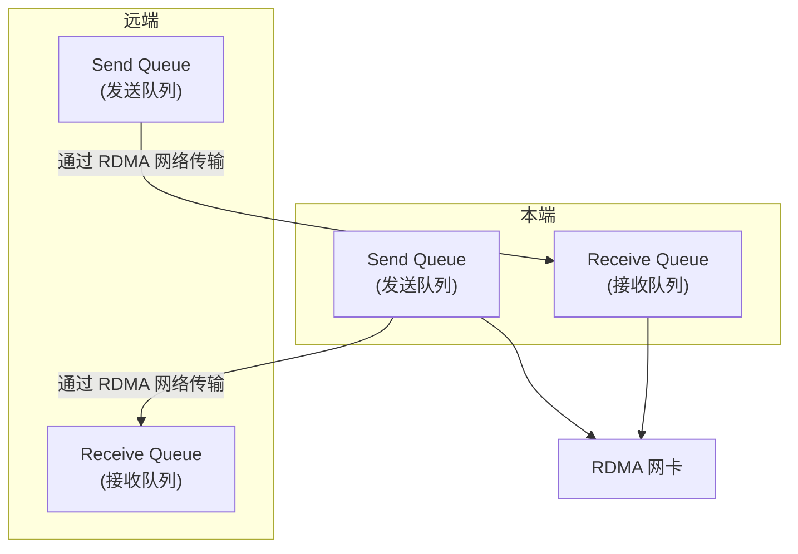
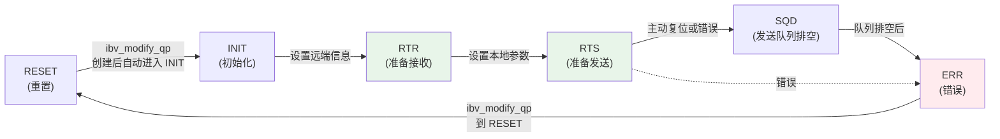

# 2.4 Queue Pair（QP）

上一节我们讨论了 Context、PD 和 MR——这些是 RDMA 的资源基础。现在进入 RDMA 通信的核心：Queue Pair（队列对）。

在第一章的范例中，我们已经看到 client 把数据写入 server 的内存。但数据是怎么"飞"过去的？client 并没有调用 `send`，server 也没有调用 `recv`。真正的"搬运工"是 QP——网卡通过 QP 获取你投递的请求，异步执行，把数据从一个地址搬到另一个地址。

理解 QP 是掌握 RDMA 编程的关键。它不是简单的队列，而是一个带状态机的复杂对象——你必须按正确顺序初始化、连接、投递请求。

!!! note "推荐阅读资源"
    RDMA 的官方编程手册和 www.rdmamojo.com 网站提供了更完整的 API 参考。本章建立概念框架，具体 API 的细节可以在需要时查阅这些资源。

## 2.4.1 先从问题开始：为什么需要 QP

在深入代码之前，让我们先回答一个根本问题：**RDMA 为什么不像 TCP 那样提供简单的 `send/recv` 接口？**

答案是：**RDMA 需要更底层的控制，以实现零拷贝和内核旁路**。

TCP 的 `send/recv` 是高层抽象——你把数据交给内核，内核负责拷贝、分片、重传。RDMA 不走内核，你的程序直接和网卡对话。代价是：你必须告诉网卡更多细节。

### QP 的本质：通信双方的专用通道

QP 代表了本端与远端之间的一个专用通信通道。每个 QP 由一对队列组成：

- **Send Queue（SQ）**：存放本端要发送的 Work Request（WR）
- **Receive Queue（RQ）**：存放本端准备接收远端消息的缓冲区



图 2-6：QP 是通信双方之间的专用通道，本端的 SQ 对应远端的 RQ。
{: .figure-caption }

### QP 与 TCP socket 的类比

如果你熟悉 TCP socket，可以这样理解 QP：

| TCP Socket | QP | 说明 |
|-----------|-----|------|
| `socket()` | `ibv_create_qp()` | 创建通信对象 |
| `connect()` | `ibv_modify_qp()` 到 RTR/RTS | 建立连接 |
| `send()` | `ibv_post_send()` | 投递发送请求 |
| `recv()` | `ibv_post_recv()` + 轮询 CQ | 投递接收请求 + 等待完成 |
| `close()` | `ibv_destroy_qp()` | 销毁对象 |

但 QP 比 socket 更底层：
- **请求投递与完成解耦**：`ibv_post_send` 只是把请求放入队列，实际传输异步进行
- **多种传输服务**：QP 支持可靠连接、不可靠连接、无连接数据报
- **显式状态管理**：你必须手动驱动 QP 状态机

!!! note "QP 不是用户态队列"
    QP 虽然在程序中"投递"请求，但队列本身在网卡或内核管理的内存区域。你只是把请求描述给网卡，网卡从队列中取请求执行。这就是"内核旁路"的体现。

## 2.4.2 QP 的类型：可靠还是不可靠？

RDMA 支持多种传输服务类型。选择哪种类型，取决于你的应用需求。

### Reliable Connected（RC）

**特性**：
- 可靠连接：保证消息按序投递，不丢包
- 双向通信：支持所有 RDMA 操作
- 确认机制：每个消息都有确认
- 流量控制：支持 credit-based 流控

**适用场景**：
- 需要严格可靠性的场景
- 存储系统、数据库
- 需要RDMA READ和 Atomic 操作的场景

!!! note "RC 是最常用的类型"
    绝大多数 RDMA 应用使用 RC 类型。后续章节主要关注 RC QP。

### Unreliable Connected（UC）

**特性**：
- 不可靠连接：不保证消息投递
- 无确认机制：发送后不等待确认
- 支持大部分操作（不支持 RDMA READ 和 Atomic）
- 更低的延迟

**适用场景**：
- 可以容忍少量丢包的场景
- 实时性要求高的应用
- 有上层应用层重传机制的场景

### Unreliable Datagram（UD）

**特性**：
- 无连接：类似于 UDP
- 支持一对多通信
- 消息大小受限（通常 MTU 大小）
- 不保证顺序和投递
- 不支持 RDMA 操作，只支持 SEND/RECV

**适用场景**：
- 发现和协商服务
- 一对多广播
- 低优先级的管理流量

### 传输类型对比

| 类型 | 可靠性 | 连接 | RDMA READ | Atomic | 消息大小 | 典型应用 |
|------|-------|------|-----------|--------|---------|---------|
| **RC** | 可靠 | 是 | ✓ | ✓ | 任意 | 存储系统、数据库 |
| **UC** | 不可靠 | 是 | ✗ | ✗ | 任意 | 实时系统 |
| **UD** | 不可靠 | 否 | ✗ | ✗ | MTU | 发现服务、管理流量 |

## 2.4.3 创建 QP：`ibv_create_qp`

### 函数原型

```c
struct ibv_qp *ibv_create_qp(struct ibv_pd *pd,
                             struct ibv_qp_init_attr *qp_init_attr);
```

### 参数说明

| 参数 | 说明 |
|------|------|
| `pd` | Protection Domain，QP 必须属于某个 PD |
| `qp_init_attr` | QP 初始化属性 |

!!! note "QP 和 CQ 的创建顺序"
    你可能会问：*创建 QP 需要 CQ，那 CQ 怎么创建？* 答案是：CQ 只需要 context，不依赖 QP。所以正确的顺序是：先创建 CQ，再创建 QP。

### `ibv_qp_init_attr` 结构体

```c
struct ibv_qp_init_attr {
    void                    *qp_context;      // 用户定义的上下文
    struct ibv_cq           *send_cq;         // Send CQ
    struct ibv_cq           *recv_cq;         // Receive CQ
    struct ibv_srq          *srq;             // Shared Receive Queue（可选）
    struct ibv_qp_cap        cap;              // QP 能力
    enum ibv_qp_type         qp_type;         // QP 类型
    int                      sq_sig_all;      // 所有 WR 是否都生成 CQE
};
```

### `ibv_qp_cap` 结构体

```c
struct ibv_qp_cap {
    uint32_t max_send_wr;     // 最大 Send WR 数量
    uint32_t max_recv_wr;     // 最大 Receive WR 数量
    max_send_sge;    // 每个 Send WR 最大 SGE 数量
    uint32_t max_recv_sge;    // 每个 Receive WR 最大 SGE 数量
    uint32_t max_inline_data; // 最大 inline 数据大小
};
```

!!! note "硬件限制很重要"
    这些 `max_*` 值不能超过设备能力。你可以在创建 QP 前通过 `ibv_query_device` 查询设备的限制值。某些设备（尤其是老设备或模拟设备）的限制很低，不注意的话创建会失败。

### 示例代码：创建 RC QP

```c
// 定义 QP 能力
struct ibv_qp_cap cap = {
    .max_send_wr = 16,        // 最多 16 个未完成的 Send WR
    .max_recv_wr = 16,        // 最多 16 个未完成的 Receive WR
    .max_send_sge = 1,        // 每个 Send WR 最多 1 个 SGE
    .max_recv_sge = 1,        // 每个 Receive WR 最多 1 个 SGE
    .max_inline_data = 64,    // 最多 64 字节 inline 数据
};

// 定义 QP 初始化属性
struct ibv_qp_init_attr qp_init_attr = {
    .send_cq = cq,            // Send CQ
    .recv_cq = cq,            // Receive CQ（可以与 Send CQ 共享）
    .qp_type = IBV_QPT_RC,    // RC 类型
    .cap = cap,
    .sq_sig_all = 0,          // 非 0 表示所有 WR 都生成 CQE
};

// 创建 QP
struct ibv_qp *qp = ibv_create_qp(pd, &qp_init_attr);
if (!qp) {
    perror("Failed to create QP");
    return -1;
}

printf("QP created successfully: QP number = %u\n", qp->qp_num);
```

### CQE 生成的控制

`sq_sig_all` 参数控制所有 Send WR 是否都生成 CQE：
- `sq_sig_all = 0`：只有设置了 `IBV_SEND_SIGNALED` 标志的 WR 才生成 CQE
- `sq_sig_all = 1`：所有 Send WR 都生成 CQE

对于 Receive WR，总是生成 CQE。

!!! note "为什么不是所有 WR 都生成 CQE？"
    生成 CQE 有开销。对于批量操作，你可能只需要知道"最后一批"完成了，而不是每一个 WR 的完成。`sq_sig_all = 0` 让你可以选择哪些 WR 需要完成通知。

!!! note "共享 CQ"
    Send CQ 和 Receive CQ 可以是同一个 CQ，这样可以减少资源消耗。但要注意：
    - 需要通过 `wc.opcode` 区分是 Send 还是 Receive 完成
    - CQE 数量要足够容纳 Send 和 Receive 的完成

## 2.4.4 QP 状态机：从创建到可用的必经之路

QP 有一个复杂的状态机。理解状态转换是正确使用 QP 的关键——你不能随便往 QP 里投递请求，必须等 QP 进入正确状态。

### QP 状态

```c
enum ibv_qp_state {
    IBV_QPS_RESET,      // 重置状态
    IBV_QPS_INIT,       // 初始化状态
    IBV_QPS_RTR,        // Ready to Receive
    IBV_QPS_RTS,        // Ready to Send
    IBV_QPS_SQD,        // SQ Draining
    IBV_QPS_SQE,        // SQ Error
    IBV_QPS_ERR         // Error
};
```

### 状态转换图



图 2-7：QP 状态机转换图。
{: .figure-caption }

### 各状态说明

| 状态 | 说明 | 允许的操作 |
|------|------|-----------|
| **RESET** | QP 重置状态，不能投递任何 WR | 只能转换到 INIT |
| **INIT** | QP 初始化完成，等待配置远端信息 | 只能转换到 RTR 或 RESET |
| **RTR** | QP 准备接收远端消息 | 只能转换到 RTS 或 RESET |
| **RTS** | QP 完全就绪，可以发送和接收 | 正常工作状态 |
| **SQD** | 发送队列正在排空 | 可以转换到 RTS 或 ERR |
| **ERR** | QP 进入错误状态 | 只能转换到 RESET |

!!! note "创建后自动进入 INIT"
    `ibv_create_qp` 返回时，QP 已经处于 INIT 状态。你不需要手动从 RESET 转到 INIT。

!!! note "RTS 是唯一可以正常通信的状态"
    只有当 QP 处于 RTS 状态时，你才能正常投递 Send/Receive WR。在 RTR 状态只能投递 Receive WR，不能投递 Send WR。

## 2.4.5 修改 QP 状态：`ibv_modify_qp`

### 函数原型

```c
int ibv_modify_qp(struct ibv_qp *qp,
                  struct ibv_qp_attr *attr,
                  int attr_mask);
```

### 参数说明

| 参数 | 说明 |
|------|------|
| `qp` | 要修改的 QP |
| `attr` | QP 属性 |
| `attr_mask` | 指定要修改哪些属性 |

!!! note "attr_mask 的作用"
    `attr_mask` 告诉驱动"attr 结构体中哪些字段是有效的"。不是所有字段在每次转换时都需要设置——只设置你关心的字段。

### `ibv_qp_attr` 结构体（关键字段）

```c
struct ibv_qp_attr {
    enum ibv_qp_state    qp_state;         // 目标状态
    enum ibv_qp_state    cur_qp_state;     // 当前状态（用于某些转换）
    struct ibv_qp_cap    cap;              // QP 能力
    uint32_t             path_mtu;         // 路径 MTU
    uint32_t             max_dest_rd_atomic; // 最大并发远端原子操作
    uint32_t             min_rnr_timer;    // RNR NAK 定时器
    uint32_t             timeout;          // 超时时间
    uint32_t             retry_cnt;        // 重试次数
    uint32_t             rnr_retry;        // RNR 重试次数
    uint16_t             pkey_index;       // P_KEY 索引
    uint16_t             alt_pkey_index;   // 备用 P_KEY 索引
    uint16_t             port_num;         // 端口号
    struct ibv_ah_attr    ah_attr;          // Address Handle 属性（UD）
    struct ibv_ah_attr    alt_ah_attr;     // 备用 AH 属性
    uint32_t             qkey;             // Q_Key（UD）
};
```

### 状态转换示例：INIT → RTR → RTS

这是 RC QP 最常见的转换流程。让我们分步看看。

#### 第一步：INIT → RTR

RTR（Ready to Receive）表示"我已经准备好接收来自特定远端 QP 的消息"。你需要告诉本端：远端的 QP 编号是多少、地址是什么。

```c
struct ibv_qp_attr attr = {
    .qp_state = IBV_QPS_RTR,
    .path_mtu = IBV_MTU_2048,              // 或从设备能力查询
    .dest_qp_num = remote_qpn,             // 远端 QP 编号
    .rq_psn = remote_psn,                  // 远端包序列号
    .max_dest_rd_atomic = 16,              // 最大并发远端原子操作
    .min_rnr_timer = 12,                    // RNR NAK 定时器
    .ah_attr = {
        .is_global = 1,                     // 使用 RoCE/GID
        .dlid = remote_lid,                 // 远端 LID（IB 网络）
        .sl = 0,                            // Service Level
        .src_path_bits = 0,
        .port_num = port_num,               // 本端端口号
        // 对于 RoCE，需要设置 GID
        .grh.dgid = remote_gid,             // 远端 GID
        .grh.sgid_index = gid_index,        // 本端 GID 索引
        .grh.hop_limit = 1,
        .grh.traffic_class = 0,
    }
};

int attr_mask = IBV_QP_STATE |
                IBV_QP_AV |
                IBV_QP_PATH_MTU |
                IBV_QP_DEST_QPN |
                IBV_QP_RQ_PSN |
                IBV_QP_MAX_DEST_RD_ATOMIC |
                IBV_QP_MIN_RNR_TIMER;

if (ibv_modify_qp(qp, &attr, attr_mask)) {
    perror("Failed to modify QP to RTR");
    return -1;
}
```

!!! note "LID vs GID"
    - **LID（Local Identifier）**：16 位本地地址，由 InfiniBand 子网管理器（SM）分配，仅用于 InfiniBand 网络
    - **GID（Global Identifier）**：128 位全球标识符（IPv6 格式），在 InfiniBand 和 RoCE 网络中都存在
    - 在 InfiniBand 网络中，通常使用 LID 进行子网内通信（更高效），GID 用于跨子网场景
    - 在 RoCE 网络中（无子网管理器），必须使用 GID 进行路由

#### 第二步：RTR → RTS

RTS（Ready to Send）表示"我已经准备好向远端发送消息"。这里设置的是本端的发送参数：超时、重试次数、包序列号。

```c
attr.qp_state = IBV_QPS_RTS;
attr.timeout = 14;                         // 局部超时（约 68 微秒）
attr.retry_cnt = 7;                        // 重试次数
attr.rnr_retry = 7;                        // RNR 重试次数
attr.sq_psn = local_psn;                   // 本端包序列号
attr.max_rd_atomic = 16;                  // 最大并发本地原子操作

attr_mask = IBV_QP_STATE |
            IBV_QP_TIMEOUT |
            IBV_QP_RETRY_CNT |
            IBV_QP_RNR_RETRY |
            IBV_QP_SQ_PSN |
            IBV_QP_MAX_QP_RD_ATOMIC;

if (ibv_modify_qp(qp, &attr, attr_mask)) {
    perror("Failed to modify QP to RTS");
    return -1;
}
```

!!! note "双方都需要执行状态转换"
    对于 RC QP，通信双方都需要将自己的 QP 从 INIT 转到 RTR，再转到 RTS。这是建立可靠连接的必要步骤。如果只有一方进入 RTS，通信无法正常进行。

!!! note "超时和重试参数的选择"
    `timeout` 和 `retry_cnt` 的值影响可靠性：
    - `timeout` 太小：网络抖动时容易超时重传
    - `timeout` 太大：故障检测慢
    - 典型值：`timeout = 14`（约 68us），`retry_cnt = 7`
    - 具体值应参考网络环境和应用需求

## 2.4.6 查询 QP 状态：`ibv_query_qp`

有时候你需要知道 QP 当前是什么状态、配置了什么参数。`ibv_query_qp` 用于这个目的。

### 函数原型

```c
int ibv_query_qp(struct ibv_qp *qp,
                 struct ibv_qp_attr *attr,
                 int attr_mask,
                 struct ibv_qp_init_attr *init_attr);
```

### 示例代码

```c
struct ibv_qp_attr qp_attr;
struct ibv_qp_init_attr qp_init_attr;

if (ibv_query_qp(qp, &qp_attr, -1, &qp_init_attr)) {
    perror("Failed to query QP");
    return -1;
}

printf("QP state: %s\n", ibv_qp_state_str(qp_attr.qp_state));
printf("QP number: %u\n", qp->qp_num);
printf("Send queue size: %u\n", qp_init_attr.cap.max_send_wr);
printf("Receive queue size: %u\n", qp_init_attr.cap.max_recv_wr);
printf("Path MTU: %u\n", qp_attr.path_mtu);
```

!!! note "attr_mask = -1 的含义"
    `-1` 表示"查询所有支持的属性"。这是一个常见的惯用法。

## 2.4.7 投递 Send 请求：`ibv_post_send`

现在 QP 已经进入 RTS 状态，可以开始投递请求了。`ibv_post_send` 用于投递 Send Work Request。

### 函数原型

```c
int ibv_post_send(struct ibv_qp *qp,
                  struct ibv_send_wr *wr,
                  struct ibv_send_wr **bad_wr);
```

### 参数说明

| 参数 | 说明 |
|------|------|
| `qp` | 目标 QP |
| `wr` | Send Work Request 链表 |
| `bad_wr` | 第一个失败的 WR（出错时返回） |

### 返回值

- 成功：0（只表示 WR 被接受投递）
- 失败：-1，errno 设置错误码

!!! note "投递成功 ≠ 传输完成"
    这是 RDMA 新手最容易混淆的地方。`ibv_post_send` 返回成功，只说明 WR 已经被放入队列。数据是否真正发送到远端，需要通过轮询 CQ 并检查 WC 来判断。

### `ibv_send_wr` 结构体

```c
struct ibv_send_wr {
    uint64_t                wr_id;           // 用户定义的 WR ID
    struct ibv_send_wr     *next;           // 链表的下一个 WR
    struct ibv_sg_list     *sg_list;        // SGE 数组
    int                     num_sge;         // SGE 数量
    enum ibv_wr_opcode      opcode;         // 操作类型
    int                     send_flags;     // 标志位
    uint32_t                imm_data;        // Immediate 数据（可选）
    union {
        struct {
            uint64_t        remote_addr;    // 远端地址
            uint32_t        rkey;           // 远端 key
        } rdma;
        struct {
            uint64_t        remote_addr;    // 远端地址
            uint64_t        compare_add;    // Compare 值
            uint64_t        swap;           // Swap 值
            uint32_t        rkey;           // 远端 key
        } atomic;
        // ... 其他联合体成员
    };
};
```

### 操作类型（opcode）

```c
enum ibv_wr_opcode {
    IBV_WR_SEND,              // Send 操作
    IBV_WR_SEND_WITH_IMM,     // Send with Immediate
    IBV_WR_RDMA_WRITE,        // RDMA Write
    IBV_WR_RDMA_WRITE_WITH_IMM, // RDMA Write with Immediate
    IBV_WR_RDMA_READ,         // RDMA Read
    IBV_WR_ATOMIC_CMP_AND_SWP, // Compare and Swap
    IBV_WR_ATOMIC_FETCH_AND_ADD // Fetch and Add
};
```

### 标志位（send_flags）

```c
#define IBV_SEND_FENCE        (1<<0)  // 在此 WR 之前的 WR 完成后才执行
#define IBV_SEND_SIGNALED      (1<<1)  // 此 WR 生成 CQE
#define IBV_SEND_SOLICITED    (1<<2)  // Solicited event（不常用）
#define IBV_SEND_INLINE       (1<<3)  // Inline 数据（不单独注册 MR）
```

### 示例代码：RDMA WRITE

```c
// 准备本地数据
memcpy(buffer, "Hello from client", 17);

// 第一个 SGE：描述本地数据从哪里读
struct ibv_sge sge = {
    .addr = (uintptr_t)buffer,
    .length = 17,
    .lkey = mr->lkey
};

// 第一个 WR：描述完整的远端写入请求
struct ibv_send_wr wr = {
    .wr_id = 12345,                        // 用户 ID
    .sg_list = &sge,
    .num_sge = 1,
    .opcode = IBV_WR_RDMA_WRITE,          // RDMA WRITE
    .send_flags = IBV_SEND_SIGNALED,      // 生成 CQE
    .wr.rdma.remote_addr = remote_addr,   // 远端地址
    .wr.rdma.rkey = remote_rkey           // 远端 key
};
struct ibv_send_wr *bad_wr;

// 投递 WR
if (ibv_post_send(qp, &wr, &bad_wr)) {
    perror("Failed to post send WR");
    return -1;
}
```

### 示例代码：SEND

```c
struct ibv_sge sge = {
    .addr = (uintptr_t)send_buffer,
    .length = strlen(send_buffer) + 1,
    .lkey = send_mr->lkey
};

struct ibv_send_wr wr = {
    .wr_id = 54321,
    .sg_list = &sge,
    .num_sge = 1,
    .opcode = IBV_WR_SEND,
    .send_flags = IBV_SEND_SIGNALED
};
struct ibv_send_wr *bad_wr;

if (ibv_post_send(qp, &wr, &bad_wr)) {
    perror("Failed to post SEND WR");
    return -1;
}
```

### 示例代码：批量投递

WR 可以链成队列，一次性投递多个：

```c
struct ibv_send_wr wr_list[3];
struct ibv_sge sge_list[3];

// 准备三个 WR
for (int i = 0; i < 3; i++) {
    sge_list[i] = (struct ibv_sge){
        .addr = (uintptr_t)(buffers[i]),
        .length = sizes[i],
        .lkey = mr->lkey
    };

    wr_list[i] = (struct ibv_send_wr){
        .wr_id = 100 + i,
        .sg_list = &sge_list[i],
        .num_sge = 1,
        .opcode = IBV_WR_SEND,
        .send_flags = IBV_SEND_SIGNALED,
        .next = (i < 2) ? &wr_list[i + 1] : NULL
    };
}

// 一次性投递三个 WR
struct ibv_send_wr *bad_wr;
if (ibv_post_send(qp, &wr_list[0], &bad_wr)) {
    fprintf(stderr, "Failed at bad_wr_id: %lu\n", bad_wr->wr_id);
    return -1;
}
```

!!! note "Inline 数据"
    使用 `IBV_SEND_INLINE` 标志，可以发送小量数据而不需要单独注册 MR：
    ```c
    wr.send_flags = IBV_SEND_INLINE | IBV_SEND_SIGNALED;
    wr.num_sge = 1;
    ```
    Inline 数据大小受限于 `max_inline_data` 能力。Inline 数据直接放在 WR 描述符中，不引用用户态 MR。

## 2.4.8 投递 Receive 请求：`ibv_post_recv`

Send 请求相对直观——你告诉网卡"把这段数据发出去"。Receive 请求则不同：**你必须提前告诉网卡"我有这些缓冲区，消息来了放这里"**。

### 函数原型

```c
int ibv_post_recv(struct ibv_qp *qp,
                  struct ibv_recv_wr *wr,
                  struct ibv_recv_wr **bad_wr);
```

### 参数说明

| 参数 | 说明 |
|------|------|
| `qp` | 目标 QP |
| `wr` | Receive Work Request 链表 |
| `bad_wr` | 第一个失败的 WR（出错时返回） |

### `ibv_recv_wr` 结构体

```c
struct ibv_recv_wr {
    uint64_t                wr_id;           // 用户定义的 WR ID
    struct ibv_recv_wr     *next;           // 链表的下一个 WR
    struct ibv_sg_list     *sg_list;        // SGE 数组
    int                     num_sge;         // SGE 数量
};
```

!!! note "Receive WR 更简单"
    注意 `ibv_recv_wr` 没有 `opcode` 和 `send_flags`。Receive WR 只描述"我有一段缓冲区"，不描述"做什么操作"。做什么操作由 Send WR 的 opcode 决定。

### 示例代码：投递 Receive WR

```c
#define NUM_RECV_WR 16

// 为每个接收 buffer 分配内存并注册
for (int i = 0; i < NUM_RECV_WR; i++) {
    posix_memalign((void **)&recv_buffers[i], 4096, RECV_BUFFER_SIZE);
}

struct ibv_mr *recv_mr = ibv_reg_mr(pd, recv_buffers[0],
                                    NUM_RECV_WR * RECV_BUFFER_SIZE,
                                    IBV_ACCESS_LOCAL_WRITE);

// 投递多个 Receive WR
for (int i = 0; i < NUM_RECV_WR; i++) {
    struct ibv_sge sge = {
        .addr = (uintptr_t)recv_buffers[i],
        .length = RECV_BUFFER_SIZE,
        .lkey = recv_mr->lkey
    };

    struct ibv_recv_wr wr = {
        .wr_id = 200 + i,
        .sg_list = &sge,
        .num_sge = 1,
        .next = NULL
    };

    struct ibv_recv_wr *bad_wr;
    if (ibv_post_recv(qp, &wr, &bad_wr)) {
        perror("Failed to post recv WR");
        return -1;
    }
}

printf("Posted %d receive WRs\n", NUM_RECV_WR);
```

!!! note "Receive WR 必须提前投递"
    RDMA 的 Receive 操作不同于 TCP 的 `recv`：
    - 必须在消息到达之前投递 Receive WR
    - 如果没有预先投递的 Receive WR，到达的消息会被丢弃
    - 对于 SEND 操作，接收方必须提前投递 Receive WR

!!! note "Receive WR 耗尽问题"
    如果 Receive WR 耗尽，新到达的 SEND 消息会导致 RNR（Receiver Not Ready）错误。解决方案：
    - 投递足够多的 Receive WR（post-receive 水线）
    - 在处理完一个 Receive 后立即重新投递

!!! note "为什么 Receive WR 不需要 rkey？"
    Receive WR 描述的是本地缓冲区。远端 SEND 来的消息会被网卡写入这些缓冲区。网卡使用 `lkey` 来验证权限，不需要远端的 `rkey`。

## 2.4.9 销毁 QP：`ibv_destroy_qp`

使用完毕 QP 后，需要销毁它。

### 函数原型

```c
int ibv_destroy_qp(struct ibv_qp *qp);
```

### 何时可以销毁

只有在以下情况下才能安全销毁 QP：
1. 没有正在处理的 WR
2. QP 处于 RESET 或错误状态
3. 相关的 CQ 操作已完成

### 示例代码

```c
// 第一步：将 QP 转到 RESET 状态
struct ibv_qp_attr attr = {
    .qp_state = IBV_QPS_RESET
};
ibv_modify_qp(qp, &attr, IBV_QP_STATE);

// 第二步：确保所有 WR 都已完成
poll_cq_until_empty(qp->send_cq);
poll_cq_until_empty(qp->recv_cq);

// 第三步：销毁 QP
if (ibv_destroy_qp(qp)) {
    perror("Failed to destroy QP");
    return -1;
}
```

!!! note "为什么要先转到 RESET？"
    虽然很多驱动允许直接销毁非 RESET 状态的 QP，但标准做法是先转到 RESET。这确保网卡停止对该 QP 的操作，避免资源泄漏。

!!! warning "RESET 与 ERR 对在途请求的处理不同"
    - **RESET**：网卡丢弃所有尚未完成的 WR，**不会生成 CQE**。如果你需要知道哪些请求完成了，必须在转到 RESET 之前轮询 CQ。
    - **ERR**：网卡会将在途的 WR **立即报告为带错误码的 CQE**（通常是 `IBV_WC_WR_FLUSH_ERR`），让你知道哪些请求因 QP 错误而失败。

## 2.4.10 完整示例：QP 生命周期管理

让我们把上述内容串联起来，看看一个完整的 QP 生命周期：

```c
#include <infiniband/verbs.h>
#include <stdio.h>
#include <stdlib.h>
#include <string.h>
#include <errno.h>

struct rdma_qp_context {
    struct ibv_pd *pd;
    struct ibv_cq *cq;
    struct ibv_qp *qp;
    struct ibv_mr *send_mr;
    struct ibv_mr *recv_mr;
    char *send_buffer;
    char *recv_buffer;
    uint32_t local_psn;
};

#define SEND_BUFFER_SIZE 4096
#define RECV_BUFFER_SIZE 4096
#define MAX_SEND_WR 16
#define MAX_RECV_WR 16

int create_qp_resources(struct rdma_qp_context *ctx) {
    // 分配 buffer
    posix_memalign((void **)&ctx->send_buffer, 4096, SEND_BUFFER_SIZE);
    posix_memalign((void **)&ctx->recv_buffer, 4096, RECV_BUFFER_SIZE);

    // 注册 MR
    int access = IBV_ACCESS_LOCAL_WRITE |
                 IBV_ACCESS_REMOTE_WRITE |
                 IBV_ACCESS_REMOTE_READ;

    ctx->send_mr = ibv_reg_mr(ctx->pd, ctx->send_buffer,
                               SEND_BUFFER_SIZE, access);
    if (!ctx->send_mr) {
        fprintf(stderr, "Failed to register send MR\n");
        return -1;
    }

    ctx->recv_mr = ibv_reg_mr(ctx->pd, ctx->recv_buffer,
                               RECV_BUFFER_SIZE, access);
    if (!ctx->recv_mr) {
        fprintf(stderr, "Failed to register recv MR\n");
        return -1;
    }

    // 创建 QP
    struct ibv_qp_cap cap = {
        .max_send_wr = MAX_SEND_WR,
        .max_recv_wr = MAX_RECV_WR,
        .max_send_sge = 1,
        .max_recv_sge = 1,
        .max_inline_data = 64,
    };

    struct ibv_qp_init_attr qp_init_attr = {
        .send_cq = ctx->cq,
        .recv_cq = ctx->cq,
        .qp_type = IBV_QPT_RC,
        .cap = cap,
        .sq_sig_all = 0,
    };

    ctx->qp = ibv_create_qp(ctx->pd, &qp_init_attr);
    if (!ctx->qp) {
        fprintf(stderr, "Failed to create QP: %s\n", strerror(errno));
        return -1;
    }

    // 随机生成 PSN
    ctx->local_psn = (uint32_t)rand() & 0xFFFFFF;

    printf("QP created: QPN = %u, PSN = %u\n",
           ctx->qp->qp_num, ctx->local_psn);

    // 投递初始 Receive WR
    struct ibv_sge sge = {
        .addr = (uintptr_t)ctx->recv_buffer,
        .length = RECV_BUFFER_SIZE,
        .lkey = ctx->recv_mr->lkey
    };

    struct ibv_recv_wr wr = {
        .wr_id = 1,
        .sg_list = &sge,
        .num_sge = 1,
    };
    struct ibv_recv_wr *bad_wr;

    if (ibv_post_recv(ctx->qp, &wr, &bad_wr)) {
        fprintf(stderr, "Failed to post recv WR\n");
        return -1;
    }

    return 0;
}

int connect_qp_to_peer(struct rdma_qp_context *ctx,
                       uint32_t remote_qpn,
                       uint16_t remote_lid,
                       uint32_t remote_psn) {
    struct ibv_qp_attr attr;
    int attr_mask;

    // INIT -> RTR
    memset(&attr, 0, sizeof(attr));
    attr.qp_state = IBV_QPS_RTR;
    attr.path_mtu = IBV_MTU_2048;
    attr.dest_qp_num = remote_qpn;
    attr.rq_psn = remote_psn;
    attr.max_dest_rd_atomic = 16;
    attr.min_rnr_timer = 12;

    // 对于 RoCE，需要设置 GID
    attr.ah_attr.is_global = 1;
    attr.ah_attr.grh.dgid.global.interface_id = remote_lid; // 简化示例
    attr.ah_attr.grh.sgid_index = 0;  // 使用第一个 GID
    attr.ah_attr.port_num = 1;

    attr_mask = IBV_QP_STATE |
                IBV_QP_AV |
                IBV_QP_PATH_MTU |
                IBV_QP_DEST_QPN |
                IBV_QP_RQ_PSN |
                IBV_QP_MAX_DEST_RD_ATOMIC |
                IBV_QP_MIN_RNR_TIMER;

    if (ibv_modify_qp(ctx->qp, &attr, attr_mask)) {
        fprintf(stderr, "Failed to modify QP to RTR\n");
        return -1;
    }

    printf("QP state: RTR\n");

    // RTR -> RTS
    attr.qp_state = IBV_QPS_RTS;
    attr.timeout = 14;
    attr.retry_cnt = 7;
    attr.rnr_retry = 7;
    attr.sq_psn = ctx->local_psn;
    attr.max_rd_atomic = 16;

    attr_mask = IBV_QP_STATE |
                IBV_QP_TIMEOUT |
                IBV_QP_RETRY_CNT |
                IBV_QP_RNR_RETRY |
                IBV_QP_SQ_PSN |
                IBV_QP_MAX_QP_RD_ATOMIC;

    if (ibv_modify_qp(ctx->qp, &attr, attr_mask)) {
        fprintf(stderr, "Failed to modify QP to RTS\n");
        return -1;
    }

    printf("QP state: RTS\n");
    return 0;
}

void cleanup_qp_resources(struct rdma_qp_context *ctx) {
    if (ctx->qp) {
        // 转到 RESET 状态
        struct ibv_qp_attr attr = {.qp_state = IBV_QPS_RESET};
        ibv_modify_qp(ctx->qp, &attr, IBV_QP_STATE);

        ibv_destroy_qp(ctx->qp);
        ctx->qp = NULL;
    }

    if (ctx->recv_mr) {
        ibv_dereg_mr(ctx->recv_mr);
        ctx->recv_mr = NULL;
    }

    if (ctx->send_mr) {
        ibv_dereg_mr(ctx->send_mr);
        ctx->send_mr = NULL;
    }

    if (ctx->recv_buffer) {
        free(ctx->recv_buffer);
        ctx->recv_buffer = NULL;
    }

    if (ctx->send_buffer) {
        free(ctx->send_buffer);
        ctx->send_buffer = NULL;
    }
}

int main() {
    struct rdma_qp_context ctx = {0};

    // 假设 pd 和 cq 已经创建
    // ctx.pd = ...;
    // ctx.cq = ...;

    // 创建资源
    if (create_qp_resources(&ctx) != 0) {
        fprintf(stderr, "Failed to create QP resources\n");
        return EXIT_FAILURE;
    }

    // 连接到对端（假设从某个地方获取了对端信息）
    // connect_qp_to_peer(&ctx, remote_qpn, remote_lid, remote_psn);

    // 清理
    cleanup_qp_resources(&ctx);

    return EXIT_SUCCESS;
}
```

## 2.4.11 关键要点回顾

| 概念 | 要点 |
|------|------|
| **QP 的本质** | 通信双方的专用通道，由 SQ 和 RQ 组成 |
| **传输类型** | RC（可靠连接）、UC（不可靠连接）、UD（数据报） |
| **状态机** | RESET → INIT → RTR → RTS，必须按顺序转换 |
| **双方连接** | RC QP 需要双方都转到 RTR/RTS 才能通信 |
| **Send WR** | 投递到 SQ，异步执行，通过 CQ 获取完成 |
| **Recv WR** | 必须提前投递，否则消息会被丢弃 |
| **wr_id** | 用户定义的 ID，用于关联请求和完成 |
| **CQE 生成** | Send WR 可选是否生成 CQE，Recv WR 总是生成 |
| **资源清理** | 先转到 RESET，再销毁 QP，最后释放 MR |

!!! note "下一步"
    QP 是发送和接收请求的载体。但请求完成后，你怎么知道结果？答案是下一章的 CQ（Completion Queue）——网卡在这里写完成记录，你通过轮询或事件获取结果。
