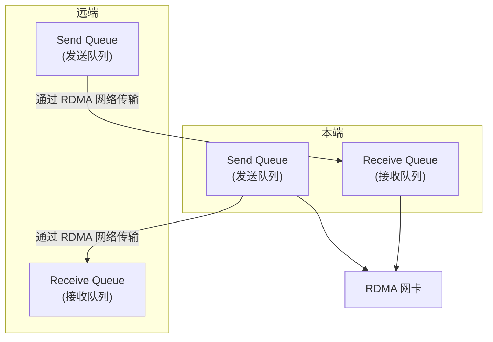
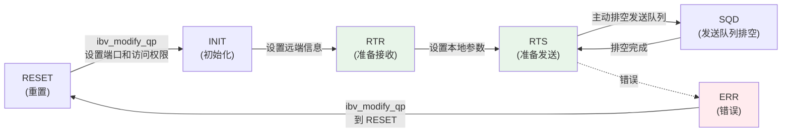

# 2.4 Queue Pair（QP）

上一节讨论了 Context、PD 和 MR。这些对象提供设备入口、资源访问域和可由网卡访问的内存。本章讨论 Queue Pair（QP，队列对）。

在第一章的范例中，client 把数据写入 server 的内存。client 并没有通过 TCP `send` 发送这段数据，server 也没有为这段数据投递 RDMA RECV。发起方把请求投递到 QP，网卡随后异步执行请求。

QP 不只是一个队列对象。它包含发送队列、接收队列以及连接状态；程序必须按照规定的状态机初始化和连接 QP，然后才能投递请求。

本章实验分为两层。`examples/programming_model/02_resource_lifecycle.c` 创建一个 RC QP，打印创建前请求的队列能力和创建后驱动返回的实际能力，并把 QP 从 RESET 转到 INIT。`examples/programming_model/03_rc_loopback.c` 在一个进程内创建两个 RC QP，将二者互相连接到 RTS，再投递 SEND、RDMA WRITE、RDMA READ 和 Atomic 请求。

```bash
make -C examples/programming_model
./examples/programming_model/02_resource_lifecycle -d mlx5_0 -p 1
./examples/programming_model/03_rc_loopback -d mlx5_0 -p 1 -g 0
```

`02_resource_lifecycle` 中的 `after create qp_state=RESET` 和 `after modify to INIT qp_state=INIT` 对应 QP 状态机的起始两步。`03_rc_loopback` 中的完成记录则说明：QP 进入 RTS 后，SQ 中的请求才会被网卡执行，并通过 CQ 返回结果。

## 2.4.1 QP 的作用

在 Verbs 编程模型中，QP 是应用向网卡提交通信请求的主要对象。它把请求队列、连接状态和传输服务类型组织在一起。

与 TCP `send/recv` 的字节流抽象相比，RDMA 数据路径要求应用显式描述更多信息，例如使用哪段本地内存、访问哪个远端地址、是否生成完成通知以及采用哪种传输服务。本章只讨论这些信息如何通过 QP 组织，不展开 RDMA 设计动机的完整讨论。

### QP 的基本结构

QP 承载一个通信关系中的请求队列和状态。每个 QP 至少包含两类队列：Send Queue（SQ）存放本端要发送的 Work Request（WR），Receive Queue（RQ）存放本端准备接收远端消息的缓冲区。



图 2-6：QP 中的 SQ 和 RQ。
{: .figure-caption }

### QP 与 TCP socket 的类比

QP 与 TCP socket 可以作如下对照：

| TCP Socket | QP | 说明 |
|-----------|-----|------|
| `socket()` | `ibv_create_qp()` | 创建通信对象 |
| `connect()` | `ibv_modify_qp()` 到 RTR/RTS | 建立连接 |
| `send()` | `ibv_post_send()` | 投递发送请求 |
| `recv()` | `ibv_post_recv()` + 轮询 CQ | 投递接收请求 + 等待完成 |
| `close()` | `ibv_destroy_qp()` | 销毁对象 |

需要注意的是，QP 比 socket 更底层。`ibv_post_send` 只是把请求放入队列，实际传输异步进行；QP 还支持可靠连接、不可靠连接和无连接数据报等多种传输服务，程序也必须手动驱动状态机。

!!! note "QP 不是用户态队列"
    QP 虽然通过用户态 Verbs 接口投递请求，但队列和 doorbell 等底层机制由驱动和网卡共同管理。应用提交的是请求描述，网卡再从队列中取出并执行。

## 2.4.2 QP 的类型：可靠还是不可靠？

RDMA 支持多种传输服务类型。具体选择取决于应用对可靠性、连接模型和操作类型的需求。

Reliable Connected（RC）是最常见的 QP 类型。它提供可靠连接语义，保证消息按序到达，并支持 SEND/RECV、RDMA READ、RDMA WRITE 和 Atomic 等主要操作。存储系统、数据库和许多 AI 基础设施中的 RDMA 数据路径通常从 RC QP 开始讨论，本教程后续章节也主要以 RC 为背景。

Unreliable Connected（UC）仍然是连接型服务，但不提供与 RC 相同的可靠性保证。它支持 SEND/RECV 和 RDMA WRITE，不支持 RDMA READ 和 Atomic。UC 适用于上层协议能够处理丢包或重试、并且希望减少部分可靠传输开销的场景。

Unreliable Datagram（UD）是无连接数据报服务，形式上更接近 UDP。UD 支持一对多通信，但消息大小通常受 MTU 限制，也不支持 RDMA READ/WRITE/Atomic，只支持 SEND/RECV。它常用于发现、协商或低优先级管理流量。

### 传输类型对比

| 类型 | 可靠性 | 连接 | RDMA READ | Atomic | 消息大小 | 典型应用 |
|------|-------|------|-----------|--------|---------|---------|
| **RC** | 可靠 | 是 | ✓ | ✓ | 任意 | 存储系统、数据库 |
| **UC** | 不可靠 | 是 | ✗ | ✗ | 任意 | 实时系统 |
| **UD** | 不可靠 | 否 | ✗ | ✗ | MTU | 发现服务、管理流量 |

## 2.4.3 创建 QP：`ibv_create_qp`

### 函数原型

```c
struct ibv_qp *ibv_create_qp(struct ibv_pd *pd,
                             struct ibv_qp_init_attr *qp_init_attr);
```

### 参数说明

| 参数 | 说明 |
|------|------|
| `pd` | Protection Domain，QP 必须属于某个 PD |
| `qp_init_attr` | QP 初始化属性 |

!!! note "QP 和 CQ 的创建顺序"
    创建 QP 时需要指定 send CQ 和 recv CQ；创建 CQ 只需要 context，不依赖 QP。因此常见顺序是先创建 CQ，再创建 QP。

### `ibv_qp_init_attr` 结构体

```c
struct ibv_qp_init_attr {
    void                    *qp_context;      // 用户定义的上下文
    struct ibv_cq           *send_cq;         // Send CQ
    struct ibv_cq           *recv_cq;         // Receive CQ
    struct ibv_srq          *srq;             // Shared Receive Queue（可选）
    struct ibv_qp_cap        cap;              // QP 能力
    enum ibv_qp_type         qp_type;         // QP 类型
    int                      sq_sig_all;      // 所有 WR 是否都生成 CQE
};
```

### `ibv_qp_cap` 结构体

```c
struct ibv_qp_cap {
    uint32_t max_send_wr;     // 最大 Send WR 数量
    uint32_t max_recv_wr;     // 最大 Receive WR 数量
    uint32_t max_send_sge;    // 每个 Send WR 最大 SGE 数量
    uint32_t max_recv_sge;    // 每个 Receive WR 最大 SGE 数量
    uint32_t max_inline_data; // 最大 inline 数据大小
};
```

!!! note "硬件限制很重要"
    这些 `max_*` 值不能超过设备能力。创建 QP 前可以通过 `ibv_query_device` 查询设备限制。某些设备或模拟设备限制较低，参数过大时创建会失败。

    创建成功后，驱动可能会把 `qp_init_attr.cap` 更新为实际分配的能力，实际值可能等于或大于请求值。后续判断 inline 大小、队列深度和 SGE 数量时，应以创建后的实际能力为准，而不是只记住调用前填写的请求值。

### 示例代码：创建 RC QP

```c
// 定义 QP 能力
struct ibv_qp_cap cap = {
    .max_send_wr = 16,        // 最多 16 个未完成的 Send WR
    .max_recv_wr = 16,        // 最多 16 个未完成的 Receive WR
    .max_send_sge = 1,        // 每个 Send WR 最多 1 个 SGE
    .max_recv_sge = 1,        // 每个 Receive WR 最多 1 个 SGE
    .max_inline_data = 64,    // 最多 64 字节 inline 数据
};

// 定义 QP 初始化属性
struct ibv_qp_init_attr qp_init_attr = {
    .send_cq = cq,            // Send CQ
    .recv_cq = cq,            // Receive CQ（可以与 Send CQ 共享）
    .qp_type = IBV_QPT_RC,    // RC 类型
    .cap = cap,
    .sq_sig_all = 0,          // 非 0 表示所有 WR 都生成 CQE
};

// 创建 QP
struct ibv_qp *qp = ibv_create_qp(pd, &qp_init_attr);
if (!qp) {
    perror("Failed to create QP");
    return -1;
}

printf("QP created successfully: QP number = %u\n", qp->qp_num);
printf("Actual max_inline_data = %u\n", qp_init_attr.cap.max_inline_data);
```

`qp->qp_num` 是设备内用于标识该 QP 的编号，连接双方需要通过控制面交换它。它适合用于连接建立和调试日志，但不应被当作长期稳定的业务身份；QP 销毁后，编号可能在以后被设备重新分配给新的 QP。

### CQE 生成的控制

`sq_sig_all` 参数控制所有 Send WR 是否都生成 CQE：

`sq_sig_all = 0` 时，只有设置了 `IBV_SEND_SIGNALED` 标志的 WR 才生成 CQE；`sq_sig_all = 1` 时，所有 Send WR 都生成 CQE。

对于 Receive WR，总是生成 CQE。

!!! note "CQE 生成的选择"
    生成 CQE 有开销。批量操作中常见的做法是只让部分 WR 生成完成通知，例如每 N 个 WR 设置一次 `IBV_SEND_SIGNALED`。`sq_sig_all = 0` 允许应用自行选择哪些 Send WR 需要完成通知。

!!! note "共享 CQ"
    Send CQ 和 Receive CQ 可以是同一个 CQ，这样可以减少资源消耗。但应用需要通过 `wc.opcode` 区分 Send 完成和 Receive 完成，并确保 CQE 数量足够容纳两类完成。

## 2.4.4 QP 状态机：从创建到可用的必经之路

QP 有明确的状态机。使用 RC QP 时，程序必须按 `RESET → INIT → RTR → RTS` 的顺序完成状态转换。

### QP 状态

```c
enum ibv_qp_state {
    IBV_QPS_RESET,      // 重置状态
    IBV_QPS_INIT,       // 初始化状态
    IBV_QPS_RTR,        // Ready to Receive
    IBV_QPS_RTS,        // Ready to Send
    IBV_QPS_SQD,        // SQ Draining
    IBV_QPS_SQE,        // SQ Error
    IBV_QPS_ERR         // Error
};
```

### 状态转换图



!!! note "ERR 状态的进入"
    除图中标注的错误路径外，任何状态下发生不可恢复错误时，QP 都可能直接转入 ERR（例如端口 down、对端 QP 异常、重试耗尽等）。图中只画出最常见的转换，不代表全部合法路径。

图 2-7：QP 状态机转换图。
{: .figure-caption }

### 各状态说明

| 状态 | 说明 | 允许的操作 |
|------|------|-----------|
| **RESET** | QP 重置状态，不能投递任何 WR | 只能转换到 INIT |
| **INIT** | QP 初始化完成，等待配置远端信息 | 只能转换到 RTR 或 RESET |
| **RTR** | QP 准备接收远端消息 | 只能转换到 RTS 或 RESET |
| **RTS** | QP 已进入可发送状态 | 正常工作状态 |
| **SQD** | 发送队列正在排空 | 可以转换到 RTS 或 ERR |
| **ERR** | QP 进入错误状态 | 只能转换到 RESET |

!!! note "创建后的初始状态"
    `ibv_create_qp` 返回后，QP 处于 RESET 状态。RC QP 需要先通过 `ibv_modify_qp` 设置 `IBV_QP_STATE`、`IBV_QP_PKEY_INDEX`、`IBV_QP_PORT` 和 `IBV_QP_ACCESS_FLAGS`，转换到 INIT。

!!! note "RTS 后才能正常发送"
    对 RC QP 而言，发送请求需要 QP 进入 RTS。Receive WR 通常会在 INIT 或 RTR 阶段提前投递，以避免远端 SEND 到达时没有可用接收缓冲区。

    更准确地说，接收队列可以在 QP 还未进入 RTS 前准备好；发送队列上的 SEND、WRITE、READ、Atomic 等请求则要等到 QP 进入 RTS 后才应投递。

## 2.4.5 修改 QP 状态：`ibv_modify_qp`

### 函数原型

```c
int ibv_modify_qp(struct ibv_qp *qp,
                  struct ibv_qp_attr *attr,
                  int attr_mask);
```

### 参数说明

| 参数 | 说明 |
|------|------|
| `qp` | 要修改的 QP |
| `attr` | QP 属性 |
| `attr_mask` | 指定要修改哪些属性 |

!!! note "attr_mask 的作用"
    `attr_mask` 告诉驱动 `attr` 结构体中哪些字段有效。每次状态转换只需要设置该转换要求的字段。

    如果 `attr` 或 `attr_mask` 不合法，`ibv_modify_qp` 会失败，QP 属性不会按这次调用发生部分更新。错误处理时不要假定“已经改了一半”；应把失败看作状态转换没有完成，并根据需要查询 QP 状态或重建连接。

### `ibv_qp_attr` 结构体（关键字段）

```c
struct ibv_qp_attr {
    enum ibv_qp_state    qp_state;         // 目标状态
    enum ibv_qp_state    cur_qp_state;     // 当前状态（用于某些转换）
    struct ibv_qp_cap    cap;              // QP 能力
    uint32_t             path_mtu;         // 路径 MTU
    uint32_t             max_dest_rd_atomic; // 最大并发远端原子操作
    uint32_t             min_rnr_timer;    // RNR NAK 定时器
    uint32_t             timeout;          // 超时时间
    uint32_t             retry_cnt;        // 重试次数
    uint32_t             rnr_retry;        // RNR 重试次数
    uint16_t             pkey_index;       // P_KEY 索引
    uint16_t             alt_pkey_index;   // 备用 P_KEY 索引
    uint16_t             port_num;         // 端口号
    struct ibv_ah_attr    ah_attr;          // Address Handle 属性（UD）
    struct ibv_ah_attr    alt_ah_attr;     // 备用 AH 属性
    uint32_t             qkey;             // Q_Key（UD）
};
```

### 状态转换示例：RESET → INIT → RTR → RTS

以下是 RC QP 常见的状态转换流程。

#### 第一步：RESET → INIT

INIT 阶段设置本端端口、P_Key 索引以及该 QP 允许的远端访问类型。

```c
struct ibv_qp_attr attr = {
    .qp_state = IBV_QPS_INIT,
    .pkey_index = 0,
    .port_num = port_num,
    .qp_access_flags = IBV_ACCESS_REMOTE_WRITE |
                       IBV_ACCESS_REMOTE_READ,
};

int attr_mask = IBV_QP_STATE |
                IBV_QP_PKEY_INDEX |
                IBV_QP_PORT |
                IBV_QP_ACCESS_FLAGS;

if (ibv_modify_qp(qp, &attr, attr_mask)) {
    perror("Failed to modify QP to INIT");
    return -1;
}
```

#### 第二步：INIT → RTR

RTR（Ready to Receive）阶段设置远端 QP 编号、远端 PSN 和路径地址信息。

```c
struct ibv_qp_attr attr = {
    .qp_state = IBV_QPS_RTR,
    .path_mtu = IBV_MTU_2048,              // 或从设备能力查询
    .dest_qp_num = remote_qpn,             // 远端 QP 编号
    .rq_psn = remote_psn,                  // 远端包序列号
    .max_dest_rd_atomic = 16,              // 作为响应方允许的 READ/Atomic 并发
    .min_rnr_timer = 12,                    // RNR NAK 定时器
    .ah_attr = {
        .is_global = 1,                     // 使用 RoCE/GID
        .dlid = remote_lid,                 // 远端 LID（IB 网络）
        .sl = 0,                            // Service Level
        .src_path_bits = 0,
        .port_num = port_num,               // 本端端口号
        // 对于 RoCE，需要设置 GID
        .grh.dgid = remote_gid,             // 远端 GID
        .grh.sgid_index = gid_index,        // 本端 GID 索引
        .grh.hop_limit = 1,
        .grh.traffic_class = 0,
    }
};

int attr_mask = IBV_QP_STATE |
                IBV_QP_AV |
                IBV_QP_PATH_MTU |
                IBV_QP_DEST_QPN |
                IBV_QP_RQ_PSN |
                IBV_QP_MAX_DEST_RD_ATOMIC |
                IBV_QP_MIN_RNR_TIMER;

if (ibv_modify_qp(qp, &attr, attr_mask)) {
    perror("Failed to modify QP to RTR");
    return -1;
}
```

!!! note "LID vs GID"
    LID（Local Identifier）是由 InfiniBand 子网管理器分配的 16 位本地地址，主要用于 InfiniBand 子网内通信。GID（Global Identifier）是 128 位标识符，在 InfiniBand 和 RoCE 中都存在；InfiniBand 通常用 LID 做子网内寻址，而 RoCE 依赖 GID 进行路由。

    RoCE 场景下，连接型 QP 在 RTR 阶段需要正确填写 GRH 相关字段，例如 `ah_attr.is_global`、远端 GID、本端 `sgid_index` 和 `hop_limit`。这些字段遗漏或与网卡端口不匹配时，`ibv_modify_qp` 可能在 INIT 到 RTR 的转换中失败。

#### 第三步：RTR → RTS

RTS（Ready to Send）阶段设置本端发送参数，包括超时、重试次数和本端 PSN。

```c
struct ibv_qp_attr attr;
memset(&attr, 0, sizeof(attr));
attr.qp_state = IBV_QPS_RTS;
attr.timeout = 14;                         // 局部超时编码值：4.096µs × 2^14 ≈ 67.1ms
attr.retry_cnt = 7;                        // 重试次数
attr.rnr_retry = 7;                        // RNR 重试次数
attr.sq_psn = local_psn;                   // 本端包序列号
attr.max_rd_atomic = 16;                  // 最大发起端 RDMA READ/Atomic 并发数

int attr_mask = IBV_QP_STATE |
                IBV_QP_TIMEOUT |
                IBV_QP_RETRY_CNT |
                IBV_QP_RNR_RETRY |
                IBV_QP_SQ_PSN |
                IBV_QP_MAX_QP_RD_ATOMIC;

if (ibv_modify_qp(qp, &attr, attr_mask)) {
    perror("Failed to modify QP to RTS");
    return -1;
}
```

!!! note "双方都需要执行状态转换"
    对于 RC QP，通信双方都需要将自己的 QP 从 RESET 转到 INIT，再转到 RTR 和 RTS。这是建立可靠连接的必要步骤。

!!! note "超时和重试参数的选择"
    `timeout` 和 `retry_cnt` 的值会影响可靠性和故障发现速度。`timeout` 太小，网络抖动时容易触发超时重传；`timeout` 太大，故障检测会变慢。示例中常见的 `timeout = 14`、`retry_cnt = 7` 只能作为起点，具体值应结合网络环境和应用需求选择。

## 2.4.6 查询 QP 状态：`ibv_query_qp`

调试或诊断时，有时需要查询 QP 当前状态和配置参数。`ibv_query_qp` 用于这个目的。

### 函数原型

```c
int ibv_query_qp(struct ibv_qp *qp,
                 struct ibv_qp_attr *attr,
                 int attr_mask,
                 struct ibv_qp_init_attr *init_attr);
```

### 示例代码

```c
struct ibv_qp_attr qp_attr;
struct ibv_qp_init_attr qp_init_attr;

if (ibv_query_qp(qp, &qp_attr, -1, &qp_init_attr)) {
    perror("Failed to query QP");
    return -1;
}

printf("QP state: %s\n", ibv_qp_state_str(qp_attr.qp_state));
printf("QP number: %u\n", qp->qp_num);
printf("Send queue size: %u\n", qp_init_attr.cap.max_send_wr);
printf("Receive queue size: %u\n", qp_init_attr.cap.max_recv_wr);
printf("Path MTU: %u\n", qp_attr.path_mtu);
```

!!! note "attr_mask = -1 的含义"
    示例中使用 `-1` 作为 `attr_mask`，表示尽可能查询所有支持属性。实际工程代码也可以只查询需要的字段。

## 2.4.7 投递 Send 请求：`ibv_post_send`

QP 进入 RTS 后，可以向 SQ 投递 Send Work Request。`ibv_post_send` 用于完成这一动作。

### 函数原型

```c
int ibv_post_send(struct ibv_qp *qp,
                  struct ibv_send_wr *wr,
                  struct ibv_send_wr **bad_wr);
```

### 参数说明

| 参数 | 说明 |
|------|------|
| `qp` | 目标 QP |
| `wr` | Send Work Request 链表 |
| `bad_wr` | 第一个失败的 WR（出错时返回） |

### 返回值

返回 0 只表示 WR 被接受投递；失败时返回 -1，并通过 `errno` 表示错误原因。

!!! note "投递成功 ≠ 传输完成"
    `ibv_post_send` 返回成功只说明 WR 已被接受投递。请求是否完成、是否成功，需要通过轮询 CQ 并检查 WC 判断。

    如果一次投递的是 WR 链表，驱动会从头开始检查并投递。遇到第一个非法 WR 或队列空间不足时，调用停止，并通过 `bad_wr` 指出第一个失败的 WR；此前已经被接受的 WR 仍可能继续执行，后续需要通过 CQ 处理它们的完成。

### `ibv_send_wr` 结构体

```c
struct ibv_send_wr {
    uint64_t                wr_id;           // 用户定义的 WR ID
    struct ibv_send_wr     *next;           // 链表的下一个 WR
    struct ibv_sge         *sg_list;        // SGE 数组
    int                     num_sge;         // SGE 数量
    enum ibv_wr_opcode      opcode;         // 操作类型
    unsigned int            send_flags;      // 标志位
    union {
        uint32_t            imm_data;        // Immediate 数据（网络字节序）
        uint32_t            invalidate_rkey;
    };
    union {
        struct {
            uint64_t        remote_addr;    // 远端地址
            uint32_t        rkey;           // 远端 key
        } rdma;
        struct {
            uint64_t        remote_addr;    // 远端地址
            uint64_t        compare_add;    // Compare 值
            uint64_t        swap;           // Swap 值
            uint32_t        rkey;           // 远端 key
        } atomic;
        // ... UD、bind MW 等其他成员
    } wr;
};
```

### 操作类型（opcode）

```c
enum ibv_wr_opcode {
    IBV_WR_SEND,              // Send 操作
    IBV_WR_SEND_WITH_IMM,     // Send with Immediate
    IBV_WR_RDMA_WRITE,        // RDMA Write
    IBV_WR_RDMA_WRITE_WITH_IMM, // RDMA Write with Immediate
    IBV_WR_RDMA_READ,         // RDMA Read
    IBV_WR_ATOMIC_CMP_AND_SWP, // Compare and Swap
    IBV_WR_ATOMIC_FETCH_AND_ADD // Fetch and Add
};
```

### 标志位（send_flags）

```c
#define IBV_SEND_FENCE        (1<<0)  // 在此 WR 之前的 WR 完成后才执行
#define IBV_SEND_SIGNALED      (1<<1)  // 此 WR 生成 CQE
#define IBV_SEND_SOLICITED    (1<<2)  // Solicited event（不常用）
#define IBV_SEND_INLINE       (1<<3)  // Inline 数据（不单独注册 MR）
```

SGE 数组描述的是本地内存片段，`num_sge` 不能超过创建 QP 时 send/recv 队列各自允许的 SGE 数量。如果同一个 WR 的多个 SGE 覆盖了相同内存区域，设备访问这些 SGE 的内部顺序不应被应用依赖，重叠区域的结果也不适合作为协议语义的一部分。

### 示例代码：RDMA WRITE

```c
// 准备本地数据
memcpy(buffer, "Hello from client", 17);

// 第一个 SGE：描述本地数据从哪里读
struct ibv_sge sge = {
    .addr = (uintptr_t)buffer,
    .length = 17,
    .lkey = mr->lkey
};

// 第一个 WR：描述完整的远端写入请求
struct ibv_send_wr wr = {
    .wr_id = 12345,                        // 用户 ID
    .sg_list = &sge,
    .num_sge = 1,
    .opcode = IBV_WR_RDMA_WRITE,          // RDMA WRITE
    .send_flags = IBV_SEND_SIGNALED,      // 生成 CQE
    .wr.rdma.remote_addr = remote_addr,   // 远端地址
    .wr.rdma.rkey = remote_rkey           // 远端 key
};
struct ibv_send_wr *bad_wr;

// 投递 WR
if (ibv_post_send(qp, &wr, &bad_wr)) {
    perror("Failed to post send WR");
    return -1;
}
```

### 示例代码：SEND

```c
struct ibv_sge sge = {
    .addr = (uintptr_t)send_buffer,
    .length = strlen(send_buffer) + 1,
    .lkey = send_mr->lkey
};

struct ibv_send_wr wr = {
    .wr_id = 54321,
    .sg_list = &sge,
    .num_sge = 1,
    .opcode = IBV_WR_SEND,
    .send_flags = IBV_SEND_SIGNALED
};
struct ibv_send_wr *bad_wr;

if (ibv_post_send(qp, &wr, &bad_wr)) {
    perror("Failed to post SEND WR");
    return -1;
}
```

### 示例代码：批量投递

WR 可以链成队列，一次性投递多个：

```c
struct ibv_send_wr wr_list[3];
struct ibv_sge sge_list[3];

// 准备三个 WR
for (int i = 0; i < 3; i++) {
    sge_list[i] = (struct ibv_sge){
        .addr = (uintptr_t)(buffers[i]),
        .length = sizes[i],
        .lkey = mr->lkey
    };

    wr_list[i] = (struct ibv_send_wr){
        .wr_id = 100 + i,
        .sg_list = &sge_list[i],
        .num_sge = 1,
        .opcode = IBV_WR_SEND,
        .send_flags = IBV_SEND_SIGNALED,
        .next = (i < 2) ? &wr_list[i + 1] : NULL
    };
}

// 一次性投递三个 WR
struct ibv_send_wr *bad_wr;
if (ibv_post_send(qp, &wr_list[0], &bad_wr)) {
    fprintf(stderr, "Failed at bad_wr_id: %lu\n", bad_wr->wr_id);
    return -1;
}
```

!!! note "Inline 数据"
    使用 `IBV_SEND_INLINE` 标志，可以发送小量数据而不需要单独注册 MR：
    ```c
    wr.send_flags = IBV_SEND_INLINE | IBV_SEND_SIGNALED;
    wr.num_sge = 1;
    ```
    Inline 数据大小受限于创建 QP 后返回的实际 `max_inline_data` 能力。Inline 数据直接放在 WR 描述符中，驱动会在 `ibv_post_send` 路径读取这部分数据；对应本地缓冲区不需要注册 MR，也可以在 `ibv_post_send` 返回后立即复用。Immediate 数据则是随消息携带的 32 位元数据，会出现在远端 WC 中，两者不是同一类机制。

## 2.4.8 投递 Receive 请求：`ibv_post_recv`

Send WR 描述发起方要执行的操作。Receive WR 描述本端已经准备好的接收缓冲区；对于 SEND/RECV，接收方必须在消息到达前投递 Receive WR。

### 函数原型

```c
int ibv_post_recv(struct ibv_qp *qp,
                  struct ibv_recv_wr *wr,
                  struct ibv_recv_wr **bad_wr);
```

### 参数说明

| 参数 | 说明 |
|------|------|
| `qp` | 目标 QP |
| `wr` | Receive Work Request 链表 |
| `bad_wr` | 第一个失败的 WR（出错时返回） |

### `ibv_recv_wr` 结构体

```c
struct ibv_recv_wr {
    uint64_t                wr_id;           // 用户定义的 WR ID
    struct ibv_recv_wr     *next;           // 链表的下一个 WR
    struct ibv_sge         *sg_list;        // SGE 数组
    int                     num_sge;         // SGE 数量
};
```

!!! note "Receive WR 更简单"
    注意 `ibv_recv_wr` 没有 `opcode` 和 `send_flags`。Receive WR 只描述"我有一段缓冲区"，不描述"做什么操作"。做什么操作由 Send WR 的 opcode 决定。

### 示例代码：投递 Receive WR

```c
#define NUM_RECV_WR 16

// 分配一块连续的大缓冲区，再划分为 NUM_RECV_WR 个接收 buffer
// （多个 posix_memalign 调用得到的内存不保证连续，不能注册为同一个 MR）
char *recv_buffers = NULL;
posix_memalign((void **)&recv_buffers, 4096,
               NUM_RECV_WR * RECV_BUFFER_SIZE);

struct ibv_mr *recv_mr = ibv_reg_mr(pd, recv_buffers,
                                    NUM_RECV_WR * RECV_BUFFER_SIZE,
                                    IBV_ACCESS_LOCAL_WRITE);

// 投递多个 Receive WR
for (int i = 0; i < NUM_RECV_WR; i++) {
    struct ibv_sge sge = {
        .addr = (uintptr_t)recv_buffers + i * RECV_BUFFER_SIZE,
        .length = RECV_BUFFER_SIZE,
        .lkey = recv_mr->lkey
    };

    struct ibv_recv_wr wr = {
        .wr_id = 200 + i,
        .sg_list = &sge,
        .num_sge = 1,
        .next = NULL
    };

    struct ibv_recv_wr *bad_wr;
    if (ibv_post_recv(qp, &wr, &bad_wr)) {
        perror("Failed to post recv WR");
        return -1;
    }
}

printf("Posted %d receive WRs\n", NUM_RECV_WR);
```

!!! note "Receive WR 必须提前投递"
    RDMA 的 Receive 操作不同于 TCP 的 `recv`。接收缓冲区必须在消息到达之前投递；如果 RC QP 没有预先投递的 Receive WR，会返回 RNR NAK，并按 `rnr_retry` 配置重试。对于 SEND 操作，接收方必须把这一点作为协议设计的一部分。

!!! note "Receive WR 耗尽问题"
    如果 Receive WR 耗尽，新到达的 SEND 消息会导致 RNR（Receiver Not Ready）错误。常见做法是维持一个 post-receive 水线，并在处理完一个 Receive 完成后尽快重新投递。

!!! note "Receive WR 与 rkey"
    Receive WR 描述的是本地缓冲区。远端 SEND 来的消息会被网卡写入这些缓冲区。网卡使用 `lkey` 来验证权限，不需要远端的 `rkey`。

## 2.4.9 销毁 QP：`ibv_destroy_qp`

使用完毕 QP 后，需要销毁它。

### 函数原型

```c
int ibv_destroy_qp(struct ibv_qp *qp);
```

### 何时可以销毁

安全销毁 QP 的前提是没有仍需应用确认的在途 WR，QP 已经处于 RESET 或错误处理流程中，并且相关 CQ 中的完成已经被处理。实际程序通常先停止投递新 WR，再处理已有完成，最后销毁 QP。

### 示例代码

```c
// 第一步：将 QP 转到 RESET 状态
struct ibv_qp_attr attr = {
    .qp_state = IBV_QPS_RESET
};
ibv_modify_qp(qp, &attr, IBV_QP_STATE);

// 第二步：确保所有 WR 都已完成
poll_cq_until_empty(qp->send_cq);
poll_cq_until_empty(qp->recv_cq);

// 第三步：销毁 QP
if (ibv_destroy_qp(qp)) {
    perror("Failed to destroy QP");
    return -1;
}
```

!!! note "RESET 状态"
    虽然很多驱动允许直接销毁非 RESET 状态的 QP，但标准做法是先转到 RESET。这确保网卡停止对该 QP 的操作，避免资源泄漏。

!!! warning "RESET 与 ERR 对在途请求的处理不同"
    RESET 时，网卡通常会丢弃尚未完成的 WR，并且不再为这些 WR 生成 CQE；如果应用需要确认请求完成情况，应先轮询 CQ，再复位 QP。ERR 状态则不同，在途 WR 通常会以错误 CQE 的形式被 flush，常见状态为 `IBV_WC_WR_FLUSH_ERR`。

## 2.4.10 QP 生命周期示例

下面的代码片段串联了 QP 的创建、状态转换、预投递 RECV 和清理流程。示例省略了控制面交换和完整错误回收，只保留资源关系。

```c
#include <infiniband/verbs.h>
#include <stdio.h>
#include <stdlib.h>
#include <string.h>
#include <errno.h>

struct rdma_qp_context {
    struct ibv_pd *pd;
    struct ibv_cq *cq;
    struct ibv_qp *qp;
    struct ibv_mr *send_mr;
    struct ibv_mr *recv_mr;
    char *send_buffer;
    char *recv_buffer;
    uint32_t local_psn;
};

#define SEND_BUFFER_SIZE 4096
#define RECV_BUFFER_SIZE 4096
#define MAX_SEND_WR 16
#define MAX_RECV_WR 16

int create_qp_resources(struct rdma_qp_context *ctx) {
    // 分配 buffer
    posix_memalign((void **)&ctx->send_buffer, 4096, SEND_BUFFER_SIZE);
    posix_memalign((void **)&ctx->recv_buffer, 4096, RECV_BUFFER_SIZE);

    // 注册 MR
    int access = IBV_ACCESS_LOCAL_WRITE |
                 IBV_ACCESS_REMOTE_WRITE |
                 IBV_ACCESS_REMOTE_READ;

    ctx->send_mr = ibv_reg_mr(ctx->pd, ctx->send_buffer,
                               SEND_BUFFER_SIZE, access);
    if (!ctx->send_mr) {
        fprintf(stderr, "Failed to register send MR\n");
        return -1;
    }

    ctx->recv_mr = ibv_reg_mr(ctx->pd, ctx->recv_buffer,
                               RECV_BUFFER_SIZE, access);
    if (!ctx->recv_mr) {
        fprintf(stderr, "Failed to register recv MR\n");
        return -1;
    }

    // 创建 QP
    struct ibv_qp_cap cap = {
        .max_send_wr = MAX_SEND_WR,
        .max_recv_wr = MAX_RECV_WR,
        .max_send_sge = 1,
        .max_recv_sge = 1,
        .max_inline_data = 64,
    };

    struct ibv_qp_init_attr qp_init_attr = {
        .send_cq = ctx->cq,
        .recv_cq = ctx->cq,
        .qp_type = IBV_QPT_RC,
        .cap = cap,
        .sq_sig_all = 0,
    };

    ctx->qp = ibv_create_qp(ctx->pd, &qp_init_attr);
    if (!ctx->qp) {
        fprintf(stderr, "Failed to create QP: %s\n", strerror(errno));
        return -1;
    }

    // 随机生成 PSN
    ctx->local_psn = (uint32_t)rand() & 0xFFFFFF;

    printf("QP created: QPN = %u, PSN = %u\n",
           ctx->qp->qp_num, ctx->local_psn);

    return 0;
}

int connect_qp_to_peer(struct rdma_qp_context *ctx,
                       uint32_t remote_qpn,
                       uint16_t remote_lid,
                       uint32_t remote_psn) {
    struct ibv_qp_attr attr;
    int attr_mask;

    // RESET -> INIT
    memset(&attr, 0, sizeof(attr));
    attr.qp_state = IBV_QPS_INIT;
    attr.pkey_index = 0;
    attr.port_num = 1;
    attr.qp_access_flags = IBV_ACCESS_REMOTE_WRITE |
                           IBV_ACCESS_REMOTE_READ;

    attr_mask = IBV_QP_STATE |
                IBV_QP_PKEY_INDEX |
                IBV_QP_PORT |
                IBV_QP_ACCESS_FLAGS;

    if (ibv_modify_qp(ctx->qp, &attr, attr_mask)) {
        fprintf(stderr, "Failed to modify QP to INIT\n");
        return -1;
    }

    // QP 转到 INIT 后，可以预投递 Receive WR
    struct ibv_sge sge = {
        .addr = (uintptr_t)ctx->recv_buffer,
        .length = RECV_BUFFER_SIZE,
        .lkey = ctx->recv_mr->lkey
    };

    struct ibv_recv_wr wr = {
        .wr_id = 1,
        .sg_list = &sge,
        .num_sge = 1,
    };
    struct ibv_recv_wr *bad_wr;

    if (ibv_post_recv(ctx->qp, &wr, &bad_wr)) {
        fprintf(stderr, "Failed to post recv WR\n");
        return -1;
    }

    // INIT -> RTR
    memset(&attr, 0, sizeof(attr));
    attr.qp_state = IBV_QPS_RTR;
    attr.path_mtu = IBV_MTU_2048;
    attr.dest_qp_num = remote_qpn;
    attr.rq_psn = remote_psn;
    attr.max_dest_rd_atomic = 16;
    attr.min_rnr_timer = 12;

    // RoCE 程序需要设置 is_global 和 grh.dgid；此处保留 IB LID 示例
    attr.ah_attr.dlid = remote_lid;
    attr.ah_attr.port_num = 1;

    attr_mask = IBV_QP_STATE |
                IBV_QP_AV |
                IBV_QP_PATH_MTU |
                IBV_QP_DEST_QPN |
                IBV_QP_RQ_PSN |
                IBV_QP_MAX_DEST_RD_ATOMIC |
                IBV_QP_MIN_RNR_TIMER;

    if (ibv_modify_qp(ctx->qp, &attr, attr_mask)) {
        fprintf(stderr, "Failed to modify QP to RTR\n");
        return -1;
    }

    printf("QP state: RTR\n");

    // RTR -> RTS
    attr.qp_state = IBV_QPS_RTS;
    attr.timeout = 14;
    attr.retry_cnt = 7;
    attr.rnr_retry = 7;
    attr.sq_psn = ctx->local_psn;
    attr.max_rd_atomic = 16;

    attr_mask = IBV_QP_STATE |
                IBV_QP_TIMEOUT |
                IBV_QP_RETRY_CNT |
                IBV_QP_RNR_RETRY |
                IBV_QP_SQ_PSN |
                IBV_QP_MAX_QP_RD_ATOMIC;

    if (ibv_modify_qp(ctx->qp, &attr, attr_mask)) {
        fprintf(stderr, "Failed to modify QP to RTS\n");
        return -1;
    }

    printf("QP state: RTS\n");
    return 0;
}

void cleanup_qp_resources(struct rdma_qp_context *ctx) {
    if (ctx->qp) {
        // 转到 RESET 状态
        struct ibv_qp_attr attr = {.qp_state = IBV_QPS_RESET};
        ibv_modify_qp(ctx->qp, &attr, IBV_QP_STATE);

        ibv_destroy_qp(ctx->qp);
        ctx->qp = NULL;
    }

    if (ctx->recv_mr) {
        ibv_dereg_mr(ctx->recv_mr);
        ctx->recv_mr = NULL;
    }

    if (ctx->send_mr) {
        ibv_dereg_mr(ctx->send_mr);
        ctx->send_mr = NULL;
    }

    if (ctx->recv_buffer) {
        free(ctx->recv_buffer);
        ctx->recv_buffer = NULL;
    }

    if (ctx->send_buffer) {
        free(ctx->send_buffer);
        ctx->send_buffer = NULL;
    }
}

int main() {
    struct rdma_qp_context ctx = {0};

    // 假设 pd 和 cq 已经创建
    // ctx.pd = ...;
    // ctx.cq = ...;

    // 创建资源
    if (create_qp_resources(&ctx) != 0) {
        fprintf(stderr, "Failed to create QP resources\n");
        return EXIT_FAILURE;
    }

    // 连接到对端（假设从某个地方获取了对端信息）
    // connect_qp_to_peer(&ctx, remote_qpn, remote_lid, remote_psn);

    // 清理
    cleanup_qp_resources(&ctx);

    return EXIT_SUCCESS;
}
```

## 2.4.11 本章小结

QP 是 RDMA 请求进入数据路径的主要对象。它由发送队列和接收队列组成，同时携带传输服务类型和连接状态。RC QP 创建后不能立即通信，程序需要按照 RESET、INIT、RTR、RTS 的顺序完成状态转换，并把双方 QP 的连接参数设置一致。

Send WR 投递到 SQ 后异步执行，完成结果通过 CQ 返回；Receive WR 则提前放入 RQ，等待远端 SEND 或 WRITE with Immediate 消耗。`wr_id` 是应用自己放入 WR 的标识，用来在 WC 返回时找回请求上下文。资源清理也应遵守依赖关系：先停止或销毁 QP，再释放它引用的 MR、CQ 和 PD 等资源。

!!! note "下一章"
    QP 是发送和接收请求的载体。请求完成后的结果由 CQ（Completion Queue）返回。下一章将讨论 CQ 的轮询、事件通知和完成语义。

## 延伸阅读

- [rdma-core 手册页：ibv_create_qp(3)、ibv_modify_qp(3)、ibv_post_send(3)、ibv_post_recv(3)、ibv_destroy_qp(3)](https://man.archlinux.org/man/extra/rdma-core/)：QP 创建、状态转换与请求投递的完整参数语义。
- [InfiniBand Architecture Specification Volume 1](https://www.infinibandta.org/)：QP 状态机（RESET/INIT/RTR/RTS/SQD/SQE/ERR）、传输服务类型与 `timeout`/`retry_cnt`/`rnr_retry` 等字段的规范定义。
- [Linux 内核文档：RDMA Verbs 与 QP](https://docs.kernel.org/infiniband/)：说明内核侧 QP 对象与用户态 Verbs 的对应关系。
- 关于 `timeout` 的编码（`4.096µs × 2^timeout`）与 `min_rnr_timer` 的编码（IBTA Table 45），可查阅上述规范；示例中的 `timeout = 14`、`retry_cnt = 7` 只是常见起点，不应对所有网络环境通用。
