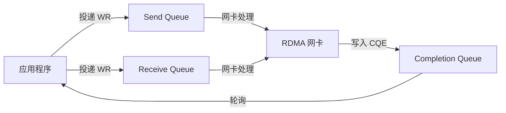

# 2.5 Completion Queue（CQ）

上一节讨论了 QP，即发送和接收请求的载体。请求投递后由网卡异步执行，应用需要通过另一类对象获取执行结果，这就是 Completion Queue（CQ，完成队列）。

在第一章的范例中，client 调用 `ibv_post_send` 投递 RDMA WRITE 请求后，返回值只表示投递动作是否被接受。传输是否完成，需要继续轮询 CQ，读取网卡生成的完成记录。这就是 RDMA 的异步编程模型：应用提交请求，网卡执行请求，完成状态通过 CQ 返回。

理解 CQ 是理解 RDMA 异步语义的关键——投递成功不等于完成，完成也不等于应用层成功（必须检查 WC status）。

本章实验使用 `examples/programming_model/03_rc_loopback.c`。实验在每个操作完成后打印 CQE：SEND/RECV 会产生两个完成，一个属于发送方 SEND WR，另一个属于接收方 RECV WR；RDMA WRITE 和 RDMA READ 则只在发起方产生完成。`wr_id`、`opcode`、`status` 和 `byte_len` 的含义，可以直接从这些输出中对照观察。

```bash
make -C examples/programming_model
./examples/programming_model/03_rc_loopback -d mlx5_0 -p 1 -g 0
```

## 2.5.1 CQ 的作用

CQ 用于承接异步请求的完成结果。`ibv_post_send` 和 `ibv_post_recv` 只负责投递 WR；请求是否完成、成功或失败，需要通过 CQ 中的 WC 判断。

这种模型把“提交请求”和“获取结果”分离开来。

### 同步 vs 异步

如果 `ibv_post_send` 等待操作完成再返回：

```
线程调用 ibv_post_send → 等待网卡完成 → 返回
```

这意味着线程在等待期间被阻塞，无法继续投递其他请求或处理其他连接。

使用 CQ 的异步模型：

```
线程投递多个 WR → 继续做其他事 → 定期轮询 CQ → 批量处理完成
```

线程可以在等待网卡完成的同时做别的事情，而且可以批量处理多个完成。

### CQ 的基本概念

CQ 是一个队列，网卡完成 Work Request（WR）后，会在这里写入 Completion Queue Entry（CQE）。应用程序通过轮询 CQ 来获取完成通知。



图 2-8：CQ 在 RDMA 异步模型中的作用。
{: .figure-caption }

### CQ 与回调的对比

RDMA 也支持基于 `ibv_comp_channel` 的事件驱动完成通知，但低延迟数据路径通常使用轮询。轮询由应用主动调用 `ibv_poll_cq` 获取已完成的 WC，路径短、响应快，但会占用 CPU；事件驱动会让应用阻塞等待完成事件，CPU 占用低一些，但涉及内核通知和上下文切换。

!!! note "RDMA 的设计哲学"
    高性能 RDMA 程序常采用忙轮询，是为了减少完成通知路径上的额外延迟。通用服务或空闲连接较多的场景，也可以使用事件驱动以降低 CPU 占用。

## 2.5.2 创建 CQ：`ibv_create_cq`

### 函数原型

```c
struct ibv_cq *ibv_create_cq(struct ibv_context *context,
                             int cqe,
                             void *cq_context,
                             struct ibv_comp_channel *channel,
                             int comp_vector);
```

### 参数说明

| 参数 | 说明 |
|------|------|
| `context` | 设备上下文 |
| `cqe` | 最少 CQE 数量（实际可能更多） |
| `cq_context` | 用户定义的上下文，会在 CQ 事件中返回 |
| `channel` | 完成通道（可为 NULL，用于事件驱动） |
| `comp_vector` | 完成向量（用于指定 CPU，通常为 0） |

!!! note "cqe 是“最小值”，不是“精确值”"
    请求 16 个 CQE 时，驱动可能实际分配 32 个。这是正常行为，因为驱动可能会按照硬件要求向上取整。

### 返回值

创建成功时返回 `struct ibv_cq` 指针，失败时返回 `NULL`。

### 示例代码

```c
// 创建一个至少可容纳 16 个 CQE 的 CQ
struct ibv_cq *cq = ibv_create_cq(context, 16, NULL, NULL, 0);
if (!cq) {
    perror("Failed to create CQ");
    return -1;
}
```

### CQE 数量的选择

CQE 数量的选择要与并发窗口和轮询策略匹配。它不应小于可能同时完成但尚未被应用取走的 WR 数量；如果应用轮询很频繁，可以适当减小 CQE；如果轮询不及时，过小的 CQ 更容易溢出。

```c
// 场景1：最多 8 个未完成的 WR
struct ibv_cq *cq = ibv_create_cq(context, 8, NULL, NULL, 0);

// 场景2：大量并发 WR
struct ibv_cq *cq = ibv_create_cq(context, 1024, NULL, NULL, 0);
```

!!! note "CQ 溢出的后果"
    如果 CQ 满了，网卡无法写入新的 CQE，会产生异步错误事件。发生 CQ overrun 后，这个 CQ 通常不能继续作为正常完成队列使用，关联的 QP 也可能进入错误状态。程序应该通过 `ibv_get_async_event` 监听这类事件，并按错误恢复流程重建相关资源。

## 2.5.3 Work Completion（WC）结构：网卡给程序的"收条"

每个 CQE 对应一个 Work Completion（WC），包含一个已完成的 WR 的详细信息。可以把 WC 理解为网卡的"收条"——通知程序"这个请求处理完了，结果是什么"。

### WC 结构体

```c
struct ibv_wc {
    uint64_t wr_id;              // Work Request ID
    enum ibv_wc_status status;    // 完成状态
    enum ibv_wc_opcode opcode;    // 操作类型
    uint32_t vendor_err;          // 厂商特定错误码
    uint32_t byte_len;            // 传输字节数
    union {
        uint32_t imm_data;        // Immediate 数据（网络字节序）
        uint32_t invalidated_rkey; // 被无效化的 rkey（与 Invalidate 操作相关）
    };
    uint32_t qp_num;              // QP 编号
    uint32_t src_qp;              // 源 QP 编号（UD）
    enum ibv_wc_flags wc_flags;   // 标志位
    uint16_t pkey_index;          // Partition key 索引
    uint16_t slid;                // 源 LID
    uint8_t sl;                   // Service Level
    uint8_t dlid_path_bits;       // DLID path bits
};
```

!!! note "结构随版本略有差异"
    上面的结构以 rdma-core 当前版本为参照。不同版本的 `libibverbs` 可能增加字段（例如 VLAN 信息）或调整注释；读者应以所用系统的 `verbs.h` 头文件为准。

### 关键字段说明

| 字段 | 说明 |
|------|------|
| `wr_id` | 用户在 WR 中设置的 ID，用于关联请求和完成 |
| `status` | 完成状态，`IBV_WC_SUCCESS` 表示成功 |
| `opcode` | 操作类型（SEND、RDMA_WRITE、RDMA_READ 等） |
| `byte_len` | 传输字节数；主要对 RECV 和 RDMA READ 有实际意义 |

!!! note "`wr_id` 的作用"
    投递 WR 时设置的 `wr_id` 会在完成时返回。应用通常把指针、请求编号或 `(qp_num << 32) | user_context` 一类编码放入 `wr_id`，用于关联请求和完成。

!!! note "非成功 WC 的字段有效性"
    只有 `wc.status == IBV_WC_SUCCESS` 时，`opcode`、`byte_len`、`imm_data` 等字段才适合按对应操作解释。对于失败完成，应用主要依赖 `wr_id`、`status`、`qp_num` 和 `vendor_err` 做诊断；不要在错误路径里继续按成功路径解析数据长度或 immediate 数据。

### 完成状态（status）：必须检查的字段

应注意，`ibv_poll_cq` 返回 WC 不代表操作成功。应用必须检查 `wc.status`。

```c
enum ibv_wc_status {
    IBV_WC_SUCCESS,              // 成功
    IBV_WC_LOC_LEN_ERR,         // 本地长度错误
    IBV_WC_LOC_QP_OP_ERR,       // QP 操作错误
    IBV_WC_LOC_EEC_OP_ERR,      // EEC 操作错误
    IBV_WC_LOC_PROT_ERR,        // 本地保护错误
    IBV_WC_WR_FLUSH_ERR,        // WR 被清空
    IBV_WC_MW_BIND_ERR,         // MW 绑定错误
    IBV_WC_BAD_RESP_ERR,        // 响应错误
    IBV_WC_LOC_ACCESS_ERR,      // 本地访问错误
    IBV_WC_REM_INV_REQ_ERR,    // 无效的远端请求
    IBV_WC_REM_ACCESS_ERR,     // 远端访问错误
    IBV_WC_REM_OP_ERR,         // 远端操作错误
    IBV_WC_RETRY_EXC_ERR,      // 重试超限
    IBV_WC_RNR_RETRY_EXC_ERR   // RNR 重试超限
    // ... 更多错误码
};
```

!!! note "非 SUCCESS 不一定是程序错误"
    有些错误来自暂时性条件，例如接收方没有准备好导致 `IBV_WC_RNR_RETRY_EXC_ERR`，或网络/对端响应问题导致 `IBV_WC_RETRY_EXC_ERR`；应用可以在修正接收队列或降低并发后重试。另一些错误通常说明配置不正确，例如 `IBV_WC_REM_ACCESS_ERR` 指向远端访问权限或 `rkey` 问题，`IBV_WC_LOC_PROT_ERR` 则需要检查本地 MR 权限和地址范围。

### 操作类型（opcode）

```c
enum ibv_wc_opcode {
    IBV_WC_SEND,              // Send 完成
    IBV_WC_RDMA_WRITE,        // RDMA Write 完成
    IBV_WC_RDMA_READ,         // RDMA Read 完成
    IBV_WC_COMP_SWAP,         // Compare & Swap 完成
    IBV_WC_FETCH_ADD,         // Fetch & Add 完成
    IBV_WC_RECV,              // Receive 完成
    IBV_WC_RECV_RDMA_WITH_IMM // RDMA Write with Immediate 的接收
};
```

## 2.5.4 轮询 CQ：`ibv_poll_cq`

### 函数原型

```c
int ibv_poll_cq(struct ibv_cq *cq,
                int num_entries,
                struct ibv_wc *wc);
```

### 参数说明

| 参数 | 说明 |
|------|------|
| `cq` | 要轮询的 CQ |
| `num_entries` | 最多返回的 WC 数量 |
| `wc` | WC 数组，用于存放结果 |

### 返回值

`ibv_poll_cq` 返回正数时表示取到的 WC 数量，返回 0 表示当前没有可用完成，返回负数表示轮询出错。

!!! note "返回 0 不是错误"
    返回 0 只是说明当前没有可返回的 WC，不是错误。等待完成时需要继续轮询，或结合超时机制避免无限等待。

`ibv_poll_cq` 会把已经返回给应用的 WC 从 CQ 中取走。一个完成被取出后，不会再次出现在同一个 CQ 中。因此应用处理完成时要么立即消费并更新状态，要么把必要信息复制到自己的数据结构里。

### 示例代码：单个轮询

```c
struct ibv_wc wc;
int ret;

// 轮询一个 WC
ret = ibv_poll_cq(cq, 1, &wc);
if (ret < 0) {
    fprintf(stderr, "Poll CQ failed\n");
    return -1;
}
if (ret == 0) {
    // CQ 为空，继续等待
    return 0;
}
// ret == 1，有一个 WC
if (wc.status != IBV_WC_SUCCESS) {
    fprintf(stderr, "Work completion failed: %s\n",
            ibv_wc_status_str(wc.status));
    return -1;
}
printf("Operation completed successfully\n");
printf("  wr_id: %lu\n", wc.wr_id);
printf("  opcode: %d\n", wc.opcode);
printf("  byte_len: %u\n", wc.byte_len);
```

### 示例代码：批量轮询

批量轮询可以提高效率，一次 `ibv_poll_cq` 调用最多返回多个完成：

```c
#define MAX_WC 16

struct ibv_wc wcs[MAX_WC];
int ret;

// 批量轮询，一次最多获取 16 个 WC
ret = ibv_poll_cq(cq, MAX_WC, wcs);
if (ret > 0) {
    for (int i = 0; i < ret; i++) {
        if (wcs[i].status != IBV_WC_SUCCESS) {
            fprintf(stderr, "WC[%d] failed: %s\n", i,
                    ibv_wc_status_str(wcs[i].status));
        } else {
            printf("WC[%d] completed, wr_id: %lu\n", i, wcs[i].wr_id);
        }
    }
}
```

!!! note "批量轮询的性能优势"
    `ibv_poll_cq` 通常是用户态快速路径。批量轮询的优势主要是减少函数调用、分支判断和循环管理开销，而不是减少系统调用次数。

## 2.5.5 轮询策略：三种模式

轮询 CQ 有三种基本策略，各有优劣。

### 策略 1：忙轮询（Busy Polling）

```c
while (1) {
    struct ibv_wc wc;
    int ret = ibv_poll_cq(cq, 1, &wc);
    if (ret > 0) {
        if (wc.status == IBV_WC_SUCCESS) {
            // 处理完成
            handle_completion(&wc);
        }
        break;
    }
    // CPU 忙等待
}
```

**优点**：响应快
**缺点**：CPU 占用高

!!! note "忙轮询的适用场景"
    忙轮询适合低延迟场景。它以较高 CPU 占用换取更短的完成发现时间。

### 策略 2：超时轮询

```c
#define TIMEOUT_MS 2000

unsigned long start = get_current_time_ms();
while (1) {
    struct ibv_wc wc;
    int ret = ibv_poll_cq(cq, 1, &wc);
    if (ret > 0) {
        if (wc.status == IBV_WC_SUCCESS) {
            handle_completion(&wc);
        }
        break;
    }

    if (get_current_time_ms() - start > TIMEOUT_MS) {
        fprintf(stderr, "Poll timeout\n");
        return -1;
    }
    usleep(100);  // 短暂休眠
}
```

**优点**：CPU 占用较低
**缺点**：响应延迟

!!! note "超时轮询的权衡"
    超时轮询在 CPU 占用和响应延迟之间取得平衡。休眠时间（`usleep(100)`）需要仔细选择——太短 CPU 占用高，太长响应慢。

### 策略 3：事件驱动（Event Driven）

```c
// 创建完成通道
struct ibv_comp_channel *channel = ibv_create_comp_channel(context);

// 创建 CQ 时关联通道
struct ibv_cq *cq = ibv_create_cq(context, 16, NULL, channel, 0);

// 请求通知
ibv_req_notify_cq(cq, 0);

// 等待事件（阻塞）
struct ibv_cq *event_cq;
void *event_ctx;
ibv_get_cq_event(channel, &event_cq, &event_ctx);

// 确认事件
ibv_ack_cq_events(event_cq, 1);

// 轮询 CQ
ibv_poll_cq(cq, 1, &wc);
```

**优点**：CPU 占用最低，适合大规模应用
**缺点**：实现复杂

!!! note "事件驱动不是零开销"
    虽然事件驱动的 CPU 占用最低，但 `ibv_get_cq_event` 会阻塞线程，而且每次事件都需要内核介入。对于延迟敏感的应用，忙轮询可能更合适。

## 2.5.6 不同操作的完成语义

不同的 RDMA 操作有不同的完成语义。理解这些语义——特别是**WC 生成时确切发生了什么**——是正确编写 RDMA 程序的关键。

### Send 操作的完成

**WC 生成的时间点**：以本教程主线的 RC QP 为背景，远端网卡已经接收并确认了这个消息。

对于 Send 操作：

发送方获得 SEND WC 时，表示该 SEND WR 已完成，本地发送 buffer 可以复用；远端接收方获得 RECV WC 时，表示数据已经写入预先投递的接收缓冲区。发送方 SEND WC 中的 `byte_len` 不作为发送长度使用；如果使用 Send with Immediate，立即数会体现在接收方的 WC 中。

```c
// 投递 Send WR
struct ibv_send_wr wr = {
    .opcode = IBV_WR_SEND,
    .send_flags = IBV_SEND_SIGNALED,  // 必须设置
    .wr_id = 12345
};
ibv_post_send(qp, &wr, &bad_wr);

// 轮询 CQ
struct ibv_wc wc;
ibv_poll_cq(cq, 1, &wc);
if (wc.wr_id == 12345 && wc.opcode == IBV_WC_SEND) {
    printf("Send completed\n");
}
```

!!! note "Send WC 生成时的状态"
    当发送方获得 WC 时，本地 WR 已经完成，本地发送 buffer 可以复用。对 RC QP 而言，可靠传输协议已经获得必要确认；但远端应用是否已经处理消息，仍取决于远端是否轮询并处理了对应 RECV WC。

    如果 SQ 使用 selective signaling，一个带 `IBV_SEND_SIGNALED` 的成功完成还表示同一 Send Queue 中排在它之前、尚未单独生成 WC 的 unsignaled WR 已经不再 outstanding。高性能程序常据此减少 CQE 数量，但仍需定期产生 signaled WR，避免无法判断资源何时可复用。

!!! note "Send 是双边操作"
    远端必须提前投递 Receive WR。如果没有预先投递的 Recv WR，会产生 RNR（Receiver Not Ready）错误，发送方的 WC status 会是 `IBV_WC_RNR_RETRY_EXC_ERR`。

### Receive 操作的完成

**WC 生成的时间点**：远端的 SEND 消息已经被本地网卡写入预先投递的接收缓冲区。

对于 Receive 操作：

接收方获得 WC 时，数据已经写入预先投递的缓冲区；`byte_len` 表示实际接收的字节数，可能小于缓冲区大小。对于 UD 模式，`src_qp` 可用于识别发送方 QP。

```c
// 投递 Recv WR
struct ibv_recv_wr wr = {
    .wr_id = 67890
};
ibv_post_recv(qp, &wr, &bad_wr);

// 轮询 CQ
struct ibv_wc wc;
ibv_poll_cq(cq, 1, &wc);
if (wc.wr_id == 67890 && wc.opcode == IBV_WC_RECV) {
    printf("Received %u bytes\n", wc.byte_len);
    // 数据已经写入 recv_buffer
}
```

!!! note "Receive WC 生成时数据已可用"
    当 Receive WC 生成时，数据已经在接收缓冲区中，可以直接访问。应用仍需根据自己的协议解析消息边界和内容。

!!! note "Receive WR 必须提前投递"
    如果消息到达时没有预先投递的 Receive WR，会产生 RNR（Receiver Not Ready）错误。发送方会收到这个错误并重试。

### RDMA Write 的完成

**WC 生成的时间点**：发起方的 RDMA WRITE WR 已完成，可靠连接上已得到远端确认。

对于 RDMA WRITE：

发起方获得 WRITE WC 时，该 WRITE WR 已完成，本地源 buffer 可以复用。基本 RDMA WRITE 不会在远端生成 WC，`byte_len` 也不作为写入长度使用。

```c
// 投递 RDMA WRITE WR
struct ibv_send_wr wr = {
    .opcode = IBV_WR_RDMA_WRITE,
    .wr.rdma.remote_addr = remote_addr,
    .wr.rdma.rkey = remote_rkey,
    .send_flags = IBV_SEND_SIGNALED,
    .wr_id = 11111
};
ibv_post_send(qp, &wr, &bad_wr);

// 轮询 CQ
struct ibv_wc wc;
ibv_poll_cq(cq, 1, &wc);
if (wc.wr_id == 11111 && wc.opcode == IBV_WC_RDMA_WRITE) {
    printf("RDMA Write completed\n");
}
```

!!! note "RDMA Write WC 生成时的状态"
    当发起方获得 WRITE WC 时，本地源 buffer 可以复用，远端不会因此自动得到应用层通知。远端应用若需要处理这段数据，必须通过协议约定的同步方式得知写入已经完成。

!!! warning "RDMA Write 完成不等于应用级完成"
    WRITE WC 不表示远端应用已经读取或处理了数据。如果远端 CPU 需要处理写入内容，需要额外的同步机制：
    常见做法包括远端主动轮询检查、发送方通过额外的 SEND/RECV 或 TCP 通知，以及使用 RDMA Write with Immediate 让远端收到一个带 `imm_data` 的 Receive WC。

### RDMA Read 的完成

**WC 生成的时间点**：数据已经从远端内存通过 DMA 读回到本地内存。

对于 RDMA READ：

发起方获得 READ WC 时，数据已经读回到本地内存；`byte_len` 表示读取的字节数，本地 buffer 可以直接访问。

```c
// 投递 RDMA READ WR
struct ibv_send_wr wr = {
    .opcode = IBV_WR_RDMA_READ,
    .wr.rdma.remote_addr = remote_addr,
    .wr.rdma.rkey = remote_rkey,
    .send_flags = IBV_SEND_SIGNALED,
    .wr_id = 22222
};
ibv_post_send(qp, &wr, &bad_wr);

// 轮询 CQ
struct ibv_wc wc;
ibv_poll_cq(cq, 1, &wc);
if (wc.wr_id == 22222 && wc.opcode == IBV_WC_RDMA_READ) {
    printf("RDMA Read completed, %u bytes read\n", wc.byte_len);
    // 数据已经在本地 buffer 中
}
```

!!! note "RDMA Read WC 生成时数据已可用"
    当 RDMA Read WC 生成时，数据已经在本地 buffer 中，可以直接访问。网卡已经完成了从远端内存到本地内存的 DMA 写入。

!!! note "RDMA Read 的远端影响"
    RDMA READ 需要远端网卡响应（READ Request → READ Response），会增加远端的网络负载。频繁的 RDMA READ 可能导致远端性能下降。相比 RDMA WRITE，RDMA READ 的延迟也更高（需要往返）。

## 2.5.7 错误处理：根据 status 采取不同策略

### 处理失败的 WC

```c
struct ibv_wc wc;
int ret = ibv_poll_cq(cq, 1, &wc);
if (ret > 0 && wc.status != IBV_WC_SUCCESS) {
    fprintf(stderr, "Work completion failed:\n");
    fprintf(stderr, "  status: %s\n", ibv_wc_status_str(wc.status));
    fprintf(stderr, "  vendor_err: %u\n", wc.vendor_err);
    fprintf(stderr, "  opcode: %d\n", wc.opcode);
    fprintf(stderr, "  wr_id: %lu\n", wc.wr_id);

    // 根据错误类型处理
    switch (wc.status) {
        case IBV_WC_RETRY_EXC_ERR:
            // 重试超限，可能需要减少并发请求
            break;
        case IBV_WC_RNR_RETRY_EXC_ERR:
            // 接收方未准备好，需要确保远端有足够的 Recv WR
            break;
        case IBV_WC_LOC_ACCESS_ERR:
        case IBV_WC_REM_ACCESS_ERR:
            // 访问权限错误，检查 MR 权限和 rkey
            break;
        default:
            // 其他错误，可能需要重建连接
            break;
    }
}
```

!!! note "错误恢复是应用层的责任"
    RDMA 只负责报告错误，不负责恢复。应用需要根据错误类型采取相应的恢复策略：重试、重建连接，或者报告上层应用。

### CQ 溢出

如果应用程序轮询 CQ 不够频繁，CQ 可能会溢出：

```c
// 网卡生成异步事件
IBV_EVENT_CQ_ERR  // CQ 错误事件
```

预防 CQ 溢出的办法主要是及时轮询 CQ，按并发窗口增大 CQE 数量，或在合适场景使用事件驱动机制。

!!! note "CQ 溢出后 QP 的状态"
    CQ 溢出会使 CQ 不能继续可靠使用，关联的 QP 也可能进入错误状态。程序需要通过 `ibv_get_async_event` 监听这类事件，并在必要时重建 CQ 和 QP。

## 2.5.8 销毁 CQ：`ibv_destroy_cq`

### 函数原型

```c
int ibv_destroy_cq(struct ibv_cq *cq);
```

### 何时可以销毁

只有在没有任何 QP 关联到这个 CQ，且所有使用该 CQ 的完成都已经被处理之后，才能安全销毁 CQ。

```c
// 先销毁关联的 QP
ibv_destroy_qp(qp);

// 再销毁 CQ
if (ibv_destroy_cq(cq)) {
    perror("Failed to destroy CQ");
    return -1;
}
```

!!! note "资源销毁的顺序"
    必须先销毁 QP，再销毁 CQ。如果 CQ 还有 QP 在使用，`ibv_destroy_cq` 会失败。

## 2.5.9 示例：使用 CQ

```c
#include <infiniband/verbs.h>
#include <stdio.h>
#include <stdlib.h>
#include <string.h>
#include <errno.h>

#define MAX_WC 16

int cq_example(struct ibv_cq *cq) {
    struct ibv_wc wcs[MAX_WC];
    int ret;

    printf("Polling CQ for completions...\n");

    // 批量轮询
    ret = ibv_poll_cq(cq, MAX_WC, wcs);
    if (ret < 0) {
        fprintf(stderr, "ibv_poll_cq failed: %s\n", strerror(errno));
        return -1;
    }

    if (ret == 0) {
        printf("No completions available\n");
        return 0;
    }

    printf("Got %d completion(s)\n", ret);

    // 处理每个 WC
    for (int i = 0; i < ret; i++) {
        printf("\nCompletion #%d:\n", i);
        printf("  wr_id: %lu\n", wcs[i].wr_id);
        printf("  status: %s\n", ibv_wc_status_str(wcs[i].status));

        if (wcs[i].status != IBV_WC_SUCCESS) {
            fprintf(stderr, "  Error! vendor_err: %u\n", wcs[i].vendor_err);
            continue;
        }

        printf("  opcode: ");
        switch (wcs[i].opcode) {
            case IBV_WC_SEND:
                printf("SEND\n");
                break;
            case IBV_WC_RECV:
                printf("RECV\n");
                printf("  byte_len: %u\n", wcs[i].byte_len);
                printf("  src_qp: %u\n", wcs[i].src_qp);
                break;
            case IBV_WC_RDMA_WRITE:
                printf("RDMA_WRITE\n");
                break;
            case IBV_WC_RDMA_READ:
                printf("RDMA_READ\n");
                printf("  byte_len: %u\n", wcs[i].byte_len);
                break;
            default:
                printf("Unknown\n");
                break;
        }

        // 检查 inline 数据
        if (wcs[i].wc_flags & IBV_WC_WITH_IMM) {
            printf("  imm_data: %u\n", wcs[i].imm_data);
        }
    }

    return 0;
}
```

## 2.5.10 高级主题：共享 CQ

### 多 QP 共享一个 CQ

```c
// 创建一个 CQ
struct ibv_cq *cq = ibv_create_cq(context, 256, NULL, NULL, 0);

// 多个 QP 使用同一个 CQ
struct ibv_qp_init_attr qp_init_attr = {
    .send_cq = cq,
    .recv_cq = cq,
    // ...
};

struct ibv_qp *qp1 = ibv_create_qp(pd, &qp_init_attr);
struct ibv_qp *qp2 = ibv_create_qp(pd, &qp_init_attr);
```

共享 CQ 可以减少资源消耗，也能把多个 QP 的完成收敛到同一个轮询点。代价是应用需要通过 `wr_id` 区分不同请求，也可以结合 `wc.qp_num` 辅助定位来源 QP；CQE 数量要按所有关联 QP 的完成量统一规划。

### 使用 wr_id 关联

```c
// 定义 wr_id 的格式
#define WR_ID qp_num << 32 | context

// 投递 WR 时设置 wr_id
struct ibv_send_wr wr = {
    .wr_id = ((uint64_t)qp_num << 32) | user_context,
    // ...
};

// 处理 WC 时解析 wr_id
uint32_t qp_num = wc.wr_id >> 32;
uint32_t context = wc.wr_id & 0xFFFFFFFF;
```

!!! note "共享 CQ 的权衡"
    共享 CQ 减少资源消耗，但增加了 `wr_id` 管理的复杂度。对于简单的单 QP 应用，使用独立的 CQ 更简单。

## 2.5.11 性能考虑

### 轮询频率

轮询频率需要在响应性和 CPU 占用之间权衡：

```c
// 高频轮询：响应快，CPU 占用高
while (!done) {
    ibv_poll_cq(cq, 1, &wc);
}

// 低频轮询：CPU 占用低，响应慢
while (!done) {
    ibv_poll_cq(cq, 1, &wc);
    usleep(1000);
}
```

!!! note "轮询频率的选择"
    轮询频率取决于应用需求。低延迟应用通常倾向忙轮询，吞吐量敏感应用常结合批量轮询和较低轮询频率，通用应用则更适合事件驱动或混合模式。

### 批量处理

批量轮询可以减少循环和函数调用开销：

```c
// 逐个轮询
for (int i = 0; i < n; i++) {
    ibv_poll_cq(cq, 1, &wc);
}

// 批量轮询
ibv_poll_cq(cq, n, wcs);
```

### CQE 数量

CQE 数量要足够大以避免溢出，但也不是越大越好：

```c
// 根据应用模式选择
int cqe = max_outstanding_wr * 2;  // 留出余量
struct ibv_cq *cq = ibv_create_cq(context, cqe, NULL, NULL, 0);
```

!!! note "CQE 数量的经验法则"
    通常 CQE 数量应该是"最大未完成 WR 数量"的 1.5-2 倍。这留出了足够的余量，避免 CQ 溢出。

## 2.5.12 本章小结

CQ 把 RDMA 请求的异步完成结果交还给应用。`ibv_poll_cq` 返回 0 只表示暂时没有 WC；返回正数时，应用还必须检查每个 WC 的 `status`。只有 `IBV_WC_SUCCESS` 表示对应 WR 成功完成，非成功状态只能按错误路径解释。

完成处理通常依赖 `wr_id` 找回请求上下文。多个 QP 可以共享同一个 CQ，但这要求应用在 `wr_id` 或其他上下文结构中保留足够信息。CQ 需要及时轮询或通过 completion channel 驱动，否则 CQE 积压可能导致 CQ overrun，并进一步产生异步事件。

!!! note "后续章节"
    至此，第二篇已经介绍了 RDMA 的核心资源：Context、PD、MR、QP、CQ。后续章节将进入具体操作，包括双边 SEND/RECV、单边 RDMA WRITE、单边 RDMA READ 和 Atomic。每种操作都有自己的语义和适用场景，但都建立在上述资源模型之上。

## 延伸阅读

- [rdma-core 手册页：ibv_create_cq(3)、ibv_poll_cq(3)、ibv_req_notify_cq(3)、ibv_create_comp_channel(3)、ibv_destroy_cq(3)](https://man.archlinux.org/man/extra/rdma-core/)：CQ 创建、轮询与事件驱动的函数语义。
- [InfiniBand Architecture Specification Volume 1](https://www.infinibandta.org/)：CQ 溢出（CQ overrun）与 CQE 的规范行为。
- [rdma-core 头文件 `libibverbs/verbs.h`](https://github.com/linux-rdma/rdma-core/blob/master/libibverbs/verbs.h)：`ibv_wc`、`ibv_wc_status`、`ibv_wc_opcode` 的权威定义。
