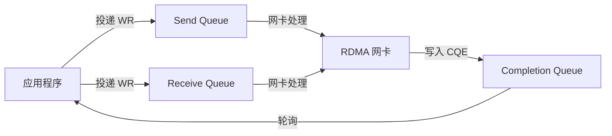

# 2.5 Completion Queue（CQ）

上一节我们讨论了 QP——发送和接收请求的队列。但你投递请求后，请求在后台异步执行，怎么知道操作完成了？

答案是：**通过 Completion Queue（完成队列）**。

在第一章的范例中，client 调用 `ibv_post_send` 投递 RDMA WRITE 请求后，并没有立即返回结果——它必须轮询 CQ，等待网卡写入完成记录。这就是 RDMA 的异步编程模型：你告诉网卡"做什么"，网卡在后台做，完成后在 CQ 里留个"条子"，你定期来查看。

理解 CQ 是理解 RDMA 异步语义的关键——投递成功不等于完成，完成也不等于应用层成功（必须检查 WC status）。

!!! note "推荐阅读资源"
    RDMA 的官方编程手册和 www.rdmamojo.com 网站提供了更完整的 API 参考。本章建立概念框架，具体 API 的细节可以在需要时查阅这些资源。

## 2.5.1 先从问题开始：为什么需要 CQ

在深入代码之前，让我们先理解一个根本问题：**为什么不能让 `ibv_post_send` 直接等待完成，而是要设计一个 CQ？**

答案是：**性能和灵活性**。

### 同步 vs 异步

如果 `ibv_post_send` 等待操作完成再返回：

```
线程调用 ibv_post_send → 等待网卡完成 → 返回
```

这意味着线程在等待期间被阻塞，无法做其他事情。对于高性能应用，这是不可接受的。

使用 CQ 的异步模型：

```
线程投递多个 WR → 继续做其他事 → 定期轮询 CQ → 批量处理完成
```

线程可以在等待网卡完成的同时做别的事情，而且可以批量处理多个完成。

### CQ 的基本概念

CQ 是一个队列，网卡完成 Work Request（WR）后，会在这里写入 Completion Queue Entry（CQE）。应用程序通过轮询 CQ 来获取完成通知。



图 2-8：CQ 在 RDMA 异步模型中的作用。
{: .figure-caption }

### CQ 与回调的对比

你可能会问：*为什么不用回调函数？*

RDMA 确实支持事件驱动（通过 `ibv_comp_channel`），但轮询 CQ 是最低开销的方式：
- 轮询：用户态直接读取内存，无内核介入
- 回调：需要内核介入和上下文切换

!!! note "RDMA 的设计哲学"
    RDMA 的设计目标是"零拷贝、内核旁路"。轮询 CQ 符合这个目标——网卡直接写用户态内存，应用程序直接读取，无需内核参与。

## 2.5.2 创建 CQ：`ibv_create_cq`

### 函数原型

```c
struct ibv_cq *ibv_create_cq(struct ibv_context *context,
                             int cqe,
                             void *cq_context,
                             struct ibv_comp_channel *channel,
                             int comp_vector);
```

### 参数说明

| 参数 | 说明 |
|------|------|
| `context` | 设备上下文 |
| `cqe` | 最少 CQE 数量（实际可能更多） |
| `cq_context` | 用户定义的上下文，会在 CQ 事件中返回 |
| `channel` | 完成通道（可为 NULL，用于事件驱动） |
| `comp_vector` | 完成向量（用于指定 CPU，通常为 0） |

!!! note "cqe 是"最小值"，不是"精确值""
    你请求 16 个 CQE，驱动可能给你 32 个。这是正常行为——驱动可能会向上取整以对齐硬件要求。

### 返回值

- 成功：指向 `struct ibv_cq` 的指针
- 失败：NULL

### 示例代码

```c
// 创建一个至少可容纳 16 个 CQE 的 CQ
struct ibv_cq *cq = ibv_create_cq(context, 16, NULL, NULL, 0);
if (!cq) {
    perror("Failed to create CQ");
    return -1;
}
```

### CQE 数量的选择

CQE 数量的选择需要考虑：

1. **未完成的 WR 数量**：CQE 数量不应小于可能同时未完成的 WR 数
2. **轮询策略**：如果定期轮询，可以减小 CQE
3. **错误容忍**：太小的 CQ 容易溢出

```c
// 场景1：最多 8 个未完成的 WR
struct ibv_cq *cq = ibv_create_cq(context, 8, NULL, NULL, 0);

// 场景2：大量并发 WR
struct ibv_cq *cq = ibv_create_cq(context, 1024, NULL, NULL, 0);
```

!!! note "CQ 溢出的后果"
    如果 CQ 满了，网卡无法写入新的 CQE，会产生异步错误事件。程序应该通过 `ibv_get_async_event` 监听这类事件。

## 2.5.3 Work Completion（WC）结构：网卡给程序的"收条"

每个 CQE 对应一个 Work Completion（WC），包含一个已完成的 WR 的详细信息。可以把 WC 理解为网卡的"收条"——通知程序"这个请求处理完了，结果是什么"。

### WC 结构体

```c
struct ibv_wc {
    uint64_t wr_id;              // Work Request ID
    enum ibv_wc_status status;    // 完成状态
    enum ibv_wc_opcode opcode;    // 操作类型
    uint32_t vendor_err;          // 厂商特定错误码
    uint32_t byte_len;            // 传输字节数
    union {
        struct {
            uint32_t key;         // inline 数据的 key
            uint32_t imm_data;    // inline 数据
        };
    };
    uint32_t qp_num;              // QP 编号
    uint32_t src_qp;              // 源 QP 编号（UD）
    enum ibv_wc_flags wc_flags;   // 标志位
    uint16_t pkey_index;          // Partition key 索引
    uint16_t slid;                // 源 LID
    uint8_t sl;                   // Service Level
    uint8_t dlid_path_bits;       // DLID path bits
};
```

### 关键字段说明

| 字段 | 说明 |
|------|------|
| `wr_id` | 用户在 WR 中设置的 ID，用于关联请求和完成 |
| `status` | 完成状态，`IBV_WC_SUCCESS` 表示成功 |
| `opcode` | 操作类型（SEND、RDMA_WRITE、RDMA_READ 等） |
| `byte_len` | 实际传输的字节数 |

!!! note "wr_id 是应用程序和网卡的"通信语言""
    你在投递 WR 时设置 `wr_id`，网卡在完成时把这个 ID 原样返回给你。这样你就能知道"哪个请求完成了"。典型的做法是把 `wr_id` 编码为 `(qp_num << 32) | user_context`，以便在多 QP 场景下区分来源。

### 完成状态（status）：必须检查的字段

这是 RDMA 新手最容易忽略的地方：**`ibv_poll_cq` 返回 WC，不代表操作成功——你必须检查 `wc.status`**。

```c
enum ibv_wc_status {
    IBV_WC_SUCCESS,              // 成功
    IBV_WC_LOC_LEN_ERR,         // 本地长度错误
    IBV_WC_LOC_QP_OP_ERR,       // QP 操作错误
    IBV_WC_LOC_EEC_OP_ERR,      // EEC 操作错误
    IBV_WC_LOC_PROT_ERR,        // 本地保护错误
    IBV_WC_WR_FLUSH_ERR,        // WR 被清空
    IBV_WC_MW_BIND_ERR,         // MW 绑定错误
    IBV_WC_BAD_RESP_ERR,        // 响应错误
    IBV_WC_LOC_ACCESS_ERR,      // 本地访问错误
    IBV_WC_REM_INV_REQ_ERR,    // 无效的远端请求
    IBV_WC_REM_ACCESS_ERR,     // 远端访问错误
    IBV_WC_REM_OP_ERR,         // 远端操作错误
    IBV_WC_RETRY_EXC_ERR,      // 重试超限
    IBV_WC_RNR_RETRY_EXC_ERR   // RNR 重试超限
    // ... 更多错误码
};
```

!!! note "非 SUCCESS 不一定是程序错误"
    某些错误是可恢复的：
    - `IBV_WC_RNR_RETRY_EXC_ERR`：接收方没准备好，可以稍后重试
    - `IBV_WC_RETRY_EXC_ERR`：网络拥塞，可以降低并发

    某些错误需要重建连接：
    - `IBV_WC_REM_ACCESS_ERR`：远端访问权限错误，需要检查 rkey
    - `IBV_WC_LOC_PROT_ERR`：本地保护错误，需要检查 MR 权限

### 操作类型（opcode）

```c
enum ibv_wc_opcode {
    IBV_WC_SEND,              // Send 完成
    IBV_WC_RDMA_WRITE,        // RDMA Write 完成
    IBV_WC_RDMA_READ,         // RDMA Read 完成
    IBV_WC_COMP_SWAP,         // Compare & Swap 完成
    IBV_WC_FETCH_ADD,         // Fetch & Add 完成
    IBV_WC_RECV,              // Receive 完成
    IBV_WC_RECV_RDMA_WITH_IMM // RDMA Write with Immediate 的接收
};
```

## 2.5.4 轮询 CQ：`ibv_poll_cq`

### 函数原型

```c
int ibv_poll_cq(struct ibv_cq *cq,
                int num_entries,
                struct ibv_wc *wc);
```

### 参数说明

| 参数 | 说明 |
|------|------|
| `cq` | 要轮询的 CQ |
| `num_entries` | 最多返回的 WC 数量 |
| `wc` | WC 数组，用于存放结果 |

### 返回值

- `> 0`：返回的 WC 数量
- `0`：当前没有可用的 WC
- `< 0`：错误

!!! note "返回 0 不是错误"
    很多 RDMA 新手会误以为 `ibv_poll_cq` 返回 0 是错误。实际上，返回 0 只是说明"当前没有可返回的 WC"，这是正常的——你需要继续轮询。

### 示例代码：单个轮询

```c
struct ibv_wc wc;
int ret;

// 轮询一个 WC
ret = ibv_poll_cq(cq, 1, &wc);
if (ret < 0) {
    fprintf(stderr, "Poll CQ failed\n");
    return -1;
}
if (ret == 0) {
    // CQ 为空，继续等待
    return 0;
}
// ret == 1，有一个 WC
if (wc.status != IBV_WC_SUCCESS) {
    fprintf(stderr, "Work completion failed: %s\n",
            ibv_wc_status_str(wc.status));
    return -1;
}
printf("Operation completed successfully\n");
printf("  wr_id: %lu\n", wc.wr_id);
printf("  opcode: %d\n", wc.opcode);
printf("  byte_len: %u\n", wc.byte_len);
```

### 示例代码：批量轮询

批量轮询可以提高效率——一次系统调用获取多个完成：

```c
#define MAX_WC 16

struct ibv_wc wcs[MAX_WC];
int ret;

// 批量轮询，一次最多获取 16 个 WC
ret = ibv_poll_cq(cq, MAX_WC, wcs);
if (ret > 0) {
    for (int i = 0; i < ret; i++) {
        if (wcs[i].status != IBV_WC_SUCCESS) {
            fprintf(stderr, "WC[%d] failed: %s\n", i,
                    ibv_wc_status_str(wcs[i].status));
        } else {
            printf("WC[%d] completed, wr_id: %lu\n", i, wcs[i].wr_id);
        }
    }
}
```

!!! note "批量轮询的性能优势"
    批量轮询减少"用户态-内核态"切换次数。如果你有大量并发请求，批量轮询比逐个轮询效率高得多。

## 2.5.5 轮询策略：三种模式

轮询 CQ 有三种基本策略，各有优劣。

### 策略 1：忙轮询（Busy Polling）

```c
while (1) {
    struct ibv_wc wc;
    int ret = ibv_poll_cq(cq, 1, &wc);
    if (ret > 0) {
        if (wc.status == IBV_WC_SUCCESS) {
            // 处理完成
            handle_completion(&wc);
        }
        break;
    }
    // CPU 忙等待
}
```

**优点**：响应快
**缺点**：CPU 占用高

!!! note "忙轮询的适用场景"
    忙轮询适合低延迟场景（如高频交易）。CPU 占用高换来的是最快的响应速度。如果你的应用对延迟敏感，这是值得的。

### 策略 2：超时轮询

```c
#define TIMEOUT_MS 2000

unsigned long start = get_current_time_ms();
while (1) {
    struct ibv_wc wc;
    int ret = ibv_poll_cq(cq, 1, &wc);
    if (ret > 0) {
        if (wc.status == IBV_WC_SUCCESS) {
            handle_completion(&wc);
        }
        break;
    }

    if (get_current_time_ms() - start > TIMEOUT_MS) {
        fprintf(stderr, "Poll timeout\n");
        return -1;
    }
    usleep(100);  // 短暂休眠
}
```

**优点**：CPU 占用较低
**缺点**：响应延迟

!!! note "超时轮询的权衡"
    超时轮询在 CPU 占用和响应延迟之间取得平衡。休眠时间（`usleep(100)`）需要仔细选择——太短 CPU 占用高，太长响应慢。

### 策略 3：事件驱动（Event Driven）

```c
// 创建完成通道
struct ibv_comp_channel *channel = ibv_create_comp_channel(context);

// 创建 CQ 时关联通道
struct ibv_cq *cq = ibv_create_cq(context, 16, NULL, channel, 0);

// 请求通知
ibv_req_notify_cq(cq, 0);

// 等待事件（阻塞）
struct ibv_cq *event_cq;
void *event_ctx;
ibv_get_cq_event(channel, &event_cq, &event_ctx);

// 确认事件
ibv_ack_cq_events(event_cq, 1);

// 轮询 CQ
ibv_poll_cq(cq, 1, &wc);
```

**优点**：CPU 占用最低，适合大规模应用
**缺点**：实现复杂

!!! note "事件驱动不是零开销"
    虽然事件驱动的 CPU 占用最低，但 `ibv_get_cq_event` 会阻塞线程，而且每次事件都需要内核介入。对于延迟敏感的应用，忙轮询可能更合适。

## 2.5.6 不同操作的完成语义

不同的 RDMA 操作有不同的完成语义。理解这些语义——特别是**WC 生成时确切发生了什么**——是正确编写 RDMA 程序的关键。

### Send 操作的完成

**WC 生成的时间点**：远端网卡已经接收并确认了这个消息。

对于 Send 操作：
- **发送方**获得 WC：表示远端网卡已经接收并确认了数据
- **远端接收方**同时获得 WC：数据已经写入接收方预先投递的缓冲区
- `byte_len` 表示发送的字节数
- 对于 Send with Immediate，`imm_data` 有效

```c
// 投递 Send WR
struct ibv_send_wr wr = {
    .opcode = IBV_WR_SEND,
    .send_flags = IBV_SEND_SIGNALED,  // 必须设置
    .wr_id = 12345
};
ibv_post_send(qp, &wr, &bad_wr);

// 轮询 CQ
struct ibv_wc wc;
ibv_poll_cq(cq, 1, &wc);
if (wc.wr_id == 12345 && wc.opcode == IBV_WC_SEND) {
    printf("Send completed, %u bytes sent\n", wc.byte_len);
}
```

!!! note "Send WC 生成时的状态"
    当发送方获得 WC 时：
    - 数据已经被远端网卡**接收并确认**
    - 远端网卡的**接收缓冲区已经写入完成**（如果远端投递了 Recv WR）
    - 但远端的 **CPU 此时可能还没有处理这段数据**
    - 远端 CPU 何时看到数据取决于它何时轮询 CQ

!!! note "Send 是双边操作"
    远端必须提前投递 Receive WR。如果没有预先投递的 Recv WR，会产生 RNR（Receiver Not Ready）错误，发送方的 WC status 会是 `IBV_WC_RNR_RETRY_EXC_ERR`。

### Receive 操作的完成

**WC 生成的时间点**：远端的 SEND 消息已经被本地网卡写入你预先投递的缓冲区。

对于 Receive 操作：
- **接收方**获得 WC：数据已经写入预先投递的缓冲区
- `byte_len` 表示实际接收的字节数（可能小于缓冲区大小）
- `src_qp` 表示发送方 QP（UD 模式）

```c
// 投递 Recv WR
struct ibv_recv_wr wr = {
    .wr_id = 67890
};
ibv_post_recv(qp, &wr, &bad_wr);

// 轮询 CQ
struct ibv_wc wc;
ibv_poll_cq(cq, 1, &wc);
if (wc.wr_id == 67890 && wc.opcode == IBV_WC_RECV) {
    printf("Received %u bytes\n", wc.byte_len);
    // 数据已经写入 recv_buffer
}
```

!!! note "Receive WC 生成时数据已可用"
    当 Receive WC 生成时，数据**已经在你的缓冲区中**，可以直接访问。你不需要任何额外的同步操作——网卡已经完成了 DMA 写入。

!!! note "Receive WR 必须提前投递"
    如果消息到达时没有预先投递的 Receive WR，会产生 RNR（Receiver Not Ready）错误。发送方会收到这个错误并重试。

### RDMA Write 的完成

**WC 生成的时间点**：发起方的网卡已经收到远端的 ACK，数据已经写入远端内存。

对于 RDMA WRITE：
- **发起方**获得 WC：数据已经写入远端内存（远端网卡已确认）
- **远端**不获得任何 WC（这是 one-sided 操作的特性）
- `byte_len` 通常为 0（无数据返回）

```c
// 投递 RDMA WRITE WR
struct ibv_send_wr wr = {
    .opcode = IBV_WR_RDMA_WRITE,
    .wr.rdma.remote_addr = remote_addr,
    .wr.rdma.rkey = remote_rkey,
    .send_flags = IBV_SEND_SIGNALED,
    .wr_id = 11111
};
ibv_post_send(qp, &wr, &bad_wr);

// 轮询 CQ
struct ibv_wc wc;
ibv_poll_cq(cq, 1, &wc);
if (wc.wr_id == 11111 && wc.opcode == IBV_WC_RDMA_WRITE) {
    printf("RDMA Write completed\n");
}
```

!!! note "RDMA Write WC 生成时的状态"
    当发起方获得 WC 时：
    - 数据已经通过 DMA **写入远端内存的指定地址**
    - 远端网卡已经发送了 ACK
    - 但远端 **CPU 此时可能还没有看到这段数据**（可能还在网卡或 CPU 缓存中）

!!! warning "RDMA Write 完成不等于远端 CPU 可见"
    这是 RDMA 新手最容易误解的地方。WC 只保证数据已写入远端内存，不保证远端 CPU 已经看到。如果远端 CPU 需要看到数据，需要额外的同步机制：
    - 远端主动轮询检查（polling）
    - 发送方通过额外的 SEND/RECV 或 TCP 通知
    - 使用 RDMA Write with Immediate（远端会收到一个带 `imm_data` 的 Receive WC）

### RDMA Read 的完成

**WC 生成的时间点**：数据已经从远端内存通过 DMA 读回到本地内存。

对于 RDMA READ：
- **发起方**获得 WC：数据已经读回到本地内存
- `byte_len` 表示读取的字节数
- 数据已经在本地 buffer 中，可直接访问

```c
// 投递 RDMA READ WR
struct ibv_send_wr wr = {
    .opcode = IBV_WR_RDMA_READ,
    .wr.rdma.remote_addr = remote_addr,
    .wr.rdma.rkey = remote_rkey,
    .send_flags = IBV_SEND_SIGNALED,
    .wr_id = 22222
};
ibv_post_send(qp, &wr, &bad_wr);

// 轮询 CQ
struct ibv_wc wc;
ibv_poll_cq(cq, 1, &wc);
if (wc.wr_id == 22222 && wc.opcode == IBV_WC_RDMA_READ) {
    printf("RDMA Read completed, %u bytes read\n", wc.byte_len);
    // 数据已经在本地 buffer 中
}
```

!!! note "RDMA Read WC 生成时数据已可用"
    当 RDMA Read WC 生成时，数据**已经在本地 buffer 中**，可以直接访问。网卡已经完成了从远端内存到本地内存的 DMA 拷贝。

!!! note "RDMA Read 的远端影响"
    RDMA READ 需要远端网卡响应（READ Request → READ Response），会增加远端的网络负载。频繁的 RDMA READ 可能导致远端性能下降。相比 RDMA WRITE，RDMA READ 的延迟也更高（需要往返）。

## 2.5.7 错误处理：根据 status 采取不同策略

### 处理失败的 WC

```c
struct ibv_wc wc;
int ret = ibv_poll_cq(cq, 1, &wc);
if (ret > 0 && wc.status != IBV_WC_SUCCESS) {
    fprintf(stderr, "Work completion failed:\n");
    fprintf(stderr, "  status: %s\n", ibv_wc_status_str(wc.status));
    fprintf(stderr, "  vendor_err: %u\n", wc.vendor_err);
    fprintf(stderr, "  opcode: %d\n", wc.opcode);
    fprintf(stderr, "  wr_id: %lu\n", wc.wr_id);

    // 根据错误类型处理
    switch (wc.status) {
        case IBV_WC_RETRY_EXC_ERR:
            // 重试超限，可能需要减少并发请求
            break;
        case IBV_WC_RNR_RETRY_EXC_ERR:
            // 接收方未准备好，需要确保远端有足够的 Recv WR
            break;
        case IBV_WC_LOC_ACCESS_ERR:
        case IBV_WC_REM_ACCESS_ERR:
            // 访问权限错误，检查 MR 权限和 rkey
            break;
        default:
            // 其他错误，可能需要重建连接
            break;
    }
}
```

!!! note "错误恢复是应用层的责任"
    RDMA 只负责报告错误，不负责恢复。你的应用需要根据错误类型采取相应的恢复策略：重试、重建连接、或者报告上层应用。

### CQ 溢出

如果应用程序轮询 CQ 不够频繁，CQ 可能会溢出：

```c
// 网卡生成异步事件
IBV_EVENT_CQ_ERR  // CQ 错误事件
```

**预防方法**：
1. 定期轮询 CQ
2. 增大 CQE 数量
3. 使用事件驱动机制

!!! note "CQ 溢出后 QP 的状态"
    CQ 溢出会导致关联的 QP 进入错误状态。你需要通过 `ibv_get_async_event` 监听这类事件，并重建 QP。

## 2.5.8 销毁 CQ：`ibv_destroy_cq`

### 函数原型

```c
int ibv_destroy_cq(struct ibv_cq *cq);
```

### 何时可以销毁

只有在以下情况下才能安全销毁 CQ：
1. 没有任何 QP 关联到这个 CQ
2. 所有使用该 CQ 的操作都已完成

```c
// 先销毁关联的 QP
ibv_destroy_qp(qp);

// 再销毁 CQ
if (ibv_destroy_cq(cq)) {
    perror("Failed to destroy CQ");
    return -1;
}
```

!!! note "资源销毁的顺序"
    必须先销毁 QP，再销毁 CQ。如果 CQ 还有 QP 在使用，`ibv_destroy_cq` 会失败。

## 2.5.9 完整示例：使用 CQ

```c
#include <infiniband/verbs.h>
#include <stdio.h>
#include <stdlib.h>
#include <string.h>
#include <errno.h>

#define MAX_WC 16

int cq_example(struct ibv_cq *cq) {
    struct ibv_wc wcs[MAX_WC];
    int ret;

    printf("Polling CQ for completions...\n");

    // 批量轮询
    ret = ibv_poll_cq(cq, MAX_WC, wcs);
    if (ret < 0) {
        fprintf(stderr, "ibv_poll_cq failed: %s\n", strerror(errno));
        return -1;
    }

    if (ret == 0) {
        printf("No completions available\n");
        return 0;
    }

    printf("Got %d completion(s)\n", ret);

    // 处理每个 WC
    for (int i = 0; i < ret; i++) {
        printf("\nCompletion #%d:\n", i);
        printf("  wr_id: %lu\n", wcs[i].wr_id);
        printf("  status: %s\n", ibv_wc_status_str(wcs[i].status));

        if (wcs[i].status != IBV_WC_SUCCESS) {
            fprintf(stderr, "  Error! vendor_err: %u\n", wcs[i].vendor_err);
            continue;
        }

        printf("  opcode: ", wcs[i].opcode);
        switch (wcs[i].opcode) {
            case IBV_WC_SEND:
                printf("SEND\n");
                break;
            case IBV_WC_RECV:
                printf("RECV\n");
                printf("  byte_len: %u\n", wcs[i].byte_len);
                printf("  src_qp: %u\n", wcs[i].src_qp);
                break;
            case IBV_WC_RDMA_WRITE:
                printf("RDMA_WRITE\n");
                break;
            case IBV_WC_RDMA_READ:
                printf("RDMA_READ\n");
                printf("  byte_len: %u\n", wcs[i].byte_len);
                break;
            default:
                printf("Unknown\n");
                break;
        }

        // 检查 inline 数据
        if (wcs[i].wc_flags & IBV_WC_WITH_IMM) {
            printf("  imm_data: %u\n", wcs[i].imm_data);
        }
    }

    return 0;
}
```

## 2.5.10 高级主题：共享 CQ

### 多 QP 共享一个 CQ

```c
// 创建一个 CQ
struct ibv_cq *cq = ibv_create_cq(context, 256, NULL, NULL, 0);

// 多个 QP 使用同一个 CQ
struct ibv_qp_init_attr qp_init_attr = {
    .send_cq = cq,
    .recv_cq = cq,
    // ...
};

struct ibv_qp *qp1 = ibv_create_qp(pd, &qp_init_attr);
struct ibv_qp *qp2 = ibv_create_qp(pd, &qp_init_attr);
```

**优点**：
- 减少资源消耗
- 简化轮询逻辑

**注意事项**：
- 需要使用 `wr_id` 来区分不同 QP 的完成
- CQE 数量要足够容纳所有 QP 的完成

### 使用 wr_id 关联

```c
// 定义 wr_id 的格式
#define WR_ID qp_num << 32 | context

// 投递 WR 时设置 wr_id
struct ibv_send_wr wr = {
    .wr_id = ((uint64_t)qp_num << 32) | user_context,
    // ...
};

// 处理 WC 时解析 wr_id
uint32_t qp_num = wc.wr_id >> 32;
uint32_t context = wc.wr_id & 0xFFFFFFFF;
```

!!! note "共享 CQ 的权衡"
    共享 CQ 减少资源消耗，但增加了 `wr_id` 管理的复杂度。对于简单的单 QP 应用，使用独立的 CQ 更简单。

## 2.5.11 性能考虑

### 轮询频率

轮询频率需要在响应性和 CPU 占用之间权衡：

```c
// 高频轮询：响应快，CPU 占用高
while (!done) {
    ibv_poll_cq(cq, 1, &wc);
}

// 低频轮询：CPU 占用低，响应慢
while (!done) {
    ibv_poll_cq(cq, 1, &wc);
    usleep(1000);
}
```

!!! note "轮询频率的选择"
    轮询频率取决于应用需求：
    - 低延迟应用（如高频交易）：忙轮询
    - 吞吐量敏感应用：批量轮询 + 低频轮询
    - 通用应用：事件驱动

### 批量处理

批量轮询可以减少系统调用次数：

```c
// 不推荐：逐个轮询
for (int i = 0; i < n; i++) {
    ibv_poll_cq(cq, 1, &wc);
}

// 推荐：批量轮询
ibv_poll_cq(cq, n, wcs);
```

### CQE 数量

CQE 数量要足够大以避免溢出，但也不是越大越好：

```c
// 根据应用模式选择
int cqe = max_outstanding_wr * 2;  // 留出余量
struct ibv_cq *cq = ibv_create_cq(context, cqe, NULL, NULL, 0);
```

!!! note "CQE 数量的经验法则"
    通常 CQE 数量应该是"最大未完成 WR 数量"的 1.5-2 倍。这留出了足够的余量，避免 CQ 溢出。

## 2.5.12 关键要点回顾

| 概念 | 要点 |
|------|------|
| **CQ 的作用** | 提供异步操作的完成通知 |
| **轮询 CQ** | 通过 `ibv_poll_cq` 获取 WC，返回 0 不是错误 |
| **必须检查 status** | 只有 `IBV_WC_SUCCESS` 才是真正成功 |
| **wr_id 的用途** | 关联请求和完成，由应用程序定义 |
| **批量轮询** | 提高效率，减少系统调用 |
| **错误处理** | 根据 status 类型采取不同的恢复策略 |
| **共享 CQ** | 多个 QP 可以共享一个 CQ，需要用 wr_id 区分 |
| **CQ 溢出** | 轮询不及时会导致 CQ 溢出，产生异步事件 |

!!! note "你已经掌握了资源基础"
    到这里，你已经理解了 RDMA 的核心资源：Context、PD、MR、QP、CQ。接下来我们将深入具体的操作：
    - **SEND/RECV 操作**（2.6）——双边通信模式
    - **RDMA WRITE 操作**（2.7）——单边写入模式
    - **RDMA READ 操作**（2.8）——单边读取模式
    - **Atomic 操作**（2.9）——原子操作模式

    每种操作都有自己的语义和适用场景，但都基于你已经掌握的资源模型。
