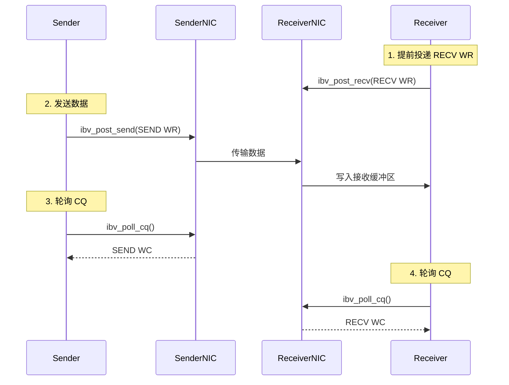
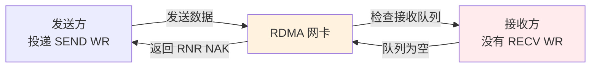

# 2.6 SEND/RECV 操作

前几章我们讨论了 RDMA 的资源模型：Context、PD、MR、QP、CQ。现在我们开始深入具体操作。

RDMA 提供两类操作：**one-sided**（RDMA READ/WRITE/Atomic）和 **two-sided**（SEND/RECV）。SEND/RECV 是最接近传统 TCP socket 语义的 RDMA 操作，理解它是掌握 RDMA 双边通信的基础。

!!! note "推荐阅读资源"
    RDMA 的官方编程手册和 www.rdmamojo.com 网站提供了更完整的 API 参考。本章建立概念框架，具体 API 的细节可以在需要时查阅这些资源。

## 2.6.1 先从问题开始：为什么需要 SEND/RECV

在深入代码之前，让我们先理解一个根本问题：**RDMA 已经有了单边操作，为什么还需要双边操作？**

答案是：**有些场景需要双方的明确参与，单边操作不合适**。

### 双边 vs 单边：本质区别

**双边操作（SEND/RECV）**：
- 发送方和接收方都参与
- 接收方必须"准备好"（投递 RECV WR）
- 双方都知道操作发生了

**单边操作（RDMA READ/WRITE）**：
- 只有发起方参与
- 远端 CPU 完全不参与
- 远端可能不知道操作发生了

### SEND/RECV 的本质



图 2-9：SEND/RECV 操作的完整流程。
{: .figure-caption }

### SEND/RECV 与 TCP socket 的类比

如果你熟悉 TCP socket，可以这样理解：

| TCP socket | RDMA SEND/RECV | 差异 |
|-----------|----------------|------|
| `send()` | `ibv_post_send(SEND)` | TCP 会拷贝数据，RDMA 直接 DMA |
| `recv()` | 提前 `ibv_post_recv()` | TCP 可以随时调用，RDMA 必须提前准备 |
| 内核缓冲区 | 用户注册内存 | TCP 管理缓冲区，RDMA 你自己管理 |
| 阻塞返回 | 轮询 CQ | TCP 同步等待，RDMA 异步轮询 |

!!! note "最关键的区别：接收方必须提前准备"
    TCP 可以随时调用 `recv()`，如果没有数据就阻塞或返回 EAGAIN。RDMA 必须在消息到达**之前**投递 RECV WR。如果没有预先投递的 RECV WR，消息会被丢弃。

### SEND/RECV 的典型应用场景

SEND/RECV 适用于需要双方明确参与的场景：

| 场景 | 为什么用 SEND/RECV |
|------|-------------------|
| **控制消息传递** | 需要双方确认，协商参数 |
| **RPC 请求/响应** | 客户端发送请求，服务端返回响应 |
| **RDMA WRITE 完成通知** | RDMA WRITE 是单边的，需要额外通知机制 |
| **元数据交换** | 交换地址、rkey 等信息 |

## 2.6.2 SEND 操作详解

### 投递 SEND WR

SEND WR 的结构与普通 Send WR 相同，主要区别在于 `opcode`：

```c
struct ibv_send_wr wr = {
    .wr_id = 1001,                    // 用户定义的 ID
    .sg_list = &sge,                  // 本地数据描述
    .num_sge = 1,
    .opcode = IBV_WR_SEND,            // SEND 操作
    .send_flags = IBV_SEND_SIGNALED,  // 生成 CQE
    .next = NULL
};

struct ibv_send_wr *bad_wr;
if (ibv_post_send(qp, &wr, &bad_wr)) {
    fprintf(stderr, "Failed to post SEND WR\n");
    return -1;
}
```

### SEND 操作的完成语义

**WC 生成的时间点**：远端网卡已经接收并确认了这个消息。

- **发送方 CQ**：收到一个 SEND WC
  - `opcode` = `IBV_WC_SEND`
  - `status` = `IBV_WC_SUCCESS` 表示成功
  - `byte_len` = 发送的字节数

- **接收方 CQ**：同时收到一个 RECV WC
  - `opcode` = `IBV_WC_RECV`
  - `byte_len` = 接收的字节数
  - 数据已经在接收缓冲区中

!!! note "SEND 完成时数据已在远端"
    当发送方获得 SEND WC 时，远端网卡已经接收并确认了消息。远端的接收缓冲区中已经有了数据，但远端 CPU 此时可能还没有处理这段数据——取决于它何时轮询 CQ。

### 完整示例：发送方

```c
#include <infiniband/verbs.h>
#include <stdio.h>
#include <string.h>
#include <errno.h>

int send_message(struct ibv_qp *qp, struct ibv_cq *cq,
                 struct ibv_mr *mr, const char *message) {
    // 准备数据
    size_t msg_len = strlen(message) + 1;
    memcpy(mr->addr, message, msg_len);

    // 构造 SGE
    struct ibv_sge sge = {
        .addr = (uintptr_t)mr->addr,
        .length = msg_len,
        .lkey = mr->lkey
    };

    // 构造 SEND WR
    struct ibv_send_wr wr = {
        .wr_id = 1001,
        .sg_list = &sge,
        .num_sge = 1,
        .opcode = IBV_WR_SEND,
        .send_flags = IBV_SEND_SIGNALED,
        .next = NULL
    };

    // 投递 WR
    struct ibv_send_wr *bad_wr;
    if (ibv_post_send(qp, &wr, &bad_wr)) {
        fprintf(stderr, "Failed to post SEND: %s\n", strerror(errno));
        return -1;
    }

    printf("SEND WR posted, wr_id=%lu\n", wr.wr_id);

    // 轮询 CQ 等待完成
    struct ibv_wc wc;
    while (1) {
        int n = ibv_poll_cq(cq, 1, &wc);
        if (n < 0) {
            fprintf(stderr, "Poll CQ failed\n");
            return -1;
        }
        if (n == 0) {
            continue;  // 还没完成，继续轮询
        }

        // 有 WC 了
        if (wc.status != IBV_WC_SUCCESS) {
            fprintf(stderr, "SEND failed: %s\n", ibv_wc_status_str(wc.status));
            return -1;
        }

        if (wc.opcode == IBV_WC_SEND) {
            printf("SEND completed, %u bytes sent, wr_id=%lu\n",
                   wc.byte_len, wc.wr_id);
            return 0;
        } else {
            printf("Got unexpected opcode: %d\n", wc.opcode);
        }
    }
}
```

## 2.6.3 RECV 操作详解

### RECV 的核心要求：提前投递

这是 SEND/RECV 与传统 socket 最关键的区别：

**传统 TCP**：可以随时调用 `recv()`，如果没有数据，调用会阻塞或返回 EAGAIN。

**RDMA RECV**：必须在消息到达**之前**投递 RECV WR。如果没有预先投递的 RECV WR，到达的消息会被丢弃。

!!! note "为什么必须提前投递？"
    RDMA 的数据路径完全绕过内核。没有内核来帮你"缓存"到达的消息。网卡直接把数据写入你指定的缓冲区。如果你没有告诉网卡"把数据写到哪里"，消息就无处安放，只能丢弃。

### 投递 RECV WR

```c
struct ibv_recv_wr wr = {
    .wr_id = 2001,              // 用户定义的 ID
    .sg_list = &sge,            // 接收缓冲区描述
    .num_sge = 1,               // SGE 数量
    .next = NULL                // 链表下一个（NULL 表示单个）
};

struct ibv_recv_wr *bad_wr;
if (ibv_post_recv(qp, &wr, &bad_wr)) {
    fprintf(stderr, "Failed to post RECV WR\n");
    return -1;
}
```

### RECV WR 的生命周期

```
投递 RECV WR → 接收队列中等待 → 消息到达 → 数据写入缓冲区 → 生成 RECV WC
```

**重要时间点**：
- 投递成功 ≠ 有消息到达
- 有消息到达 ≠ WC 已生成（需要轮询）
- WC 生成 = 数据已在缓冲区中，可直接访问

!!! note "WC 生成时数据已可用"
    当 RECV WC 生成时，数据**已经在你的缓冲区中**，可以直接访问。你不需要任何额外的同步操作——网卡已经完成了 DMA 写入。

### 完整示例：接收方

```c
#include <infiniband/verbs.h>
#include <stdio.h>
#include <string.h>
#include <errno.h>

// 接收缓冲区（必须预先注册）
char recv_buffer[4096];
struct ibv_mr *recv_mr;

int init_recv_resources(struct ibv_pd *pd) {
    // 注册接收缓冲区
    int access = IBV_ACCESS_LOCAL_WRITE;
    recv_mr = ibv_reg_mr(pd, recv_buffer, sizeof(recv_buffer), access);
    if (!recv_mr) {
        perror("Failed to register recv MR");
        return -1;
    }

    // 投递初始 RECV WR
    struct ibv_sge sge = {
        .addr = (uintptr_t)recv_buffer,
        .length = sizeof(recv_buffer),
        .lkey = recv_mr->lkey
    };

    struct ibv_recv_wr wr = {
        .wr_id = 2001,
        .sg_list = &sge,
        .num_sge = 1,
        .next = NULL
    };

    struct ibv_recv_wr *bad_wr;
    if (ibv_post_recv(qp, &wr, &bad_wr)) {
        fprintf(stderr, "Failed to post RECV WR\n");
        return -1;
    }

    printf("RECV WR posted, waiting for message...\n");
    return 0;
}

int receive_message(struct ibv_qp *qp, struct ibv_cq *cq) {
    struct ibv_wc wc;

    while (1) {
        int n = ibv_poll_cq(cq, 1, &wc);
        if (n < 0) {
            fprintf(stderr, "Poll CQ failed\n");
            return -1;
        }
        if (n == 0) {
            continue;  // 还没完成，继续轮询
        }

        // 有 WC 了
        if (wc.status != IBV_WC_SUCCESS) {
            fprintf(stderr, "RECV failed: %s\n", ibv_wc_status_str(wc.status));
            return -1;
        }

        if (wc.opcode == IBV_WC_RECV) {
            printf("RECV completed, %u bytes received\n", wc.byte_len);
            printf("Message: \"%s\"\n", recv_buffer);
            printf("wr_id: %lu\n", wc.wr_id);

            // 重新投递 RECV WR，为下一次接收做准备
            repost_recv_wr(qp);
            return 0;
        } else {
            printf("Got unexpected opcode: %d\n", wc.opcode);
        }
    }
}

void repost_recv_wr(struct ibv_qp *qp) {
    struct ibv_sge sge = {
        .addr = (uintptr_t)recv_buffer,
        .length = sizeof(recv_buffer),
        .lkey = recv_mr->lkey
    };

    struct ibv_recv_wr wr = {
        .wr_id = 2002,  // 使用新的 wr_id
        .sg_list = &sge,
        .num_sge = 1,
        .next = NULL
    };

    struct ibv_recv_wr *bad_wr;
    if (ibv_post_recv(qp, &wr, &bad_wr)) {
        fprintf(stderr, "Failed to repost RECV WR\n");
    }
}
```

## 2.6.4 RNR（Receiver Not Ready）错误

### 什么是 RNR

RNR 是 SEND/RECV 操作中最常见的错误之一。当发送方发送消息时，如果接收方没有预先投递足够的 RECV WR，就会产生 RNR 错误。



图 2-10：RNR 错误的产生过程。
{: .figure-caption }

### RNR 的后果

1. **发送方会收到错误 WC**：
   - `status` = `IBV_WC_RNR_RETRY_EXC_ERR`（RNR 重试超限）
   - 或 `IBV_WC_RESP_TIMEOUT_ERR`（响应超时）

2. **连接可能出现问题**：
   - RC QP 会进入错误状态
   - 需要重新建立连接

!!! note "RNR 是 SEND/REVC 特有的错误"
    RDMA WRITE 不会产生 RNR 错误，因为它是单边操作，不需要远端准备接收缓冲区。只有 SEND/RECV 这种双边操作才会有 RNR。

### 如何避免 RNR

**策略1：保持足够的 RECV WR**

```c
#define RECV_WR_HIGH_WATERMARK 8

void maintain_recv_queue(struct ibv_qp *qp, int *posted_count) {
    while (*posted_count < RECV_WR_HIGH_WATERMARK) {
        struct ibv_recv_wr wr = {
            .wr_id = 2000 + *posted_count,
            .sg_list = &sge,
            .num_sge = 1,
            .next = NULL
        };

        struct ibv_recv_wr *bad_wr;
        if (ibv_post_recv(qp, &wr, &bad_wr) == 0) {
            (*posted_count)++;
        } else {
            break;
        }
    }
}

// 每次收到 RECV WC 后
int recv_completion_handler(struct ibv_wc *wc) {
    static int posted_count = 16;

    // 处理接收到的数据
    process_message(wc->byte_len);

    // 减少计数
    posted_count--;

    // 重新投递到高水线
    maintain_recv_queue(qp, &posted_count);

    return 0;
}
```

**策略2：设置合适的 RNR 重试参数**

```c
// 在修改 QP 到 RTR 状态时设置
struct ibv_qp_attr attr = {
    .qp_state = IBV_QPS_RTR,
    .min_rnr_timer = 12,  // RNR NAK 定时器（约 0.34ms）
    // ...
};

int attr_mask = IBV_QP_STATE | IBV_QP_MIN_RNR_TIMER;
ibv_modify_qp(qp, &attr, attr_mask);

// 在修改 QP 到 RTS 状态时设置
attr.qp_state = IBV_QPS_RTS;
attr.rnr_retry = 7;  // RNR 重试次数（7 次）

attr_mask = IBV_QP_STATE | IBV_QP_RNR_RETRY;
ibv_modify_qp(qp, &attr, attr_mask);
```

!!! note "RNR 重试参数的选择"
    - `min_rnr_timer`：控制多快重试。太小会增加网络负载，太大会降低响应速度。
    - `rnr_retry`：控制重试多少次后放弃。太大会导致长时间阻塞，太小会容错性差。

## 2.6.5 SEND with Immediate

### 什么是 Immediate 数据

**SEND with Immediate** 允许发送方在消息携带一个 32 位 `imm_data`，这个数据会直接写入接收方的 WC 中，而不需要额外的存储空间。

### Immediate 数据的特点

| 特性 | 说明 |
|------|------|
| **大小** | 固定 32 位 |
| **传递方式** | 不占用接收缓冲区，直接写入 WC |
| **原子性** | 与消息一起原子传递 |
| **用途** | 小元数据传递、通知机制 |

!!! note "Immediate 数据的实际用途"
    最典型的用途是通知机制。比如 RDMA WRITE 是单边的，远端不知道数据写入了。你可以用 RDMA WRITE with IMM：数据写入远端，同时发送一个 32 位通知，远端收到 RECV WC 时就知道数据已经写好了。

### 投递 SEND with Immediate

```c
struct ibv_send_wr wr = {
    .wr_id = 1001,
    .sg_list = &sge,
    .num_sge = 1,
    .opcode = IBV_WR_SEND_WITH_IMM,  // 注意：使用 SEND_WITH_IMM
    .send_flags = IBV_SEND_SIGNALED,
    .imm_data = htonl(0x12345678),    // 32 位立即数据（注意字节序）
    .next = NULL
};
```

!!! note "字节序转换"
    `imm_data` 在网络传输时使用网络字节序（大端）。使用 `htonl()` 转换，接收方用 `ntohl()` 转换回来。

### 接收 Immediate 数据

接收方不需要做特殊处理，`imm_data` 会直接出现在 WC 中：

```c
struct ibv_wc wc;
ibv_poll_cq(cq, 1, &wc);

if (wc.opcode == IBV_WC_RECV) {
    printf("Received %u bytes\n", wc.byte_len);

    // 检查是否有 immediate 数据
    if (wc.wc_flags & IBV_WC_WITH_IMM) {
        uint32_t imm_data = ntohl(wc.imm_data);  // 注意字节序转换
        printf("Immediate data: 0x%x\n", imm_data);
    }
}
```

### Immediate 数据的应用场景

**场景：RDMA WRITE 完成通知**

```c
// 发起 RDMA WRITE 的同时发送通知
struct ibv_send_wr wr = {
    .opcode = IBV_WR_RDMA_WRITE_WITH_IMM,
    .wr.rdma.remote_addr = remote_addr,
    .wr.rdma.rkey = remote_rkey,
    .imm_data = htonl(WRITE_COMPLETED),  // 通知类型
    // ...
};
```

## 2.6.6 SEND/RECV 的 Scatter-Gather

### Scatter-Gather 的概念

Scatter-Gather 允许一次 SEND/RECV 操作涉及多个不连续的内存区域。

**Scatter（接收）**：将收到的数据分散存储到多个缓冲区
**Gather（发送）**：从多个缓冲区收集数据一次性发送

### 发送 Gather 示例

```c
// 假设有三个不连续的数据块
struct {
    char header[64];
    char body[1024];
    char trailer[32];
} message_parts;

// 构造三个 SGE
struct ibv_sge sg_list[3] = {
    {
        .addr = (uintptr_t)message_parts.header,
        .length = sizeof(message_parts.header),
        .lkey = mr->lkey
    },
    {
        .addr = (uintptr_t)message_parts.body,
        .length = sizeof(message_parts.body),
        .lkey = mr->lkey
    },
    {
        .addr = (uintptr_t)message_parts.trailer,
        .length = sizeof(message_parts.trailer),
        .lkey = mr->lkey
    }
};

// 投递 Gather SEND
struct ibv_send_wr wr = {
    .opcode = IBV_WR_SEND,
    .sg_list = sg_list,
    .num_sge = 3,  // 三个 SGE
    .send_flags = IBV_SEND_SIGNALED,
    .wr_id = 1001
};

ibv_post_send(qp, &wr, &bad_wr);

// 接收方会收到连续的 1120 字节（64 + 1024 + 32）
```

!!! note "Scatter-Gather 的限制"
    - `max_send_sge` 和 `max_recv_sge` 限制了单个 WR 可以使用的 SGE 数量
    - 如果消息大小超过所有 SGE 总长度，多余部分会被丢弃
    - 每个额外的 SGE 都会消耗硬件资源

## 2.6.7 关键要点回顾

| 概念 | 要点 |
|------|------|
| **双边操作** | 双方都参与，不同于 one-sided 操作 |
| **必须提前投递 RECV WR** | 否则消息会被丢弃，导致 RNR 错误 |
| **RNR 错误** | 接收方没有足够的 RECV WR，发送方会收到错误 |
| **保持 RECV WR 水位线** | 避免耗尽，通常维持 8-16 个未完成的 RECV WR |
| **Immediate 数据** | 32 位元数据，不占用缓冲区，原子传递 |
| **Scatter-Gather** | 支持多缓冲区操作，减少拷贝 |
| **完成语义** | SEND WC 表示远端已确认，RECV WC 表示数据已可访问 |

!!! note "下一步"
    SEND/RECV 是 RDMA 双边通信的基础，适合控制消息传递和需要双方确认的场景。接下来的章节会介绍单边操作：
    - **2.7 RDMA WRITE**：单边写入，远端 CPU 不参与
    - **2.8 RDMA READ**：单边读取，主动拉取数据
    - **2.9 Atomic**：原子操作，分布式同步
