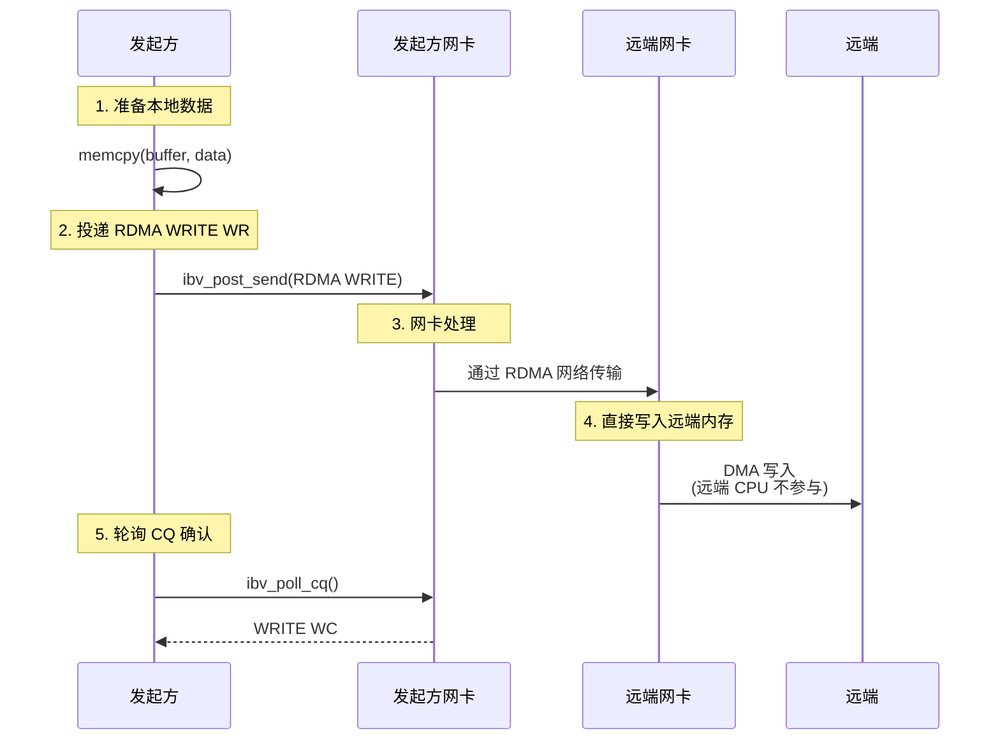

# 2.7 RDMA WRITE 操作

上一节我们讨论了 SEND/RECV——RDMA 的双边操作。发送方发送数据，接收方必须提前准备好缓冲区。

本章讨论 RDMA WRITE。它是一种单边操作：发起方把本地数据写入远端已经授权的内存区域，远端 CPU 不参与这次数据搬运，也不会自动得到完成事件。

## 2.7.1 RDMA WRITE 的使用场景

RDMA WRITE 适合由发起方主动推送数据的场景。与 SEND/RECV 相比，它不要求远端为每次数据到达提前投递 RECV WR，也不会在远端自动生成完成事件。本章只讨论这一操作在 Verbs 程序中的使用方式和语义边界。

### 单边与双边

双边操作（SEND/RECV）要求发送方投递 SEND WR，接收方提前投递 RECV WR，因此双方都会通过 completion 感知操作。RDMA WRITE 则是单边操作，只有发起方投递 WR，远端不需要为基本 WRITE 投递接收请求，远端 CPU 也不会自动知道这次写入已经发生。

!!! note "单边操作"
    单边指只有发起方投递 WR。远端必须提前注册并授权内存，但不需要为每次 WRITE 投递 RECV WR，也不会因为基本 RDMA WRITE 自动收到 WC。

    这里说的是基本 RDMA WRITE。`RDMA_WRITE_WITH_IMM` 虽然数据仍写入远端指定地址，但 immediate 通知会消耗远端预投递的 Receive WR，并在远端 CQ 中生成完成记录。

### RDMA WRITE 的执行过程



图 2-11：RDMA WRITE 操作的完整流程。
{: .figure-caption }

### RDMA WRITE vs SEND/RECV

| 特性 | RDMA WRITE | SEND/RECV |
|------|-----------|-----------|
| **操作类型** | 单边操作 | 双边操作 |
| **远端参与** | CPU 不参与 | 必须提前投递 RECV WR |
| **远端通知** | 无自动通知 | 有 RECV WC |
| **典型用途** | 大数据传输、状态同步 | 控制消息、RPC |

!!! note "RDMA WRITE 没有远端通知"
    RDMA WRITE 完成后，发起方可以通过本地 WC 得知 WR 已完成；远端不会收到 WC。如果远端应用需要处理写入内容，需要额外的同步机制。

### RDMA WRITE 的典型应用场景

RDMA WRITE 适用于需要高效数据搬运的场景：

| 场景 | 说明 |
|------|-------------------|
| **分布式存储** | 数据直接写入远端存储缓冲区，无需远端 CPU 参与 |
| **分布式训练** | 梯度更新直接写入远端参数内存 |
| **数据库** | 数据页面直接写入远端节点 |
| **状态同步** | 本地状态直接镜像到远端 |

## 2.7.2 基本 RDMA WRITE

### 投递 RDMA WRITE WR

RDMA WRITE WR 的结构需要指定远端地址和 `rkey`：

```c
// 本地数据准备
memcpy(send_buffer, "Hello, RDMA WRITE!", 19);

// 构造 SGE：描述本地数据
struct ibv_sge sge = {
    .addr = (uintptr_t)send_buffer,
    .length = 19,
    .lkey = send_mr->lkey
};

// 构造 RDMA WRITE WR
struct ibv_send_wr wr = {
    .wr_id = 1001,                        // 用户定义的 ID
    .sg_list = &sge,
    .num_sge = 1,
    .opcode = IBV_WR_RDMA_WRITE,         // RDMA WRITE 操作
    .send_flags = IBV_SEND_SIGNALED,     // 生成 CQE
    .wr.rdma.remote_addr = remote_addr,  // 远端虚拟地址
    .wr.rdma.rkey = remote_rkey          // 远端访问密钥
};

struct ibv_send_wr *bad_wr;
if (ibv_post_send(qp, &wr, &bad_wr)) {
    fprintf(stderr, "Failed to post RDMA WRITE WR\n");
    return -1;
}
```

小消息可以尝试使用 `IBV_SEND_INLINE`。当 WR 以内联方式投递且大小不超过 QP 的实际 `max_inline_data` 时，驱动在 `ibv_post_send` 路径已经读取了本地数据，应用可以在调用返回后复用本地源缓冲区。若没有使用 inline，则仍应等到对应 WR 不再 outstanding 后再复用这段源缓冲区。

!!! note "rkey 是访问凭证"
    远端地址本身不是权限。发起 RDMA WRITE 时必须同时提供远端地址和正确的 `remote_rkey`。实际系统还需要在控制面管理 `addr`/`rkey` 的交换、撤销和授权范围。

### RDMA WRITE 的完成语义

**WC 生成的时间点**：发起方的 RDMA WRITE WR 已完成，可靠连接上已得到远端确认。

发起方 CQ 会收到一个 WRITE WC，`opcode` 为 `IBV_WC_RDMA_WRITE`，`status` 为 `IBV_WC_SUCCESS` 才表示写入成功完成。基本 RDMA WRITE 不会在远端生成 WC；远端应用如果要处理写入内容，需要依赖额外同步。

!!! warning "写完成不等于应用级完成"
    发起方获得 WRITE WC 后，本地源 buffer 可以复用；但这不表示远端应用已经处理了写入内容。远端应用级可见性通常依赖额外通知，例如 SEND/RECV、TCP 控制消息或 RDMA WRITE with Immediate。

### 示例：发起方

```c
#include <infiniband/verbs.h>
#include <stdio.h>
#include <string.h>
#include <errno.h>

int rdma_write_data(struct ibv_qp *qp, struct ibv_cq *cq,
                   struct ibv_mr *send_mr,
                   uint64_t remote_addr, uint32_t remote_rkey,
                   const char *data, size_t len) {
    // 准备本地数据
    memcpy(send_mr->addr, data, len);

    // 构造 SGE
    struct ibv_sge sge = {
        .addr = (uintptr_t)send_mr->addr,
        .length = len,
        .lkey = send_mr->lkey
    };

    // 构造 RDMA WRITE WR
    struct ibv_send_wr wr = {
        .wr_id = 1001,
        .sg_list = &sge,
        .num_sge = 1,
        .opcode = IBV_WR_RDMA_WRITE,
        .send_flags = IBV_SEND_SIGNALED,
        .wr.rdma.remote_addr = remote_addr,
        .wr.rdma.rkey = remote_rkey,
        .next = NULL
    };

    // 投递 WR
    struct ibv_send_wr *bad_wr;
    if (ibv_post_send(qp, &wr, &bad_wr)) {
        fprintf(stderr, "Failed to post RDMA WRITE: %s\n", strerror(errno));
        return -1;
    }

    printf("RDMA WRITE WR posted\n");
    printf("  Remote addr: 0x%lx\n", remote_addr);
    printf("  Remote rkey: 0x%x\n", remote_rkey);
    printf("  Local data: \"%s\" (%zu bytes)\n", data, len);

    // 轮询 CQ 等待完成
    struct ibv_wc wc;
    while (1) {
        int n = ibv_poll_cq(cq, 1, &wc);
        if (n < 0) {
            fprintf(stderr, "Poll CQ failed\n");
            return -1;
        }
        if (n == 0) {
            continue;  // 还没完成，继续轮询
        }

        // 有 WC 了
        if (wc.status != IBV_WC_SUCCESS) {
            fprintf(stderr, "RDMA WRITE failed: %s\n",
                    ibv_wc_status_str(wc.status));
            return -1;
        }

        if (wc.opcode == IBV_WC_RDMA_WRITE) {
            printf("RDMA WRITE completed\n");
            printf("  wr_id: %lu\n", wc.wr_id);
            return 0;
        } else {
            printf("Got unexpected opcode: %d\n", wc.opcode);
        }
    }
}
```

### 示例：远端（接收方）

远端需要准备可被写入的内存，并通过控制面交换地址和 `rkey`：

```c
#include <infiniband/verbs.h>
#include <stdio.h>
#include <string.h>
#include <errno.h>

#define BUFFER_SIZE 4096

struct rdma_write_target {
    struct ibv_mr *mr;
    char *buffer;
    uint64_t addr;
    uint32_t rkey;
};

int init_rdma_write_target(struct ibv_pd *pd,
                          struct rdma_write_target *target) {
    // 分配内存（页对齐）
    posix_memalign((void **)&target->buffer, 4096, BUFFER_SIZE);

    // 初始化缓冲区
    memset(target->buffer, 0, BUFFER_SIZE);

    // 注册内存，允许远端写入
    int access = IBV_ACCESS_LOCAL_WRITE |      // 本端可以写
                 IBV_ACCESS_REMOTE_WRITE |     // 远端可以写
                 IBV_ACCESS_REMOTE_READ;       // 远端可以读（可选）

    target->mr = ibv_reg_mr(pd, target->buffer, BUFFER_SIZE, access);
    if (!target->mr) {
        perror("Failed to register MR");
        free(target->buffer);
        return -1;
    }

    // 准备远端访问信息
    target->addr = (uint64_t)target->mr->addr;
    target->rkey = target->mr->rkey;

    printf("RDMA WRITE target initialized:\n");
    printf("  Address: 0x%lx\n", target->addr);
    printf("  rkey: 0x%x\n", target->rkey);
    printf("  Buffer: %p\n", target->buffer);

    return 0;
}
```

!!! note "远端写权限必须配合本地写权限"
    `ibv_reg_mr` 要求：如果设置 `IBV_ACCESS_REMOTE_WRITE` 或 `IBV_ACCESS_REMOTE_ATOMIC`，必须同时设置 `IBV_ACCESS_LOCAL_WRITE`。

## 2.7.3 RDMA WRITE with Immediate

### 什么是 Immediate 数据

**RDMA WRITE with Immediate** 允许发起方在写入数据的同时携带一个 32 位 `imm_data` 到远端。远端会收到一个 RECV WC，其中包含这个 `imm_data`。

### Immediate 数据的作用

RDMA WRITE 本身不会通知远端应用。`imm_data` 提供了一种轻量级的通知机制：发起方在写入数据的同时发送 32 位通知，远端通过 RECV WC 获得这次通知，并据此判断对应数据已经写入完成。

!!! note "WRITE with Immediate 的定位"
    基本 RDMA WRITE 不会在远端生成 WC。若需要通知远端，常见选择是额外的控制消息（TCP 或 SEND/RECV）或 RDMA WRITE with Immediate。后者会消耗远端预投递的 RECV WR，并在远端 CQ 中生成 `IBV_WC_RECV_RDMA_WITH_IMM`。

    因为它会消耗 Receive WR，所以远端必须像处理 SEND 一样维护接收队列水位。若没有可用 RECV WR，连接会进入 RNR 相关重试路径。

### 与基本 RDMA WRITE 的对比

| 特性 | 基本 RDMA WRITE | RDMA WRITE with IMM |
|------|---------------|-------------------|
| **远端 WC** | 无 | 有 RECV WC |
| **Immediate 数据** | 无 | 32 位 |
| **远端应用通知** | 无 | 有 RECV WC |
| **典型用途** | 批量数据传输 | 带通知的数据传输 |

### RDMA WRITE with IMM 的完成语义

!!! success "远端收到 WC 时的语义"
    RDMA WRITE with IMM 与基本 RDMA WRITE 的关键区别在于远端会获得一个 RECV WC：

    **当远端收到 RECV WC（包含 `imm_data`）时**：
    与该 WRITE with IMM 对应的数据写入已经完成，`imm_data` 可作为通知类型、队列编号或长度等小型元数据。远端应用可以把这个 WC 作为开始处理数据的同步点。

    **发起方收到 WRITE WC 时**：
    本地 WR 已完成，本地源 buffer 可以复用，但这不表示远端应用已经处理了数据。

    !!! tip "使用条件"
        WRITE with IMM 仍然需要远端提前投递 RECV WR。若远端没有可用 RECV WR，会进入 RNR 相关错误路径。

### 投递 RDMA WRITE with Immediate

```c
// 构造 RDMA WRITE with Immediate WR
struct ibv_send_wr wr = {
    .wr_id = 1001,
    .sg_list = &sge,
    .num_sge = 1,
    .opcode = IBV_WR_RDMA_WRITE_WITH_IMM,  // 注意：使用 WITH_IMM
    .send_flags = IBV_SEND_SIGNALED,
    .imm_data = htonl(0xDEADBEEF),         // 32 位立即数据（注意字节序）
    .wr.rdma.remote_addr = remote_addr,
    .wr.rdma.rkey = remote_rkey,
    .next = NULL
};

struct ibv_send_wr *bad_wr;
if (ibv_post_send(qp, &wr, &bad_wr)) {
    fprintf(stderr, "Failed to post RDMA WRITE with IMM\n");
    return -1;
}
```

### 接收 Immediate 数据

远端需要提前投递 RECV WR 来接收 `imm_data`：

```c
struct ibv_recv_wr wr = {
    .wr_id = 2001,
    .sg_list = NULL,
    .num_sge = 0,
    .next = NULL
};

ibv_post_recv(qp, &wr, &bad_wr);

// 轮询 CQ
struct ibv_wc wc;
ibv_poll_cq(cq, 1, &wc);

if (wc.opcode == IBV_WC_RECV_RDMA_WITH_IMM) {
    uint32_t imm_data = ntohl(wc.imm_data);  // 注意字节序转换
    printf("Received RDMA WRITE with IMM\n");
    printf("  imm_data: 0x%x\n", imm_data);

    // 根据 imm_data 做相应的处理
    process_notification(imm_data);
}
```

!!! note "RECV WR 的特殊性"
    对 RDMA WRITE with IMM，远端 RECV WR 只用于生成带 immediate 数据的完成事件，不接收写入数据本身。常见写法是 `num_sge = 0`。

## 2.7.4 缓存一致性与内存序（简述）

### 核心概念

RDMA WRITE 的完成语义需要分两个角度理解：

**发起方收到 WC 时**：
发起方本地 WR 已完成，本地 buffer 可以复用；基本 RDMA WRITE 不会让远端自动得到应用层通知。

**远端 CPU 何时可见数据？**
对普通主机内存，平台通常会维护 DMA 与 CPU 之间的一致性；对设备内存、特殊映射或放宽排序的 MR，则需要参考平台和设备文档。无论哪种情况，应用仍需要一个同步点，避免远端在写入完成前读取数据。

!!! info "这是高级话题"
    缓存一致性的细节涉及 DDIO、cacheline 粒度、内存屏障、设备内存和 relaxed ordering 等内容。本章只强调应用级同步：远端需要知道何时可以读取被写入的数据。

### 推荐的同步模式

**方案 1：使用 RDMA WRITE with IMM**

```c
// 发起方
memcpy(data_buffer, large_data, size);
rdma_write(qp, data_mr, remote_data_addr, remote_data_rkey, data_buffer, size);
rdma_write(qp, flag_mr, remote_flag_addr, remote_flag_rkey, &done_flag, sizeof(done_flag));
rdma_write_with_imm(qp, IMM_DATA_DONE);  // 最后带通知

// 远端（收到 IMM 后）
if (wc.opcode == IBV_WC_RECV_RDMA_WITH_IMM) {
    // 与该 immediate 对应的写入已经完成，可按协议处理数据
    process_data();
}
```

!!! tip "WRITE with IMM 的优势"
    WRITE with IMM 把数据写入和远端通知放在同一个 RDMA 操作中，适合作为生产者-消费者协议中的同步点。

**方案2：控制通道同步（需要正确的时序）**

```c
// 发起方 - 正确的做法
rdma_write(qp, data_mr, remote_data_addr, remote_data_rkey, data_buffer, size);
// 必须先等待 RDMA WRITE 完成！
wait_for_write_completion(qp, cq);
// 然后才能发送通知
send_notification(tcp_sock, "DONE");

// 远端
recv_notification(tcp_sock);
__sync_synchronize();  // 内存屏障
process_data();
```

!!! danger "注意时序问题"
    如果不等待 RDMA WRITE 完成就直接发送通知，通知可能在数据到达前就到达远端！这是因为 `ibv_post_send` 是异步的，RDMA WRITE 和 SEND/TCP 是并行处理的。

    使用 RDMA WRITE with IMM 可以把通知与写入完成绑定在一起，减少控制面时序错误。

## 2.7.5 错误处理

### 常见错误类型

**错误1：本地访问错误**

```c
// WC status = IBV_WC_LOC_ACCESS_ERR
// 原因：本地地址、长度或 lkey 不正确，或 WR 引用了已经失效的 MR
// 解决：检查 SGE 是否落在本地 MR 范围内，并确认 lkey 属于仍然有效的 MR

int access = 0;  // 仅作为 RDMA WRITE 源缓冲区时，本地读权限是隐式的
struct ibv_mr *mr = ibv_reg_mr(pd, buffer, size, access);
```

**错误2：远端访问错误**

```c
// WC status = IBV_WC_REM_ACCESS_ERR
// 原因：远端内存权限不足或 rkey 错误
// 解决：确保远端 MR 有 REMOTE_WRITE 权限

int remote_access = IBV_ACCESS_LOCAL_WRITE |  // 必须同时设置
                   IBV_ACCESS_REMOTE_WRITE;
struct ibv_mr *remote_mr = ibv_reg_mr(pd, buffer, size, remote_access);
```

**错误3：长度错误**

```c
// WC status = IBV_WC_LOC_LEN_ERR 或 IBV_WC_REM_INV_REQ_ERR
// 原因：长度超出 MR 范围
// 解决：确保操作在 MR 范围内

size_t offset = 1000;
size_t length = 5000;
// 如果 MR 长度只有 4096，这个操作会失败
```

### 错误处理示例

```c
struct ibv_wc wc;
int n = ibv_poll_cq(cq, 1, &wc);

if (n > 0 && wc.status != IBV_WC_SUCCESS) {
    fprintf(stderr, "RDMA WRITE failed:\n");
    fprintf(stderr, "  status: %s\n", ibv_wc_status_str(wc.status));
    fprintf(stderr, "  vendor_err: %u\n", wc.vendor_err);

    switch (wc.status) {
        case IBV_WC_LOC_ACCESS_ERR:
            fprintf(stderr, "  Check: Local SGE address, length, and lkey\n");
            break;

        case IBV_WC_REM_ACCESS_ERR:
            fprintf(stderr, "  Check: Remote MR access flags and rkey\n");
            break;

        case IBV_WC_LOC_LEN_ERR:
        case IBV_WC_REM_INV_REQ_ERR:
            fprintf(stderr, "  Check: Operation length within MR bounds\n");
            break;

        default:
            fprintf(stderr, "  Check: Connection and resource state\n");
            break;
    }
}
```

## 2.7.6 关键要点回顾

| 概念 | 要点 |
|------|------|
| **单边操作** | 远端 CPU 不参与，直接写入远端内存 |
| **必须知道远端 addr 和 rkey** | 通过控制面交换这些信息 |
| **完成语义** | 发起方收到 WC，远端无通知 |
| **WRITE with IMM** | 携带 32 位 `imm_data`，远端需预投递 RECV WR 并收到 RECV WC |
| **同步语义** | 写完成 ≠ 远端应用已处理，通常需要同步 |
| **错误处理** | 检查 WC status，常见错误是访问权限和长度 |
| **应用场景** | 大数据传输、状态同步、分布式系统 |

!!! note "后续章节"
    RDMA WRITE 是最常用的单边操作，适合高效的数据推送。下一章将讨论 RDMA READ，即由发起方主动从远端拉取数据。
