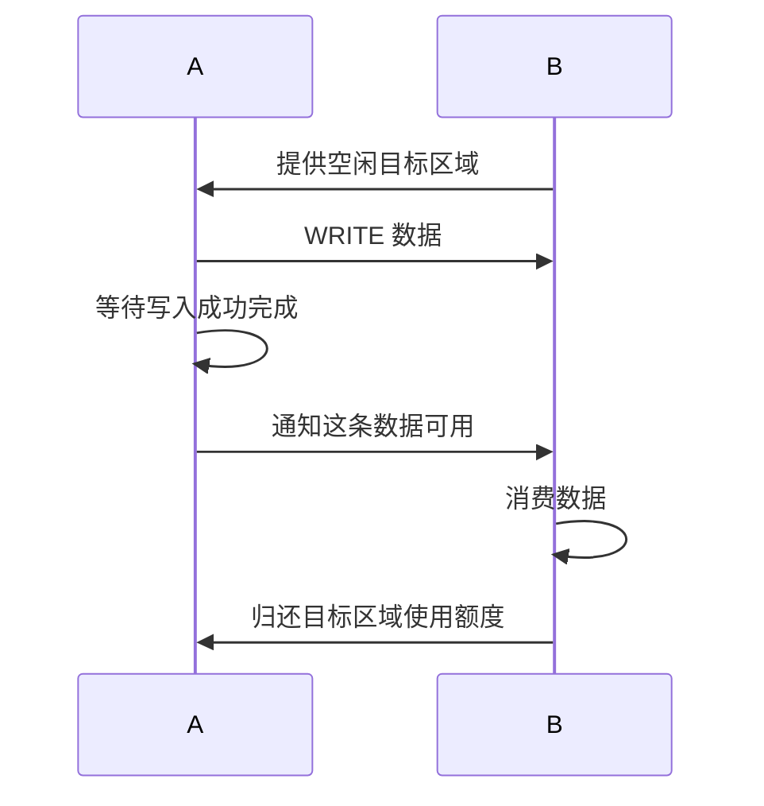

# 2.7 RDMA WRITE

SEND 把数据放进接收方预先投递的缓冲区。WRITE 则由发起方在请求中指定远端地址，接收方不必为每一块数据投递 RECV。第一篇的字符串程序就是一次这样的写入。

本章把地址、完成和通知放在一起，进一步考虑：如果要反复使用同一个远端缓冲区，两端应怎样协作？

## 准备两端的内存

A 是数据源，B 是目标。普通非 inline WRITE 使用 A 的本地 MR 读取源，使用 B 的 `rkey` 授权目标写入。B 的 MR 需要本地写与远端写权限，QP 也要允许远端写入。

控制通道至少要让 A 知道 B 的目标地址、可写长度和 `rkey`。A 应检查本次长度落在双方约定范围内。MR 的权限检查是设备保护，应用仍应在提交前验证自己的长度与偏移。

## 描述并投递写入

下面片段假设 RC QP 已就绪、两端 MR 有效，并且 `length` 已完成范围检查：

```c
struct ibv_sge sge = {
    .addr = (uintptr_t)local_buffer,
    .length = length,
    .lkey = local_mr->lkey,
};
struct ibv_send_wr wr = {
    .wr_id = 1001,
    .sg_list = &sge,
    .num_sge = 1,
    .opcode = IBV_WR_RDMA_WRITE,
    .send_flags = IBV_SEND_SIGNALED,
    .wr.rdma.remote_addr = remote_addr,
    .wr.rdma.rkey = remote_rkey,
};
struct ibv_send_wr *bad = NULL;
int rc = ibv_post_send(qp, &wr, &bad);
if (rc != 0) return -1;
```

SGE 描述本地源，`wr.rdma` 描述远端目标。投递成功以后，按 [CQ 章节](05-cq.md#polling)等待 `wr_id = 1001` 的成功完成。完成之前保持源内容不变；WRITE 失败时也不能把目标当成一块完整有效的数据，部分数据可能已经移动。

## 完成与远端通知 {#notification}

普通 WRITE 只在发起方报告相应完成，远端不产生一条普通 RECV 完成。因此 B 还需要一种方法知道数据可以消费。最小程序让 A 等待完成后，经 TCP 发 `D`，B 收到后打印。

另一种方式是 WRITE with Immediate。数据仍写到请求指定的地址，同时在远端产生带立即数的接收完成。它需要消耗远端预投递的接收请求；这条接收请求用于通知，不决定 WRITE payload 的目标地址。

| 方式 | 目标地址由谁指定 | 远端如何得知结果 |
|---|---|---|
| 普通 WRITE | 发起方 | 应用另行约定通知 |
| WRITE with Immediate | 发起方 | 带立即数的接收完成，需要 RQ 资源 |
| SEND | 接收方的 RECV | 接收完成，数据进入 RECV 缓冲区 |

表 2-8：完成与远端通知。
{: .table-caption }

还有程序通过另一次写入更新标志位。这种协议需要同时处理设备写入顺序、CPU 或 GPU 的可见性，以及应用线程同步。不能在普通 C 指针上加一个 `volatile` 就假定获得了完整的跨设备协议。

## 连续写入需要消费确认

第一次 WRITE 成功后，A 可以复用本地源。但如果 A 立即再次写 B 的同一地址，B 可能还在处理上一条消息。于是，源可复用和目标可复用是两个不同时间点。

最简单的双端协议是：



图 2-2：连续写入需要消费确认。
{: .figure-caption }

它一次只处理一块数据，容易理解。增加多个槽位以后，A 可以在 B 消费前一块时填写下一块，形成流水线。但每个槽位仍需要编号、有效长度和归还规则。第四篇从这个模型继续讨论并发。

本章先按普通主机内存讲解。B 将数据交给 GPU kernel 时，还要建立设备消费依赖，见 [GPU 执行顺序](../05-gpu-data/03-synchronization.md#gpu-sync)。

## 从实验中辨认两种完成

`03_rc_loopback` 的 `[2] RDMA WRITE` 让 A 写 B，并从 A 的发送完成判断操作结束。由于两个端点位于一个进程，程序能直接打印 B 的缓冲区。这是实验安排，不能据此省掉分布式程序中的远端通知。

可以对照第一篇两进程程序，找出环回实验没有通过网络发送的业务通知。再考虑将一个远端缓冲区扩成两个槽位：除了地址，还需给通知增加什么信息，才能知道该消费哪一条数据？

需要由数据使用者决定取数时机时，可以改用[下一章的 READ](08-rdma-read.md)。

## 参考资料

[ibv_post_send 手册](https://github.com/linux-rdma/rdma-core/blob/master/libibverbs/man/ibv_post_send.3)说明 WRITE 操作及立即数字段；[ibv_poll_cq 手册](https://github.com/linux-rdma/rdma-core/blob/master/libibverbs/man/ibv_poll_cq.3)定义接收完成标志。
