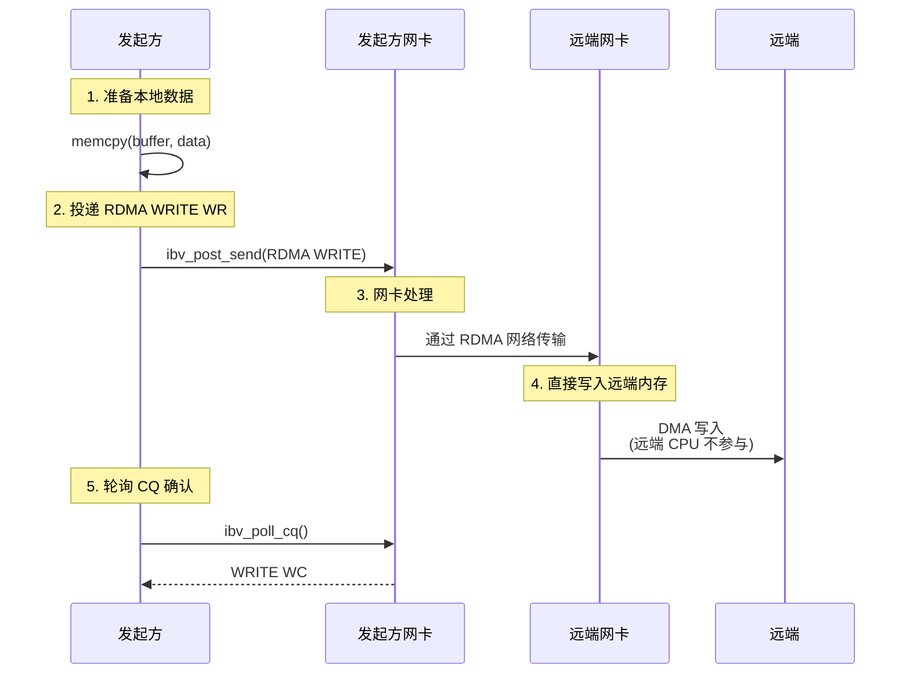

# 2.7 RDMA WRITE 操作

上一节我们讨论了 SEND/RECV——RDMA 的双边操作。发送方发送数据，接收方必须提前准备好缓冲区。

本章讨论 RDMA WRITE——单边操作。发起方单方面把数据写入远端内存，远端 CPU 完全不参与。这是 RDMA 最能体现"远程直接内存访问"特性的操作。

!!! note "推荐阅读资源"
    RDMA 的官方编程手册和 www.rdmamojo.com 网站提供了更完整的 API 参考。本章建立概念框架，具体 API 的细节可以在需要时查阅这些资源。

## 2.7.1 先从问题开始：为什么需要 RDMA WRITE

在深入代码之前，让我们先理解：**RDMA WRITE 和 SEND/RECV 的本质区别是什么？**

答案是：**参与方不同**。

### 单边 vs 双边：本质区别

**双边操作（SEND/RECV）**：

- 发送方投递 SEND WR
- 接收方必须提前投递 RECV WR
- 双方都知道操作发生了

**单边操作（RDMA WRITE）**：

- 只有发起方投递 WR
- 远端不需要做任何操作
- 远端 CPU 可能还不知道操作发生了

!!! note "为什么叫"单边"？"
    因为只有发起方"主动"参与。远端是"被动"的——它的 CPU 可以完全不知道数据被写入了。数据从发起方内存，通过网络，直接进入远端内存，全程没有远端 CPU 的参与。

### RDMA WRITE 的本质



图 2-11：RDMA WRITE 操作的完整流程。
{: .figure-caption }

### RDMA WRITE vs SEND/RECV

| 特性 | RDMA WRITE | SEND/RECV |
|------|-----------|-----------|
| **操作类型** | 单边操作 | 双边操作 |
| **远端参与** | CPU 不参与 | 必须提前投递 RECV WR |
| **远端通知** | 无自动通知 | 有 RECV WC |
| **典型用途** | 大数据传输、状态同步 | 控制消息、RPC |

!!! note "RDMA WRITE 没有远端通知"
    这是 RDMA 新手最容易误解的地方。RDMA WRITE 完成后，发起方知道数据已经写入远端，但远端 CPU 此时可能还不知道——因为远端没有收到任何 WC。如果远端 CPU 需要知道数据已经写好，需要额外的同步机制。

### RDMA WRITE 的典型应用场景

RDMA WRITE 适用于需要高效数据搬运的场景：

| 场景 | 为什么用 RDMA WRITE |
|------|-------------------|
| **分布式存储** | 数据直接写入远端存储缓冲区，无需远端 CPU 参与 |
| **分布式训练** | 梯度更新直接写入远端参数内存 |
| **数据库** | 数据页面直接写入远端节点 |
| **状态同步** | 本地状态直接镜像到远端 |

## 2.7.2 基本 RDMA WRITE

### 投递 RDMA WRITE WR

RDMA WRITE WR 的结构需要指定远端地址和 `rkey`：

```c
// 本地数据准备
memcpy(send_buffer, "Hello, RDMA WRITE!", 19);

// 构造 SGE：描述本地数据
struct ibv_sge sge = {
    .addr = (uintptr_t)send_buffer,
    .length = 19,
    .lkey = send_mr->lkey
};

// 构造 RDMA WRITE WR
struct ibv_send_wr wr = {
    .wr_id = 1001,                        // 用户定义的 ID
    .sg_list = &sge,
    .num_sge = 1,
    .opcode = IBV_WR_RDMA_WRITE,         // RDMA WRITE 操作
    .send_flags = IBV_SEND_SIGNALED,     // 生成 CQE
    .wr.rdma.remote_addr = remote_addr,  // 远端虚拟地址
    .wr.rdma.rkey = remote_rkey          // 远端访问密钥
};

struct ibv_send_wr *bad_wr;
if (ibv_post_send(qp, &wr, &bad_wr)) {
    fprintf(stderr, "Failed to post RDMA WRITE WR\n");
    return -1;
}
```

!!! note "rkey 是访问凭证"
    远端地址本身不是权限。有了 `remote_addr` 没用，你必须有正确的 `remote_rkey` 才能访问对方的内存。这就是 RDMA 安全模型的基石。

### RDMA WRITE 的完成语义

**WC 生成的时间点**：发起方的网卡已经收到远端的 ACK，数据已经到达远端网卡并被确认。

- **发起方 CQ**：收到一个 WRITE WC
  - `opcode` = `IBV_WC_RDMA_WRITE`
  - `status` = `IBV_WC_SUCCESS` 表示成功

- **远端**：不获得任何 WC
  - 数据已经到达远端网卡
  - 但数据是否已写入远端内存，以及远端 CPU 何时可见，取决于网卡实现和缓存一致性（详见 2.7.4）

!!! warning "写完成不等于远端 CPU 可见"
    这是 RDMA 新手最容易误解的地方。发起方获得 WC 表示"数据已经写入远端内存"，但远端 CPU 此时可能还没有看到这段数据（可能还在网卡或 CPU 缓存中）。如果远端 CPU 需要看到数据，需要额外的同步机制。

### 完整示例：发起方

```c
#include <infiniband/verbs.h>
#include <stdio.h>
#include <string.h>
#include <errno.h>

int rdma_write_data(struct ibv_qp *qp, struct ibv_cq *cq,
                   struct ibv_mr *send_mr,
                   uint64_t remote_addr, uint32_t remote_rkey,
                   const char *data, size_t len) {
    // 准备本地数据
    memcpy(send_mr->addr, data, len);

    // 构造 SGE
    struct ibv_sge sge = {
        .addr = (uintptr_t)send_mr->addr,
        .length = len,
        .lkey = send_mr->lkey
    };

    // 构造 RDMA WRITE WR
    struct ibv_send_wr wr = {
        .wr_id = 1001,
        .sg_list = &sge,
        .num_sge = 1,
        .opcode = IBV_WR_RDMA_WRITE,
        .send_flags = IBV_SEND_SIGNALED,
        .wr.rdma.remote_addr = remote_addr,
        .wr.rdma.rkey = remote_rkey,
        .next = NULL
    };

    // 投递 WR
    struct ibv_send_wr *bad_wr;
    if (ibv_post_send(qp, &wr, &bad_wr)) {
        fprintf(stderr, "Failed to post RDMA WRITE: %s\n", strerror(errno));
        return -1;
    }

    printf("RDMA WRITE WR posted\n");
    printf("  Remote addr: 0x%lx\n", remote_addr);
    printf("  Remote rkey: 0x%x\n", remote_rkey);
    printf("  Local data: \"%s\" (%zu bytes)\n", data, len);

    // 轮询 CQ 等待完成
    struct ibv_wc wc;
    while (1) {
        int n = ibv_poll_cq(cq, 1, &wc);
        if (n < 0) {
            fprintf(stderr, "Poll CQ failed\n");
            return -1;
        }
        if (n == 0) {
            continue;  // 还没完成，继续轮询
        }

        // 有 WC 了
        if (wc.status != IBV_WC_SUCCESS) {
            fprintf(stderr, "RDMA WRITE failed: %s\n",
                    ibv_wc_status_str(wc.status));
            return -1;
        }

        if (wc.opcode == IBV_WC_RDMA_WRITE) {
            printf("RDMA WRITE completed\n");
            printf("  wr_id: %lu\n", wc.wr_id);
            return 0;
        } else {
            printf("Got unexpected opcode: %d\n", wc.opcode);
        }
    }
}
```

### 完整示例：远端（接收方）

远端需要准备可被写入的内存，并通过控制面交换地址和 `rkey`：

```c
#include <infiniband/verbs.h>
#include <stdio.h>
#include <string.h>
#include <errno.h>

#define BUFFER_SIZE 4096

struct rdma_write_target {
    struct ibv_mr *mr;
    char *buffer;
    uint64_t addr;
    uint32_t rkey;
};

int init_rdma_write_target(struct ibv_pd *pd,
                          struct rdma_write_target *target) {
    // 分配内存（页对齐）
    posix_memalign((void **)&target->buffer, 4096, BUFFER_SIZE);

    // 初始化缓冲区
    memset(target->buffer, 0, BUFFER_SIZE);

    // 注册内存，允许远端写入
    int access = IBV_ACCESS_LOCAL_WRITE |      // 本端可以写
                 IBV_ACCESS_REMOTE_WRITE |     // 远端可以写
                 IBV_ACCESS_REMOTE_READ;       // 远端可以读（可选）

    target->mr = ibv_reg_mr(pd, target->buffer, BUFFER_SIZE, access);
    if (!target->mr) {
        perror("Failed to register MR");
        free(target->buffer);
        return -1;
    }

    // 准备远端访问信息
    target->addr = (uint64_t)target->mr->addr;
    target->rkey = target->mr->rkey;

    printf("RDMA WRITE target initialized:\n");
    printf("  Address: 0x%lx\n", target->addr);
    printf("  rkey: 0x%x\n", target->rkey);
    printf("  Buffer: %p\n", target->buffer);

    return 0;
}
```

!!! note "远端写权限必须配合本地写权限"
    如果设置了 `IBV_ACCESS_REMOTE_WRITE`，必须**同时**设置 `IBV_ACCESS_LOCAL_WRITE`。原因是网卡可能需要在本地处理某些操作（如响应 RDMA READ 或 Atomic）。

## 2.7.3 RDMA WRITE with Immediate

### 什么是 Immediate 数据

**RDMA WRITE with Immediate** 允许发起方在写入数据的同时携带一个 32 位 `imm_data` 到远端。远端会收到一个 RECV WC，其中包含这个 `imm_data`。

### Immediate 数据的作用

RDMA WRITE 本身不会通知远端应用。`imm_data` 提供了一种轻量级的通知机制：

- **发起方**：写入数据 + 发送 32 位通知
- **远端**：收到 RECV WC，知道数据已写入 + 通知内容

!!! note "这是 RDMA WRITE 唯一的远端通知机制"
    基本 RDMA WRITE 完成后，远端 CPU 完全不知道。如果你想通知远端"数据写好了"，要么用额外的 TCP/SEND，要么用 RDMA WRITE with IMM。后者是 RDMA 原生的通知方式，效率更高。

### 与基本 RDMA WRITE 的对比

| 特性 | 基本 RDMA WRITE | RDMA WRITE with IMM |
|------|---------------|-------------------|
| **远端 WC** | 无 | 有 RECV WC |
| **Immediate 数据** | 无 | 32 位 |
| **远端 CPU 参与** | 完全不参与 | 收到 WC 时参与 |
| **典型用途** | 批量数据传输 | 带通知的数据传输 |

### RDMA WRITE with IMM 的完成语义

!!! success "远端收到 WC 时，数据已经落内存"
    这是 RDMA WRITE with IMM 与基本 RDMA WRITE 的**关键区别**：

    **当远端收到 RECV WC（包含 `imm_data`）时**：
    - 数据已经写入远端物理内存
    - 缓存一致性已保证（远端 CPU 可以直接读取）
    - 这个语义与 SEND/RECV **完全等价**

    **发起方收到 WRITE WC 时**：
    - 只保证数据到达远端网卡并被 ACK（与基本 WRITE 相同）
    - 不保证数据已落内存

    !!! tip "为什么远端收到 WC 时保证数据落内存？"
        因为 `imm_data` 是由远端网卡在 DMA 写入完成后生成的 CQE。远端网卡生成 RECV WC 时，数据已经通过 DMA 写入主机内存，缓存同步也已完成。这与 SEND 操作中远端网卡收到数据后生成 RECV WC 的流程相同。

### 投递 RDMA WRITE with Immediate

```c
// 构造 RDMA WRITE with Immediate WR
struct ibv_send_wr wr = {
    .wr_id = 1001,
    .sg_list = &sge,
    .num_sge = 1,
    .opcode = IBV_WR_RDMA_WRITE_WITH_IMM,  // 注意：使用 WITH_IMM
    .send_flags = IBV_SEND_SIGNALED,
    .imm_data = htonl(0xDEADBEEF),         // 32 位立即数据（注意字节序）
    .wr.rdma.remote_addr = remote_addr,
    .wr.rdma.rkey = remote_rkey,
    .next = NULL
};

struct ibv_send_wr *bad_wr;
if (ibv_post_send(qp, &wr, &bad_wr)) {
    fprintf(stderr, "Failed to post RDMA WRITE with IMM\n");
    return -1;
}
```

### 接收 Immediate 数据

远端需要提前投递 RECV WR 来接收 `imm_data`：

```c
// 投递 RECV WR（不需要缓冲区，只接收 imm_data）
struct ibv_sge sge = {
    .addr = 0,        // 可以是任意地址，不会写入数据
    .length = 0,      // 长度为 0
    .lkey = 0         // lkey 可以是任意值
};

struct ibv_recv_wr wr = {
    .wr_id = 2001,
    .sg_list = &sge,
    .num_sge = 1,     // 必须至少有一个 SGE
    .next = NULL
};

ibv_post_recv(qp, &wr, &bad_wr);

// 轮询 CQ
struct ibv_wc wc;
ibv_poll_cq(cq, 1, &wc);

if (wc.opcode == IBV_WC_RECV_RDMA_WITH_IMM) {
    uint32_t imm_data = ntohl(wc.imm_data);  // 注意字节序转换
    printf("Received RDMA WRITE with IMM\n");
    printf("  imm_data: 0x%x\n", imm_data);

    // 根据 imm_data 做相应的处理
    process_notification(imm_data);
}
```

!!! note "SGE 的特殊处理"
    对于 RDMA WRITE with IMM，远端的 RECV WR 中的 SGE 不会被写入实际数据。但 SGE 仍然必须存在（`num_sge >= 1`），可以设置为任意值。

## 2.7.4 缓存一致性与内存序（简述）

### 核心概念

RDMA WRITE 的完成语义需要分两个角度理解：

**发起方收到 WC 时**：
- 数据已经到达远端网卡并被 ACK
- 本地 buffer 可以立即复用
- **但不保证数据已写入远端内存，也不保证远端 CPU 可见**

**远端 CPU 何时可见数据？**
- 取决于网卡实现（何时 DMA 写入内存）
- 取决于缓存层次结构（DDIO、CPU 缓存状态）
- 可能需要额外的同步机制

!!! info "这是高级话题"
    缓存一致性的细节涉及 DDIO、cacheline 粒度、内存屏障等。对于大多数应用，使用 RDMA WRITE with IMM 即可获得正确的语义，无需深入这些细节。如有需要，可参考 InfiniBand 规范和网卡厂商文档。

### 推荐的同步模式

**方案1：使用 RDMA WRITE with IMM（推荐）**

```c
// 发起方
memcpy(data_buffer, large_data, size);
rdma_write(qp, data_mr, remote_data_addr, remote_data_rkey, data_buffer, size);
rdma_write(qp, flag_mr, remote_flag_addr, remote_flag_rkey, &done_flag, sizeof(done_flag));
rdma_write_with_imm(qp, IMM_DATA_DONE);  // 最后带通知

// 远端（收到 IMM 后）
if (wc.opcode == IBV_WC_RECV_RDMA_WITH_IMM) {
    // 数据已落内存，缓存一致，可直接处理
    // 不需要额外的内存屏障
    process_data();
}
```

!!! tip "WRITE with IMM 的优势"
    远端收到 RECV WC 时，数据已经落内存且缓存一致，可以直接处理。这与 SEND/RECV 语义完全等价，因此不需要额外的同步机制。

**方案2：控制通道同步（需要正确的时序）**

```c
// 发起方 - 正确的做法
rdma_write(qp, data_mr, remote_data_addr, remote_data_rkey, data_buffer, size);
// 必须先等待 RDMA WRITE 完成！
wait_for_write_completion(qp, cq);
// 然后才能发送通知
send_notification(tcp_sock, "DONE");

// 远端
recv_notification(tcp_sock);
__sync_synchronize();  // 内存屏障
process_data();
```

!!! danger "注意时序问题"
    如果不等待 RDMA WRITE 完成就直接发送通知，通知可能在数据到达前就到达远端！这是因为 `ibv_post_send` 是异步的，RDMA WRITE 和 SEND/TCP 是并行处理的。

    更好的做法是直接使用 **RDMA WRITE with IMM**，它天然保证了正确的时序。

## 2.7.5 错误处理

### 常见错误类型

**错误1：本地访问错误**

```c
// WC status = IBV_WC_LOC_ACCESS_ERR
// 原因：本地内存权限不足
// 解决：检查 MR 的 access 标志

int access = IBV_ACCESS_LOCAL_WRITE;  // 必须设置
struct ibv_mr *mr = ibv_reg_mr(pd, buffer, size, access);
```

**错误2：远端访问错误**

```c
// WC status = IBV_WC_REM_ACCESS_ERR
// 原因：远端内存权限不足或 rkey 错误
// 解决：确保远端 MR 有 REMOTE_WRITE 权限

int remote_access = IBV_ACCESS_LOCAL_WRITE |  // 必须同时设置
                   IBV_ACCESS_REMOTE_WRITE;
struct ibv_mr *remote_mr = ibv_reg_mr(pd, buffer, size, remote_access);
```

**错误3：长度错误**

```c
// WC status = IBV_WC_LOC_LEN_ERR 或 IBV_WC_REM_INV_REQ_ERR
// 原因：长度超出 MR 范围
// 解决：确保操作在 MR 范围内

size_t offset = 1000;
size_t length = 5000;
// 如果 MR 长度只有 4096，这个操作会失败
```

### 错误处理示例

```c
struct ibv_wc wc;
int n = ibv_poll_cq(cq, 1, &wc);

if (n > 0 && wc.status != IBV_WC_SUCCESS) {
    fprintf(stderr, "RDMA WRITE failed:\n");
    fprintf(stderr, "  status: %s\n", ibv_wc_status_str(wc.status));
    fprintf(stderr, "  vendor_err: %u\n", wc.vendor_err);

    switch (wc.status) {
        case IBV_WC_LOC_ACCESS_ERR:
            fprintf(stderr, "  Check: Local MR access flags\n");
            break;

        case IBV_WC_REM_ACCESS_ERR:
            fprintf(stderr, "  Check: Remote MR access flags and rkey\n");
            break;

        case IBV_WC_LOC_LEN_ERR:
        case IBV_WC_REM_INV_REQ_ERR:
            fprintf(stderr, "  Check: Operation length within MR bounds\n");
            break;

        default:
            fprintf(stderr, "  Check: Connection and resource state\n");
            break;
    }
}
```

## 2.7.6 关键要点回顾

| 概念 | 要点 |
|------|------|
| **单边操作** | 远端 CPU 不参与，直接写入远端内存 |
| **必须知道远端 addr 和 rkey** | 通过控制面交换这些信息 |
| **完成语义** | 发起方收到 WC，远端无通知 |
| **WRITE with IMM** | 携带 32 位 `imm_data`，远端收到 RECV WC |
| **缓存一致性** | 写完成 ≠ 远端 CPU 立即可见，可能需要同步 |
| **错误处理** | 检查 WC status，常见错误是访问权限和长度 |
| **应用场景** | 大数据传输、状态同步、分布式系统 |

!!! note "下一步"
    RDMA WRITE 是最常用的单边操作，适合高效的数据推送。下一章会介绍：

    - **2.8 RDMA READ**：单边读取，主动拉取数据
    - **2.9 Atomic**：原子操作，分布式同步
