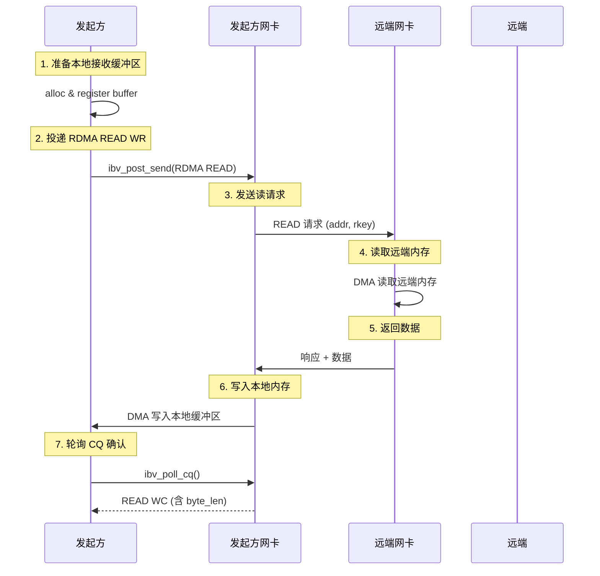

# 2.8 RDMA READ 操作

上一节我们讨论了 RDMA WRITE——发起方把数据写入远端内存。本章讨论相反的操作：RDMA READ——发起方主动从远端内存中读取数据。

RDMA READ 适合"按需加载"的场景：发起方决定何时读取，远端 CPU 完全不参与。

!!! note "推荐阅读资源"
    RDMA 的官方编程手册和 www.rdmamojo.com 网站提供了更完整的 API 参考。本章建立概念框架，具体 API 的细节可以在需要时查阅这些资源。

## 2.8.1 先从问题开始：为什么需要 RDMA READ

在深入代码之前，让我们先理解：**RDMA READ 和 RDMA WRITE 的本质区别是什么？**

答案是：**数据方向不同**。

### WRITE vs READ：数据方向

| 操作 | 数据方向 | 谁主动 | 典型用途 |
|------|---------|--------|---------|
| **RDMA WRITE** | 发起方 → 远端 | 发起方推送 | 数据推送、状态同步 |
| **RDMA READ** | 远端 → 发起方 | 发起方拉取 | 按需加载、远程缓存 |

!!! note "为什么有了 WRITE 还需要 READ？"
    有些场景下，发起方不知道何时需要数据，或者远端数据经常变化。使用 READ 可以让发起方按需拉取最新数据，而不是等待远端推送。

### RDMA READ 的本质



图 2-12：RDMA READ 操作的完整流程。
{: .figure-caption }

!!! note "RDMA READ 需要往返"
    RDMA WRITE 是单向的：发起方发送数据，远端网卡确认。RDMA READ 需要往返：发起方发送请求，远端网卡读取内存并发送响应。这意味着 RDMA READ 的延迟通常比 RDMA WRITE 更高。

### RDMA READ 的典型应用场景

RDMA READ 适用于发起方需要主动获取数据的场景：

| 场景 | 为什么用 RDMA READ |
|------|-------------------|
| **按需数据加载** | 客户端按需从服务器读取数据，无需等待推送 |
| **分布式缓存** | 从远程节点缓存中读取数据 |
| **数据库查询** | 从远程数据节点读取查询结果 |
| **状态检查** | 读取远端节点的状态信息 |

## 2.8.2 基本 RDMA READ

### 投递 RDMA READ WR

RDMA READ WR 的结构需要指定远端地址、`rkey` 和本地接收缓冲区：

```c
// 准备本地接收缓冲区（必须已注册）
char recv_buffer[4096];
struct ibv_mr *recv_mr = ibv_reg_mr(pd, recv_buffer, sizeof(recv_buffer),
                                     IBV_ACCESS_LOCAL_WRITE);

// 构造 SGE：描述本地接收缓冲区
struct ibv_sge sge = {
    .addr = (uintptr_t)recv_buffer,
    .length = sizeof(recv_buffer),
    .lkey = recv_mr->lkey
};

// 构造 RDMA READ WR
struct ibv_send_wr wr = {
    .wr_id = 1001,                        // 用户定义的 ID
    .sg_list = &sge,                      // 本地接收缓冲区
    .num_sge = 1,
    .opcode = IBV_WR_RDMA_READ,          // RDMA READ 操作
    .send_flags = IBV_SEND_SIGNALED,      // 生成 CQE
    .wr.rdma.remote_addr = remote_addr,   // 远端虚拟地址
    .wr.rdma.rkey = remote_rkey           // 远端访问密钥
};

struct ibv_send_wr *bad_wr;
if (ibv_post_send(qp, &wr, &bad_wr)) {
    fprintf(stderr, "Failed to post RDMA READ WR\n");
    return -1;
}
```

!!! note "注意 SGE 的含义"
    对于 RDMA READ，SGE 描述的是**本地接收缓冲区**，与 SEND 的 SGE 含义相同。这与 RDMA WRITE 不同——WRITE 的 SGE 是本地数据源，READ 的 SGE 是本地数据目的地。

### RDMA READ 的完成语义

**WC 生成的时间点**：数据已经从远端内存通过 DMA 读回到发起方本地内存。

- **发起方 CQ**：收到一个 READ WC
  - `opcode` = `IBV_WC_RDMA_READ`
  - `status` = `IBV_WC_SUCCESS` 表示成功
  - `byte_len` = 实际读取的字节数（重要！）

- **远端**：不获得任何 WC
  - 远端 CPU 完全不参与
  - 只是被网卡读取

!!! success "发起方收到 WC 时，数据已经可用"
    这是 RDMA READ 与 RDMA WRITE 的**关键区别**：

    - **RDMA READ**：发起方收到 WC 时，数据已经在本地内存中，**保证正确完整**，可以直接使用
    - **RDMA WRITE**：发起方收到 WC 时，只保证数据到达远端网卡，不保证已落内存

    因为 RDMA READ 是"拉"操作——发起方主动请求读取数据，只有当数据真正 DMA 到本地内存后，网卡才会生成 CQE。

!!! note "byte_len 是有用的"
    RDMA WRITE 的 `byte_len` 通常为 0，但 RDMA READ 的 `byte_len` 等于实际读取的字节数。这个值可能小于你请求的大小——比如远端数据不足，或者某些硬件限制。

### 完整示例：发起方

```c
#include <infiniband/verbs.h>
#include <stdio.h>
#include <string.h>
#include <errno.h>

int rdma_read_data(struct ibv_qp *qp, struct ibv_cq *cq,
                   struct ibv_mr *recv_mr,
                   uint64_t remote_addr, uint32_t remote_rkey,
                   size_t read_size) {
    // 构造 SGE：描述本地接收缓冲区
    struct ibv_sge sge = {
        .addr = (uintptr_t)recv_mr->addr,
        .length = read_size,
        .lkey = recv_mr->lkey
    };

    // 构造 RDMA READ WR
    struct ibv_send_wr wr = {
        .wr_id = 1001,
        .sg_list = &sge,
        .num_sge = 1,
        .opcode = IBV_WR_RDMA_READ,
        .send_flags = IBV_SEND_SIGNALED,
        .wr.rdma.remote_addr = remote_addr,
        .wr.rdma.rkey = remote_rkey,
        .next = NULL
    };

    // 投递 WR
    struct ibv_send_wr *bad_wr;
    if (ibv_post_send(qp, &wr, &bad_wr)) {
        fprintf(stderr, "Failed to post RDMA READ: %s\n", strerror(errno));
        return -1;
    }

    printf("RDMA READ WR posted\n");
    printf("  Remote addr: 0x%lx\n", remote_addr);
    printf("  Remote rkey: 0x%x\n", remote_rkey);
    printf("  Local buffer: %p (%zu bytes)\n", recv_mr->addr, read_size);

    // 轮询 CQ 等待完成
    struct ibv_wc wc;
    while (1) {
        int n = ibv_poll_cq(cq, 1, &wc);
        if (n < 0) {
            fprintf(stderr, "Poll CQ failed\n");
            return -1;
        }
        if (n == 0) {
            continue;  // 还没完成，继续轮询
        }

        // 有 WC 了
        if (wc.status != IBV_WC_SUCCESS) {
            fprintf(stderr, "RDMA READ failed: %s\n",
                    ibv_wc_status_str(wc.status));
            return -1;
        }

        if (wc.opcode == IBV_WC_RDMA_READ) {
            printf("RDMA READ completed\n");
            printf("  wr_id: %lu\n", wc.wr_id);
            printf("  bytes read: %u\n", wc.byte_len);

            // 现在数据已在 recv_buffer 中
            printf("  Data: \"%.*s\"\n", (int)wc.byte_len, (char *)recv_mr->addr);
            return 0;
        } else {
            printf("Got unexpected opcode: %d\n", wc.opcode);
        }
    }
}
```

### 完整示例：远端（数据源）

远端需要准备可被读取的内存，并通过控制面交换地址和 `rkey`：

```c
#include <infiniband/verbs.h>
#include <stdio.h>
#include <string.h>
#include <errno.h>

#define BUFFER_SIZE 4096

struct rdma_read_source {
    struct ibv_mr *mr;
    char *buffer;
    uint64_t addr;
    uint32_t rkey;
};

int init_rdma_read_source(struct ibv_pd *pd,
                         struct rdma_read_source *source) {
    // 分配内存（页对齐）
    posix_memalign((void **)&source->buffer, 4096, BUFFER_SIZE);

    // 初始化数据
    strcpy(source->buffer, "Hello from RDMA READ source!");
    strcat(source->buffer, " This data can be read remotely.");

    // 注册内存，允许远端读取
    int access = IBV_ACCESS_LOCAL_WRITE |      // 本端可以写
                 IBV_ACCESS_REMOTE_READ;        // 远端可以读

    source->mr = ibv_reg_mr(pd, source->buffer, BUFFER_SIZE, access);
    if (!source->mr) {
        perror("Failed to register MR");
        free(source->buffer);
        return -1;
    }

    // 准备远端访问信息
    source->addr = (uint64_t)source->mr->addr;
    source->rkey = source->mr->rkey;

    printf("RDMA READ source initialized:\n");
    printf("  Address: 0x%lx\n", source->addr);
    printf("  rkey: 0x%x\n", source->rkey);
    printf("  Buffer: %p\n", source->buffer);
    printf("  Data: \"%s\"\n", source->buffer);

    return 0;
}

// 远端可以继续修改数据，发起方的下一次 READ 会读到新数据
void update_source_data(struct rdma_read_source *source, const char *new_data) {
    strncpy(source->buffer, new_data, BUFFER_SIZE - 1);
    source->buffer[BUFFER_SIZE - 1] = '\0';
    printf("Source data updated: \"%s\"\n", source->buffer);
}
```

!!! note "远端权限要求"
    远端 MR 必须设置 `IBV_ACCESS_REMOTE_READ` 权限。不需要 `REMOTE_WRITE` 权限——因为发起方只是读取，不会修改远端数据。

## 2.8.3 最大并发 RDMA READ 限制

### 并发读取限制

RDMA 协议对并发的 RDMA READ 操作有限制：

- **`max_dest_rd_atomic`**：远端允许的最大并发 RDMA READ 和 Atomic 操作
- **`max_rd_atomic`**：本地允许的最大并发 RDMA READ 和 Atomic 操作

!!! note "为什么要限制并发？"
    每个未完成的 RDMA READ 需要远端网卡维护状态（读请求缓存）。限制并发数是为了防止远端网卡资源耗尽。

### 配置并发限制

在 QP 状态转换时设置这些参数：

```c
// 接收方（远端）：在 RTR 状态设置
struct ibv_qp_attr attr = {
    .qp_state = IBV_QPS_RTR,
    .max_dest_rd_atomic = 16,  // 允许最多 16 个并发 RDMA READ/Atomic
    // ...
};

int attr_mask = IBV_QP_STATE | IBV_QP_MAX_DEST_RD_ATOMIC;
ibv_modify_qp(qp, &attr, attr_mask);

// 发起方（本地）：在 RTS 状态设置
attr.qp_state = IBV_QPS_RTS;
attr.max_rd_atomic = 16;  // 本地最多发起 16 个并发 RDMA READ/Atomic

attr_mask = IBV_QP_STATE | IBV_QP_MAX_QP_RD_ATOMIC;
ibv_modify_qp(qp, &attr, attr_mask);
```

!!! note "硬件限制很重要"
    某些硬件（尤其是老设备或模拟设备）的 `max_dest_rd_atomic` 和 `max_rd_atomic` 限制很低。如果你的程序尝试超过这个限制，`ibv_post_send` 会返回错误或产生 `IBV_WC_REM_OP_ERR`。

### 超限的错误

```c
// WC status = IBV_WC_REM_OP_ERR
// 原因：超过了远端的 max_dest_rd_atomic 限制
// 解决：增加 max_dest_rd_atomic 或减少并发数
```

## 2.8.4 性能考虑

### 延迟与吞吐

RDMA READ 的性能特点：

| 特性 | 说明 |
|------|------|
| **延迟** | 比 RDMA WRITE 高，需要往返（请求→响应） |
| **吞吐** | 受限于并发数和网络往返时间 |
| **远端负载** | 网卡需要读取内存并发送响应 |

!!! note "RDMA READ 的往返开销"
    RDMA WRITE 是单向的：数据从发起方流向远端。RDMA READ 需要往返：请求从发起方到远端，数据从远端返回发起方。这意味着：
    - 延迟至少是 RTT（往返时间）
    - 远端网卡需要额外的工作（读取内存、发送响应）
    - 对远端的压力比 RDMA WRITE 大

### 批量读取优化

```c
// 不推荐：逐个读取
for (int i = 0; i < n; i++) {
    rdma_read_single(remote_addr + i * size, local_buffer + i * size, size);
    wait_for_completion();  // 每次都等待
}

// 推荐：批量并发读取
for (int i = 0; i < n; i++) {
    rdma_read_post_only(remote_addr + i * size, local_buffer + i * size, size);
}
wait_for_all_completions();  // 统一等待
```

## 2.8.5 错误处理

### 常见错误类型

**错误1：远端访问权限错误**

```c
// WC status = IBV_WC_REM_ACCESS_ERR
// 原因：远端 MR 没有 REMOTE_READ 权限
// 解决：确保远端 MR 注册时设置了正确的权限

int remote_access = IBV_ACCESS_LOCAL_WRITE |
                   IBV_ACCESS_REMOTE_READ;  // 必须设置
struct ibv_mr *remote_mr = ibv_reg_mr(pd, buffer, size, remote_access);
```

**错误2：本地长度错误**

```c
// WC status = IBV_WC_LOC_LEN_ERR
// 原因：本地 SGE 长度不足
// 解决：确保本地缓冲区足够大

size_t read_size = get_data_size();
size_t buffer_size = read_size + 1024;  // 留余量
struct ibv_mr *mr = ibv_reg_mr(pd, buffer, buffer_size, access);
```

**错误3：远端操作错误（并发超限）**

```c
// WC status = IBV_WC_REM_OP_ERR
// 原因：超过了远端的 max_dest_rd_atomic 限制
// 解决：增加远端的 max_dest_rd_atomic

// 接收方（远端）
struct ibv_qp_attr attr = {
    .qp_state = IBV_QPS_RTR,
    .max_dest_rd_atomic = 32,  // 增加到 32
    // ...
};
```

### 错误处理示例

```c
struct ibv_wc wc;
int n = ibv_poll_cq(cq, 1, &wc);

if (n > 0 && wc.status != IBV_WC_SUCCESS) {
    fprintf(stderr, "RDMA READ failed:\n");
    fprintf(stderr, "  status: %s\n", ibv_wc_status_str(wc.status));

    switch (wc.status) {
        case IBV_WC_REM_ACCESS_ERR:
            fprintf(stderr, "  Check: Remote MR has REMOTE_READ permission\n");
            fprintf(stderr, "  Check: Remote rkey is correct\n");
            break;

        case IBV_WC_LOC_LEN_ERR:
            fprintf(stderr, "  Check: Local buffer size is sufficient\n");
            break;

        case IBV_WC_REM_OP_ERR:
            fprintf(stderr, "  Check: Remote max_dest_rd_atomic limit\n");
            break;

        default:
            fprintf(stderr, "  Check: Connection and resource state\n");
            break;
    }
}
```

## 2.8.6 关键要点回顾

| 概念 | 要点 |
|------|------|
| **单边操作** | 发起方主动从远端读取，远端 CPU 不参与 |
| **必须知道远端 addr 和 rkey** | 通过控制面交换这些信息 |
| **完成语义** | 发起方收到 WC，包含 `byte_len`，远端无通知 |
| **本地缓冲区** | 必须预先注册，有 LOCAL_WRITE 权限 |
| **远端权限** | 必须有 REMOTE_READ 权限 |
| **并发限制** | 受 `max_rd_atomic` 和 `max_dest_rd_atomic` 限制 |
| **延迟** | 比 RDMA WRITE 高，需要往返 |
| **应用场景** | 按需加载、远程缓存、数据库查询 |

!!! note "下一步"
    RDMA READ 适合"按需拉取"的场景，但延迟比 RDMA WRITE 高。下一章会介绍：
    - **2.9 Atomic**：原子操作，分布式同步
