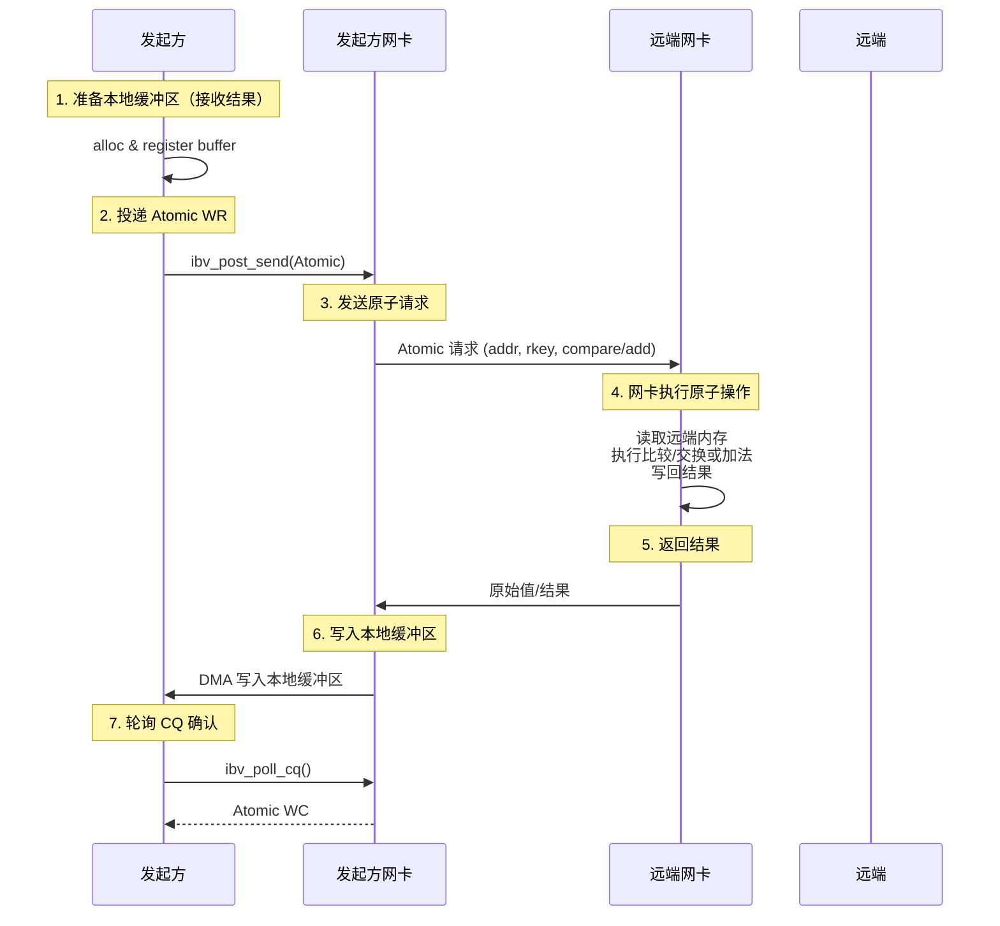
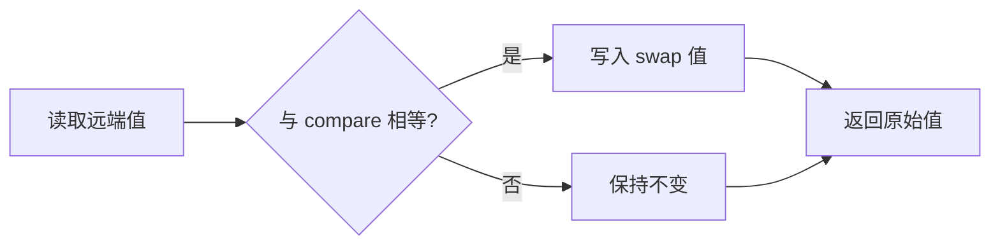
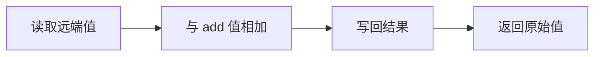

# 2.9 Atomic 操作

前几章我们讨论了 RDMA WRITE 和 READ——单边操作。发起方写入或读取远端内存，远端 CPU 完全不参与。

本章讨论另一种单边操作：**Atomic**。它允许发起方在远端内存上执行原子操作，远端 CPU 仍然不参与，但网卡会执行更复杂的操作——比较并交换、取数加。

!!! note "推荐阅读资源"
    RDMA 的官方编程手册和 www.rdmamojo.com 网站提供了更完整的 API 参考。本章建立概念框架，具体 API 的细节可以在需要时查阅这些资源。

## 2.9.1 先从问题开始：为什么需要 Atomic 操作

在深入代码之前，让我们先理解：**为什么有了 RDMA READ/WRITE 还需要 Atomic 操作？**

答案是：**分布式系统需要同步机制，而普通 RDMA 操作不够用**。

### 一个经典问题：分布式锁

假设你想实现一个分布式锁——多个节点竞争一个共享资源。你会怎么做？

**尝试1：用 RDMA WRITE**

```c
// 发起方 A
lock_value = 1;
rdma_write(remote_lock_addr, &lock_value, sizeof(lock_value));

// 发起方 B（几乎同时）
lock_value = 1;
rdma_write(remote_lock_addr, &lock_value, sizeof(lock_value));
```

问题：两个节点都认为获得了锁，但实际上只有一个应该成功。

**尝试2：用 RDMA READ + WRITE**

```c
// 发起方 A
rdma_read(remote_lock_addr, &current_value);
if (current_value == 0) {
    lock_value = 1;
    rdma_write(remote_lock_addr, &lock_value, sizeof(lock_value));
}
```

问题：READ 和 WRITE 之间，另一个节点可能已经修改了锁。这是经典的**竞态条件**。

**解决方案：Atomic 操作**

```c
// 发起方 A
atomic_compare_and_swap(remote_lock_addr, 
                        expected=0,   // 期望是 0
                        new_value=1);  // 设置为 1
// 返回原始值，如果返回 0，说明成功获取锁
```

Atomic 操作保证读-修改-写这三个步骤是原子的——不会有其他节点插入其中。

### Atomic 操作的本质



图 2-13：Atomic 操作的完整流程。
{: .figure-caption }

!!! note "原子操作在网卡上执行"
    关键点：读-修改-写这三个步骤是在**远端网卡上**完成的，不是在发起方 CPU 上。这意味着即使有多个节点同时发起 Atomic 操作，网卡也能保证它们按顺序执行，不会产生竞态条件。

### Atomic 操作的类型

RDMA 支持两种原子操作：

| 操作 | 名称 | 功能 | 返回值 |
|------|------|------|--------|
| **CAS** | Compare & Swap | 比较并交换 | 返回原始值 |
| **FA** | Fetch & Add | 取数加 | 返回原始值 |

### Atomic 操作的典型应用场景

Atomic 操作适用于需要远程同步和协调的场景：

| 场景 | 为什么用 Atomic |
|------|-----------------|
| **分布式锁** | 原子地获取锁，避免竞态条件 |
| **无锁队列** | 原子地更新队列索引 |
| **引用计数** | 原子地增加/减少计数 |
| **序号生成** | 原子地分配唯一 ID |

### 扩展原子操作说明

!!! info "文献中的扩展原子操作"
    标准 RDMA verbs 只支持上述两种原子操作（CAS 和 FA），但你在阅读论文时可能会遇到其他原子操作，如：

    - **Masked Compare-and-Swap**：带掩码的 CAS，只比较和修改 64 位值中的某些位
    - **Masked Fetch-and-Add**：带掩码的 FA，只对 64 位值中的某些位进行加法

    这些通常是 **MLX 网卡早期版本**（ConnectX-4/5 era）提供的扩展接口，不属于标准 RDMA verbs。如果论文中使用这些操作，可能需要：

    1. 使用厂商提供的特定 verbs 扩展（如 `ibv_exp_*` 函数）
    2. 使用特定版本的网卡和驱动
    3. 注意代码的可移植性

    对于大多数应用，标准的 CAS 和 FA 已经足够实现各种同步原语。

## 2.9.2 Compare & Swap（CAS）

### CAS 操作原理

CAS 是一种经典的原子操作，它原子性地执行以下步骤：

1. 读取远端 64 位值
2. 比较该值是否与 `compare` 值相等
3. 如果相等，将 `swap` 值写入远端
4. 如果不相等，保持远端值不变
5. 返回原始值



图 2-14：CAS 操作的逻辑流程。
{: .figure-caption }

!!! note "CAS 的返回值告诉你结果"
    CAS 返回的是**原始值**，而不是"是否成功"的布尔值。你需要自己比较返回值和期望值：
    - 如果返回值 == 期望值 → CAS 成功
    - 如果返回值 != 期望值 → CAS 失败（值已被其他节点修改）

### CAS 操作的参数

```c
struct ibv_send_wr wr = {
    .opcode = IBV_WR_ATOMIC_CMP_AND_SWP,
    .wr_id = 1001,
    .sg_list = &sge,                    // 本地接收缓冲区（接收原始值）
    .num_sge = 1,
    .send_flags = IBV_SEND_SIGNALED,
    .wr.atomic.remote_addr = remote_addr,  // 远端地址
    .wr.atomic.rkey = remote_rkey,         // 远端 key
    .wr.atomic.compare = compare_value,   // 比较值（64 位）
    .wr.atomic.swap = swap_value,         // 交换值（64 位）
    .next = NULL
};
```

### CAS 示例：分布式锁

```c
#include <infiniband/verbs.h>
#include <stdio.h>
#include <stdint.h>
#include <errno.h>

#define LOCK_FREE   0
#define LOCK_ACQUIRED 1

struct distributed_lock {
    struct ibv_qp *qp;
    struct ibv_cq *cq;
    struct ibv_mr *result_mr;
    uint64_t *result_buffer;  // 存储原始值
    uint64_t remote_lock_addr;
    uint32_t remote_lock_rkey;
};

int try_acquire_lock(struct distributed_lock *lock) {
    // 准备本地缓冲区接收原始值
    struct ibv_sge sge = {
        .addr = (uintptr_t)lock->result_buffer,
        .length = sizeof(uint64_t),
        .lkey = lock->result_mr->lkey
    };

    // 尝试获取锁：如果远端值是 LOCK_FREE，则设置为 LOCK_ACQUIRED
    struct ibv_send_wr wr = {
        .wr_id = 1001,
        .sg_list = &sge,
        .num_sge = 1,
        .opcode = IBV_WR_ATOMIC_CMP_AND_SWP,
        .send_flags = IBV_SEND_SIGNALED,
        .wr.atomic.remote_addr = lock->remote_lock_addr,
        .wr.atomic.rkey = lock->remote_lock_rkey,
        .wr.atomic.compare = LOCK_FREE,       // 期望是 FREE
        .wr.atomic.swap = LOCK_ACQUIRED,     // 设置为 ACQUIRED
        .next = NULL
    };

    struct ibv_send_wr *bad_wr;
    if (ibv_post_send(lock->qp, &wr, &bad_wr)) {
        fprintf(stderr, "Failed to post CAS WR\n");
        return -1;
    }

    // 等待完成
    struct ibv_wc wc;
    while (1) {
        int n = ibv_poll_cq(lock->cq, 1, &wc);
        if (n < 0) {
            fprintf(stderr, "Poll CQ failed\n");
            return -1;
        }
        if (n == 0) continue;

        if (wc.status != IBV_WC_SUCCESS) {
            fprintf(stderr, "CAS failed: %s\n", ibv_wc_status_str(wc.status));
            return -1;
        }

        if (wc.opcode == IBV_WC_COMP_SWAP) {
            // 原始值已在 result_buffer 中
            uint64_t original = *lock->result_buffer;

            if (original == LOCK_FREE) {
                printf("Lock acquired!\n");
                return 1;  // 成功获取锁
            } else {
                printf("Lock already held (original value: %lu)\n", original);
                return 0;  // 锁已被占用
            }
        }
    }
}
```

!!! note "CAS 的正确使用模式"
    CAS 不是"设置并返回成功与否"，而是"比较并返回原始值"。你需要检查返回的原始值来判断 CAS 是否成功。这是一个常见的理解误区。

## 2.9.3 Fetch & Add（FA）

### FA 操作原理

Fetch & Add 是另一种原子操作，它原子性地执行：

1. 读取远端 64 位值
2. 将该值与 `add` 值相加
3. 将结果写回远端
4. 返回原始值



图 2-15：Fetch & Add 操作的逻辑流程。
{: .figure-caption }

!!! note "FA 返回的是原始值，不是新值"
    FA 返回的是**加法之前的原始值**，不是加法后的新值。如果你需要新值，需要自己计算：`new_value = original + add`。

### FA 操作的参数

```c
struct ibv_send_wr wr = {
    .opcode = IBV_WR_ATOMIC_FETCH_ADD,
    .wr_id = 1001,
    .sg_list = &sge,                    // 本地接收缓冲区（接收原始值）
    .num_sge = 1,
    .send_flags = IBV_SEND_SIGNALED,
    .wr.atomic.remote_addr = remote_addr,  // 远端地址
    .wr.atomic.rkey = remote_rkey,         // 远端 key
    .wr.atomic.compare_add = add_value,    // 要加的值（64 位）
    .next = NULL
};
```

### FA 示例：分布式计数器

```c
#include <infiniband/verbs.h>
#include <stdio.h>
#include <stdint.h>
#include <errno.h>

struct distributed_counter {
    struct ibv_qp *qp;
    struct ibv_cq *cq;
    struct ibv_mr *result_mr;
    uint64_t *result_buffer;
    uint64_t remote_counter_addr;
    uint32_t remote_counter_rkey;
};

int increment_counter(struct distributed_counter *counter, int delta) {
    // 准备本地缓冲区接收原始值
    struct ibv_sge sge = {
        .addr = (uintptr_t)counter->result_buffer,
        .length = sizeof(uint64_t),
        .lkey = counter->result_mr->lkey
    };

    // 远端计数器增加 delta
    struct ibv_send_wr wr = {
        .wr_id = 1001,
        .sg_list = &sge,
        .num_sge = 1,
        .opcode = IBV_WR_ATOMIC_FETCH_ADD,
        .send_flags = IBV_SEND_SIGNALED,
        .wr.atomic.remote_addr = counter->remote_counter_addr,
        .wr.atomic.rkey = counter->remote_counter_rkey,
        .wr.atomic.compare_add = delta,  // 要加的值
        .next = NULL
    };

    struct ibv_send_wr *bad_wr;
    if (ibv_post_send(counter->qp, &wr, &bad_wr)) {
        fprintf(stderr, "Failed to post FA WR\n");
        return -1;
    }

    // 等待完成
    struct ibv_wc wc;
    while (1) {
        int n = ibv_poll_cq(counter->cq, 1, &wc);
        if (n < 0) {
            fprintf(stderr, "Poll CQ failed\n");
            return -1;
        }
        if (n == 0) continue;

        if (wc.status != IBV_WC_SUCCESS) {
            fprintf(stderr, "FA failed: %s\n", ibv_wc_status_str(wc.status));
            return -1;
        }

        if (wc.opcode == IBV_WC_FETCH_ADD) {
            // 原始值已在 result_buffer 中
            uint64_t original = *counter->result_buffer;
            uint64_t new_value = original + delta;

            printf("Counter incremented: %lu -> %lu (+%d)\n",
                   original, new_value, delta);
            return new_value;
        }
    }
}
```

## 2.9.4 Atomic 操作的限制

### 数据类型限制

RDMA Atomic 操作只支持 **64 位** 操作：

```c
// 只能操作 64 位值
uint64_t *remote_ptr = ...;  // 正确
uint32_t *remote_ptr = ...;  // 错误！

// 地址必须 64 位对齐
assert((uint64_t)remote_addr % sizeof(uint64_t) == 0);
```

!!! note "为什么只有 64 位？"
    RDMA 的 Atomic 操作设计要满足硬件实现的高效性。64 位是现代处理器和网卡最自然的原子操作粒度。支持任意大小会大大增加硬件复杂度。

### 并发限制

与 RDMA READ 一样，Atomic 操作也受并发限制：

- **`max_dest_rd_atomic`**：远端允许的最大并发 Atomic 操作
- **`max_rd_atomic`**：本地允许的最大并发 Atomic 操作

### 权限要求

远端 MR 必须设置正确的权限：

```c
int access = IBV_ACCESS_LOCAL_WRITE |     // 必需
             IBV_ACCESS_REMOTE_WRITE |    // 必需
             IBV_ACCESS_REMOTE_ATOMIC;    // Atomic 操作必需

struct ibv_mr *mr = ibv_reg_mr(pd, buffer, size, access);
```

!!! note "REMOTE_ATOMIC 需要配合 REMOTE_WRITE"
    设置 `IBV_ACCESS_REMOTE_ATOMIC` 时，必须**同时**设置 `IBV_ACCESS_REMOTE_WRITE`。这是 RDMA 规范的要求。

## 2.9.5 错误处理

### 常见错误类型

**错误1：远端权限错误**

```c
// WC status = IBV_WC_REM_ACCESS_ERR
// 原因：远端 MR 没有 REMOTE_ATOMIC 权限
// 解决：确保远端 MR 注册时设置了正确的权限

int access = IBV_ACCESS_LOCAL_WRITE |
             IBV_ACCESS_REMOTE_WRITE |
             IBV_ACCESS_REMOTE_ATOMIC;  // 必须设置
```

**错误2：地址未对齐**

```c
// WC status = IBV_WC_REM_INV_REQ_ERR
// 原因：远端地址未 64 位对齐
// 解决：确保地址 8 字节对齐

assert(remote_addr % sizeof(uint64_t) == 0);
```

**错误3：并发超限**

```c
// WC status = IBV_WC_REM_OP_ERR
// 原因：超过了远端的 max_dest_rd_atomic 限制
// 解决：增加 max_dest_rd_atomic 或减少并发
```

### 错误处理示例

```c
struct ibv_wc wc;
int n = ibv_poll_cq(cq, 1, &wc);

if (n > 0 && wc.status != IBV_WC_SUCCESS) {
    fprintf(stderr, "Atomic operation failed:\n");
    fprintf(stderr, "  status: %s\n", ibv_wc_status_str(wc.status));

    switch (wc.status) {
        case IBV_WC_REM_ACCESS_ERR:
            fprintf(stderr, "  Check: Remote MR has REMOTE_ATOMIC permission\n");
            break;

        case IBV_WC_LOC_LEN_ERR:
            fprintf(stderr, "  Check: Local buffer size\n");
            break;

        case IBV_WC_REM_INV_REQ_ERR:
            fprintf(stderr, "  Check: Remote address alignment (must be 8-byte aligned)\n");
            break;

        case IBV_WC_REM_OP_ERR:
            fprintf(stderr, "  Check: Concurrent atomic operations limit\n");
            break;

        default:
            fprintf(stderr, "  Check: Connection and resource state\n");
            break;
    }
}
```

## 2.9.6 关键要点回顾

| 概念 | 要点 |
|------|------|
| **单边操作** | 在远端内存上执行原子操作，远端 CPU 不参与 |
| **两种操作** | CAS（比较交换）和 FA（取数加） |
| **只支持 64 位** | 只能操作 64 位值，地址必须 8 字节对齐 |
| **CAS 原理** | 比较并交换，返回原始值，用于条件更新 |
| **FA 原理** | 取数加，返回原始值，用于计数和序列 |
| **权限要求** | 远端 MR 必须有 REMOTE_ATOMIC 和 REMOTE_WRITE 权限 |
| **并发限制** | 受 `max_rd_atomic` 和 `max_dest_rd_atomic` 限制 |
| **返回值** | 操作结果（原始值）写入本地缓冲区 |
| **应用场景** | 分布式锁、无锁队列、引用计数、ID 生成 |

!!! note "编程模型章节完成"
    恭喜！你已经完成了 RDMA 编程模型的核心内容：
    - **2.6 SEND/RECV**：双边通信，控制消息传递
    - **2.7 RDMA WRITE**：单边写入，高效数据传输
    - **2.8 RDMA READ**：单边读取，按需数据加载
    - **2.9 Atomic**：原子操作，分布式同步

    这些操作构成了 RDMA 编程的基础。接下来的学习方向：
    - Work Request 和 Scatter-Gather 详解
    - 高级资源对象（SRQ、AH、MW）
    - 错误处理和事件机制
    - 性能优化技巧
    - 完整的应用案例
