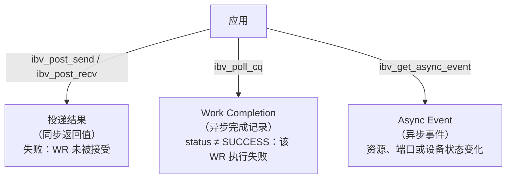

# 2.10 错误完成与异步事件

前面几章已经讨论了 RDMA 程序的主要路径：创建资源，连接 QP，投递 WR，再从 CQ 中取得完成结果。实际程序还必须处理另一面：请求可能失败，资源状态也可能在请求之外发生变化。本章不展开完整的故障恢复框架，而是在编程模型层面说明两个基本通道：Work Completion error 和 asynchronous event。

这两个通道容易混在一起。Work Completion error 是某个 WR 的执行结果，它通过 CQ 返回；asynchronous event 则是资源、端口或设备状态变化，它通过设备 Context 的异步事件队列返回。前者回答“这个请求为什么没有成功”，后者回答“这个资源或设备发生了什么变化”。

加上投递函数的返回值，RDMA 程序实际上面对三个不同层面的错误信息：



图 2-16：RDMA 程序面对的三类错误信息。投递返回值、WC status 与异步事件处在不同层面，不能都按 `errno` 一类错误处理。
{: .figure-caption }

本章实验仍以 `examples/programming_model/03_rc_loopback.c` 为参照。正常运行时，程序会打印每个成功操作对应的 WC；错误完成则应在同一条 CQ 轮询路径中处理，只是 `wc.status` 不再是 `IBV_WC_SUCCESS`。异步事件需要端口、QP、CQ 或设备状态发生真实变化，基础实验不主动制造这类故障，本章只说明它在程序结构中的位置。

```bash
make -C examples/programming_model
./examples/programming_model/03_rc_loopback -d mlx5_0 -p 1 -g 0
```

## 2.10.1 错误完成：WR 级别的结果

应用调用 `ibv_post_send` 或 `ibv_post_recv` 成功，只表示 WR 已经被接受投递。WR 的执行结果要等 CQ 中的 WC 返回后才能判断。只要 `wc.status != IBV_WC_SUCCESS`，这个 WC 就表示一个错误完成。

```c
struct ibv_wc wc;
int n = ibv_poll_cq(cq, 1, &wc);
if (n > 0) {
    if (wc.status != IBV_WC_SUCCESS) {
        fprintf(stderr, "WR failed: wr_id=%lu status=%s vendor_err=%u\n",
                wc.wr_id,
                ibv_wc_status_str(wc.status),
                wc.vendor_err);
    }
}
```

错误完成仍然与某个 WR 相关，因此 `wr_id` 是最重要的定位信息。应用通常通过 `wr_id` 找回请求上下文，再结合 `status`、`qp_num` 和 `vendor_err` 判断错误原因。需要注意的是，当 `status` 不是 `IBV_WC_SUCCESS` 时，`opcode`、`byte_len`、`imm_data` 等字段不应再按成功路径解释。

常见错误大致可以分成几类：

| 类型 | 常见状态 | 说明 |
|------|----------|------|
| 本地描述错误 | `IBV_WC_LOC_LEN_ERR`、`IBV_WC_LOC_ACCESS_ERR` | 本地 SGE 地址、长度、`lkey` 或访问权限不正确 |
| 远端访问错误 | `IBV_WC_REM_ACCESS_ERR`、`IBV_WC_REM_INV_REQ_ERR` | 远端地址、`rkey`、MR 权限或 Atomic 对齐不正确 |
| 连接与重试错误 | `IBV_WC_RETRY_EXC_ERR`、`IBV_WC_RNR_RETRY_EXC_ERR` | 对端无响应、链路异常、或接收方没有足够的 RECV WR |
| QP 状态相关错误 | `IBV_WC_WR_FLUSH_ERR` | QP 进入错误状态后，在途 WR 被 flush |

这些状态并不自动告诉应用应该如何恢复。比如 RNR 重试耗尽通常说明接收队列管理有问题，远端访问错误通常说明控制面交换的 `addr`/`rkey` 或 MR 权限不正确，retry 超限可能来自网络、对端 QP 状态或路径配置。编程模型只规定错误如何报告，恢复策略仍然属于应用协议的一部分。

## 2.10.2 异步事件：资源级别的状态变化

并非所有异常都对应某个 WR。CQ 溢出、QP fatal、端口 down/up、设备 fatal 等情况，属于资源或设备状态变化，会通过异步事件报告。应用通过 `ibv_get_async_event` 从 Context 上获取事件，并在处理后调用 `ibv_ack_async_event` 确认。

```c
struct ibv_async_event event;

if (ibv_get_async_event(ctx, &event) == 0) {
    fprintf(stderr, "Async event: %s\n",
            ibv_event_type_str(event.event_type));

    // 根据 event.event_type 和 event.element 判断受影响的资源。
    // 处理完成后必须 ack。
    ibv_ack_async_event(&event);
}
```

异步事件不表示某个 WR 成功或失败。它提示应用：某个资源的状态已经变化，继续按原来的数据路径假设运行可能不再安全。比如 `IBV_EVENT_CQ_ERR` 通常表示 CQ 已经发生 overrun，这个 CQ 不能再作为正常完成队列使用；`IBV_EVENT_QP_FATAL` 表示 QP 进入不可继续正常通信的状态；`IBV_EVENT_PORT_ERR` 和 `IBV_EVENT_PORT_ACTIVE` 则分别提示端口不可用或恢复可用。

`ibv_get_async_event` 默认是阻塞调用，常见写法是由单独线程读取事件；也可以把 Context 中的事件文件描述符设置为非阻塞，再交给 `poll`、`epoll` 或 `select` 管理。事件取出后必须调用 `ibv_ack_async_event`。未确认的资源事件可能影响后续资源销毁，因此 ack 不是可省略的日志步骤，而是事件处理的一部分。

常见事件可以按影响范围理解：

| 影响范围 | 典型事件 | 编程模型中的含义 |
|----------|----------|------------------|
| CQ | `IBV_EVENT_CQ_ERR` | 完成队列发生错误，通常需要停止使用并重建相关资源 |
| QP | `IBV_EVENT_QP_FATAL`、`IBV_EVENT_QP_REQ_ERR`、`IBV_EVENT_QP_ACCESS_ERR` | QP 或请求处理出现严重错误，需要进入连接恢复流程 |
| Port | `IBV_EVENT_PORT_ERR`、`IBV_EVENT_PORT_ACTIVE` | 端口状态变化，路径可用性可能发生改变 |
| Device | `IBV_EVENT_DEVICE_FATAL` | 设备级错误，通常超出单个连接的恢复范围 |

这里还要区分 completion event 和 asynchronous event。使用 `ibv_comp_channel` 得到的 CQ event 只是提醒“某个 CQ 里可能有 completion 可以取”，随后仍然要调用 `ibv_poll_cq` 读取 WC；而 `ibv_get_async_event` 得到的是资源或设备事件，不是普通完成通知。二者都带有“事件”这个词，但语义完全不同。

## 2.10.3 处理原则

在最小示例里，遇到错误后直接打印并退出是可以接受的；在真实程序里，这通常不够。较稳妥的结构是把错误完成和异步事件都纳入资源生命周期管理：投递路径只负责提交 WR，CQ 轮询路径负责处理成功和失败 completion，异步事件路径负责监听资源和端口状态变化。三者共享同一套连接状态，避免一个线程继续投递请求，而另一个线程已经发现 QP 或 CQ 不再可用。

对于错误完成，应用应先记录 `wr_id`、`status`、`qp_num` 和 `vendor_err`，再根据请求类型判断能否重试。遇到 RNR 时，应检查远端 RECV WR 水位；遇到访问错误时，应检查 MR 权限、地址范围和 key 生命周期；遇到 retry 超限时，应检查对端 QP 状态、端口状态和路径配置。很多情况下，简单重投同一个 WR 并不能解决问题。

对于异步事件，应用应尽快确认受影响资源，并停止继续使用已经不可靠的对象。CQ overrun、QP fatal、device fatal 这类事件通常意味着相关数据路径需要重建；端口事件则要求应用重新评估路径是否可用。`ibv_ack_async_event` 必须在事件处理完成后调用，否则驱动侧会认为这个事件仍未被应用确认。

RDMA 的错误处理不是单一的 `errno` 模型。投递函数的返回值、CQ 中的 WC status、Context 上的 asynchronous event，分别对应不同层面的信息。一个完整的 RDMA 程序需要同时处理这三处结果，才能把资源生命周期和连接状态管理清楚。

## 2.10.4 本章小结

RDMA 程序需要区分三类结果。投递函数返回失败，表示 WR 没有被接受；CQ 中出现非成功 WC，表示某个已经投递的 WR 执行失败；Context 上的 asynchronous event，则表示资源、端口或设备状态发生了变化。三者处在不同层面，不能都按 `errno` 一类错误处理。

非成功 WC 中，应用主要依赖 `wr_id`、`status`、`qp_num` 和 `vendor_err` 判断问题来源。异步事件则要求应用确认受影响对象，并在处理后调用 `ibv_ack_async_event`。Verbs 负责报告这些状态，是否重试、重建连接或向上层报告失败，仍由应用协议决定。

!!! note "第二篇小结"
    第二篇到这里完成了 RDMA 编程模型的主线：资源如何创建和关联，请求如何投递和完成，基本操作如何表达数据方向，以及错误和事件如何回到应用。后续篇章会在这个基础上转入更具体的实现机制、性能取舍和系统案例。

## 延伸阅读

- [rdma-core 手册页：ibv_get_async_event(3)、ibv_ack_async_event(3)、ibv_poll_cq(3)](https://man.archlinux.org/man/extra/rdma-core/)：异步事件与完成轮询的函数语义。
- [rdma-core 头文件 `libibverbs/verbs.h`](https://github.com/linux-rdma/rdma-core/blob/master/libibverbs/verbs.h)：`enum ibv_event_type`、`enum ibv_wc_status` 的完整定义。
- [InfiniBand Architecture Specification Volume 1](https://www.infinibandta.org/)：CQ 溢出、QP 错误状态与异步事件的规范行为。
