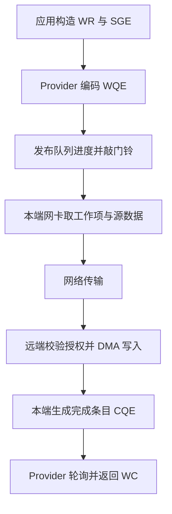

# 3.1 一次 WRITE 的执行过程

第二篇说明了应用怎样构造请求和等待完成。现在沿同一次 WRITE 继续向下看：应用交给 `ibv_post_send` 的描述怎样被网卡读取，字符串又怎样到达远端内存？

本章以 mlx5 硬件上的 RC WRITE 为例，假设两端已连接、内存已注册，使用普通主机内存、非 inline 数据，并为请求设置成功完成通知。不同设备实现的队列格式会变化，整体过程可以作为阅读后面各章的参照。

## 请求描述变成设备工作项

应用准备的 WR 包含操作类型、请求标识和远端位置，SGE 则包含本地源地址、长度和 `lkey`。这些是公共 Verbs 接口的数据结构，网卡通常不直接读取应用栈上的 `ibv_send_wr`。

用户态设备实现称为 Provider。它检查请求，按设备要求将字段编码到发送队列的工作项 WQE（Work Queue Entry）中，并保存完成时找回 `wr_id` 所需的信息。

图 3-1：一次 WRITE 从请求构造到完成返回。
{: .figure-caption }

WR 与 WQE 是请求方向的两种表示，CQE 与 WC 是完成方向的两种表示。应用处理 WR/WC，Provider 处理具体设备的 WQE/CQE。理解这一区别，就不会误以为网卡需要一直保留应用构造 WR 的栈变量。

## 发布队列进度

写好 WQE 后，Provider 还要告诉设备有新工作，这通常叫敲 doorbell（门铃）。队列内容和门铃必须按正确顺序发布，否则设备可能看到进度已经增加，工作项却尚未准备完整。

这涉及 CPU 内存访问顺序、设备可见性和 MMIO 写入。普通 Verbs 应用把这些交给 Provider；自己在业务代码中随意增加一个 CPU fence，不能替代设备规定的发布流程。

`ibv_post_send` 返回时，程序已经完成投递相关动作。网卡何时取到工作项、何时读取源数据则是后续异步过程，所以非 inline 的源内容还不能修改。

## 两端网卡各做什么

本端网卡依据本地 key 和地址范围访问源数据，用 QP 保存的路径信息发往对端。消息大于路径 MTU 时，一条 WRITE 会拆成多个网络包；应用仍只提交这一条 WR。

远端网卡根据目标 QP、地址和 `rkey` 检查访问，再将数据 DMA 写入目标内存。接收端 CPU 不必为 payload 执行复制，但之前的内存分配、注册、授权以及之后的业务消费仍由软件参与。

RC 负责包序列、确认与必要的重传。它让一次已接受的传输遵循可靠协议，但不会替应用发布缓存对象，也不知道数据是否属于某一版模型权重。

## 设备结果回到应用

本例请求了成功完成。操作满足 RC 完成条件后，本端设备向 CQ 写入 CQE。Provider 在 `ibv_poll_cq` 中辨认新条目、解释状态，返回公共的 WC。

应用检查成功后，可以按之前建立的规则复用本地源。server 仍需要约定的通知才能开始消费。GPU 目标还需额外的执行与可见性安排，不能仅把普通主机内存的程序原样搬过去。

同一条执行路径也帮助定位异常：请求在软件检查阶段被拒绝，就先看容量与描述；设备报告访问错误，就回到地址和权限；连接重试耗尽，则继续查端点状态与网络。先明确停在哪一步，再选择观察工具。

下一章解释[用户态库与内核的分工](02-verbs-provider-kernel.md)，随后分别展开地址转换、设备队列与网络协议。

## 阅读实现

mlx5 的请求与完成处理可从 [qp.c](https://github.com/linux-rdma/rdma-core/blob/master/providers/mlx5/qp.c)和 [cq.c](https://github.com/linux-rdma/rdma-core/blob/master/providers/mlx5/cq.c)追踪。阅读时先找 WRITE 的远端地址段和本地数据段，再找保存及返回 `wr_id` 的位置，不必从所有位域开始。
