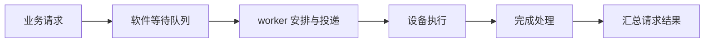

# 4.3 异步传输与并发控制

流水线使多个请求可以同时在途。应用继续扩大后，生成请求和处理完成往往由不同线程承担：业务线程提交描述，传输线程安排工作，完成处理再将结果交回。此时要管理的不只是 QP，还包括软件队列和请求对象的寿命。

## 把提交与执行分开

最初的接口可以设计成“提交后返回请求句柄，稍后查询或等待”。句柄代表应用请求，不要求与一条 WR 一一对应。大块请求可能被拆分，多个小块也可能在满足条件时合并。

图 4-1：异步运行时中的请求推进过程。
{: .figure-caption }

软件层需要区分尚未投递、已经交给设备和已经取得结果。只有知道请求停在哪一层，才能正确计算排队时间、实现取消并处理部分失败。

一个大请求拆成四段，前三段完成并不代表整个目标有效。最后一段失败时，应用通常需要将逻辑请求标为未成功，而不是向消费者发布 75% 的对象。

## 请求对象由谁持有

请求描述、底层缓冲区和业务对象可能由不同组件管理。提交线程返回后，后台仍需要描述；业务不再等待后，设备仍可能访问数据；完成状态已发布后，完成回调也可能还在读取上下文。

一种清晰的管理方式是：业务持有自己的引用，运行时在接受请求后持有设备执行所需引用，直到相关操作和回调真正退出再释放。具体采用引用计数、对象池还是明确状态机，都应写出每次引用的取得和归还位置。

Python 对象同样如此。把 Tensor 的 `data_ptr()` 交给 C++ 只传递一个地址，没有自动让运行时持有 Tensor。引擎、guard、allocation 与请求之间需要明确的持有关系。

## 请求到得比完成快

假设业务每秒生成 1200 个请求，系统持续只能完成 1000 个。队列会以每秒约 200 个的速度增长，最终占满内存。把队列容量扩大，只延后耗尽的时间。

因此需要背压：系统达到约定容量后，让上游减速、稍后重试或拒绝新请求。容量可以按请求数，也可以按在途字节限制；大小差异很大时，仅按请求数通常不足以控制资源占用。

| 位置 | 可以限制什么 |
|---|---|
| 应用入口 | 接受的请求数、字节数与等待时长 |
| 软件调度队列 | 每个对端或优先级的待处理工作 |
| 设备提交窗口 | 队列深度与 READ/Atomic 等设备资源 |
| 目标缓冲池 | 已分配而尚未归还的区域 |

表 4-2：各阶段的容量限制。
{: .table-caption }

这些限制需要配合。设备窗口为空不代表上游队列为空，目标空间不足也不一定表现为网卡错误。

## 推进线程不能等自己释放空间

一个 worker 消费队列，同时又把需要重试的条目放回同一队列。如果队列已满，worker 阻塞在入队操作上，就没有线程继续出队释放空间。

解决时要从依赖关系入手：内部重新入队采用非阻塞操作，失败时保留在一个受控待处理列表；worker 继续消费并在后续尝试恢复。不能通过无限增加队列容量消除这个循环等待。

Mooncake 的 [PR #3683](https://github.com/kvcache-ai/Mooncake/pull/3683)提供了具体修复案例。阅读它时先画出谁生产、谁消费、谁负责重试，再看数据结构细节。

## 长短请求共同运行

后台搬运大块权重时，交互 KV 请求可能也需要同一张网卡。若大请求一次占据所有提交额度，小请求即使字节数很少，也会长时间等待。

切片、每对端额度、优先级和等待时间控制可以改善这种现象，但严格优先也可能让低优先级请求长期得不到执行。实验应同时看小请求尾延迟和大请求是否持续推进。

可以用固定速率小请求叠加大块传输，记录软件等待、设备在途和完成三个阶段。若只统计总吞吐，可能看不出交互请求已经超时。[下一章](04-connections-metadata.md)再把单对端扩展到多个可重启的服务实例。
