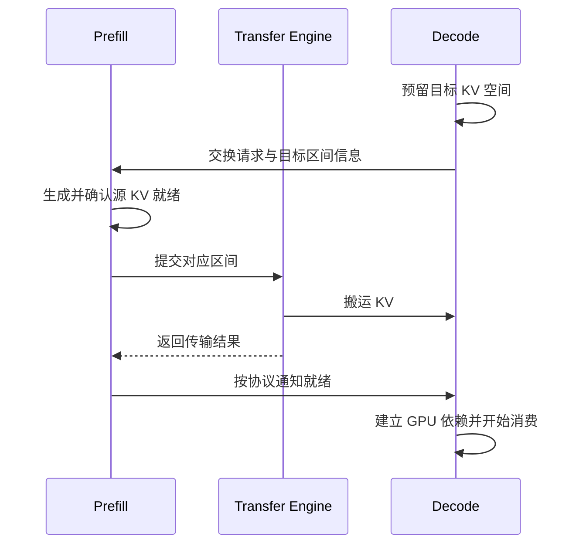

# 6.2 PD 分离中的 KV Cache 传输

大模型生成通常包含两类工作。Prefill 处理输入 token 并建立后续计算要复用的 KV Cache，即注意力计算中的 Key/Value 缓存；Decode 逐步生成后续 token。两阶段分开部署以后，Prefill 产生的 KV 必须交给承担 Decode 的实例。

本章依据 Mooncake 快照 `5772765c5070cd44db78629864db3c00e5239b70` 中的 [SGLang 集成说明](https://github.com/kvcache-ai/Mooncake/blob/5772765c5070cd44db78629864db3c00e5239b70/docs/source/deployment/integrations/sglang/pd-disaggregation.md)，提炼一次 KV 交接的教学流程。下图用于说明各层职责，具体调用和分批策略应对照所用框架版本。

## 一条请求怎样交接

Decode 要先有可接收的空间，Prefill 才能知道数据应该写到哪里。除了内存地址，还需要请求身份、KV block 映射及长度等描述。

图 6-1：PD 分离中的 KV 交接简化流程。
{: .figure-caption }

通知可以由框架协议或引擎支持的通知机制完成，但它必须与真正的数据完成对应。仅仅“已提交 KV 请求”不足以让 Decode 开始使用。

## 从逻辑 block 到内存区间

一个 block 是框架管理 KV 的逻辑单位，不一定对应一段能够直接整体发送的连续内存。不同层、K/V 分开存放、不同 head 和并行分片，都可能生成多个区间。

假设一个简化布局中，源 block 编号 3、7、9 对应目标槽位 0、1、2，接入层先根据布局算出地址，再生成三组或更多传输请求。TE 接到的是这些地址区间，不需要理解 token 本身。

两端模型、dtype、KV 布局、block 大小和并行配置必须兼容，或者由接入层明确完成转换。原始字节传输不会自动实现重新分片和布局变换。

## 生命周期随请求变化

Prefill 的源 KV 要保持到传输安全结束，Decode 的目标要保持到相关设备访问及消费结束。请求被取消时，还要判断哪些区间已投递，不能仅从调度队列移除请求就归还所有显存。

对端重启后，即使业务角色仍叫 Decode，原来交换的地址和权限也需要重新取得。将请求 ID 与实例代次、目标分配关联，可以帮助避免迟到通知指向另一条请求的新槽位。

这些问题分别对应[缓冲区管理](../05-gpu-data/02-tensor-memory.md)、[同步](../05-gpu-data/03-synchronization.md)和[恢复](../04-optimization/05-failure-recovery.md)，在接入层需要同时成立。

## 评价效果时看完整时间线

TTFT（Time to First Token，首 token 延迟）按客户端收到首个 token 计时。若系统在 KV 交接及 Decode 就绪后才返回首 token，这段传输和等待会进入 TTFT；若 Prefill 已提前返回首 token，交接成本可能更多体现在后续 token 的间隔。测量时要先确认框架的输出流程，再分析调度、计算、搬运与通知各阶段。它们可能重叠，不能总按简单相加计算。

逐 token 延迟则主要反映持续 Decode 的表现，也会受到共享资源竞争影响。PD 分离允许两阶段分别安排资源，但跨实例搬运引入额外成本，不能只根据单次 RDMA 带宽断言它一定更快。

可以先做一个简化实验：用多个已注册区间模拟 KV blocks，逐块填入不同编号，传输后核对目标内容与映射，再改变 block 数量、每块大小和并发请求数。这样能在加载模型之前发现映射与生命周期错误。

真正测框架时，固定模型、输入输出长度、到达率和并行配置，并同时保留端到端指标与 TE 阶段指标。部署参数随版本变化，采用对应 [SGLang 指南](https://github.com/kvcache-ai/Mooncake/blob/5772765c5070cd44db78629864db3c00e5239b70/docs/source/deployment/integrations/sglang/pd-disaggregation.md)或 [vLLM 官方说明](https://docs.vllm.ai/en/latest/features/disagg_prefill/)，记录实际版本。

下一章考虑 KV 不只在两个实例间交接，而是[保存到共享缓存池](03-kv-cache-store.md)以后复用。
